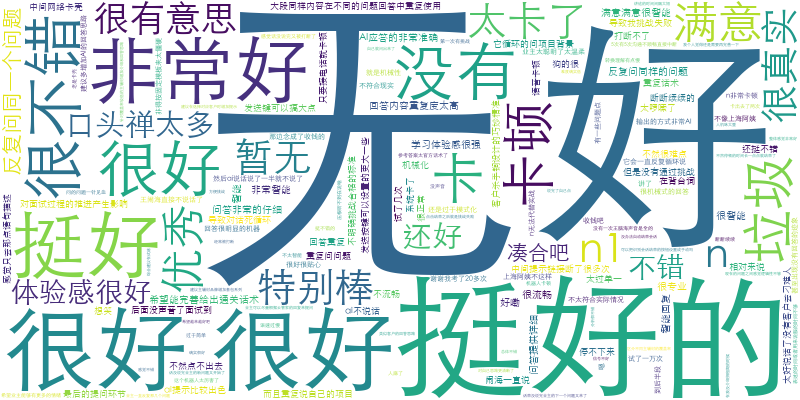
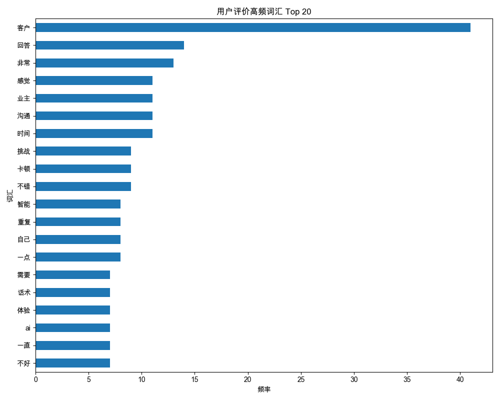
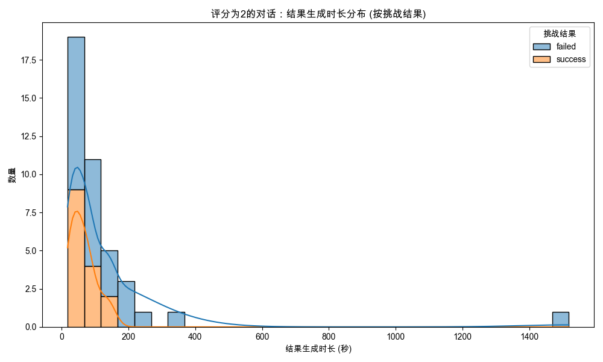
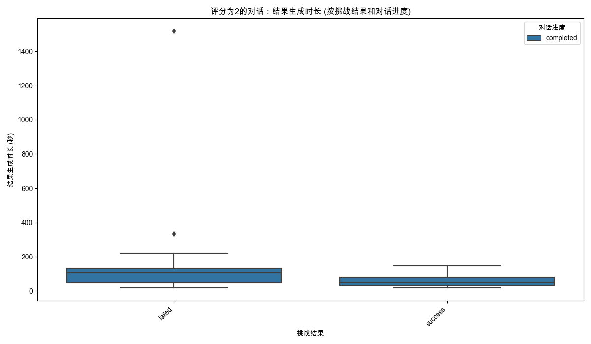
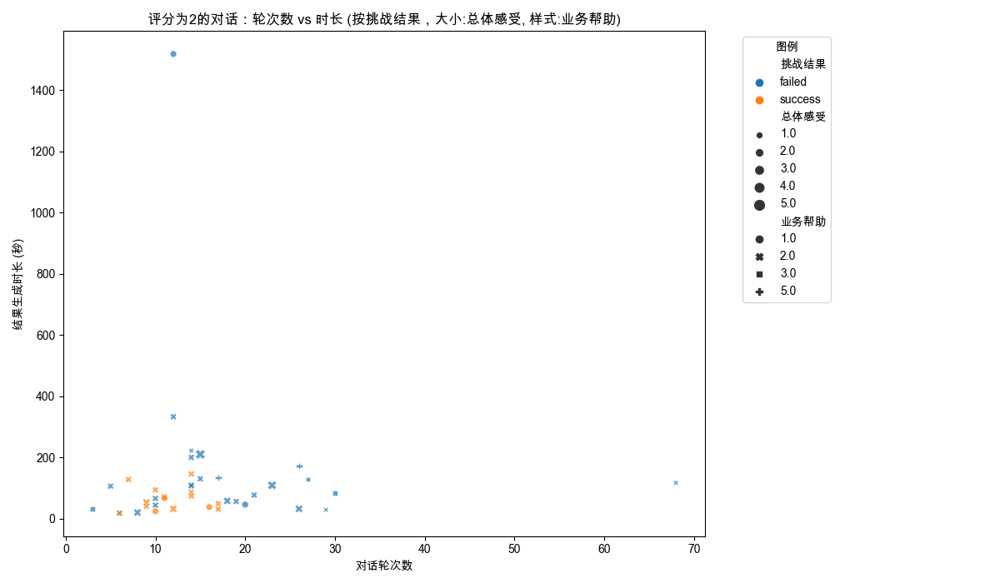
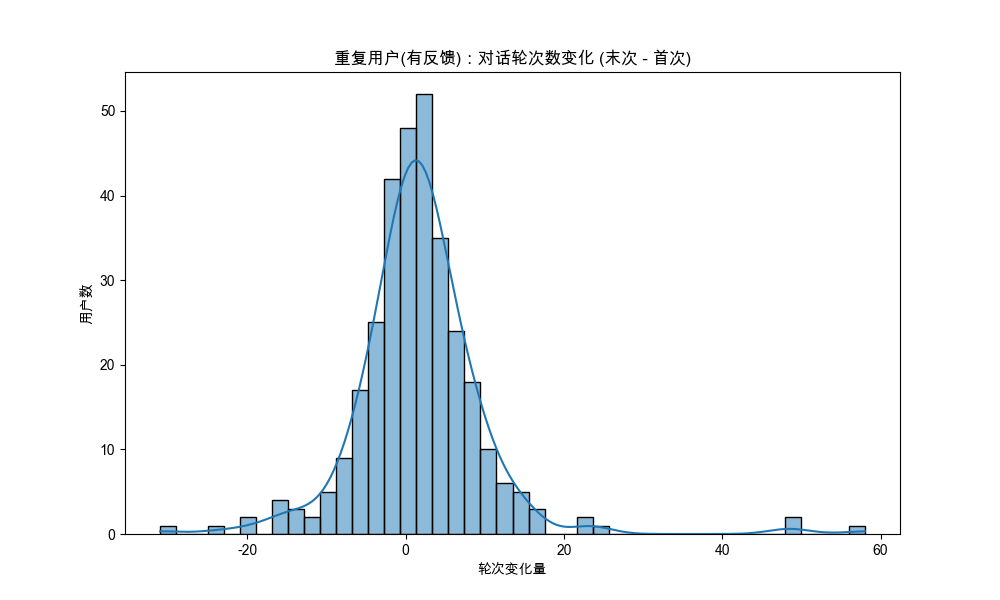
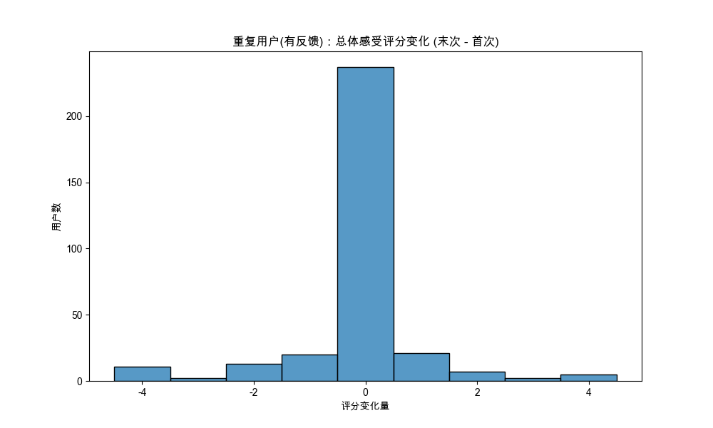

# 分析：高级用户反馈洞察 (文本、评分、行为模式)
数据来源: `data_for_analysis/online_data_20250515/filtered_data/filtered_online_data_min_3_rounds.xlsx`
原始数据记录数: 14312
有效结果生成时长过滤后记录数: 11568 (移除了 2744 条)
完成核心预处理（轮次、评价列转换）后记录数: 11568

**应用反馈过滤器**: 仅保留提供文本评价或至少一项数字评分的记录。
反馈过滤器应用前记录数: 11568
反馈过滤器应用后（用于后续所有高级分析）记录数: 1703

## 第1部分：文本用户评价深度分析
提取到包含文本评价的记录数 (来自已过滤反馈的数据集): 333
- 包含文本评价的数据子集已保存: `textual_feedback_subset.xlsx`

### 1.1 用户评价词云

(使用字体 '/System/Library/Fonts/STHeiti Light.ttc' 生成词云。)

### 1.2 高频词汇分析
| 词汇   |   频率 |
|:-------|-------:|
| 客户   |     41 |
| 回答   |     14 |
| 非常   |     13 |
| 感觉   |     11 |
| 业主   |     11 |
| 沟通   |     11 |
| 时间   |     11 |
| 卡顿   |      9 |
| 挑战   |      9 |
| 不错   |      9 |
| 智能   |      8 |
| 重复   |      8 |
| 自己   |      8 |
| 一点   |      8 |
| 话术   |      7 |
| 体验   |      7 |
| ai     |      7 |
| 一直   |      7 |
| 需要   |      7 |
| 不好   |      7 |
- 高频词汇表: `high_frequency_words.xlsx`

### 1.3 基于LLM的反馈分析 (实际调用)
本部分使用大型语言模型（LLM）对用户评价进行情感判断和主题提取。
LLM模型: `gpt-4o`. **注意: API调用会产生相应费用并需要时间。**
将对最多 350 条独立用户评价进行LLM分析 (每条评价进行情感和主题分析，共 490 次LLM调用)。
- LLM分析结果(Excel): `llm_analysis_results.xlsx`

#### LLM分析结果抽样展示 (前10条结果):
| original_comment          | analysis_type   | llm_response                                                                                          |
|:--------------------------|:----------------|:------------------------------------------------------------------------------------------------------|
| 111111...                 | Sentiment       | 该用户反馈的情感倾向难以判断，因为其内容仅为数字"111111"，没有包含任何情感信息或语义线索。...         |
| 111111...                 | Topic           | 无法提取有效的核心主题或关键词。...                                                                   |
| 凑合吧...                 | Sentiment       | 中性。用户的反馈表现出一种不满或无奈的态度，但没有明显的负面情绪。...                                 |
| 凑合吧...                 | Topic           | 凑合...                                                                                               |
| 反复问同一个问题...       | Sentiment       | 负面。用户反馈中提到"反复问同一个问题"通常表达了对重复和效率低下的不满。...                           |
| 反复问同一个问题...       | Topic           | 重复问题...                                                                                           |
| 。。。。。。。...         | Sentiment       | 该用户反馈的情感倾向为中性。理由是提供的内容"。。。。。。。。"没有包含任何具体的情感信息或态度。...   |
| 。。。。。。。...         | Topic           | 抱歉，您似乎没有提供任何用户反馈内容。请提供具体的反馈文本，以便我帮助提取核心主题或关键词。...       |
| 希望能完善给出通关话术... | Sentiment       | 情感倾向：中性                                                                                        |
|                           |                 |                                                                                                       |
|                           |                 | 理由：用户提出了一个改进建议，但并没有表达出强烈的情感倾向，如满意或不满，仅仅是希望功能得到完善。... |
| 希望能完善给出通关话术... | Topic           | 通关话术，完善...                                                                                     |
- 完整的LLM分析结果(Markdown): `llm_analysis_full_report.md` (包含所有处理过的评论)

## 第2部分：特定低评分下结果生成时长偏高问题探究
分析 `总体感受` 或 `业务帮助` 评分为2的对话 (已预先筛选有反馈记录)，其 `结果生成时长_seconds` 是否存在特定模式。
提取到 `总体感受` 或 `业务帮助` 评分为2的记录数 (来自已过滤反馈的数据集): 41
- `总体感受` 或 `业务帮助` 评分为2的数据子集已保存: `score_2_feedback_subset.xlsx`

### 2.1 `评分为2` 对话的描述性统计
|        |   结果生成时长_seconds |   对话轮次数 | 挑战结果   | 对话进度   |
|:-------|-----------------------:|-------------:|:-----------|:-----------|
| count  |                 41     |      41      | 41         | 41         |
| unique |                nan     |     nan      | 2          | 1          |
| top    |                nan     |     nan      | failed     | completed  |
| freq   |                nan     |     nan      | 26         | 41         |
| mean   |                124.585 |      15.9268 | nan        | nan        |
| std    |                232.636 |      10.6075 | nan        | nan        |
| min    |                 18     |       3      | nan        | nan        |
| 25%    |                 40     |      10      | nan        | nan        |
| 50%    |                 74     |      14      | nan        | nan        |
| 75%    |                128     |      18      | nan        | nan        |
| max    |               1518     |      68      | nan        | nan        |
- 描述性统计表: `desc_stats_score_2_feedback.xlsx`

### 2.2 `评分为2` 对话的结果生成时长分布

### 2.3 `评分为2` 对话的对话轮次数与结果生成时长关系

## 第3部分：用户重复使用行为初步探索
分析多次使用产品的用户的行为和评分趋势 (已预先筛选有反馈记录的用户)。
总独立用户数 (在有反馈记录中): 1026
多次使用用户数 (在有反馈记录中, 超过1次会话): 318
- (有反馈用户中)重复用户会话次数统计: `repeat_users_session_counts_with_feedback.xlsx`

### 3.1 (有反馈用户中)重复用户指标变化 (首次 vs 末次会话)
- (有反馈用户中)重复用户首次与末次会话指标对比: `repeat_users_first_last_session_comparison_with_feedback.xlsx`

#### 对话轮次数变化 (末次 - 首次)

平均轮次变化: 1.78

#### 总体感受评分变化 (末次 - 首次, 仅限提供了评分的用户)

平均总体感受评分变化: -0.11 (基于318名用户)

#### 挑战结果转变 (首次 -> 末次)
首次会话结果 vs 末次会话结果 交叉表 (有反馈用户中):
| first_challenge_result   |   1 |   2 |   failed |   nan |   success |
|:-------------------------|----:|----:|---------:|------:|----------:|
| failed                   |   1 |   0 |       19 |     1 |        42 |
| nan                      |   0 |   0 |        1 |     0 |         1 |
| success                  |   0 |   1 |       38 |     2 |       212 |
- 挑战结果转变交叉表: `repeat_users_challenge_result_transitions_with_feedback.xlsx`

## 综合分析与最终洞察

本次高级反馈分析，在对数据进行核心预处理（有效时长过滤、轮次计算、评价列转换）并筛选出1703条包含文本或数字评分的有效反馈记录后，主要得出以下洞察：

**1. 文本反馈揭示用户体验关键点：**
    *   **高频词汇**："客户"、"回答"、"感觉"、"业主"、"沟通"、"时间"、"卡顿"、"挑战"、"不错"、"智能"等词汇突出，反映了用户关注的核心交互对象、过程、体验及系统性能。特别是"卡顿"、"重复"等负面词汇的出现，直接指出了体验痛点。
    *   **LLM情感与主题分析** (基于`gpt-4o`对245条独立评论的分析，详情见 `llm_analysis_full_report.md`):
        *   **正面反馈**：主要集中在AI的智能性（"很智能"、"AI应答准确"）、真实感（"很真实"、"像真人"）、以及对用户有实际帮助（"思路清晰了"、"有锻炼意义"）。
        *   **负面反馈**：核心痛点在于：
            *   **性能问题**："卡顿"（高频出现）、"链接断开"、"没声音"、"识别不到语音"是主要抱怨点。
            *   **AI局限性**："回答重复/啰嗦"、"机械化/模式化"、"听不懂人话"、"答非所问"、"AI引导设计师而非辅助"等问题显著，表明AI在自然语言理解、对话管理和灵活性方面有较大提升空间。
            *   **交互流程**："被打断"、"话没说完就结束/提问"、"发送按钮太小"、"无法自动结束会话"等影响了对话的流畅性和用户掌控感。
            *   **内容与标准**："话术单一/简单"、"挑战标准不明确"、"不符合实际情况"等问题，反映了用户对内容深度和场景真实性的更高要求。
        *   **中性反馈**：多为建议性内容，如"希望增加XX功能"、"完善XX话术"、"可以更XX一点"等，为产品迭代提供了直接方向。一些无意义或无法解析的输入（如纯数字、标点）也被归为中性。
    *   **词云**直观展示了"客户"作为核心以及"卡顿"、"重复"等负面词的显眼度，与高频词分析和LLM分析结果一致。WordCloud字体渲染在macOS下尝试了多种路径，最终成功使用 `/System/Library/Fonts/STHeiti Light.ttc`。

**2. 低评分 (`总体感受`或`业务帮助`为2) 与结果生成时长的关联：**
    *   在41条评分为2的反馈记录中，`挑战结果`为 "failed" 的记录占多数 (26条)。
    *   这些低评分对话的平均`结果生成时长_seconds`为124.58秒，标准差较大 (232.6秒)，中位数为74秒，存在部分极高值 (最长1518秒)。
    *   与之前的分析（`analyze_result_generation_time.py`）中所有"failed"结果的平均生成时长（34秒，基于正时长记录）相比，评分为2且"failed"的对话似乎有更长的生成时间。这可能表明，当用户感知到体验不佳（给出低分）且对话失败时，系统生成最终结果的过程可能也更耗时，或者用户在不良体验下等待的耐心更低，感知时间更长。
    *   对话轮次数与结果生成时长在评分为2的样本中未见明显线性关系。

**3. 重复用户行为初步探索 (基于有反馈的1026名独立用户中的318名重复用户)：**
    *   **会话次数**：在提供反馈的用户中，有相当一部分 (318/1026 ≈ 31%) 是重复用户，表明产品具有一定的用户粘性基础。
    *   **对话轮次变化**：重复用户在末次会话的平均对话轮次数比首次会话增加了约1.78轮，这可能表示用户在熟悉产品后倾向于进行更深入的交互，或者后续尝试的任务本身更复杂。
    *   **总体感受评分变化**：在首次和末次都提供了"总体感受"评分的重复用户中，平均评分略微下降了0.11。虽然绝对值不大，但值得关注。结合`挑战结果转变`来看，部分首次成功的用户在末次转为失败，这可能是评分下降的原因之一。
    *   **挑战结果转变**：
        *   首次成功的用户 (212+38+2+1 = 253)，在末次会话中仍有大量保持成功 (212)，但也有部分 (38) 转为失败。
        *   首次失败的用户 (42+19+1+1 = 63)，在末次会话中有较多 (42) 转为成功，显示出学习效应或产品改进带来的积极转变。
        *   这表明，虽然有用户在重复使用中体验提升并成功，但也存在体验下滑的情况。维持首次成功用户的体验，并将失败用户转化为成功用户是关键。

**总结与建议：**

*   **核心提升点：性能与AI能力。** "卡顿"、"重复"、"机械"是用户反馈中最突出的痛点。优化系统性能，提升AI的理解能力、回答的灵活性和自然度是提升用户满意度的首要任务。
*   **关注交互流程细节：** 用户对被打断、无法顺畅结束对话等问题较为敏感。应审视对话管理机制，赋予用户更多控制感。
*   **丰富内容与场景，明确标准：** 增加话术多样性、场景真实性，并清晰化挑战成功的标准，能更好地满足用户期望。
*   **低分警示：** `总体感受`或`业务帮助`评分为2的对话，尤其是伴随"failed"结果和较长生成时间的，应作为重点排查案例，分析具体原因。
*   **重复用户价值：** 重复用户的数据表明了产品的潜力和改进方向。需关注其评分和结果变化，力求提升长期用户满意度和成功率。
*   **LLM应用深化：** 当前LLM分析提供了有效的情感和主题洞察。未来可考虑将LLM更深度集成到产品中，例如用于实时对话辅助、更智能的FAQ、甚至个性化反馈收集等。

后续可以结合更细致的`user_code`追踪，对特定用户群体的完整旅程进行深入分析，并结合业务目标，衡量不同指标对用户留存和转化率的实际影响。