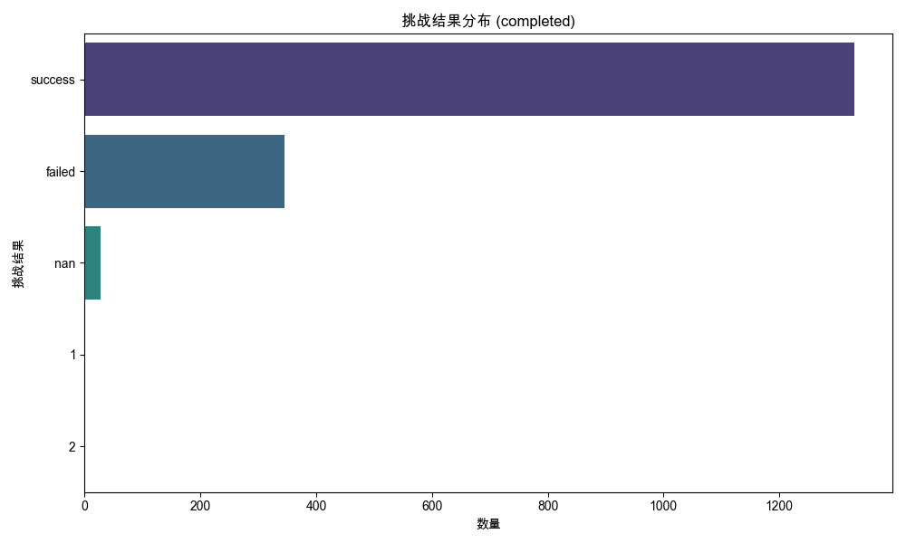
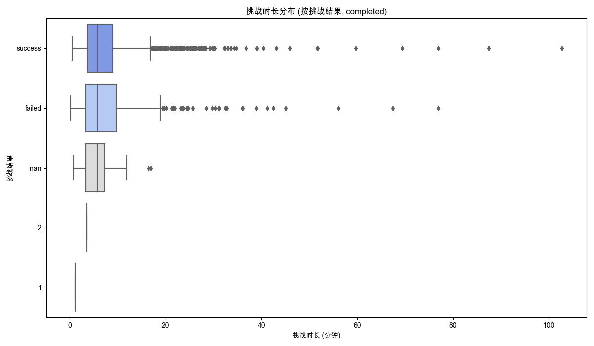
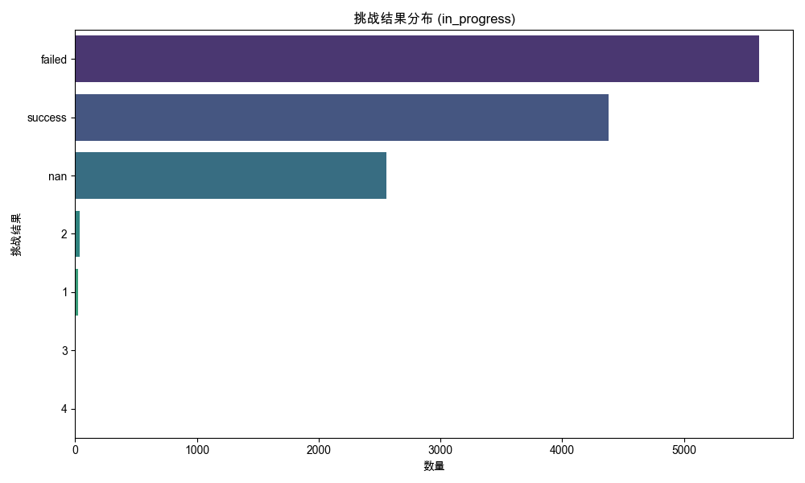
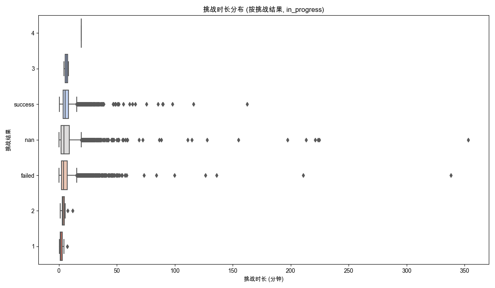

## 挑战数据分析
数据来源: `data_for_analysis/online_data_20250515/filtered_data/filtered_online_data_min_3_rounds.xlsx`
总记录数: 14312

### 生成的Excel文件:

### '对话进度' 分析: completed
- 'completed' 状态的已处理数据: `processed_data_completed.xlsx`

#### 挑战结果分布 (%):
| 挑战结果   |     百分比 |
|:-----------|-----------:|
| success    | 78.0388    |
| failed     | 20.2584    |
| nan        |  1.58544   |
| 1          |  0.0587199 |
| 2          |  0.0587199 |

#### 挑战时长与挑战结果关系:

##### 各挑战结果的平均/中位数挑战时长 (分钟):
| 挑战结果   |   平均值 |   中位数 |    标准差 |   数量 |
|:-----------|---------:|---------:|----------:|-------:|
| 1          |  1.1     |  1.1     | nan       |      1 |
| 2          |  3.46667 |  3.46667 | nan       |      1 |
| failed     |  8.37754 |  5.7     |   9.28662 |    345 |
| nan        |  6.26667 |  5.7     |   4.19809 |     27 |
| success    |  7.73683 |  5.73333 |   7.68396 |   1329 |
- 'completed' 状态各挑战结果的时长统计: `duration_stats_by_result_completed.xlsx`

##### 'completed' 状态整体挑战时长统计 (分钟):
|          |      统计值 |
|:---------|------------:|
| 记录数   | 1703        |
| 平均值   |    7.83692  |
| 标准差   |    7.99456  |
| 最小值   |    0.216667 |
| 25分位数 |    3.56667  |
| 中位数   |    5.71667  |
| 75分位数 |    9.11667  |
| 最大值   |  102.7      |

### '对话进度' 分析: in_progress
- 'in_progress' 状态的已处理数据: `processed_data_in_progress.xlsx`

#### 挑战结果分布 (%):
| 挑战结果   |      百分比 |
|:-----------|------------:|
| failed     | 44.5238     |
| success    | 34.7212     |
| nan        | 20.295      |
| 2          |  0.269649   |
| 1          |  0.166548   |
| 3          |  0.0158617  |
| 4          |  0.00793084 |

#### 挑战时长与挑战结果关系:

##### 各挑战结果的平均/中位数挑战时长 (分钟):
| 挑战结果   |   平均值 |   中位数 |    标准差 |   数量 |
|:-----------|---------:|---------:|----------:|-------:|
| 1          |  2.15873 |  1.63333 |   1.55722 |     21 |
| 2          |  3.96324 |  3.85    |   1.91345 |     34 |
| 3          |  6.44167 |  6.44167 |   2.81664 |      2 |
| 4          | 19.3     | 19.3     | nan       |      1 |
| failed     |  6.26218 |  4.19167 |   8.9613  |   5614 |
| nan        |  7.75601 |  4.3     |  15.004   |   2559 |
| success    |  7.1139  |  5.35    |   7.05424 |   4378 |
- 'in_progress' 状态各挑战结果的时长统计: `duration_stats_by_result_in_progress.xlsx`

##### 'in_progress' 状态整体挑战时长统计 (分钟):
|          |      统计值 |
|:---------|------------:|
| 记录数   | 12609       |
| 平均值   |     6.84911 |
| 标准差   |     9.95644 |
| 最小值   |     0.15    |
| 25分位数 |     2.61667 |
| 中位数   |     4.66667 |
| 75分位数 |     7.98333 |
| 最大值   |   353.317   |

## 分析与洞察

根据上述数据，我们可以观察到以下几点：

1.  **总体情况**:
    *   总共分析了 14312 条对话记录（已过滤，至少3轮对话）。
    *   其中，'completed' 状态的对话有 1703 条，'in_progress' 状态的对话有 12609 条。这表明绝大多数被记录的对话在中途被用户退出或中断。

2.  **挑战结果分布对比 ('completed' vs. 'in_progress')**:
    *   **'completed' 对话**: `success` 占比极高 (78.0%)，`failed` 占比约 20.3%。 `nan` 结果仅占约 1.6%。这符合预期，完成的对话更可能成功。
    *   **'in_progress' 对话**: `failed` 占比最高 (44.5%)，其次是 `success` (34.7%)。值得注意的是，`nan` 结果的占比显著提高至 20.3%。这表明中途退出的对话中，有相当一部分未能生成明确的挑战结果，或者结果本身就是 `nan`。
    *   数字评分 (1, 2, 3, 4) 在两种状态下都非常罕见，总占比远低于1%。

3.  **挑战时长与结果关系 ('completed' 对话)**:
    *   **平均时长**: `failed` (约 8.38 分钟) 和 `success` (约 7.74 分钟) 的平均时长相近，略高于 `nan` (约 6.27 分钟)。
    *   **中位数时长**: `success` (约 5.73 分钟) 和 `failed` (约 5.70 分钟) 的中位数时长非常接近，`nan` (5.70 分钟) 也类似。这表明大多数完成的对话，无论成功与否，时长都集中在相似的范围内。
    *   整体来看，'completed' 对话的平均时长为 7.84 分钟，中位数为 5.72 分钟。
    *   `success` 和 `failed` 的标准差较大，说明时长分布较广。

4.  **挑战时长与结果关系 ('in_progress' 对话)**:
    *   **平均时长**: `nan` 结果的平均时长最高 (约 7.76 分钟)，其次是 `success` (约 7.11 分钟)，然后是 `failed` (约 6.26 分钟)。
    *   **中位数时长**: `success` 的中位数时长最长 (约 5.35 分钟)，其次是 `nan` (约 4.30 分钟) 和 `failed` (约 4.19 分钟)。
    *   整体来看，'in_progress' 对话的平均时长为 6.85 分钟，中位数为 4.67 分钟，均略低于 'completed' 对话。这符合直觉，因为中途退出的对话自然会更短。
    *   `nan` 结果在 'in_progress' 对话中的标准差非常大 (15.00)，远超其他类别，表明其时长分布非常离散，有些 `nan` 结果的对话持续时间很长，有些则很短。
    *   `failed` 结果的平均时长 (6.26分钟) 低于 `success` (7.11分钟)，这可能表明用户在意识到挑战可能失败时较早退出。

5.  **关于 'nan' 挑战结果**:
    *   在 'completed' 对话中，'nan' 结果较少，其平均和中位数时长与其他结果相近。
    *   在 'in_progress' 对话中，'nan' 结果占比显著增加。其平均时长较高，但中位数时长相对较低，且标准差极大。这可能意味着 'nan' 包含了多种情况：例如，用户在较短时间内因技术问题或其他原因退出，或者用户在进行了较长时间的尝试后仍然没有得到明确的结果而退出。

6.  **关于数字评分结果**:
    *   数字评分 (1, 2, 3, 4) 的数量非常少，在两种状态下都几乎可以忽略不计。这可能表明当前的评估机制主要输出 'success'/'failed'，数字评分可能是特定场景或旧版逻辑的产物。对于这些稀有结果，其时长统计可能不太具有代表性。

### 总结与建议

*   **主要用户行为**: 大部分用户对话以 'in_progress' 状态结束，表明中途退出是常见现象。在这些中途退出的对话中，`failed` 和 `nan` 是最主要的结果。
*   **完成对话的特征**: 用户完成的对话绝大多数是 `success`，且平均对话时长比中途退出的对话略长。
*   **深入调查 'nan' 结果**: 'in_progress' 对话中 `nan` 结果的高占比和时长特征的离散性值得进一步调查。需要明确 'nan' 代表的具体含义（例如，技术故障、评估未完成、用户主动跳过评估等），以便更准确地理解用户行为和产品瓶颈。
*   **时长与失败**: 在 'in_progress' 状态下，`failed` 的平均和中位数时长均低于 `success`，这可能提示用户在感觉无法成功时会提前放弃。
*   **评估机制**: 挑战结果主要是 'success'/'failed'，数字评分的使用率极低。如果数字评分是期望的评估维度，则需要审视其触发条件和用户可见性。