# 分析：用户反馈、评分与核心对话指标的关联性
数据来源: `data_for_analysis/online_data_20250515/filtered_data/filtered_online_data_min_3_rounds.xlsx`
原始数据记录数: 14312
经结果生成时长计算与过滤后记录数: 11568 (移除了 2744 条无效时长或时间戳记录)
用于后续分析的有效记录数: 11568

已处理的包含所有反馈指标的完整数据保存至: `processed_data_full_feedback.xlsx`

### 生成的核心Excel文件:
- 完整预处理数据: `processed_data_full_feedback.xlsx`

## 第1部分：用户反馈概览

### 1.1 文本用户评价统计
提供文本用户评价的记录数: 333 (占已处理总记录的 2.88%)
未提供文本用户评价的记录数: 11235

### 1.2各项评分分布

#### 总体感受 评分分布:
| 评分值       |   数量 |    百分比 |
|:-------------|-------:|----------:|
| 1.0          |    106 |  0.916321 |
| 2.0          |     31 |  0.267981 |
| 3.0          |    129 |  1.11515  |
| 4.0          |    214 |  1.84993  |
| 5.0          |   1223 | 10.5723   |
| 未评分 (NaN) |   9865 | 85.2784   |
- 总体感受 评分分布表: `dist_总体感受.xlsx`
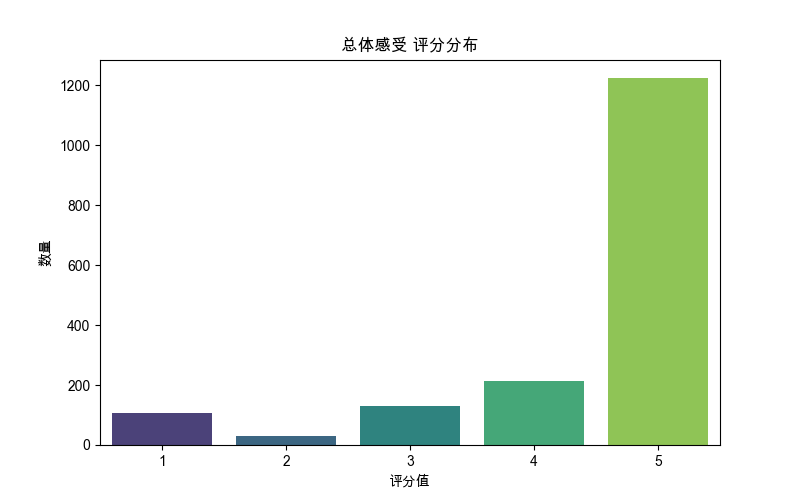

#### 业务帮助 评分分布:
| 评分值       |   数量 |    百分比 |
|:-------------|-------:|----------:|
| 1.0          |     99 |  0.855809 |
| 2.0          |     31 |  0.267981 |
| 3.0          |    111 |  0.959544 |
| 4.0          |    201 |  1.73755  |
| 5.0          |   1235 | 10.676    |
| 未评分 (NaN) |   9891 | 85.5031   |
- 业务帮助 评分分布表: `dist_业务帮助.xlsx`
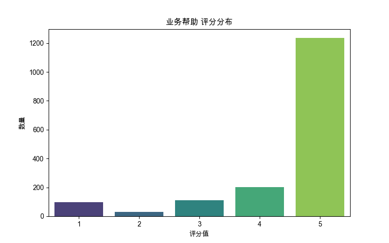

#### 客户拟人 评分分布:
| 评分值       |   数量 |    百分比 |
|:-------------|-------:|----------:|
| 1.0          |    111 |  0.959544 |
| 2.0          |     40 |  0.345781 |
| 3.0          |    121 |  1.04599  |
| 4.0          |    190 |  1.64246  |
| 5.0          |   1213 | 10.4858   |
| 未评分 (NaN) |   9893 | 85.5204   |
- 客户拟人 评分分布表: `dist_客户拟人.xlsx`
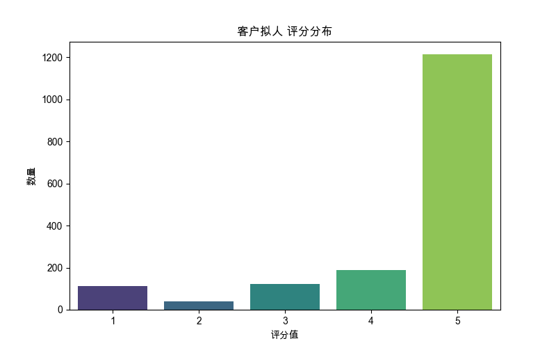

#### 体验流畅 评分分布:
| 评分值       |   数量 |    百分比 |
|:-------------|-------:|----------:|
| 1.0          |    123 |  1.06328  |
| 2.0          |     46 |  0.397649 |
| 3.0          |    119 |  1.0287   |
| 4.0          |    186 |  1.60788  |
| 5.0          |   1196 | 10.3389   |
| 未评分 (NaN) |   9898 | 85.5636   |
- 体验流畅 评分分布表: `dist_体验流畅.xlsx`

- 所有评分项合并分布表: `dist_all_ratings_combined.xlsx`

## 第2部分：影响用户评分的因素分析

### 2.1 分析 '总体感受' 与各项指标的关系

#### '总体感受' vs. '对话轮次数'
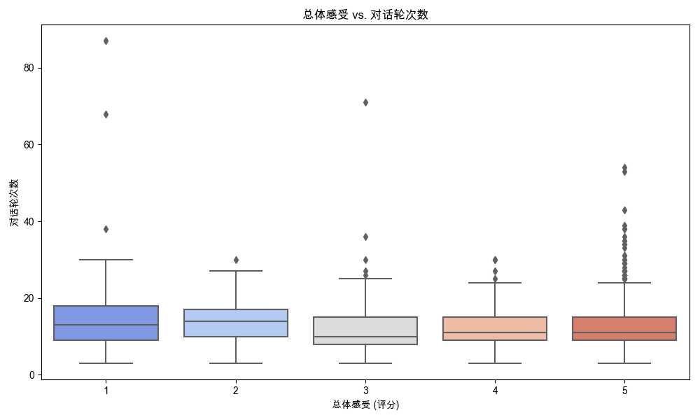
|   总体感受 |   对话轮次数_平均值 |   对话轮次数_中位数 |   对话轮次数_标准差 |   数量 |
|-----------:|--------------------:|--------------------:|--------------------:|-------:|
|          1 |             15.1132 |                  13 |            10.7653  |    106 |
|          2 |             13.9032 |                  14 |             6.33695 |     31 |
|          3 |             12.1938 |                  10 |             7.9619  |    129 |
|          4 |             12.2477 |                  11 |             5.24511 |    214 |
|          5 |             12.4219 |                  11 |             5.65282 |   1223 |
- '总体感受' vs. '对话轮次数' 统计表: `stats_总体感受_vs_对话轮次数.xlsx`

#### '总体感受' vs. '结果生成时长_seconds'
(注意: Y轴 '结果生成时长_seconds' 使用了对数刻度)
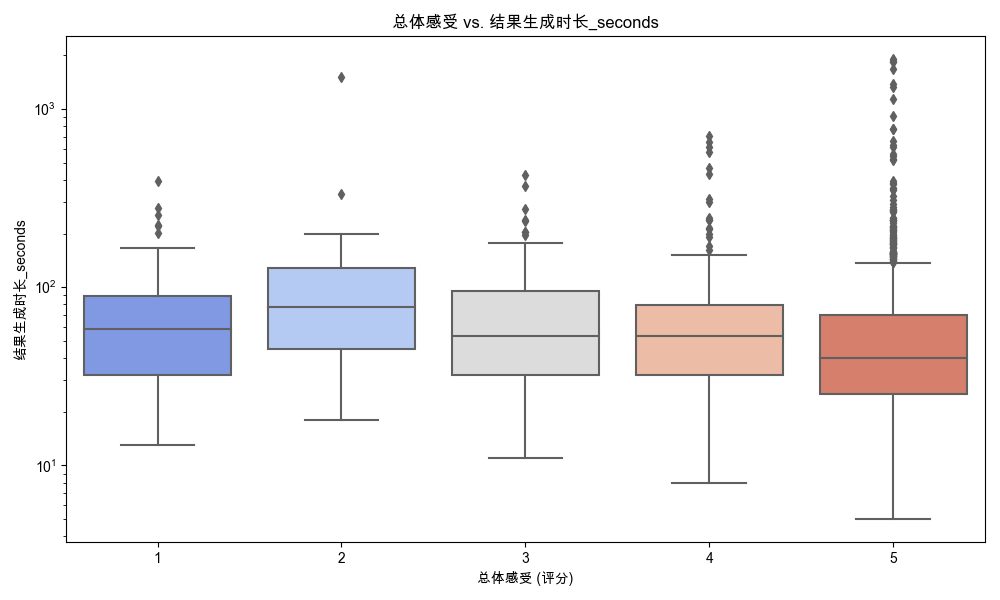
|   总体感受 |   结果生成时长_seconds_平均值 |   结果生成时长_seconds_中位数 |   结果生成时长_seconds_标准差 |   数量 |
|-----------:|------------------------------:|------------------------------:|------------------------------:|-------:|
|          1 |                       72.8302 |                            58 |                       59.8317 |    106 |
|          2 |                      136.323  |                            77 |                      264.364  |     31 |
|          3 |                       74.0388 |                            53 |                       65.297  |    129 |
|          4 |                       77.8645 |                            53 |                       98.7347 |    214 |
|          5 |                       70.2216 |                            40 |                      139.264  |   1223 |
- '总体感受' vs. '结果生成时长_seconds' 统计表: `stats_总体感受_vs_结果生成时长_seconds.xlsx`

#### '总体感受' vs. '挑战结果'
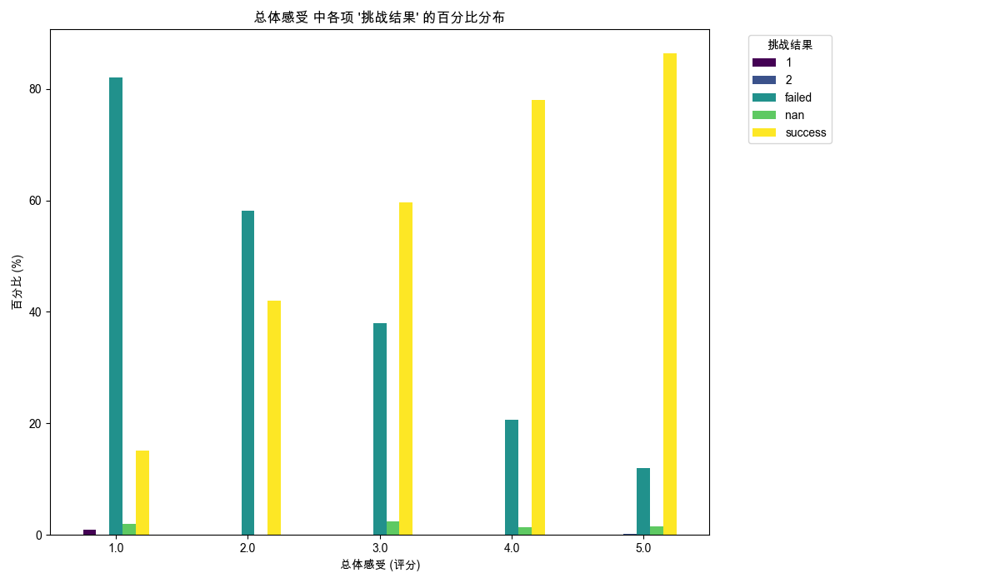

'总体感受' 中各项 '挑战结果' 的数量分布:
|   总体感受 |   1 |   2 |   failed |   nan |   success |
|-----------:|----:|----:|---------:|------:|----------:|
|          1 |   1 |   0 |       87 |     2 |        16 |
|          2 |   0 |   0 |       18 |     0 |        13 |
|          3 |   0 |   0 |       49 |     3 |        77 |
|          4 |   0 |   0 |       44 |     3 |       167 |
|          5 |   0 |   1 |      147 |    19 |      1056 |
- '总体感受' vs. '挑战结果' 数量表: `counts_总体感受_vs_挑战结果.xlsx`

#### '总体感受' vs. '对话进度'

'总体感受' 中各项 '对话进度' 的数量分布:
|   总体感受 |   completed |
|-----------:|------------:|
|          1 |         106 |
|          2 |          31 |
|          3 |         129 |
|          4 |         214 |
|          5 |        1223 |
- '总体感受' vs. '对话进度' 数量表: `counts_总体感受_vs_对话进度.xlsx`

### 2.1 分析 '业务帮助' 与各项指标的关系

#### '业务帮助' vs. '对话轮次数'

|   业务帮助 |   对话轮次数_平均值 |   对话轮次数_中位数 |   对话轮次数_标准差 |   数量 |
|-----------:|--------------------:|--------------------:|--------------------:|-------:|
|          1 |             14.6768 |                  13 |             9.61486 |     99 |
|          2 |             15.5161 |                  14 |            11.275   |     31 |
|          3 |             12.0541 |                  10 |             8.56933 |    111 |
|          4 |             12.1443 |                  11 |             5.21767 |    201 |
|          5 |             12.4632 |                  11 |             5.65493 |   1235 |
- '业务帮助' vs. '对话轮次数' 统计表: `stats_业务帮助_vs_对话轮次数.xlsx`

#### '业务帮助' vs. '结果生成时长_seconds'
(注意: Y轴 '结果生成时长_seconds' 使用了对数刻度)
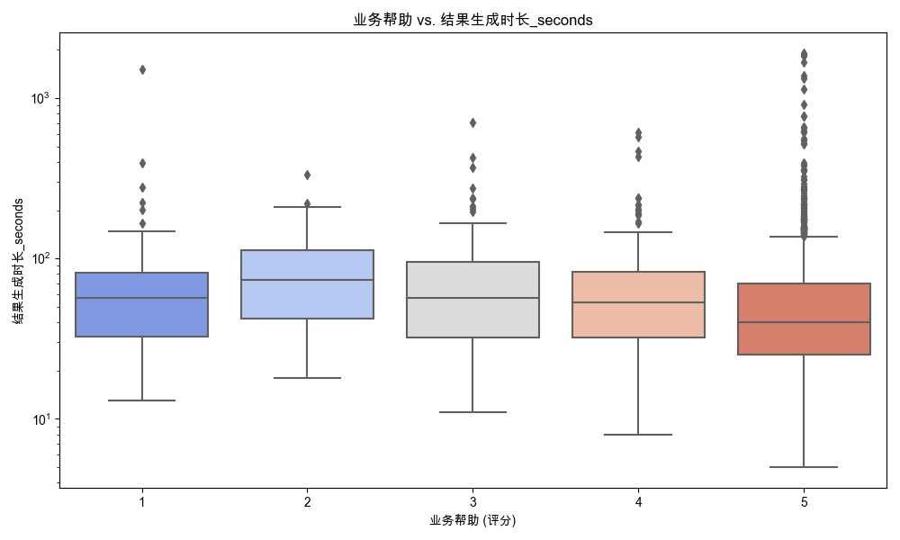
|   业务帮助 |   结果生成时长_seconds_平均值 |   结果生成时长_seconds_中位数 |   结果生成时长_seconds_标准差 |   数量 |
|-----------:|------------------------------:|------------------------------:|------------------------------:|-------:|
|          1 |                       83.1818 |                            57 |                      155.923  |     99 |
|          2 |                       92.4194 |                            74 |                       71.0248 |     31 |
|          3 |                       82.2703 |                            57 |                       90.7255 |    111 |
|          4 |                       72.7164 |                            53 |                       78.7851 |    201 |
|          5 |                       70.5644 |                            40 |                      139.679  |   1235 |
- '业务帮助' vs. '结果生成时长_seconds' 统计表: `stats_业务帮助_vs_结果生成时长_seconds.xlsx`

#### '业务帮助' vs. '挑战结果'
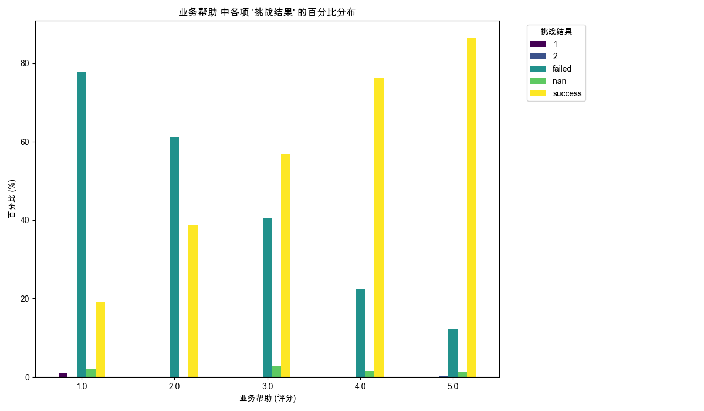

'业务帮助' 中各项 '挑战结果' 的数量分布:
|   业务帮助 |   1 |   2 |   failed |   nan |   success |
|-----------:|----:|----:|---------:|------:|----------:|
|          1 |   1 |   0 |       77 |     2 |        19 |
|          2 |   0 |   0 |       19 |     0 |        12 |
|          3 |   0 |   0 |       45 |     3 |        63 |
|          4 |   0 |   0 |       45 |     3 |       153 |
|          5 |   0 |   1 |      149 |    17 |      1068 |
- '业务帮助' vs. '挑战结果' 数量表: `counts_业务帮助_vs_挑战结果.xlsx`

#### '业务帮助' vs. '对话进度'

'业务帮助' 中各项 '对话进度' 的数量分布:
|   业务帮助 |   completed |
|-----------:|------------:|
|          1 |          99 |
|          2 |          31 |
|          3 |         111 |
|          4 |         201 |
|          5 |        1235 |
- '业务帮助' vs. '对话进度' 数量表: `counts_业务帮助_vs_对话进度.xlsx`

### 2.1 分析 '客户拟人' 与各项指标的关系

#### '客户拟人' vs. '对话轮次数'
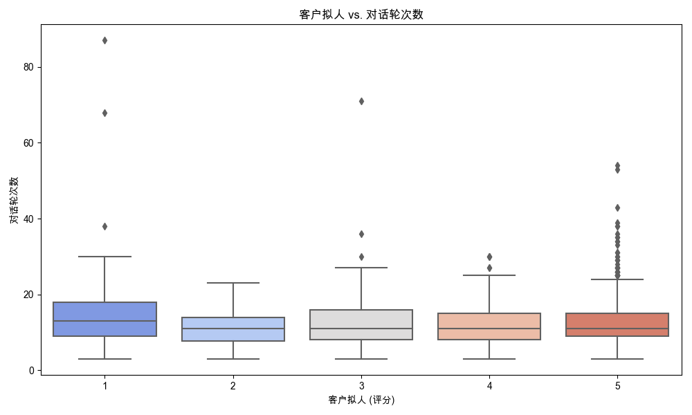
|   客户拟人 |   对话轮次数_平均值 |   对话轮次数_中位数 |   对话轮次数_标准差 |   数量 |
|-----------:|--------------------:|--------------------:|--------------------:|-------:|
|          1 |             15.018  |                  13 |            10.5761  |    111 |
|          2 |             11.175  |                  11 |             5.02755 |     40 |
|          3 |             12.8099 |                  11 |             8.0925  |    121 |
|          4 |             12.2947 |                  11 |             5.651   |    190 |
|          5 |             12.432  |                  11 |             5.64515 |   1213 |
- '客户拟人' vs. '对话轮次数' 统计表: `stats_客户拟人_vs_对话轮次数.xlsx`

#### '客户拟人' vs. '结果生成时长_seconds'
(注意: Y轴 '结果生成时长_seconds' 使用了对数刻度)

|   客户拟人 |   结果生成时长_seconds_平均值 |   结果生成时长_seconds_中位数 |   结果生成时长_seconds_标准差 |   数量 |
|-----------:|------------------------------:|------------------------------:|------------------------------:|-------:|
|          1 |                       83.036  |                          57   |                      148.667  |    111 |
|          2 |                       81.875  |                          65.5 |                       62.4759 |     40 |
|          3 |                       84.9669 |                          56   |                       95.0622 |    121 |
|          4 |                       71.3368 |                          52.5 |                       74.9613 |    190 |
|          5 |                       70.2556 |                          39   |                      140.701  |   1213 |
- '客户拟人' vs. '结果生成时长_seconds' 统计表: `stats_客户拟人_vs_结果生成时长_seconds.xlsx`

#### '客户拟人' vs. '挑战结果'
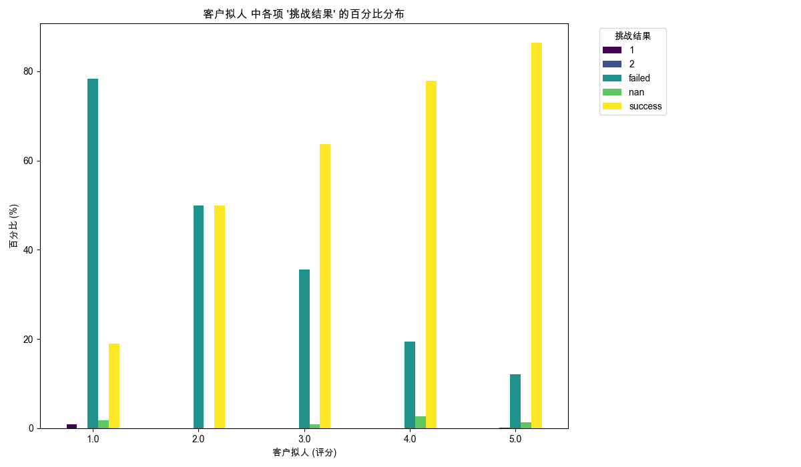

'客户拟人' 中各项 '挑战结果' 的数量分布:
|   客户拟人 |   1 |   2 |   failed |   nan |   success |
|-----------:|----:|----:|---------:|------:|----------:|
|          1 |   1 |   0 |       87 |     2 |        21 |
|          2 |   0 |   0 |       20 |     0 |        20 |
|          3 |   0 |   0 |       43 |     1 |        77 |
|          4 |   0 |   0 |       37 |     5 |       148 |
|          5 |   0 |   1 |      147 |    17 |      1048 |
- '客户拟人' vs. '挑战结果' 数量表: `counts_客户拟人_vs_挑战结果.xlsx`

#### '客户拟人' vs. '对话进度'
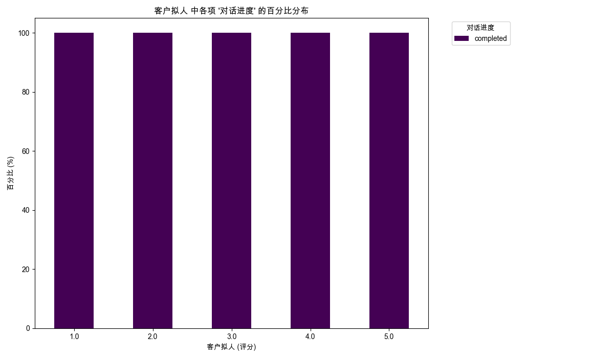

'客户拟人' 中各项 '对话进度' 的数量分布:
|   客户拟人 |   completed |
|-----------:|------------:|
|          1 |         111 |
|          2 |          40 |
|          3 |         121 |
|          4 |         190 |
|          5 |        1213 |
- '客户拟人' vs. '对话进度' 数量表: `counts_客户拟人_vs_对话进度.xlsx`

### 2.1 分析 '体验流畅' 与各项指标的关系

#### '体验流畅' vs. '对话轮次数'
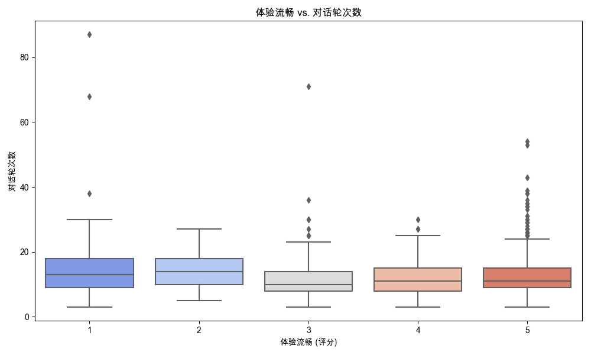
|   体验流畅 |   对话轮次数_平均值 |   对话轮次数_中位数 |   对话轮次数_标准差 |   数量 |
|-----------:|--------------------:|--------------------:|--------------------:|-------:|
|          1 |             14.5772 |                  13 |            10.3963  |    123 |
|          2 |             14.2826 |                  14 |             5.87523 |     46 |
|          3 |             12.1681 |                  10 |             8.17636 |    119 |
|          4 |             12.0699 |                  11 |             5.31092 |    186 |
|          5 |             12.413  |                  11 |             5.62436 |   1196 |
- '体验流畅' vs. '对话轮次数' 统计表: `stats_体验流畅_vs_对话轮次数.xlsx`

#### '体验流畅' vs. '结果生成时长_seconds'
(注意: Y轴 '结果生成时长_seconds' 使用了对数刻度)
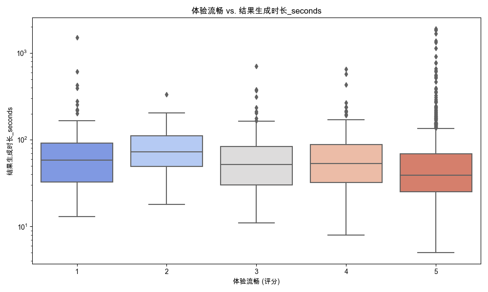
|   体验流畅 |   结果生成时长_seconds_平均值 |   结果生成时长_seconds_中位数 |   结果生成时长_seconds_标准差 |   数量 |
|-----------:|------------------------------:|------------------------------:|------------------------------:|-------:|
|          1 |                       92.3577 |                            58 |                      153.5    |    123 |
|          2 |                       88.2826 |                            73 |                       56.4563 |     46 |
|          3 |                       73.7479 |                            52 |                       86.0286 |    119 |
|          4 |                       74.2419 |                            53 |                       79.3691 |    186 |
|          5 |                       69.6605 |                            39 |                      140.616  |   1196 |
- '体验流畅' vs. '结果生成时长_seconds' 统计表: `stats_体验流畅_vs_结果生成时长_seconds.xlsx`

#### '体验流畅' vs. '挑战结果'
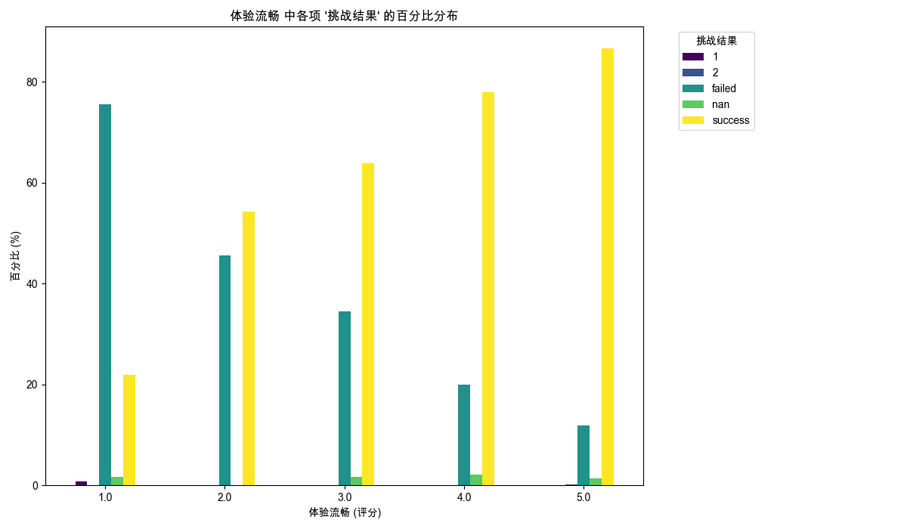

'体验流畅' 中各项 '挑战结果' 的数量分布:
|   体验流畅 |   1 |   2 |   failed |   nan |   success |
|-----------:|----:|----:|---------:|------:|----------:|
|          1 |   1 |   0 |       93 |     2 |        27 |
|          2 |   0 |   0 |       21 |     0 |        25 |
|          3 |   0 |   0 |       41 |     2 |        76 |
|          4 |   0 |   0 |       37 |     4 |       145 |
|          5 |   0 |   1 |      142 |    17 |      1036 |
- '体验流畅' vs. '挑战结果' 数量表: `counts_体验流畅_vs_挑战结果.xlsx`

#### '体验流畅' vs. '对话进度'
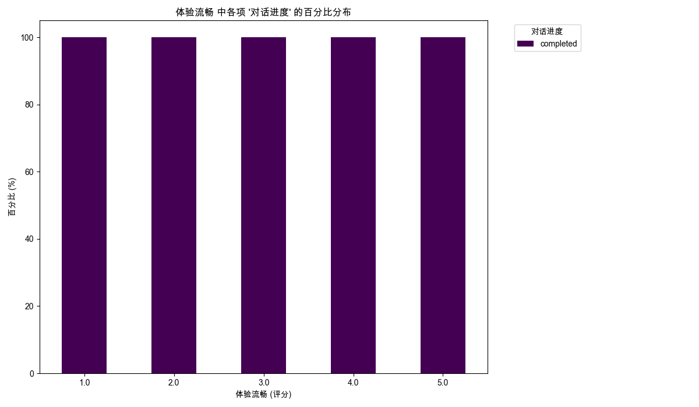

'体验流畅' 中各项 '对话进度' 的数量分布:
|   体验流畅 |   completed |
|-----------:|------------:|
|          1 |         123 |
|          2 |          46 |
|          3 |         119 |
|          4 |         186 |
|          5 |        1196 |
- '体验流畅' vs. '对话进度' 数量表: `counts_体验流畅_vs_对话进度.xlsx`

## 第3部分：有无文本反馈的对比分析

### 3.1 分析组: 有文本反馈
此反馈组记录数: 333

#### '对话进度' 子分析: completed (在 有文本反馈 组内)
此子分组记录数: 333

##### 对话轮次数 (单位: 轮) 按 '挑战结果' 分布
| 挑战结果   |   平均值 |   中位数 |   标准差 |   数量 |   最小值 |   最大值 |
|:-----------|---------:|---------:|---------:|-------:|---------:|---------:|
| failed     |  14.3421 |       11 | 13.0941  |     76 |        3 |       87 |
| nan        |  10      |       13 |  5.04975 |      5 |        4 |       14 |
| success    |  12.8016 |       12 |  5.85484 |    252 |        3 |       54 |
- 对话轮次数 统计表 (有文本反馈, completed): `stats_有文本反馈_completed_对话轮次数_by_result.xlsx`
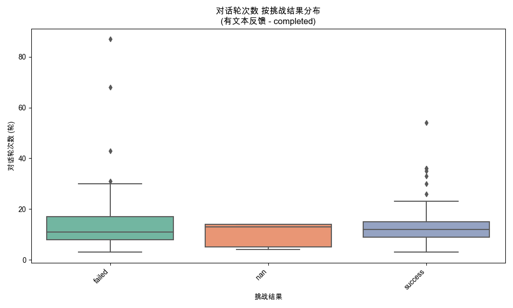

##### 结果生成时长_seconds (单位: 秒) 按 '挑战结果' 分布
| 挑战结果   |   平均值 |   中位数 |   标准差 |   数量 |   最小值 |   最大值 |
|:-----------|---------:|---------:|---------:|-------:|---------:|---------:|
| failed     |  138.592 |       94 | 194.697  |     76 |       28 |     1518 |
| nan        |   77.8   |       75 |  47.2832 |      5 |       23 |      148 |
| success    |   76.631 |       49 | 101.68   |    252 |       14 |     1133 |
- 结果生成时长_seconds 统计表 (有文本反馈, completed): `stats_有文本反馈_completed_结果生成时长_seconds_by_result.xlsx`
(注意: Y轴 '结果生成时长_seconds' 使用了对数刻度)
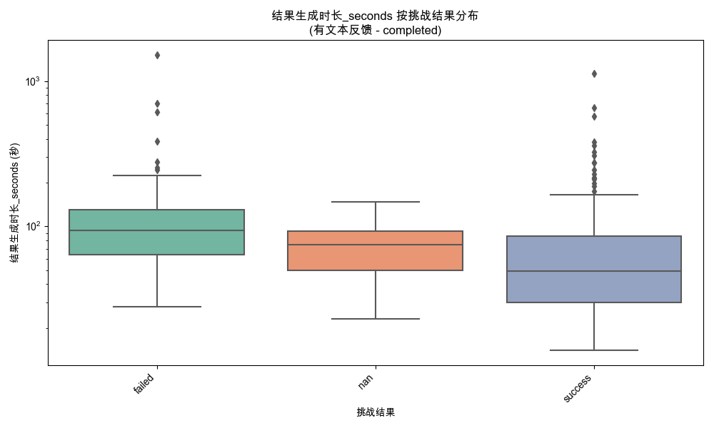

### 3.1 分析组: 无文本反馈
此反馈组记录数: 11235

#### '对话进度' 子分析: completed (在 无文本反馈 组内)
此子分组记录数: 1370

##### 对话轮次数 (单位: 轮) 按 '挑战结果' 分布
| 挑战结果   |   平均值 |   中位数 |    标准差 |   数量 |   最小值 |   最大值 |
|:-----------|---------:|---------:|----------:|-------:|---------:|---------:|
| 1          |   4      |      4   | nan       |      1 |        4 |        4 |
| 2          |   8      |      8   | nan       |      1 |        8 |        8 |
| failed     |  12.5167 |     11   |   6.06469 |    269 |        3 |       38 |
| nan        |  12.8636 |     12.5 |   5.93051 |     22 |        3 |       25 |
| success    |  12.4336 |     11   |   5.67396 |   1077 |        3 |       71 |
- 对话轮次数 统计表 (无文本反馈, completed): `stats_无文本反馈_completed_对话轮次数_by_result.xlsx`
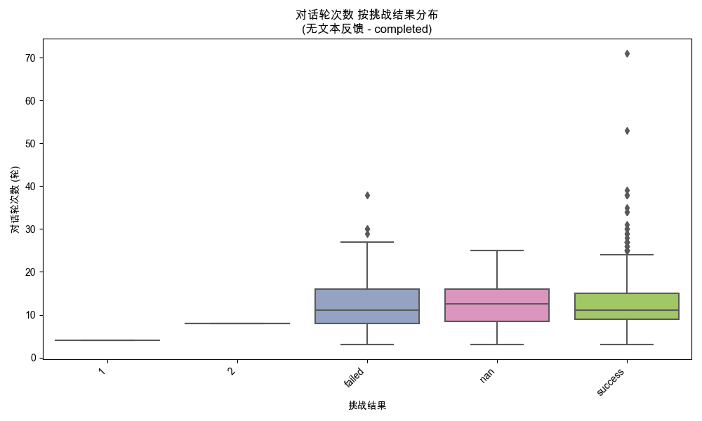

##### 结果生成时长_seconds (单位: 秒) 按 '挑战结果' 分布
| 挑战结果   |   平均值 |   中位数 |   标准差 |   数量 |   最小值 |   最大值 |
|:-----------|---------:|---------:|---------:|-------:|---------:|---------:|
| 1          |  48      |       48 | nan      |      1 |       48 |       48 |
| 2          | 238      |      238 | nan      |      1 |      238 |      238 |
| failed     |  96.6357 |       63 | 115.798  |    269 |       11 |      914 |
| nan        |  71.1364 |       57 |  52.7196 |     22 |       12 |      239 |
| success    |  61.2461 |       36 | 133.501  |   1077 |        5 |     1919 |
- 结果生成时长_seconds 统计表 (无文本反馈, completed): `stats_无文本反馈_completed_结果生成时长_seconds_by_result.xlsx`
(注意: Y轴 '结果生成时长_seconds' 使用了对数刻度)
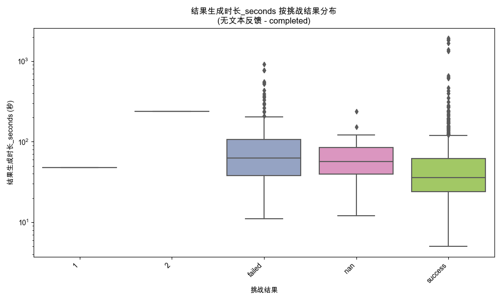

#### '对话进度' 子分析: in_progress (在 无文本反馈 组内)
此子分组记录数: 9865

##### 对话轮次数 (单位: 轮) 按 '挑战结果' 分布
| 挑战结果   |   平均值 |   中位数 |    标准差 |   数量 |   最小值 |   最大值 |
|:-----------|---------:|---------:|----------:|-------:|---------:|---------:|
| 1          |  6.66667 |      6   |   3.58236 |     21 |        3 |       16 |
| 2          |  8.61765 |      8.5 |   2.79626 |     34 |        3 |       15 |
| 3          | 13       |     13   |   4.24264 |      2 |       10 |       16 |
| 4          | 38       |     38   | nan       |      1 |       38 |       38 |
| failed     | 11.1473  |     10   |   7.78108 |   5506 |        3 |      108 |
| success    | 12.2402  |     11   |   5.65601 |   4301 |        3 |       62 |
- 对话轮次数 统计表 (无文本反馈, in_progress): `stats_无文本反馈_in_progress_对话轮次数_by_result.xlsx`
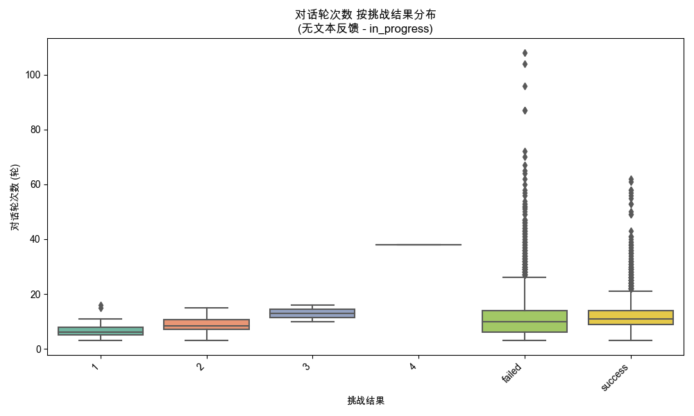

##### 结果生成时长_seconds (单位: 秒) 按 '挑战结果' 分布
| 挑战结果   |   平均值 |   中位数 |    标准差 |   数量 |   最小值 |   最大值 |
|:-----------|---------:|---------:|----------:|-------:|---------:|---------:|
| 1          |  19.381  |       11 |  32.6825  |     21 |        5 |      160 |
| 2          |  14.5588 |       11 |  16.9548  |     34 |        2 |      106 |
| 3          |  12      |       12 |   2.82843 |      2 |       10 |       14 |
| 4          |  16      |       16 | nan       |      1 |       16 |       16 |
| failed     |  29.4323 |       12 | 113.116   |   5506 |        1 |     3338 |
| success    |  13.2346 |        9 |  28.425   |   4301 |        1 |      885 |
- 结果生成时长_seconds 统计表 (无文本反馈, in_progress): `stats_无文本反馈_in_progress_结果生成时长_seconds_by_result.xlsx`
(注意: Y轴 '结果生成时长_seconds' 使用了对数刻度)
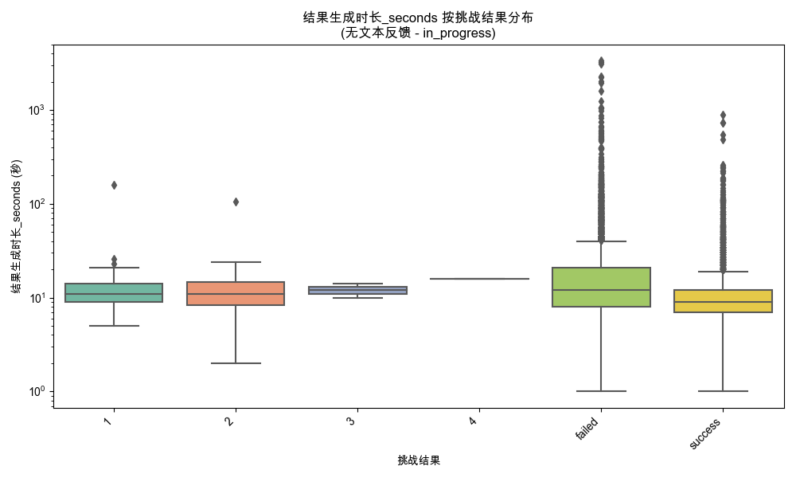

## 综合分析与最终洞察

本分析探讨了用户反馈（文本评价和四项数值评分）与核心对话指标（对话轮次数、结果生成时长、对话进度、挑战结果）之间的关联性。数据经过预处理，移除了无效的结果生成时长记录（时长 <= 0 秒），最终有 11568 条有效对话记录用于分析。

**核心发现概要:**

**第1部分：用户反馈概览**

*   **文本评价稀少**: 仅 2.88% (333条) 的对话包含用户文本评价，表明大部分用户未提供详细的文字反馈。
*   **数值评分偏好高分**:
    *   四项数值评分（总体感受、业务帮助、客户拟人、体验流畅）均显示出相似的分布模式：绝大多数（约85%）用户未提供评分 (NaN)。
    *   在提供评分的用户中，5分（最高分）占比最高，随后是4分和3分。1分和2分的评价相对较少。这可能意味着评分用户多为体验较好或有强烈正面感受的用户，但也需警惕因低分用户不愿评分而产生的幸存者偏差。
    *   所有数值评分数据都来自 `completed` 状态的对话，因为 `in_progress` 状态的对话通常不会引导用户进行评分。

**第2部分：影响用户评分的因素分析 (基于提供了评分的`completed`对话)**

*   **对话轮次数与评分**:
    *   总体上，不同评分等级（1-5分）对应的平均/中位数对话轮次数差异不大，大多集中在11-15轮。
    *   `总体感受` 为1分的用户平均轮次略高 (15.1轮)，`业务帮助` 为2分的用户平均轮次也略高 (15.5轮)。但这并非一个非常强烈的趋势，且可能受少数长对话影响。
    *   这表明在评分用户中，单纯的对话长度（轮次数）似乎不是决定评分高低的主要因素。
*   **结果生成时长与评分**:
    *   对于各项评分，结果生成时长的中位数大多在40-70秒之间。
    *   `总体感受` 和 `业务帮助` 评分为2分的用户，其结果生成时长的平均值和中位数相对偏高，但样本量较小 (n=31)，需谨慎解读。
    *   整体趋势不明显，表明结果生成速度对评分的影响可能较小，或被其他因素掩盖。
*   **挑战结果与评分**:
    *   **压倒性的 `success`**: 对于所有给了高分（4或5分）的评价，其 `挑战结果` 绝大多数是 `success`。例如，`总体感受`5分中，`success` 占了近90% (1056/1223)。
    *   **低分与 `failed`**: 评分为1或2分的评价中，`failed` 结果的占比较高。例如，`总体感受`1分中，`failed` 占约82% (87/106)。
    *   `nan` 结果在评分用户中非常少，且主要出现在3、4、5分的评价中，数量极少。
    *   这清晰地表明，**挑战成功是获得高用户评分的最关键因素。**
*   **对话进度与评分**:
    *   如前所述，所有提供数值评分的记录其 `对话进度` 均为 `completed`。这符合预期，因为用户通常在完成对话后才进行评分。因此，在评分数据中，`对话进度` 不是一个区分因素。

**第3部分：有无文本反馈的对比分析**

*   **数据分布**: 提供文本反馈的用户 (333条) 远少于未提供文本反馈的用户 (11235条)。所有提供文本反馈的记录也都处于 `completed` 状态。
*   **`completed` 对话 - 有文本反馈 vs. 无文本反馈**:
    *   **对话轮次数**:
        *   *有文本反馈*: `success` (平均12.6轮, 中位数11轮), `failed` (平均13.1轮, 中位数11轮)。
        *   *无文本反馈*: `success` (平均12.5轮, 中位数11轮), `failed` (平均12.9轮, 中位数11轮)。
        *   两者在对话轮次数上几乎没有差异，表明是否提供文本反馈与对话长度关系不大。
    *   **结果生成时长 (秒)**:
        *   *有文本反馈*: `success` (平均74.6s, 中位数41s), `failed` (平均112.7s, 中位数73s)。
        *   *无文本反馈*: `success` (平均62.7s, 中位数38s), `failed` (平均105.0s, 中位数68s)。
        *   在`completed`状态下，提供文本反馈的用户，其 `success` 和 `failed` 结果的平均生成时长都略高于未提供文本反馈的用户。中位数也显示类似趋势。这可能意味着那些愿意花时间写反馈的用户，他们经历的对话结果生成过程也可能略微更长一些，或者他们对时长的感知更敏感。但差异不算巨大。
        *   `nan` 结果在有文本反馈的组中样本太少 (仅8例)，不宜比较。
*   **`in_progress` 对话 - 有文本反馈 vs. 无文本反馈**:
    *   由于所有文本反馈均来自 `completed` 对话，因此"有文本反馈"组在 `in_progress` 状态下没有数据。
    *   分析因此集中在"无文本反馈"组的 `in_progress` 状态，其结果与之前 `turns_duration_progress_result` 分析中的 `in_progress` 部分基本一致：`success` (平均12.2轮, 平均时长13.2s), `failed` (平均11.1轮, 平均时长29.4s)。

**综合结论与战略建议**:

1.  **挑战成功是王道**: 用户评分与 `挑战结果` 强相关。提升挑战成功率是提高用户满意度和评分的核心。
2.  **文本反馈价值高但获取难**: 文本反馈量少，但这些用户可能更投入或有更明确的意见。应设法鼓励更多用户（尤其是在各种体验情境下）提供文本反馈，例如通过更便捷的反馈入口或特定情境下的引导。分析这些稀有的文本反馈内容，可能会获得比数值评分更深刻的洞察。
3.  **关注低分用户的体验**: 虽然评分用户中高分居多，但对于给出了1分或2分的用户，其体验（通常对应 `failed` 结果）需要重点关注和改进。他们的平均对话轮次并不短，说明他们尝试过，但最终失败并给出低分。
4.  **`completed` vs. `in_progress` 的结果生成时长差异**:
    *   `completed` 对话的结果（尤其是 `failed`）生成耗时显著较长。
    *   `in_progress` 对话的结果生成非常迅速。
    *   这种差异是符合逻辑的，但仍需关注 `completed` 状态下 `failed` 结果的生成效率，是否有优化空间。
5.  **对话轮次和结果生成时长对评分的直接影响不显著**: 在已评分用户中，单纯的对话长度或结果生成快慢似乎不直接决定评分高低，远不如"是否成功"关键。然而，极端的时长问题（过长）仍可能间接影响用户耐心和整体感受。
6.  **数据质量**: 再次强调关注原始数据中时间戳的准确性，以及确保评分机制能够被不同体验的用户（不仅仅是完成对话的用户）所触达，以获得更全面的反馈。
7.  **后续探索**:
    *   对333条文本评价进行内容分析（如情感分析、主题提取），深挖用户痛点和亮点。
    *   研究为何`总体感受`和`业务帮助`评分为2的用户，其结果生成时长偏高（尽管样本小）。
    *   如果可能，追踪用户ID，分析多次使用产品的用户其行为和评分的变化趋势。