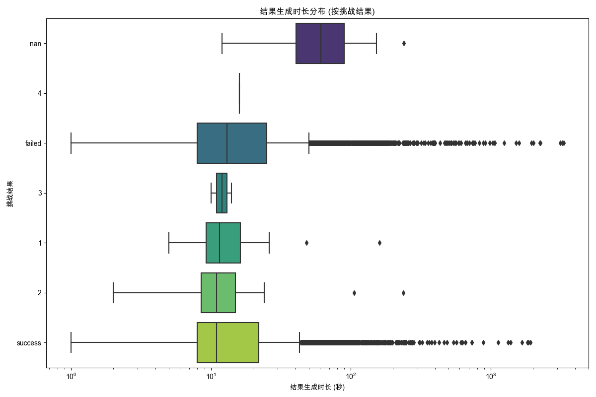

## 结果生成时长分析
数据来源: `data_for_analysis/online_data_20250515/filtered_data/filtered_online_data_min_3_rounds.xlsx`
用于分析的有效记录数 (在时间转换、时长计算并移除无效时长后): 11568

已处理数据子集保存至: `processed_data_gen_duration.xlsx`

### 生成的Excel文件:
- 已处理数据 (包含计算的时长): `processed_data_gen_duration.xlsx`

### 各挑战结果的 '结果生成时长' 统计 (秒):
| 挑战结果   |   平均值 |   中位数 |    标准差 |   数量 |   最小值 |   最大值 |
|:-----------|---------:|---------:|----------:|-------:|---------:|---------:|
| 1          |  20.6818 |     11.5 |  32.4733  |     22 |        5 |      160 |
| 2          |  20.9429 |     11   |  41.2973  |     35 |        2 |      238 |
| 3          |  12      |     12   |   2.82843 |      2 |       10 |       14 |
| 4          |  16      |     16   | nan       |      1 |       16 |       16 |
| failed     |  33.9398 |     13   | 116.117   |   5851 |        1 |     3338 |
| nan        |  72.3704 |     61   |  50.9488  |     27 |       12 |      239 |
| success    |  25.2567 |     11   |  70.4379  |   5630 |        1 |     1919 |
- 各挑战结果的 '结果生成时长' 统计数据: `gen_duration_stats_by_result.xlsx`

(注意: X轴使用了对数刻度以更好地显示大范围数据)

## 结果生成时长分析 - 洞察

数据来源: `data_for_analysis/online_data_20250515/filtered_data/filtered_online_data_min_3_rounds.xlsx`
经过时间转换、时长计算并移除了无效（非正数）的时长后，用于分析的有效记录数为 11568。之前总记录数为14312，表明约有2744条记录（约19%）的原始结果生成时间存在问题（结果生成时间早于或等于结束对话时间）或缺失。

**主要发现:**

1.  **'nan' 结果的生成时长显著较长**:
    *   `nan` 挑战结果的平均生成时长为 72.37 秒，中位数时长为 61 秒。这显著高于所有其他挑战结果类别。
    *   例如，`success` 的平均生成时长为 25.26 秒（中位数 11 秒），`failed` 的平均生成时长为 33.94 秒（中位数 13 秒）。
    *   这表明，当系统未能明确判定对话为 `success` 或 `failed` (即结果为 `nan`) 时，其结果裁定和生成过程可能消耗了更多时间。这可能与评估逻辑的复杂性、超时机制或需要更久处理的模糊情境有关。

2.  **'failed' 结果的生成时长略高于 'success'**:
    *   `failed` 的平均生成时长 (33.94 秒) 略高于 `success` (25.26 秒)。它们的中位数分别为 13 秒和 11 秒，差异不大但趋势一致。
    *   这可能暗示判定失败的过程比判定成功需要略微更长的计算或评估时间。

3.  **数字评分结果的生成时长**:
    *   数字评分 (1, 2, 3, 4) 的样本量非常小，尤其是 '3' (2例) 和 '4' (1例)，因此其统计数据的代表性有限。
    *   '1' (平均 20.68s, 中位数 11.5s) 和 '2' (平均 20.94s, 中位数 11s) 的生成时长与 `success` 结果的时长较为接近。

4.  **时长分布的离散性**:
    *   所有主要类别 (`failed`, `nan`, `success`) 的标准差都相对较大，特别是 `failed` (116.12) 和 `success` (70.44)，表明在这些类别内部，结果生成时长有很大的变异性。`nan` 的标准差为 50.95，相对其平均值而言也较大。
    *   这说明虽然平均和中位数提供了一个中心趋势，但实际的生成时长可能因个案而异，波动范围较广。
    *   图表使用了对数刻度，进一步印证了数据分布的广泛性。

**初步结论与建议**:

*   **关注 'nan' 结果的评估效率**: `nan` 结果的生成时长显著偏高，是主要的性能瓶颈。应深入调查 `nan` 结果产生的具体逻辑和条件，探究是什么原因导致其评估和生成耗时较长。是否存在可以优化或简化的评估路径？
*   **数据质量**: 约19%的记录因结果生成时间戳问题被排除。需要检查数据记录的准确性，确保 `结束对话时间` 和 `结果生成时间` 被正确记录，避免出现逻辑错误（如生成时间早于结束时间）。
*   **与对话时长对比**: 先前的分析（`analysis_summary.md`）关注的是对话本身的持续时间。将本次的结果生成时长与对话时长结合分析可能会更有价值。例如，长对话是否更容易导致长结果生成时间？
*   **进一步细分**: 如果可能，将 `nan` 结果按可能的原因进一步细分（如果数据支持），可能会揭示不同类型的 `nan` 是否有不同的生成时长特征。