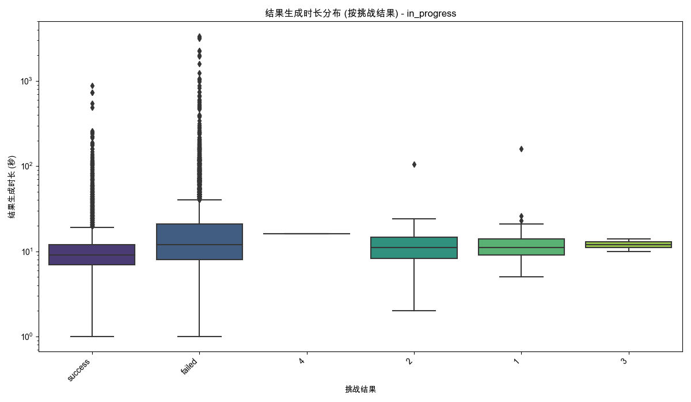

# 分析：对话轮次、结果生成时长、对话进度与挑战结果的关联性
数据来源: `data_for_analysis/online_data_20250515/filtered_data/filtered_online_data_min_3_rounds.xlsx`
原始数据记录数: 14312
经结果生成时长计算与过滤后记录数: 11568 (移除了 2744 条无效时长记录)

已处理的包含轮次与时长的完整数据保存至: `processed_data_turns_gen_time.xlsx`
用于后续分析的有效记录数: 11568

### 生成的Excel文件:
- 完整预处理数据: `processed_data_turns_gen_time.xlsx`

## '对话进度' 分析: completed
此分组记录数: 1703

### 按挑战结果统计: 对话轮次数与结果生成时长

#### 对话轮次数统计:
| 挑战结果   |   平均轮次 |   轮次中位数 |   轮次标准差 |   数量 |   最小轮次 |   最大轮次 |
|:-----------|-----------:|-------------:|-------------:|-------:|-----------:|-----------:|
| 1          |     4      |            4 |    nan       |      1 |          4 |          4 |
| 2          |     8      |            8 |    nan       |      1 |          8 |          8 |
| failed     |    12.9188 |           11 |      8.16147 |    345 |          3 |         87 |
| nan        |    12.3333 |           13 |      5.79788 |     27 |          3 |         25 |
| success    |    12.5034 |           11 |      5.70828 |   1329 |          3 |         71 |
- 对话轮次数统计表: `stats_turns_by_result_completed.xlsx`

#### 结果生成时长统计 (秒):
| 挑战结果   |   平均时长(秒) |   时长中位数(秒) |   时长标准差(秒) |   数量 |   最小时长(秒) |   最大时长(秒) |
|:-----------|---------------:|-----------------:|-----------------:|-------:|---------------:|---------------:|
| 1          |        48      |               48 |         nan      |      1 |             48 |             48 |
| 2          |       238      |              238 |         nan      |      1 |            238 |            238 |
| failed     |       105.878  |               69 |         137.893  |    345 |             11 |           1518 |
| nan        |        72.3704 |               61 |          50.9488 |     27 |             12 |            239 |
| success    |        64.1633 |               38 |         128.184  |   1329 |              5 |           1919 |
- 结果生成时长统计表: `stats_duration_by_result_completed.xlsx`

## '对话进度' 分析: in_progress
此分组记录数: 9865

### 按挑战结果统计: 对话轮次数与结果生成时长

#### 对话轮次数统计:
| 挑战结果   |   平均轮次 |   轮次中位数 |   轮次标准差 |   数量 |   最小轮次 |   最大轮次 |
|:-----------|-----------:|-------------:|-------------:|-------:|-----------:|-----------:|
| 1          |    6.66667 |          6   |      3.58236 |     21 |          3 |         16 |
| 2          |    8.61765 |          8.5 |      2.79626 |     34 |          3 |         15 |
| 3          |   13       |         13   |      4.24264 |      2 |         10 |         16 |
| 4          |   38       |         38   |    nan       |      1 |         38 |         38 |
| failed     |   11.1473  |         10   |      7.78108 |   5506 |          3 |        108 |
| success    |   12.2402  |         11   |      5.65601 |   4301 |          3 |         62 |
- 对话轮次数统计表: `stats_turns_by_result_in_progress.xlsx`

#### 结果生成时长统计 (秒):
| 挑战结果   |   平均时长(秒) |   时长中位数(秒) |   时长标准差(秒) |   数量 |   最小时长(秒) |   最大时长(秒) |
|:-----------|---------------:|-----------------:|-----------------:|-------:|---------------:|---------------:|
| 1          |        19.381  |               11 |         32.6825  |     21 |              5 |            160 |
| 2          |        14.5588 |               11 |         16.9548  |     34 |              2 |            106 |
| 3          |        12      |               12 |          2.82843 |      2 |             10 |             14 |
| 4          |        16      |               16 |        nan       |      1 |             16 |             16 |
| failed     |        29.4323 |               12 |        113.116   |   5506 |              1 |           3338 |
| success    |        13.2346 |                9 |         28.425   |   4301 |              1 |            885 |
- 结果生成时长统计表: `stats_duration_by_result_in_progress.xlsx`

(注意: in_progress组 时长Y轴使用了对数刻度)

## 综合分析与洞察

本分析探讨了对话轮次数、结果生成时长、对话进度（completed/in_progress）以及挑战结果之间的关联性。数据经过预处理，移除了无效的结果生成时长记录（时长 <= 0 秒），最终有 11568 条记录用于分析。

**核心发现:**

1.  **数据概览**:
    *   在有效的11568条记录中，`completed` 状态的对话有 1703 条，而 `in_progress` 状态的对话有 9865 条，表明绝大多数对话在中途结束。
    *   原始数据中约 19% (2744条) 的记录因结果生成时间戳问题（如生成时间早于或等于结束时间）被移除，提示数据记录层面可能存在需要关注的质量问题。

2.  **'completed' 对话状态分析**:
    *   **对话轮次数**:
        *   `success` (平均12.5轮, 中位数11轮) 和 `failed` (平均12.9轮, 中位数11轮) 的对话轮次数非常相似。
        *   `nan` 结果的对话轮次 (平均12.3轮, 中位数13轮) 也大致在同一范围。
        *   数字评分的样本量极小，其轮次数据不具广泛代表性。
        *   整体来看，完成的对话通常经历相似的交互轮次，无论最终结果如何。
    *   **结果生成时长 (秒)**:
        *   `failed` 结果的平均生成时长 (105.9秒) 显著高于 `success` (64.2秒) 和 `nan` (72.4秒)。中位数也呈现类似趋势 (`failed`: 69秒, `success`: 38秒, `nan`: 61秒)。
        *   这表明在对话完成后，判定为 `failed` 的结果比较判定为 `success` 或 `nan` 的结果需要更长的处理时间。
        *   `nan` 结果的生成时长介于 `success` 和 `failed` 之间。
        *   数字评分 '2' 有一个高达238秒的生成时长，但仅为个例。
    *   **轮次与时长关系 (completed)**:
        *   散点图显示，对于 `completed` 的对话，对话轮次数和结果生成时长之间没有明显强烈的线性关系。不同挑战结果的点在图上分布较为分散。
        *   一些长轮次的对话可以有较短的结果生成时间，反之亦然。

3.  **'in_progress' 对话状态分析**:
    *   **对话轮次数**:
        *   `success` (平均12.2轮, 中位数11轮) 和 `failed` (平均11.1轮, 中位数10轮) 的对话轮次数依然相近，`success` 略高。
        *   这与先前在 `challenge_results_analysis` 中观察到的现象（中途退出的 `failed` 对话平均时长更短）有所不同，此处轮次数差异不大。这可能意味着用户即使在较多轮次后也可能因其他原因中断并标记为 `failed`。
        *   数字评分样本依旧很少。
        *   *值得注意的是，`nan` 结果类别在本阶段的 `in_progress` 统计中缺失。这是因为在计算 `结果生成时长_seconds` 时，只有那些同时拥有有效 `结束对话时间` 和 `结果生成时间` 且计算出时长为正数的记录才被保留。如果原始数据中 `in_progress` 状态下的 `nan` 结果没有对应的有效 `结果生成时间`，它们会在预处理阶段被筛除，因此不会出现在按 `结果生成时长_seconds` 分组的统计中。这与上一个 `result_generation_time_analysis` 的侧重点不同，那个分析是专门看 `结果生成时间` 本身，而这里是看计算出来的时长。*
    *   **结果生成时长 (秒)**:
        *   `failed` (平均29.4秒, 中位数12秒) 和 `success` (平均13.2秒, 中位数9秒) 的结果生成时长都远低于 `completed` 状态下的对应值。
        *   `failed` 的生成时长仍略高于 `success`。
        *   这表明对于中途结束的对话，无论标记为 `success` 还是 `failed`，结果的生成通常非常迅速。这可能是因为评估逻辑对于未完成的对话有快速通道或默认判定。
        *   Y轴使用了对数刻度，说明时长数据仍然存在一定的离散性，但整体值域远小于 `completed` 状态。
    *   **轮次与时长关系 (in_progress)**:
        *   散点图显示，对于 `in_progress` 的对话，绝大多数点的结果生成时长都非常短（集中在底部），即使用户进行了多轮对话。
        *   对话轮次数与结果生成时长之间似乎也没有强相关性。

**综合结论与建议**:

*   **结果生成效率差异**:
    *   `completed` 对话的结果生成，特别是 `failed` 结果，耗时显著较长。这可能是一个潜在的优化点，需要审视评估 `completed` 对话（尤其是失败场景）的逻辑。
    *   `in_progress` 对话的结果生成非常快，这可能是合理的，因为它们是中途退出的。
*   **对话轮次与结果**:
    *   在 `completed` 状态下，`success` 和 `failed` 的对话轮次数相似，表明用户在放弃前通常会进行足够多的尝试。
    *   在 `in_progress` 状态下，`success` 和 `failed` 的轮次数也相近，这提示我们不能仅从轮次数判断用户退出的原因或预期的成功/失败。
*   **'nan' 结果的特殊性**:
    *   在 `completed` 对话中，`nan` 结果的生成时长介于 `success` 和 `failed` 之间，对话轮次也与其他结果相似。
    *   `in_progress` 对话中 `nan` 结果的缺失（由于预处理移除了无有效生成时间的记录）提醒我们，很多中途退出的 `nan` 可能根本就没有进入到"结果生成"的阶段或没有记录下有效的生成时间戳。这与之前 `challenge_results_analysis` 中观察到的 `in_progress` 里 `nan` 占比高的情况相符——那些 `nan` 更多的是指"未产生有效挑战结果"。
*   **数据质量再强调**: 再次强调关注原始数据中时间戳记录的准确性，以提高分析的全面性和准确性。
*   **后续方向**:
    *   深入探究 `completed` 状态下 `failed` 结果生成耗时长的具体原因。
    *   结合业务理解，分析为何部分 `in_progress` 的对话也被标记为 `success`，以及它们的特征。