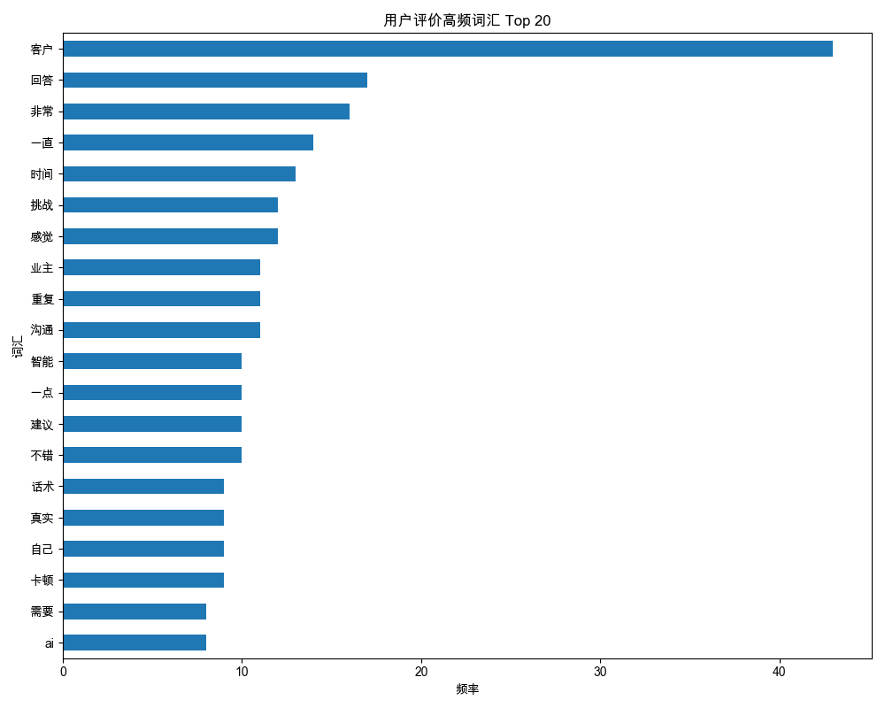
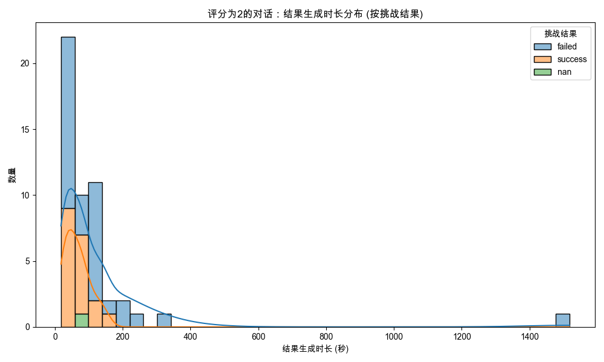
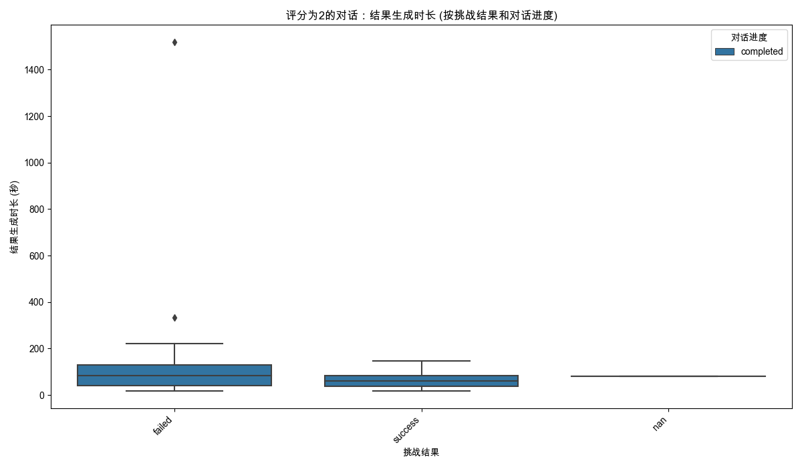
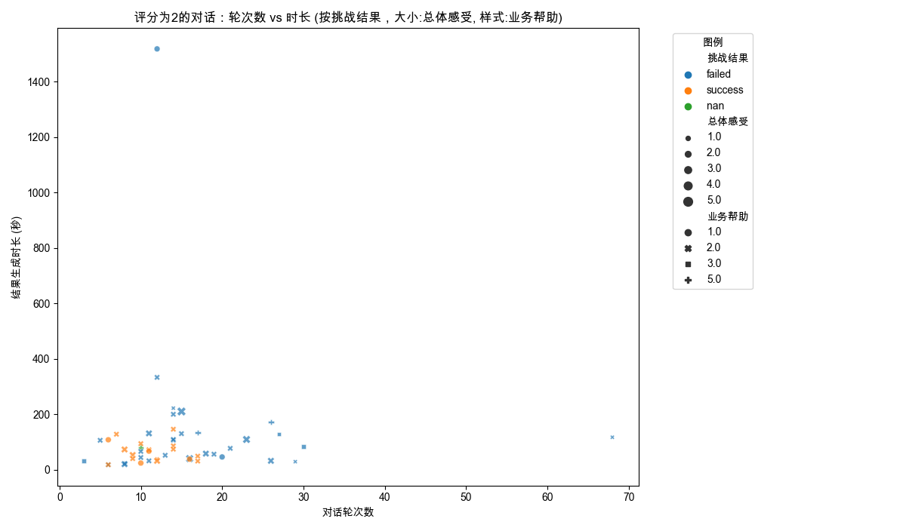
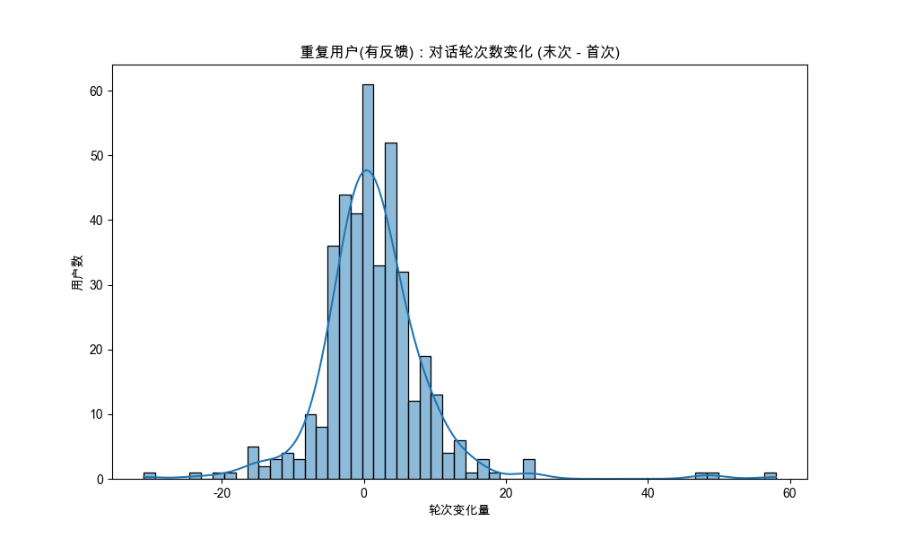
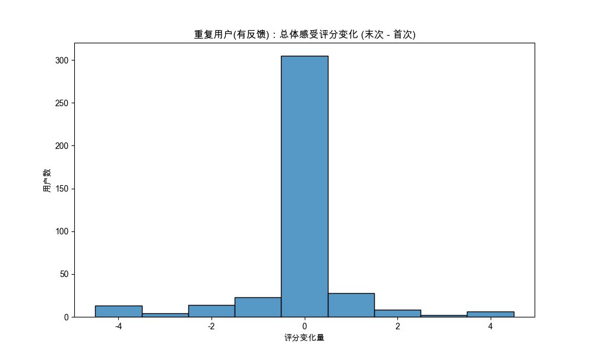

# 分析：高级用户反馈洞察 (文本、评分、行为模式)
数据来源: `filtered_online_data_min_3_rounds.xlsx`
原始数据记录数: 18426
有效结果生成时长过滤后记录数: 15328 (移除了 3098 条)
完成核心预处理（轮次、评价列转换）后记录数: 15328

**应用反馈过滤器**: 仅保留提供文本评价或至少一项数字评分的记录。
反馈过滤器应用前记录数: 15328
反馈过滤器应用后（用于后续所有高级分析）记录数: 2205

## 第1部分：文本用户评价深度分析
提取到包含文本评价的记录数 (来自已过滤反馈的数据集): 419
- 包含文本评价的数据子集已保存: `textual_feedback_subset.xlsx`

### 1.1 用户评价词云

(使用字体 '/System/Library/Fonts/STHeiti Light.ttc' 生成词云。)

### 1.2 高频词汇分析
| 词汇   |   频率 |
|:-------|-------:|
| 客户   |     43 |
| 回答   |     17 |
| 非常   |     16 |
| 一直   |     14 |
| 时间   |     13 |
| 挑战   |     12 |
| 感觉   |     12 |
| 重复   |     11 |
| 业主   |     11 |
| 沟通   |     11 |
| 智能   |     10 |
| 一点   |     10 |
| 建议   |     10 |
| 不错   |     10 |
| 话术   |      9 |
| 真实   |      9 |
| 自己   |      9 |
| 卡顿   |      9 |
| 需要   |      8 |
| ai     |      8 |
- 高频词汇表: `high_frequency_words.xlsx`

### 1.3 基于LLM的反馈分析 (实际调用)
本部分使用大型语言模型（LLM）对用户评价进行情感判断和主题提取。
LLM模型: `gpt-4o`. **注意: API调用会产生相应费用并需要时间。**
将对最多 350 条独立用户评价进行LLM分析 (每条评价进行情感和主题分析，共 582 次LLM调用)。
- LLM分析结果(Excel): `llm_analysis_results.xlsx`

#### LLM分析结果抽样展示 (前10条结果):
| original_comment                         | analysis_type   | llm_response                                                                      |
|:-----------------------------------------|:----------------|:----------------------------------------------------------------------------------|
| 挺好...                                  | Sentiment       | 情感倾向：正面。                                                                  |
|                                          |                 |                                                                                   |
|                                          |                 | 理由：“挺好”是一种对事物或体验的肯定和满意的表达，表示用户持有积极的态度。...     |
| 挺好...                                  | Topic           | 好...                                                                             |
| 无...                                    | Sentiment       | 中性。反馈内容为“无”，没有表达任何情感或态度。...                                 |
| 无...                                    | Topic           | 无反馈内容。...                                                                   |
| 太智能了...                              | Sentiment       | 正面。用户使用“太智能了”来描述产品或服务，通常表示满意和赞赏。...                 |
| 太智能了...                              | Topic           | 智能...                                                                           |
| 一点都不智能！...                        | Sentiment       | 负面。用户使用了否定的表达方式，对智能程度表示不满或失望。...                     |
| 一点都不智能！...                        | Topic           | 智能不足...                                                                       |
| 太坑了说的这么详细 还挑战结果异常我去... | Sentiment       | 负面。用户使用了“太坑了”和“结果异常”等负面词汇，表达了对挑战结果的不满和失望。... |
| 太坑了说的这么详细 还挑战结果异常我去... | Topic           | 坑，挑战，结果异常...                                                             |
- 完整的LLM分析结果(Markdown): `llm_analysis_full_report.md` (包含所有处理过的评论)

## 第2部分：特定低评分下结果生成时长偏高问题探究
分析 `总体感受` 或 `业务帮助` 评分为2的对话 (已预先筛选有反馈记录)，其 `结果生成时长_seconds` 是否存在特定模式。
提取到 `总体感受` 或 `业务帮助` 评分为2的记录数 (来自已过滤反馈的数据集): 50
- `总体感受` 或 `业务帮助` 评分为2的数据子集已保存: `score_2_feedback_subset.xlsx`

### 2.1 `评分为2` 对话的描述性统计
|        |   结果生成时长_seconds |   对话轮次数 | 挑战结果   | 对话进度   |
|:-------|-----------------------:|-------------:|:-----------|:-----------|
| count  |                 50     |     50       | 50         | 50         |
| unique |                nan     |    nan       | 3          | 1          |
| top    |                nan     |    nan       | failed     | completed  |
| freq   |                nan     |    nan       | 31         | 50         |
| mean   |                113.74  |     14.96    | nan        | nan        |
| std    |                212.002 |      9.88291 | nan        | nan        |
| min    |                 18     |      3       | nan        | nan        |
| 25%    |                 39.25  |     10       | nan        | nan        |
| 50%    |                 72.5   |     13.5     | nan        | nan        |
| 75%    |                115     |     17       | nan        | nan        |
| max    |               1518     |     68       | nan        | nan        |
- 描述性统计表: `desc_stats_score_2_feedback.xlsx`

### 2.2 `评分为2` 对话的结果生成时长分布

### 2.3 `评分为2` 对话的对话轮次数与结果生成时长关系

## 第3部分：用户重复使用行为初步探索
分析多次使用产品的用户的行为和评分趋势 (已预先筛选有反馈记录的用户)。
总独立用户数 (在有反馈记录中): 1273
多次使用用户数 (在有反馈记录中, 超过1次会话): 403
- (有反馈用户中)重复用户会话次数统计: `repeat_users_session_counts_with_feedback.xlsx`

### 3.1 (有反馈用户中)重复用户指标变化 (首次 vs 末次会话)
- (有反馈用户中)重复用户首次与末次会话指标对比: `repeat_users_first_last_session_comparison_with_feedback.xlsx`

#### 对话轮次数变化 (末次 - 首次)

平均轮次变化: 1.32

#### 总体感受评分变化 (末次 - 首次, 仅限提供了评分的用户)

平均总体感受评分变化: -0.10 (基于403名用户)

#### 挑战结果转变 (首次 -> 末次)
首次会话结果 vs 末次会话结果 交叉表 (有反馈用户中):
| first_challenge_result   |   1 |   2 |   failed |   nan |   success |
|:-------------------------|----:|----:|---------:|------:|----------:|
| failed                   |   1 |   0 |       28 |     1 |        56 |
| nan                      |   0 |   0 |        2 |     0 |         4 |
| success                  |   0 |   1 |       49 |     3 |       258 |
- 挑战结果转变交叉表: `repeat_users_challenge_result_transitions_with_feedback.xlsx`

## 综合分析与最终洞察
*(待脚本完全执行并审查结果后手动填充或由AI辅助生成)*