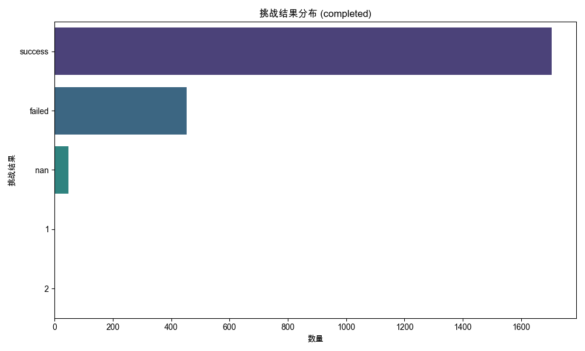
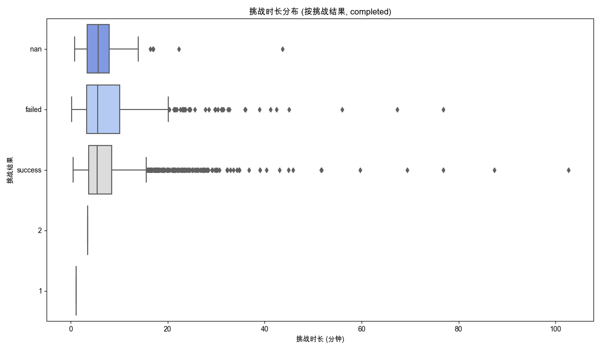
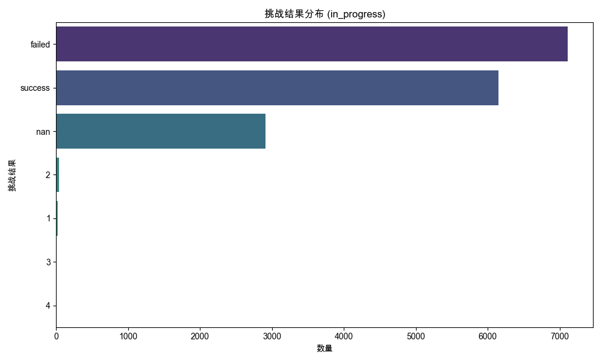
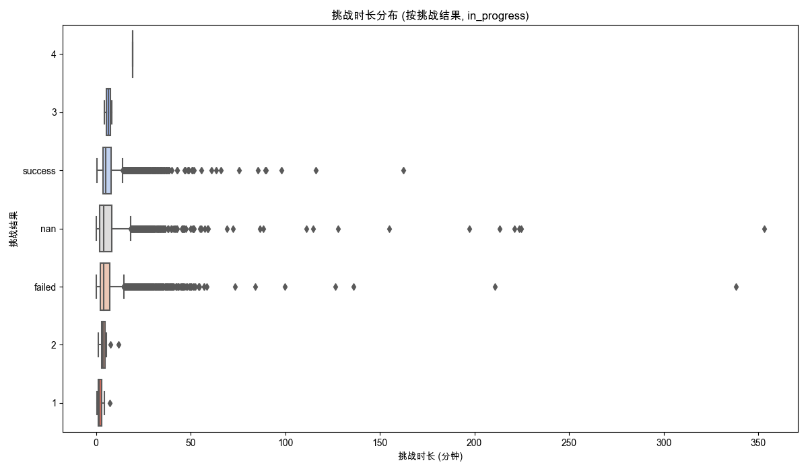

## 挑战数据分析
数据来源: `data_for_analysis/online_data_20250529/filtered_data/filtered_online_data_min_3_rounds.xlsx`
总记录数: 18426

### 生成的Excel文件:

### '对话进度' 分析: completed
- 'completed' 状态的已处理数据: `processed_data_completed.xlsx`

#### 挑战结果分布 (%):
| 挑战结果   |     百分比 |
|:-----------|-----------:|
| success    | 77.2789    |
| failed     | 20.4989    |
| nan        |  2.13152   |
| 1          |  0.0453515 |
| 2          |  0.0453515 |

#### 挑战时长与挑战结果关系:

##### 各挑战结果的平均/中位数挑战时长 (分钟):
| 挑战结果   |   平均值 |   中位数 |    标准差 |   数量 |
|:-----------|---------:|---------:|----------:|-------:|
| 1          |  1.1     |  1.1     | nan       |      1 |
| 2          |  3.46667 |  3.46667 | nan       |      1 |
| failed     |  8.29841 |  5.58333 |   8.76402 |    452 |
| nan        |  7.32766 |  5.7     |   7.15445 |     47 |
| success    |  7.43253 |  5.43333 |   7.1765  |   1704 |
- 'completed' 状态各挑战结果的时长统计: `duration_stats_by_result_completed.xlsx`

##### 'completed' 状态整体挑战时长统计 (分钟):
|          |      统计值 |
|:---------|------------:|
| 记录数   | 2205        |
| 平均值   |    7.60312  |
| 标准差   |    7.53197  |
| 最小值   |    0.216667 |
| 25分位数 |    3.6      |
| 中位数   |    5.48333  |
| 75分位数 |    8.7      |
| 最大值   |  102.7      |

### '对话进度' 分析: in_progress
- 'in_progress' 状态的已处理数据: `processed_data_in_progress.xlsx`

#### 挑战结果分布 (%):
| 挑战结果   |      百分比 |
|:-----------|------------:|
| failed     | 43.8136     |
| success    | 37.883      |
| nan        | 17.9459     |
| 2          |  0.209605   |
| 1          |  0.129462   |
| 3          |  0.0123297  |
| 4          |  0.00616485 |

#### 挑战时长与挑战结果关系:

##### 各挑战结果的平均/中位数挑战时长 (分钟):
| 挑战结果   |   平均值 |   中位数 |    标准差 |   数量 |
|:-----------|---------:|---------:|----------:|-------:|
| 1          |  2.15873 |  1.63333 |   1.55722 |     21 |
| 2          |  3.96324 |  3.85    |   1.91345 |     34 |
| 3          |  6.44167 |  6.44167 |   2.81664 |      2 |
| 4          | 19.3     | 19.3     | nan       |      1 |
| failed     |  6.15046 |  4.11667 |   8.39427 |   7107 |
| nan        |  7.39292 |  4.13333 |  14.2018  |   2911 |
| success    |  6.75316 |  5.13333 |   6.3907  |   6145 |
- 'in_progress' 状态各挑战结果的时长统计: `duration_stats_by_result_in_progress.xlsx`

##### 'in_progress' 状态整体挑战时长统计 (分钟):
|          |      统计值 |
|:---------|------------:|
| 记录数   | 16221       |
| 平均值   |     6.59285 |
| 标准差   |     9.09926 |
| 最小值   |     0.15    |
| 25分位数 |     2.73333 |
| 中位数   |     4.58333 |
| 75分位数 |     7.63333 |
| 最大值   |   353.317   |