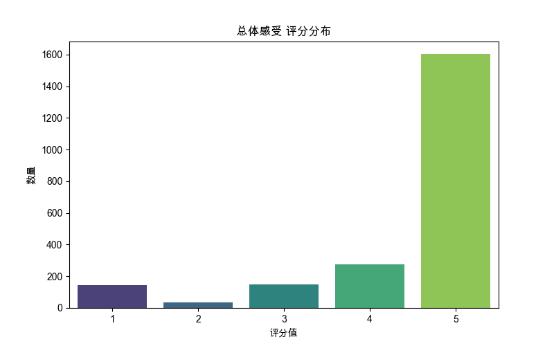

# 分析：用户反馈、评分与核心对话指标的关联性
数据来源: `filtered_online_data_min_3_rounds.xlsx`
原始数据记录数: 18426
经结果生成时长计算与过滤后记录数: 15328 (移除了 3098 条无效时长或时间戳记录)
用于后续分析的有效记录数: 15328

已处理的包含所有反馈指标的完整数据保存至: `processed_data_full_feedback.xlsx`

### 生成的核心Excel文件:
- 完整预处理数据: `processed_data_full_feedback.xlsx`

## 第1部分：用户反馈概览

### 1.1 文本用户评价统计
提供文本用户评价的记录数: 419 (占已处理总记录的 2.73%)
未提供文本用户评价的记录数: 14909

### 1.2各项评分分布

#### 总体感受 评分分布:
| 评分值       |   数量 |    百分比 |
|:-------------|-------:|----------:|
| 1.0          |    146 |  0.952505 |
| 2.0          |     36 |  0.234864 |
| 3.0          |    147 |  0.959029 |
| 4.0          |    274 |  1.78758  |
| 5.0          |   1602 | 10.4515   |
| 未评分 (NaN) |  13123 | 85.6146   |
- 总体感受 评分分布表: `dist_总体感受.xlsx`

#### 业务帮助 评分分布:
| 评分值       |   数量 |    百分比 |
|:-------------|-------:|----------:|
| 1.0          |    137 |  0.893789 |
| 2.0          |     37 |  0.241388 |
| 3.0          |    127 |  0.828549 |
| 4.0          |    264 |  1.72234  |
| 5.0          |   1612 | 10.5167   |
| 未评分 (NaN) |  13151 | 85.7972   |
- 业务帮助 评分分布表: `dist_业务帮助.xlsx`

#### 客户拟人 评分分布:
| 评分值       |   数量 |    百分比 |
|:-------------|-------:|----------:|
| 1.0          |    148 |  0.965553 |
| 2.0          |     45 |  0.29358  |
| 3.0          |    140 |  0.913361 |
| 4.0          |    256 |  1.67015  |
| 5.0          |   1584 | 10.334    |
| 未评分 (NaN) |  13155 | 85.8233   |
- 客户拟人 评分分布表: `dist_客户拟人.xlsx`

#### 体验流畅 评分分布:
| 评分值       |   数量 |    百分比 |
|:-------------|-------:|----------:|
| 1.0          |    162 |  1.05689  |
| 2.0          |     50 |  0.3262   |
| 3.0          |    143 |  0.932933 |
| 4.0          |    243 |  1.58533  |
| 5.0          |   1570 | 10.2427   |
| 未评分 (NaN) |  13160 | 85.8559   |
- 体验流畅 评分分布表: `dist_体验流畅.xlsx`

- 所有评分项合并分布表: `dist_all_ratings_combined.xlsx`

## 第2部分：影响用户评分的因素分析

### 2.1 分析 '总体感受' 与各项指标的关系

#### '总体感受' vs. '对话轮次数'

|   总体感受 |   对话轮次数_平均值 |   对话轮次数_中位数 |   对话轮次数_标准差 |   数量 |
|-----------:|--------------------:|--------------------:|--------------------:|-------:|
|          1 |             14.1027 |                12   |             9.8728  |    146 |
|          2 |             13.3056 |                12.5 |             6.12638 |     36 |
|          3 |             12.0476 |                10   |             7.72767 |    147 |
|          4 |             12.1861 |                11   |             5.31826 |    274 |
|          5 |             12.191  |                11   |             5.4345  |   1602 |
- '总体感受' vs. '对话轮次数' 统计表: `stats_总体感受_vs_对话轮次数.xlsx`

#### '总体感受' vs. '结果生成时长_seconds'
(注意: Y轴 '结果生成时长_seconds' 使用了对数刻度)

|   总体感受 |   结果生成时长_seconds_平均值 |   结果生成时长_seconds_中位数 |   结果生成时长_seconds_标准差 |   数量 |
|-----------:|------------------------------:|------------------------------:|------------------------------:|-------:|
|          1 |                       68.6096 |                          56.5 |                       55.2846 |    146 |
|          2 |                      125.611  |                          75.5 |                      246.524  |     36 |
|          3 |                       74.4082 |                          55   |                       67.1932 |    147 |
|          4 |                       71.635  |                          46   |                       91.4174 |    274 |
|          5 |                       74.2772 |                          38   |                      237.71   |   1602 |
- '总体感受' vs. '结果生成时长_seconds' 统计表: `stats_总体感受_vs_结果生成时长_seconds.xlsx`

#### '总体感受' vs. '挑战结果'

'总体感受' 中各项 '挑战结果' 的数量分布:
|   总体感受 |   1 |   2 |   failed |   nan |   success |
|-----------:|----:|----:|---------:|------:|----------:|
|          1 |   1 |   0 |      114 |     9 |        22 |
|          2 |   0 |   0 |       21 |     1 |        14 |
|          3 |   0 |   0 |       54 |     4 |        89 |
|          4 |   0 |   0 |       59 |     4 |       211 |
|          5 |   0 |   1 |      204 |    29 |      1368 |
- '总体感受' vs. '挑战结果' 数量表: `counts_总体感受_vs_挑战结果.xlsx`

#### '总体感受' vs. '对话进度'

'总体感受' 中各项 '对话进度' 的数量分布:
|   总体感受 |   completed |
|-----------:|------------:|
|          1 |         146 |
|          2 |          36 |
|          3 |         147 |
|          4 |         274 |
|          5 |        1602 |
- '总体感受' vs. '对话进度' 数量表: `counts_总体感受_vs_对话进度.xlsx`

### 2.1 分析 '业务帮助' 与各项指标的关系

#### '业务帮助' vs. '对话轮次数'

|   业务帮助 |   对话轮次数_平均值 |   对话轮次数_中位数 |   对话轮次数_标准差 |   数量 |
|-----------:|--------------------:|--------------------:|--------------------:|-------:|
|          1 |             13.7883 |                  12 |             8.9512  |    137 |
|          2 |             14.9189 |                  14 |            10.4307  |     37 |
|          3 |             11.9528 |                  10 |             8.30267 |    127 |
|          4 |             11.9356 |                  11 |             5.06081 |    264 |
|          5 |             12.245  |                  11 |             5.47293 |   1612 |
- '业务帮助' vs. '对话轮次数' 统计表: `stats_业务帮助_vs_对话轮次数.xlsx`

#### '业务帮助' vs. '结果生成时长_seconds'
(注意: Y轴 '结果生成时长_seconds' 使用了对数刻度)

|   业务帮助 |   结果生成时长_seconds_平均值 |   结果生成时长_seconds_中位数 |   结果生成时长_seconds_标准差 |   数量 |
|-----------:|------------------------------:|------------------------------:|------------------------------:|-------:|
|          1 |                       76.1314 |                          55   |                      134.527  |    137 |
|          2 |                       87.3514 |                          72   |                       67.3169 |     37 |
|          3 |                       80.748  |                          57   |                       89.5693 |    127 |
|          4 |                       67.6212 |                          47.5 |                       73.9253 |    264 |
|          5 |                       74.3368 |                          38   |                      237.359  |   1612 |
- '业务帮助' vs. '结果生成时长_seconds' 统计表: `stats_业务帮助_vs_结果生成时长_seconds.xlsx`

#### '业务帮助' vs. '挑战结果'

'业务帮助' 中各项 '挑战结果' 的数量分布:
|   业务帮助 |   1 |   2 |   failed |   nan |   success |
|-----------:|----:|----:|---------:|------:|----------:|
|          1 |   1 |   0 |      102 |     9 |        25 |
|          2 |   0 |   0 |       23 |     0 |        14 |
|          3 |   0 |   0 |       52 |     4 |        71 |
|          4 |   0 |   0 |       59 |     3 |       202 |
|          5 |   0 |   1 |      204 |    29 |      1378 |
- '业务帮助' vs. '挑战结果' 数量表: `counts_业务帮助_vs_挑战结果.xlsx`

#### '业务帮助' vs. '对话进度'

'业务帮助' 中各项 '对话进度' 的数量分布:
|   业务帮助 |   completed |
|-----------:|------------:|
|          1 |         137 |
|          2 |          37 |
|          3 |         127 |
|          4 |         264 |
|          5 |        1612 |
- '业务帮助' vs. '对话进度' 数量表: `counts_业务帮助_vs_对话进度.xlsx`

### 2.1 分析 '客户拟人' 与各项指标的关系

#### '客户拟人' vs. '对话轮次数'

|   客户拟人 |   对话轮次数_平均值 |   对话轮次数_中位数 |   对话轮次数_标准差 |   数量 |
|-----------:|--------------------:|--------------------:|--------------------:|-------:|
|          1 |             14.1757 |                12   |             9.81025 |    148 |
|          2 |             11.0222 |                11   |             4.84528 |     45 |
|          3 |             12.55   |                10.5 |             8.00119 |    140 |
|          4 |             12.1836 |                11   |             5.50663 |    256 |
|          5 |             12.2033 |                11   |             5.42639 |   1584 |
- '客户拟人' vs. '对话轮次数' 统计表: `stats_客户拟人_vs_对话轮次数.xlsx`

#### '客户拟人' vs. '结果生成时长_seconds'
(注意: Y轴 '结果生成时长_seconds' 使用了对数刻度)

|   客户拟人 |   结果生成时长_seconds_平均值 |   结果生成时长_seconds_中位数 |   结果生成时长_seconds_标准差 |   数量 |
|-----------:|------------------------------:|------------------------------:|------------------------------:|-------:|
|          1 |                       75.9932 |                          55.5 |                      130.621  |    148 |
|          2 |                       77.4667 |                          55   |                       60.2422 |     45 |
|          3 |                       89.9429 |                          56.5 |                      125.332  |    140 |
|          4 |                       67.457  |                          49   |                       70.6032 |    256 |
|          5 |                       73.4773 |                          37   |                      237.985  |   1584 |
- '客户拟人' vs. '结果生成时长_seconds' 统计表: `stats_客户拟人_vs_结果生成时长_seconds.xlsx`

#### '客户拟人' vs. '挑战结果'

'客户拟人' 中各项 '挑战结果' 的数量分布:
|   客户拟人 |   1 |   2 |   failed |   nan |   success |
|-----------:|----:|----:|---------:|------:|----------:|
|          1 |   1 |   0 |      112 |     9 |        26 |
|          2 |   0 |   0 |       22 |     0 |        23 |
|          3 |   0 |   0 |       47 |     4 |        89 |
|          4 |   0 |   0 |       54 |     6 |       196 |
|          5 |   0 |   1 |      203 |    26 |      1354 |
- '客户拟人' vs. '挑战结果' 数量表: `counts_客户拟人_vs_挑战结果.xlsx`

#### '客户拟人' vs. '对话进度'

'客户拟人' 中各项 '对话进度' 的数量分布:
|   客户拟人 |   completed |
|-----------:|------------:|
|          1 |         148 |
|          2 |          45 |
|          3 |         140 |
|          4 |         256 |
|          5 |        1584 |
- '客户拟人' vs. '对话进度' 数量表: `counts_客户拟人_vs_对话进度.xlsx`

### 2.1 分析 '体验流畅' 与各项指标的关系

#### '体验流畅' vs. '对话轮次数'

|   体验流畅 |   对话轮次数_平均值 |   对话轮次数_中位数 |   对话轮次数_标准差 |   数量 |
|-----------:|--------------------:|--------------------:|--------------------:|-------:|
|          1 |             13.821  |                  12 |             9.66386 |    162 |
|          2 |             14.08   |                  14 |             5.68507 |     50 |
|          3 |             12.014  |                  10 |             8.07708 |    143 |
|          4 |             11.9177 |                  11 |             5.04621 |    243 |
|          5 |             12.193  |                  11 |             5.41217 |   1570 |
- '体验流畅' vs. '对话轮次数' 统计表: `stats_体验流畅_vs_对话轮次数.xlsx`

#### '体验流畅' vs. '结果生成时长_seconds'
(注意: Y轴 '结果生成时长_seconds' 使用了对数刻度)

|   体验流畅 |   结果生成时长_seconds_平均值 |   结果生成时长_seconds_中位数 |   结果生成时长_seconds_标准差 |   数量 |
|-----------:|------------------------------:|------------------------------:|------------------------------:|-------:|
|          1 |                       83.7531 |                            57 |                      135.849  |    162 |
|          2 |                       85.22   |                            72 |                       55.3738 |     50 |
|          3 |                       82.6294 |                            55 |                      119.561  |    143 |
|          4 |                       67.6255 |                            47 |                       73.4713 |    243 |
|          5 |                       73.0955 |                            37 |                      238.589  |   1570 |
- '体验流畅' vs. '结果生成时长_seconds' 统计表: `stats_体验流畅_vs_结果生成时长_seconds.xlsx`

#### '体验流畅' vs. '挑战结果'

'体验流畅' 中各项 '挑战结果' 的数量分布:
|   体验流畅 |   1 |   2 |   failed |   nan |   success |
|-----------:|----:|----:|---------:|------:|----------:|
|          1 |   1 |   0 |      119 |     9 |        33 |
|          2 |   0 |   0 |       23 |     1 |        26 |
|          3 |   0 |   0 |       47 |     5 |        91 |
|          4 |   0 |   0 |       51 |     4 |       188 |
|          5 |   0 |   1 |      199 |    26 |      1344 |
- '体验流畅' vs. '挑战结果' 数量表: `counts_体验流畅_vs_挑战结果.xlsx`

#### '体验流畅' vs. '对话进度'

'体验流畅' 中各项 '对话进度' 的数量分布:
|   体验流畅 |   completed |
|-----------:|------------:|
|          1 |         162 |
|          2 |          50 |
|          3 |         143 |
|          4 |         243 |
|          5 |        1570 |
- '体验流畅' vs. '对话进度' 数量表: `counts_体验流畅_vs_对话进度.xlsx`

## 第3部分：有无文本反馈的对比分析

### 3.1 分析组: 有文本反馈
此反馈组记录数: 419

#### '对话进度' 子分析: completed (在 有文本反馈 组内)
此子分组记录数: 419

##### 对话轮次数 (单位: 轮) 按 '挑战结果' 分布
| 挑战结果   |   平均值 |   中位数 |   标准差 |   数量 |   最小值 |   最大值 |
|:-----------|---------:|---------:|---------:|-------:|---------:|---------:|
| failed     |  13.6452 |       11 | 11.9997  |     93 |        3 |       87 |
| nan        |  15.9231 |       13 | 10.7739  |     13 |        4 |       39 |
| success    |  12.5687 |       12 |  5.60757 |    313 |        3 |       54 |
- 对话轮次数 统计表 (有文本反馈, completed): `stats_有文本反馈_completed_对话轮次数_by_result.xlsx`

##### 结果生成时长_seconds (单位: 秒) 按 '挑战结果' 分布
| 挑战结果   |   平均值 |   中位数 |   标准差 |   数量 |   最小值 |   最大值 |
|:-----------|---------:|---------:|---------:|-------:|---------:|---------:|
| failed     | 130.258  |       90 | 178.271  |     93 |       24 |     1518 |
| nan        |  76.5385 |       68 |  39.3586 |     13 |       23 |      148 |
| success    |  75.4888 |       47 |  98.8801 |    313 |       13 |     1133 |
- 结果生成时长_seconds 统计表 (有文本反馈, completed): `stats_有文本反馈_completed_结果生成时长_seconds_by_result.xlsx`
(注意: Y轴 '结果生成时长_seconds' 使用了对数刻度)

### 3.1 分析组: 无文本反馈
此反馈组记录数: 14909

#### '对话进度' 子分析: completed (在 无文本反馈 组内)
此子分组记录数: 1786

##### 对话轮次数 (单位: 轮) 按 '挑战结果' 分布
| 挑战结果   |   平均值 |   中位数 |    标准差 |   数量 |   最小值 |   最大值 |
|:-----------|---------:|---------:|----------:|-------:|---------:|---------:|
| 1          |   4      |        4 | nan       |      1 |        4 |        4 |
| 2          |   8      |        8 | nan       |      1 |        8 |        8 |
| failed     |  12.4875 |       11 |   5.93439 |    359 |        3 |       38 |
| nan        |  13.0882 |       12 |   6.98643 |     34 |        3 |       37 |
| success    |  12.0978 |       11 |   5.39815 |   1391 |        3 |       71 |
- 对话轮次数 统计表 (无文本反馈, completed): `stats_无文本反馈_completed_对话轮次数_by_result.xlsx`

##### 结果生成时长_seconds (单位: 秒) 按 '挑战结果' 分布
| 挑战结果   |   平均值 |   中位数 |   标准差 |   数量 |   最小值 |   最大值 |
|:-----------|---------:|---------:|---------:|-------:|---------:|---------:|
| 1          |  48      |       48 |  nan     |      1 |       48 |       48 |
| 2          | 238      |      238 |  nan     |      1 |      238 |      238 |
| failed     | 100.565  |       58 |  197.239 |    359 |       11 |     3213 |
| nan        |  94.0882 |       54 |  180.77  |     34 |       12 |     1078 |
| success    |  63.0999 |       34 |  231.238 |   1391 |        5 |     7363 |
- 结果生成时长_seconds 统计表 (无文本反馈, completed): `stats_无文本反馈_completed_结果生成时长_seconds_by_result.xlsx`
(注意: Y轴 '结果生成时长_seconds' 使用了对数刻度)

#### '对话进度' 子分析: in_progress (在 无文本反馈 组内)
此子分组记录数: 13123

##### 对话轮次数 (单位: 轮) 按 '挑战结果' 分布
| 挑战结果   |   平均值 |   中位数 |    标准差 |   数量 |   最小值 |   最大值 |
|:-----------|---------:|---------:|----------:|-------:|---------:|---------:|
| 1          |  6.66667 |      6   |   3.58236 |     21 |        3 |       16 |
| 2          |  8.61765 |      8.5 |   2.79626 |     34 |        3 |       15 |
| 3          | 13       |     13   |   4.24264 |      2 |       10 |       16 |
| 4          | 38       |     38   | nan       |      1 |       38 |       38 |
| failed     | 10.9398  |      9   |   7.33195 |   6998 |        3 |      108 |
| success    | 11.8401  |     11   |   5.30334 |   6067 |        3 |       62 |
- 对话轮次数 统计表 (无文本反馈, in_progress): `stats_无文本反馈_in_progress_对话轮次数_by_result.xlsx`

##### 结果生成时长_seconds (单位: 秒) 按 '挑战结果' 分布
| 挑战结果   |   平均值 |   中位数 |    标准差 |   数量 |   最小值 |   最大值 |
|:-----------|---------:|---------:|----------:|-------:|---------:|---------:|
| 1          |  19.381  |       11 |  32.6825  |     21 |        5 |      160 |
| 2          |  14.5588 |       11 |  16.9548  |     34 |        2 |      106 |
| 3          |  12      |       12 |   2.82843 |      2 |       10 |       14 |
| 4          |  16      |       16 | nan       |      1 |       16 |       16 |
| failed     |  28.0554 |       12 | 122.769   |   6998 |        1 |     5644 |
| success    |  12.9454 |        9 |  24.6789  |   6067 |        1 |      885 |
- 结果生成时长_seconds 统计表 (无文本反馈, in_progress): `stats_无文本反馈_in_progress_结果生成时长_seconds_by_result.xlsx`
(注意: Y轴 '结果生成时长_seconds' 使用了对数刻度)

## 综合分析与最终洞察
*(待脚本完全执行并审查结果后手动填充或由AI辅助生成)*