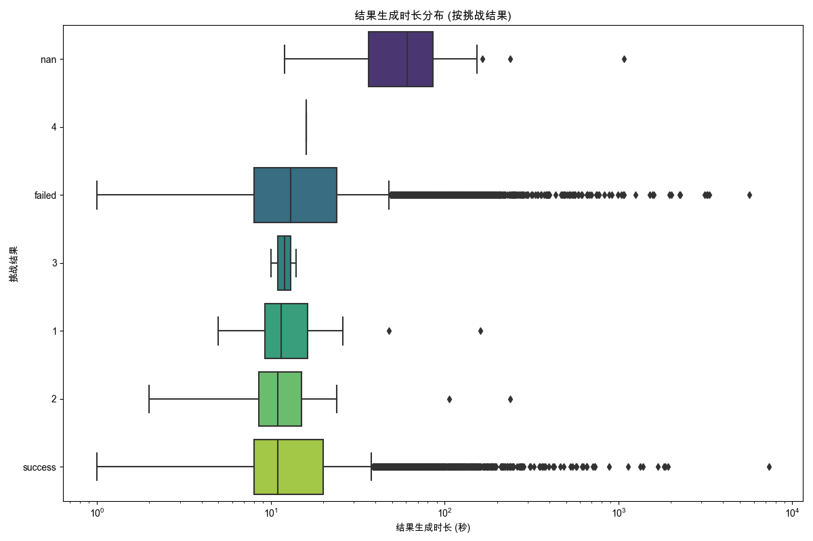

## 结果生成时长分析
数据来源: `filtered_online_data_min_3_rounds.xlsx`
用于分析的有效记录数 (在时间转换、时长计算并移除无效时长后): 15328

已处理数据子集保存至: `processed_data_gen_duration.xlsx`

### 生成的Excel文件:
- 已处理数据 (包含计算的时长): `processed_data_gen_duration.xlsx`

### 各挑战结果的 '结果生成时长' 统计 (秒):
| 挑战结果   |   平均值 |   中位数 |    标准差 |   数量 |   最小值 |   最大值 |
|:-----------|---------:|---------:|----------:|-------:|---------:|---------:|
| 1          |  20.6818 |     11.5 |  32.4733  |     22 |        5 |      160 |
| 2          |  20.9429 |     11   |  41.2973  |     35 |        2 |      238 |
| 3          |  12      |     12   |   2.82843 |      2 |       10 |       14 |
| 4          |  16      |     16   | nan       |      1 |       16 |       16 |
| failed     |  32.8254 |     13   | 129.541   |   7450 |        1 |     5644 |
| nan        |  89.234  |     61   | 154.628   |     47 |       12 |     1078 |
| success    |  24.4422 |     11   | 104.448   |   7771 |        1 |     7363 |
- 各挑战结果的 '结果生成时长' 统计数据: `gen_duration_stats_by_result.xlsx`

(注意: X轴使用了对数刻度以更好地显示大范围数据)

