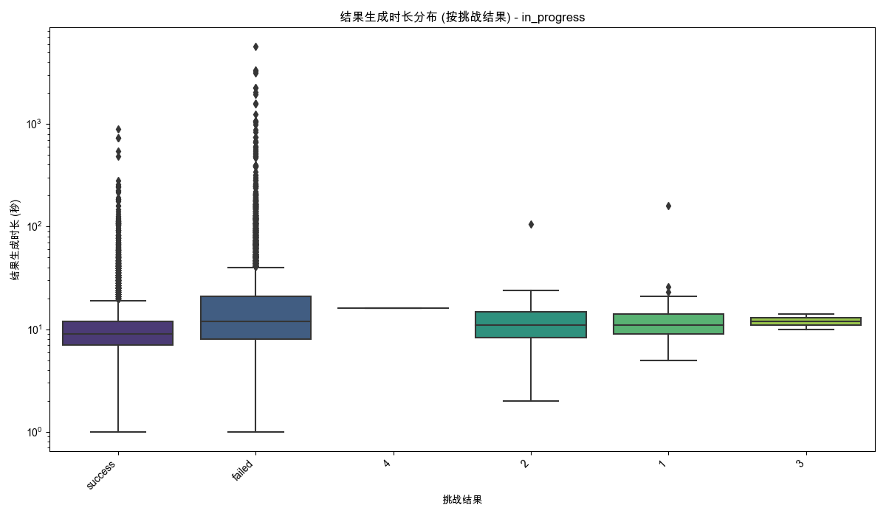

# 分析：对话轮次、结果生成时长、对话进度与挑战结果的关联性
数据来源: `filtered_online_data_min_3_rounds.xlsx`
原始数据记录数: 18426
经结果生成时长计算与过滤后记录数: 15328 (移除了 3098 条无效时长记录)

已处理的包含轮次与时长的完整数据保存至: `processed_data_turns_gen_time.xlsx`
用于后续分析的有效记录数: 15328

### 生成的Excel文件:
- 完整预处理数据: `processed_data_turns_gen_time.xlsx`

## '对话进度' 分析: completed
此分组记录数: 2205

### 按挑战结果统计: 对话轮次数与结果生成时长

#### 对话轮次数统计:
| 挑战结果   |   平均轮次 |   轮次中位数 |   轮次标准差 |   数量 |   最小轮次 |   最大轮次 |
|:-----------|-----------:|-------------:|-------------:|-------:|-----------:|-----------:|
| 1          |     4      |            4 |    nan       |      1 |          4 |          4 |
| 2          |     8      |            8 |    nan       |      1 |          8 |          8 |
| failed     |    12.7257 |           11 |      7.58602 |    452 |          3 |         87 |
| nan        |    13.8723 |           13 |      8.18168 |     47 |          3 |         39 |
| success    |    12.1843 |           11 |      5.43861 |   1704 |          3 |         71 |
- 对话轮次数统计表: `stats_turns_by_result_completed.xlsx`

#### 结果生成时长统计 (秒):
| 挑战结果   |   平均时长(秒) |   时长中位数(秒) |   时长标准差(秒) |   数量 |   最小时长(秒) |   最大时长(秒) |
|:-----------|---------------:|-----------------:|-----------------:|-------:|---------------:|---------------:|
| 1          |        48      |               48 |          nan     |      1 |             48 |             48 |
| 2          |       238      |              238 |          nan     |      1 |            238 |            238 |
| failed     |       106.675  |               65 |          193.671 |    452 |             11 |           3213 |
| nan        |        89.234  |               61 |          154.628 |     47 |             12 |           1078 |
| success    |        65.3756 |               36 |          213.208 |   1704 |              5 |           7363 |
- 结果生成时长统计表: `stats_duration_by_result_completed.xlsx`

(注意: completed组 时长Y轴使用了对数刻度)

## '对话进度' 分析: in_progress
此分组记录数: 13123

### 按挑战结果统计: 对话轮次数与结果生成时长

#### 对话轮次数统计:
| 挑战结果   |   平均轮次 |   轮次中位数 |   轮次标准差 |   数量 |   最小轮次 |   最大轮次 |
|:-----------|-----------:|-------------:|-------------:|-------:|-----------:|-----------:|
| 1          |    6.66667 |          6   |      3.58236 |     21 |          3 |         16 |
| 2          |    8.61765 |          8.5 |      2.79626 |     34 |          3 |         15 |
| 3          |   13       |         13   |      4.24264 |      2 |         10 |         16 |
| 4          |   38       |         38   |    nan       |      1 |         38 |         38 |
| failed     |   10.9398  |          9   |      7.33195 |   6998 |          3 |        108 |
| success    |   11.8401  |         11   |      5.30334 |   6067 |          3 |         62 |
- 对话轮次数统计表: `stats_turns_by_result_in_progress.xlsx`

#### 结果生成时长统计 (秒):
| 挑战结果   |   平均时长(秒) |   时长中位数(秒) |   时长标准差(秒) |   数量 |   最小时长(秒) |   最大时长(秒) |
|:-----------|---------------:|-----------------:|-----------------:|-------:|---------------:|---------------:|
| 1          |        19.381  |               11 |         32.6825  |     21 |              5 |            160 |
| 2          |        14.5588 |               11 |         16.9548  |     34 |              2 |            106 |
| 3          |        12      |               12 |          2.82843 |      2 |             10 |             14 |
| 4          |        16      |               16 |        nan       |      1 |             16 |             16 |
| failed     |        28.0554 |               12 |        122.769   |   6998 |              1 |           5644 |
| success    |        12.9454 |                9 |         24.6789  |   6067 |              1 |            885 |
- 结果生成时长统计表: `stats_duration_by_result_in_progress.xlsx`

(注意: in_progress组 时长Y轴使用了对数刻度)

## 综合分析与洞察
*(此部分将在脚本执行并审查结果后手动填充或由AI辅助生成)*