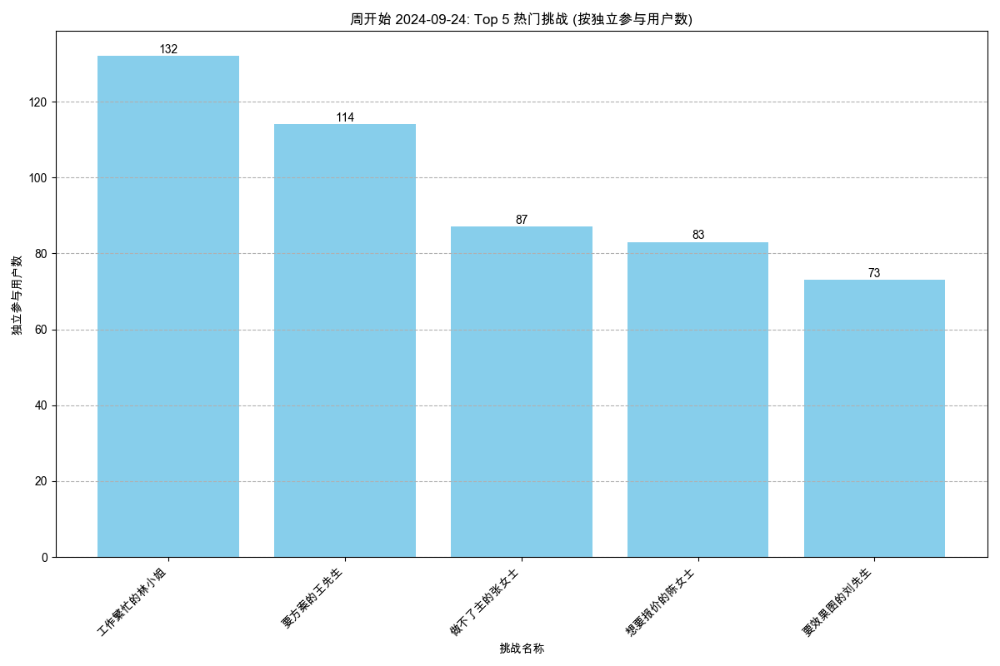
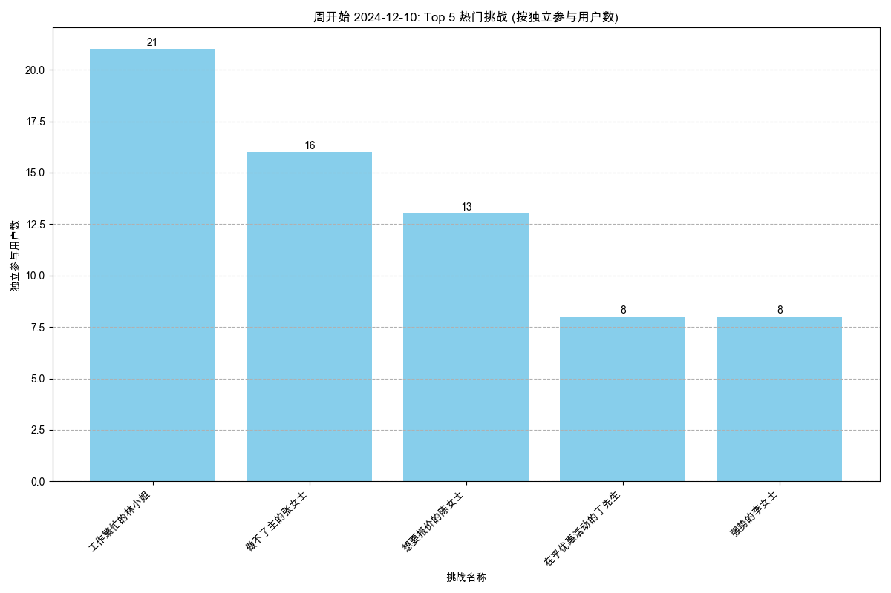
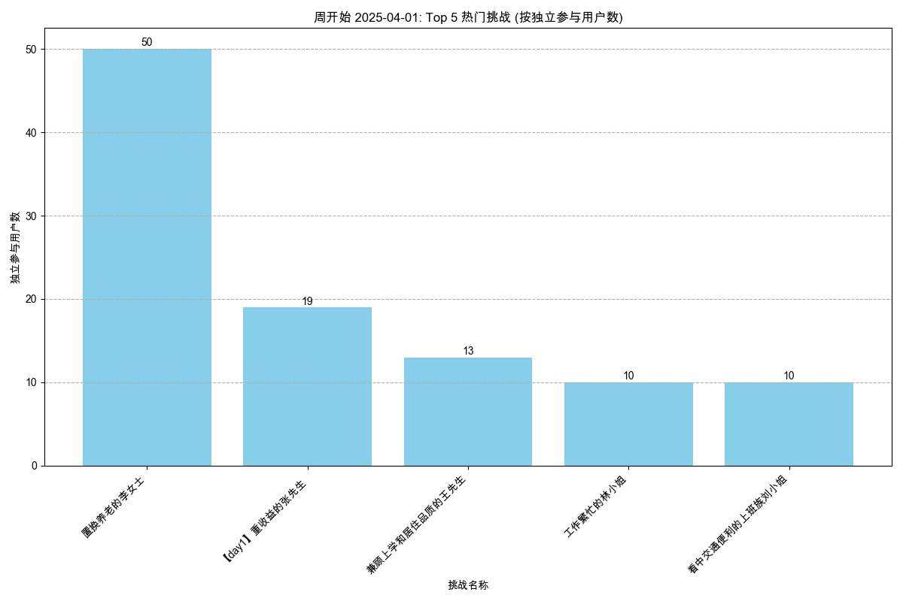

# 内容热度分析报告

报告生成于: 2025-05-30 18:48:12

## 分析目标
本报告识别基于周独立参与用户数最受欢迎的挑战（剧本/场景）。
列出每周排名前 5 的挑战。

## 数据来源
- 输入数据文件: `filtered_online_data.xlsx` (路径: `data_for_analysis/online_data_20250529/filtered_data/filtered_online_data.xlsx`)

## 每周独立参与用户数排名前 5 的挑战
### 各周热门挑战图表

#### 2024-09-03 开始的一周

#### 2024-09-10 开始的一周

#### 2024-09-17 开始的一周

#### 2024-09-24 开始的一周

#### 2024-10-01 开始的一周

#### 2024-10-08 开始的一周

#### 2024-10-15 开始的一周

#### 2024-10-22 开始的一周

#### 2024-10-29 开始的一周

#### 2024-11-05 开始的一周

#### 2024-11-12 开始的一周

#### 2024-11-19 开始的一周

#### 2024-11-26 开始的一周

#### 2024-12-03 开始的一周

#### 2024-12-10 开始的一周

#### 2024-12-17 开始的一周

#### 2024-12-24 开始的一周

#### 2024-12-31 开始的一周

#### 2025-01-07 开始的一周

#### 2025-01-14 开始的一周

#### 2025-01-21 开始的一周

#### 2025-01-28 开始的一周

#### 2025-02-04 开始的一周

#### 2025-02-11 开始的一周

#### 2025-02-18 开始的一周

#### 2025-02-25 开始的一周

#### 2025-03-04 开始的一周

#### 2025-03-11 开始的一周

#### 2025-03-18 开始的一周

#### 2025-03-25 开始的一周

#### 2025-04-01 开始的一周

#### 2025-04-08 开始的一周

#### 2025-04-15 开始的一周

#### 2025-04-22 开始的一周

#### 2025-04-29 开始的一周

#### 2025-05-06 开始的一周

#### 2025-05-13 开始的一周

#### 2025-05-20 开始的一周

#### 2025-05-27 开始的一周

### 数据表
| 周开始日期   | 挑战名称                                         |   独立参与用户数 |
|:-------------|:-------------------------------------------------|-----------------:|
| 2024-09-03   | 工作繁忙的林小姐                                 |              119 |
| 2024-09-03   | 要方案的王先生                                   |               86 |
| 2024-09-03   | 做不了主的张女士                                 |               76 |
| 2024-09-03   | 想要报价的陈女士                                 |               65 |
| 2024-09-03   | 要效果图的刘先生                                 |               61 |
| 2024-09-10   | 工作繁忙的林小姐                                 |              268 |
| 2024-09-10   | 做不了主的张女士                                 |              170 |
| 2024-09-10   | 要方案的王先生                                   |              166 |
| 2024-09-10   | 想要报价的陈女士                                 |              108 |
| 2024-09-10   | 要效果图的刘先生                                 |              108 |
| 2024-09-17   | 工作繁忙的林小姐                                 |              123 |
| 2024-09-17   | 要方案的王先生                                   |              110 |
| 2024-09-17   | 做不了主的张女士                                 |              100 |
| 2024-09-17   | 想要报价的陈女士                                 |               80 |
| 2024-09-17   | 要效果图的刘先生                                 |               64 |
| 2024-09-24   | 工作繁忙的林小姐                                 |              132 |
| 2024-09-24   | 要方案的王先生                                   |              114 |
| 2024-09-24   | 做不了主的张女士                                 |               87 |
| 2024-09-24   | 想要报价的陈女士                                 |               83 |
| 2024-09-24   | 要效果图的刘先生                                 |               73 |
| 2024-10-01   | 工作繁忙的林小姐                                 |               21 |
| 2024-10-01   | 要方案的王先生                                   |                9 |
| 2024-10-01   | 做不了主的张女士                                 |                6 |
| 2024-10-01   | 想要报价的陈女士                                 |                2 |
| 2024-10-01   | 强势的李女士                                     |                1 |
| 2024-10-08   | 工作繁忙的林小姐                                 |               12 |
| 2024-10-08   | 要效果图的刘先生                                 |                8 |
| 2024-10-08   | 要方案的王先生                                   |                8 |
| 2024-10-08   | 做不了主的张女士                                 |                5 |
| 2024-10-08   | 强势的李女士                                     |                3 |
| 2024-10-15   | 工作繁忙的林小姐                                 |               19 |
| 2024-10-15   | 要效果图的刘先生                                 |                9 |
| 2024-10-15   | 做不了主的张女士                                 |                5 |
| 2024-10-15   | 要方案的王先生                                   |                5 |
| 2024-10-15   | 强势的李女士                                     |                3 |
| 2024-10-22   | 工作繁忙的林小姐                                 |               31 |
| 2024-10-22   | 要方案的王先生                                   |               19 |
| 2024-10-22   | 做不了主的张女士                                 |               17 |
| 2024-10-22   | 想要报价的陈女士                                 |               12 |
| 2024-10-22   | 要效果图的刘先生                                 |                9 |
| 2024-10-29   | 工作繁忙的林小姐                                 |               56 |
| 2024-10-29   | 要方案的王先生                                   |               37 |
| 2024-10-29   | 想要报价的陈女士                                 |               29 |
| 2024-10-29   | 要效果图的刘先生                                 |               29 |
| 2024-10-29   | 做不了主的张女士                                 |               28 |
| 2024-11-05   | 工作繁忙的林小姐                                 |               16 |
| 2024-11-05   | 强势的李女士                                     |                6 |
| 2024-11-05   | 做不了主的张女士                                 |                5 |
| 2024-11-05   | 要效果图的刘先生                                 |                5 |
| 2024-11-05   | 要方案的王先生                                   |                4 |
| 2024-11-12   | 工作繁忙的林小姐                                 |               21 |
| 2024-11-12   | 要方案的王先生                                   |               11 |
| 2024-11-12   | 做不了主的张女士                                 |                9 |
| 2024-11-12   | 想要报价的陈女士                                 |                8 |
| 2024-11-12   | 要效果图的刘先生                                 |                7 |
| 2024-11-19   | 工作繁忙的林小姐                                 |               45 |
| 2024-11-19   | 做不了主的张女士                                 |               27 |
| 2024-11-19   | 想要报价的陈女士                                 |               23 |
| 2024-11-19   | 要方案的王先生                                   |               18 |
| 2024-11-19   | 强势的李女士                                     |               16 |
| 2024-11-26   | 工作繁忙的林小姐                                 |               71 |
| 2024-11-26   | 做不了主的张女士                                 |               49 |
| 2024-11-26   | 想要报价的陈女士                                 |               40 |
| 2024-11-26   | 强势的李女士                                     |               20 |
| 2024-11-26   | 要方案的王先生                                   |               19 |
| 2024-12-03   | 对全包公司失望的杜先生                           |               33 |
| 2024-12-03   | 看好装修公司的王女士                             |               28 |
| 2024-12-03   | 工作繁忙的林小姐                                 |               24 |
| 2024-12-03   | 首次服务失望的李阿姨                             |               22 |
| 2024-12-03   | 在乎优惠活动的丁先生                             |               21 |
| 2024-12-10   | 工作繁忙的林小姐                                 |               21 |
| 2024-12-10   | 做不了主的张女士                                 |               16 |
| 2024-12-10   | 想要报价的陈女士                                 |               13 |
| 2024-12-10   | 在乎优惠活动的丁先生                             |                8 |
| 2024-12-10   | 强势的李女士                                     |                8 |
| 2024-12-17   | 工作繁忙的林小姐                                 |               18 |
| 2024-12-17   | 做不了主的张女士                                 |               11 |
| 2024-12-17   | 想要报价的陈女士                                 |               11 |
| 2024-12-17   | 强势的李女士                                     |                9 |
| 2024-12-17   | 要方案的王先生                                   |                9 |
| 2024-12-24   | 工作繁忙的林小姐                                 |               12 |
| 2024-12-24   | 做不了主的张女士                                 |               10 |
| 2024-12-24   | 强势的李女士                                     |                8 |
| 2024-12-24   | 想要报价的陈女士                                 |                8 |
| 2024-12-24   | 要效果图的刘先生                                 |                8 |
| 2024-12-31   | 置换养老的李女士                                 |              109 |
| 2024-12-31   | 希望快速成交的李先生                             |               89 |
| 2024-12-31   | 自住认为总会涨价的李姐                           |               79 |
| 2024-12-31   | 不自住不急售的周女士                             |               76 |
| 2024-12-31   | 预期偏高的张女士                                 |               54 |
| 2025-01-07   | 工作繁忙的林小姐                                 |               13 |
| 2025-01-07   | 在乎优惠活动的丁先生                             |                3 |
| 2025-01-07   | 做不了主的张女士                                 |                2 |
| 2025-01-07   | 置换养老的李女士                                 |                2 |
| 2025-01-07   | 不自住不急售的周女士                             |                1 |
| 2025-01-14   | 置换养老的李女士                                 |               82 |
| 2025-01-14   | 工作繁忙的林小姐                                 |               23 |
| 2025-01-14   | 兼顾上学和居住品质的王先生                       |               17 |
| 2025-01-14   | 不自住不急售的周女士                             |               15 |
| 2025-01-14   | 想租一室户的年轻人卢先生                         |               15 |
| 2025-01-21   | 大姑的春节热线                                   |               22 |
| 2025-01-21   | 置换养老的李女士                                 |                8 |
| 2025-01-21   | 不自住不急售的周女士                             |                7 |
| 2025-01-21   | 工作繁忙的林小姐                                 |                7 |
| 2025-01-21   | 兼顾上学和居住品质的王先生                       |                4 |
| 2025-01-28   | 不自住不急售的周女士                             |                1 |
| 2025-01-28   | 大姑的春节热线                                   |                1 |
| 2025-01-28   | 看中交通便利的上班族刘小姐                       |                1 |
| 2025-02-04   | 工作繁忙的林小姐                                 |                5 |
| 2025-02-04   | 希望快速成交的李先生                             |                2 |
| 2025-02-04   | 置换养老的李女士                                 |                2 |
| 2025-02-04   | 不自住不急售的周女士                             |                1 |
| 2025-02-04   | 做不了主的张女士                                 |                1 |
| 2025-02-11   | 工作繁忙的林小姐                                 |                4 |
| 2025-02-11   | 置换养老的李女士                                 |                3 |
| 2025-02-11   | 做不了主的张女士                                 |                1 |
| 2025-02-11   | 兼顾上学和居住品质的王先生                       |                1 |
| 2025-02-11   | 同事合租多套的蔡先生                             |                1 |
| 2025-02-18   | 置换养老的李女士                                 |               59 |
| 2025-02-18   | 不自住不急售的周女士                             |               20 |
| 2025-02-18   | 工作繁忙的林小姐                                 |               16 |
| 2025-02-18   | 大姑的春节热线                                   |               12 |
| 2025-02-18   | 兼顾上学和居住品质的王先生                       |                8 |
| 2025-02-25   | 置换养老的李女士                                 |               11 |
| 2025-02-25   | 工作繁忙的林小姐                                 |                9 |
| 2025-02-25   | 想要报价的陈女士                                 |                6 |
| 2025-02-25   | 做不了主的张女士                                 |                5 |
| 2025-02-25   | 不自住不急售的周女士                             |                4 |
| 2025-03-04   | 置换养老的李女士                                 |              107 |
| 2025-03-04   | 想租一室户的年轻人卢先生                         |               37 |
| 2025-03-04   | 工作繁忙的林小姐                                 |               32 |
| 2025-03-04   | 兼顾上学和居住品质的王先生                       |               31 |
| 2025-03-04   | 自住认为总会涨价的李姐                           |               26 |
| 2025-03-11   | 置换养老的李女士                                 |              153 |
| 2025-03-11   | 兼顾上学和居住品质的王先生                       |               40 |
| 2025-03-11   | 想租一室户的年轻人卢先生                         |               30 |
| 2025-03-11   | 不自住不急售的周女士                             |               27 |
| 2025-03-11   | 自住认为总会涨价的李姐                           |               26 |
| 2025-03-18   | 置换养老的李女士                                 |              165 |
| 2025-03-18   | 首次了解美化套餐的张姐                           |               65 |
| 2025-03-18   | 【day1】重收益的张先生                           |               47 |
| 2025-03-18   | 【day1】爱惜房子的王女士                         |               23 |
| 2025-03-18   | 不自住不急售的周女士                             |               23 |
| 2025-03-25   | 首次了解美化套餐的张姐                           |              104 |
| 2025-03-25   | 置换养老的李女士                                 |               79 |
| 2025-03-25   | 【day1】重收益的张先生                           |               70 |
| 2025-03-25   | 了解美化后有疑问的胡女士                         |               46 |
| 2025-03-25   | 兼顾上学和居住品质的王先生                       |               33 |
| 2025-04-01   | 置换养老的李女士                                 |               50 |
| 2025-04-01   | 【day1】重收益的张先生                           |               19 |
| 2025-04-01   | 兼顾上学和居住品质的王先生                       |               13 |
| 2025-04-01   | 工作繁忙的林小姐                                 |               10 |
| 2025-04-01   | 看中交通便利的上班族刘小姐                       |               10 |
| 2025-04-08   | 置换养老的李女士                                 |               68 |
| 2025-04-08   | 【day1】重收益的张先生                           |               38 |
| 2025-04-08   | 【云管家】在外地首次了解省心租的王女士           |               19 |
| 2025-04-08   | 【云管家】朋友被包租公司坑过，担心没保障的苏女士 |               16 |
| 2025-04-08   | 兼顾上学和居住品质的王先生                       |               16 |
| 2025-04-15   | 置换养老的李女士                                 |               69 |
| 2025-04-15   | 首次了解美化套餐的张姐                           |               39 |
| 2025-04-15   | 【day1】重收益的张先生                           |               38 |
| 2025-04-15   | 兼顾上学和居住品质的王先生                       |               25 |
| 2025-04-15   | 【day1】爱惜房子的王女士                         |               14 |
| 2025-04-22   | 置换养老的李女士                                 |               65 |
| 2025-04-22   | 【day1】重收益的张先生                           |               31 |
| 2025-04-22   | 工作繁忙的林小姐                                 |               18 |
| 2025-04-22   | 做不了主的张女士                                 |               14 |
| 2025-04-22   | 大姑的春节热线                                   |               13 |
| 2025-04-29   | 前来面试的王闹海                                 |               31 |
| 2025-04-29   | 【day1】重收益的张先生                           |               21 |
| 2025-04-29   | 【上海测试】重收益的李先生                       |               16 |
| 2025-04-29   | 置换养老的李女士                                 |               13 |
| 2025-04-29   | 【上海测试】在自如托管过的金先生                 |               12 |
| 2025-05-06   | 谨慎装修的王先生                                 |              154 |
| 2025-05-06   | 前来面试的王闹海                                 |               76 |
| 2025-05-06   | 【day1】重收益的张先生                           |               39 |
| 2025-05-06   | 【云管家】在外地首次了解省心租的王女士           |               35 |
| 2025-05-06   | 【云管家】朋友被包租公司坑过，担心没保障的苏女士 |               35 |
| 2025-05-13   | 【day1】重收益的张先生                           |              164 |
| 2025-05-13   | 【day1】爱惜房子的王女士                         |               87 |
| 2025-05-13   | 前来面试的王闹海                                 |               72 |
| 2025-05-13   | 【day3】学区房的孙女士                           |               61 |
| 2025-05-13   | 购房用于即将新婚的李先生                         |               54 |
| 2025-05-20   | 谨慎装修的王先生                                 |               80 |
| 2025-05-20   | 【day1】重收益的张先生                           |               79 |
| 2025-05-20   | 置换养老的李女士                                 |               51 |
| 2025-05-20   | 在乎优惠活动的丁先生                             |               50 |
| 2025-05-20   | 套底价反复压价格李女士                           |               50 |
| 2025-05-27   | 史今哥带你逛展厅样板房（91㎡）                   |              225 |
| 2025-05-27   | 【day1】重收益的张先生                           |               45 |
| 2025-05-27   | 谨慎装修的王先生                                 |               39 |
| 2025-05-27   | 首次服务失望的李阿姨                             |               36 |
| 2025-05-27   | 新房团装-申请退款的黄小姐                        |               33 |

## 输出文件
- 周热门挑战数据: `top_challenges_weekly.xlsx` (路径: `data_for_analysis/online_data_20250529/basic_analysis_outputs/content_hotness_analysis/top_challenges_weekly.xlsx`)
- 本报告: `content_hotness_report.md` (路径: `data_for_analysis/online_data_20250529/basic_analysis_outputs/content_hotness_analysis/content_hotness_report.md`)

## 深度分析

### 1. 内容生态洞察
- **"常青树"与"爆款"内容并存**:
    - **常青树内容**: 部分核心场景，如 **"工作繁忙的林小姐"** 和 **"置换养老的李女士"**，在长达数月的时间里持续吸引大量用户，构成了产品内容生态的基石。这些是经过验证的、具有普遍吸引力的优质内容。
    - **爆款内容**: 产品的活跃度呈现出明显的"爆款驱动"模式。新内容的上线能迅速拉动用户参与。最典型的例子是 **"史今哥带你逛展厅样板房（91㎡）"**，在上线当周（2025-05-27）即吸引了225名独立用户，远超其他任何时期的单个剧本热度，与我们在用户活跃度分析中观察到的5月29日DAU峰值（342人）高度吻合。这表明，**高质量、有吸引力的新内容是拉动用户增长和活跃度的核心引擎**。

- **内容迭代与主题演进**:
    - 从热门剧本的名称演变可以看出清晰的内容策略迭代路径：从早期的通用销售异议处理（如"要方案"、"要报价"），到后期引入的房产交易（"置换养老"、"学区房"）、增值服务（"美化套餐"、"云管家"）以及特定活动（"逛展厅"、"面试"）等，内容正朝着更垂直、更细分的场景发展。

### 2. 内容的生命周期与用户疲劳
- **内容疲劳现象**: 曾经的绝对王者"工作繁忙的林小姐"在维持了近6个月的统治地位后，其热度在2025年第一季度开始逐渐下降，并最终被新的热门内容取代。这揭示了即便是最优质的内容也存在生命周期和用户疲劳效应。
- **持续更新的必要性**: 为了维持用户的新鲜感和参与度，必须建立一个持续的内容更新迭代机制。不能仅仅依赖少数几个"常青树"剧本，而是要不断推出新的、多样化的场景来满足不同用户的需求，并驱动整体活跃度的提升。

### 3. 策略建议
- **打造内容矩阵**: 建议将内容策略明确为"常青树内容"+"爆款内容"的矩阵模式。
    - **稳定输出**: 保证核心业务场景的"常青树"内容覆盖全面、质量精良。
    - **持续创新**: 定期（如每月）策划和上线具有话题性或新颖性的"爆款"内容，作为拉动用户活跃度的关键抓手，并配合运营活动进行推广。
- **加强内容宣发**: 对于"史今哥"这类潜力爆款，应在上线前、后进行预热和推广，通过公告、推送等方式告知用户，最大化其影响力。
