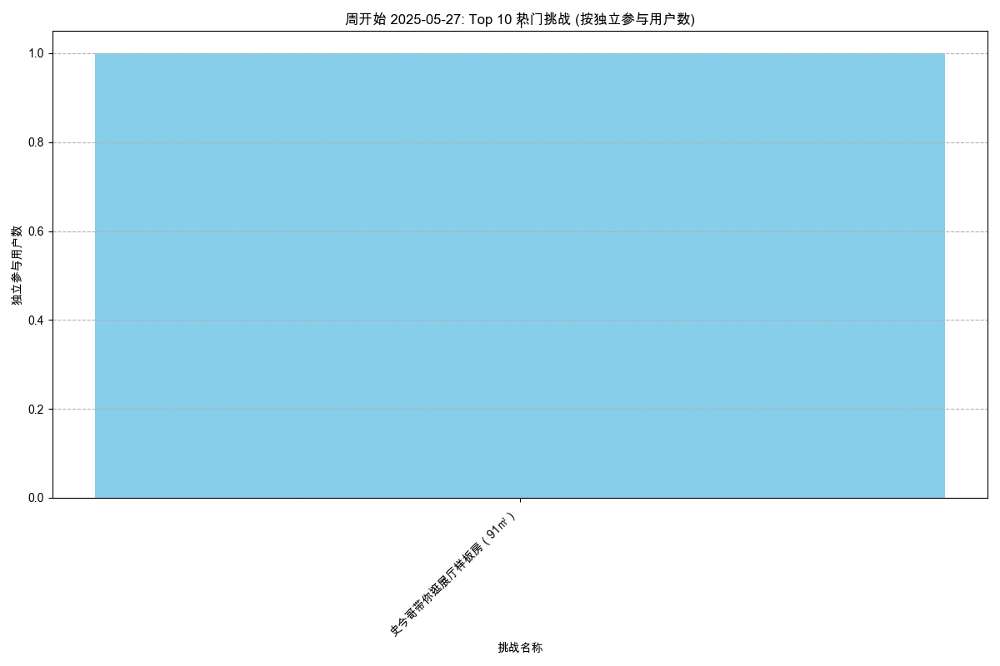

# 内容热度分析报告 (最近1日)

报告生成于: 2025-06-09 17:07:58

## 分析目标
本报告识别基于周独立参与用户数最受欢迎的挑战（剧本/场景）。
列出每周排名前 10 的挑战。

**分析周期**: 最近1日

## 数据来源
- 输入数据文件: `filtered_online_data.xlsx`

## 每周独立参与用户数排名前 10 的挑战
### 各周热门挑战图表

#### 1d 开始的一周

### 数据表
| 周开始日期   | 挑战名称                       |   独立参与用户数 |
|:-------------|:-------------------------------|-----------------:|
| 2025-05-27   | 史今哥带你逛展厅样板房（91㎡） |                1 |

## 输出文件
- 周热门挑战数据: `top_challenges_weekly_1d.xlsx`
- 本报告: `content_hotness_report_1d.md`
