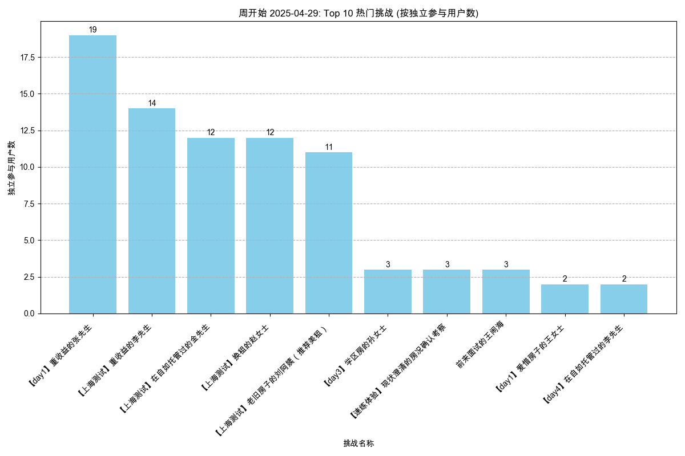
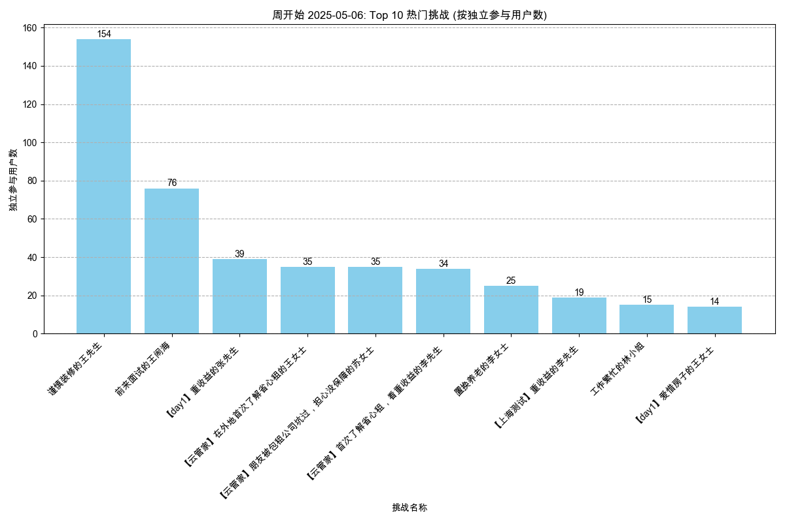
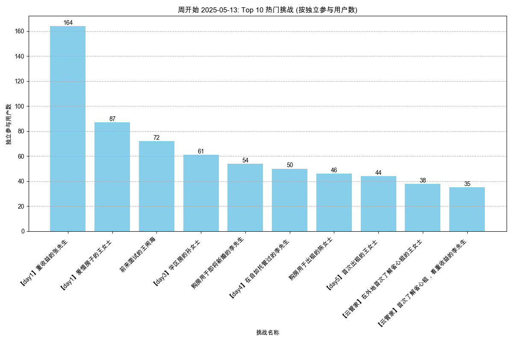
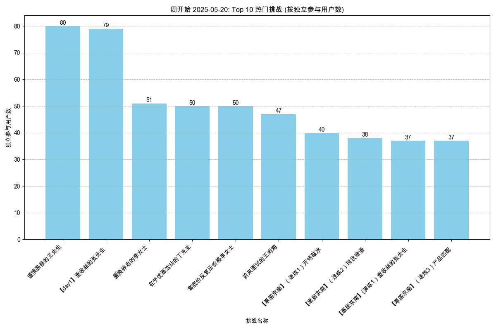
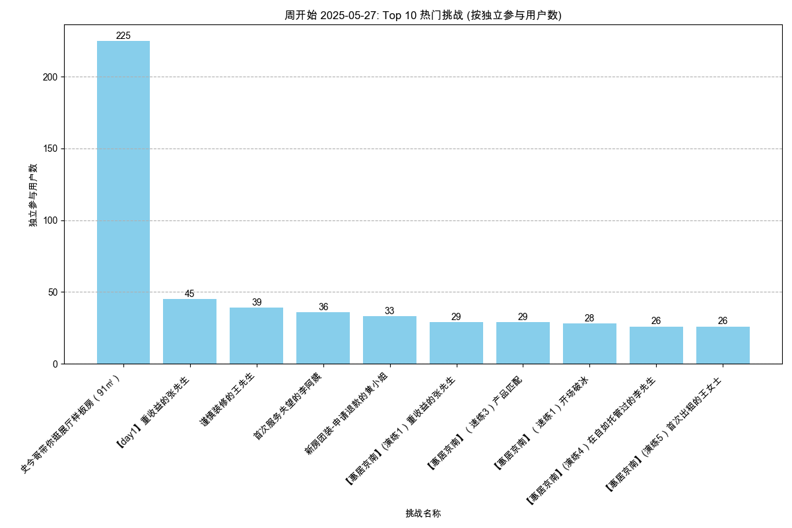

# 内容热度分析报告 (最近30日)

报告生成于: 2025-06-09 17:47:43

## 分析目标
本报告识别基于周独立参与用户数最受欢迎的挑战（剧本/场景）。
列出每周排名前 10 的挑战。

**分析周期**: 最近30日

## 数据来源
- 输入数据文件: `filtered_online_data.xlsx`

## 每周独立参与用户数排名前 10 的挑战
### 各周热门挑战图表

#### 30d 开始的一周

#### 30d 开始的一周

#### 30d 开始的一周

#### 30d 开始的一周

#### 30d 开始的一周

### 数据表
| 周开始日期   | 挑战名称                                         |   独立参与用户数 |
|:-------------|:-------------------------------------------------|-----------------:|
| 2025-04-29   | 【day1】重收益的张先生                           |               19 |
| 2025-04-29   | 【上海测试】重收益的李先生                       |               14 |
| 2025-04-29   | 【上海测试】在自如托管过的金先生                 |               12 |
| 2025-04-29   | 【上海测试】换租的赵女士                         |               12 |
| 2025-04-29   | 【上海测试】老旧房子的刘阿姨（推荐美租）         |               11 |
| 2025-04-29   | 【day3】学区房的孙女士                           |                3 |
| 2025-04-29   | 【速练体验】现状澄清的房况确认考察               |                3 |
| 2025-04-29   | 前来面试的王闹海                                 |                3 |
| 2025-04-29   | 【day1】爱惜房子的王女士                         |                2 |
| 2025-04-29   | 【day4】在自如托管过的李先生                     |                2 |
| 2025-05-06   | 谨慎装修的王先生                                 |              154 |
| 2025-05-06   | 前来面试的王闹海                                 |               76 |
| 2025-05-06   | 【day1】重收益的张先生                           |               39 |
| 2025-05-06   | 【云管家】在外地首次了解省心租的王女士           |               35 |
| 2025-05-06   | 【云管家】朋友被包租公司坑过，担心没保障的苏女士 |               35 |
| 2025-05-06   | 【云管家】首次了解省心租，看重收益的李先生       |               34 |
| 2025-05-06   | 置换养老的李女士                                 |               25 |
| 2025-05-06   | 【上海测试】重收益的李先生                       |               19 |
| 2025-05-06   | 工作繁忙的林小姐                                 |               15 |
| 2025-05-06   | 【day1】爱惜房子的王女士                         |               14 |
| 2025-05-13   | 【day1】重收益的张先生                           |              164 |
| 2025-05-13   | 【day1】爱惜房子的王女士                         |               87 |
| 2025-05-13   | 前来面试的王闹海                                 |               72 |
| 2025-05-13   | 【day3】学区房的孙女士                           |               61 |
| 2025-05-13   | 购房用于即将新婚的李先生                         |               54 |
| 2025-05-13   | 【day4】在自如托管过的李先生                     |               50 |
| 2025-05-13   | 购房用于出租的陈女士                             |               46 |
| 2025-05-13   | 【day5】首次出租的王女士                         |               44 |
| 2025-05-13   | 【云管家】在外地首次了解省心租的王女士           |               38 |
| 2025-05-13   | 【云管家】首次了解省心租，看重收益的李先生       |               35 |
| 2025-05-20   | 谨慎装修的王先生                                 |               80 |
| 2025-05-20   | 【day1】重收益的张先生                           |               79 |
| 2025-05-20   | 置换养老的李女士                                 |               51 |
| 2025-05-20   | 在乎优惠活动的丁先生                             |               50 |
| 2025-05-20   | 套底价反复压价格李女士                           |               50 |
| 2025-05-20   | 前来面试的王闹海                                 |               47 |
| 2025-05-20   | 【惠居京南】（速练1）开场破冰                    |               40 |
| 2025-05-20   | 【惠居京南】（速练2）现状澄清                    |               38 |
| 2025-05-20   | 【惠居京南】(演练1）重收益的张先生               |               37 |
| 2025-05-20   | 【惠居京南】（速练3）产品匹配                    |               37 |
| 2025-05-27   | 史今哥带你逛展厅样板房（91㎡）                   |              225 |
| 2025-05-27   | 【day1】重收益的张先生                           |               45 |
| 2025-05-27   | 谨慎装修的王先生                                 |               39 |
| 2025-05-27   | 首次服务失望的李阿姨                             |               36 |
| 2025-05-27   | 新房团装-申请退款的黄小姐                        |               33 |
| 2025-05-27   | 【惠居京南】(演练1）重收益的张先生               |               29 |
| 2025-05-27   | 【惠居京南】（速练3）产品匹配                    |               29 |
| 2025-05-27   | 【惠居京南】（速练1）开场破冰                    |               28 |
| 2025-05-27   | 【惠居京南】(演练4）在自如托管过的李先生         |               26 |
| 2025-05-27   | 【惠居京南】(演练5）首次出租的王女士             |               26 |

## 输出文件
- 周热门挑战数据: `top_challenges_weekly_30d.xlsx`
- 本报告: `content_hotness_report_30d.md`
