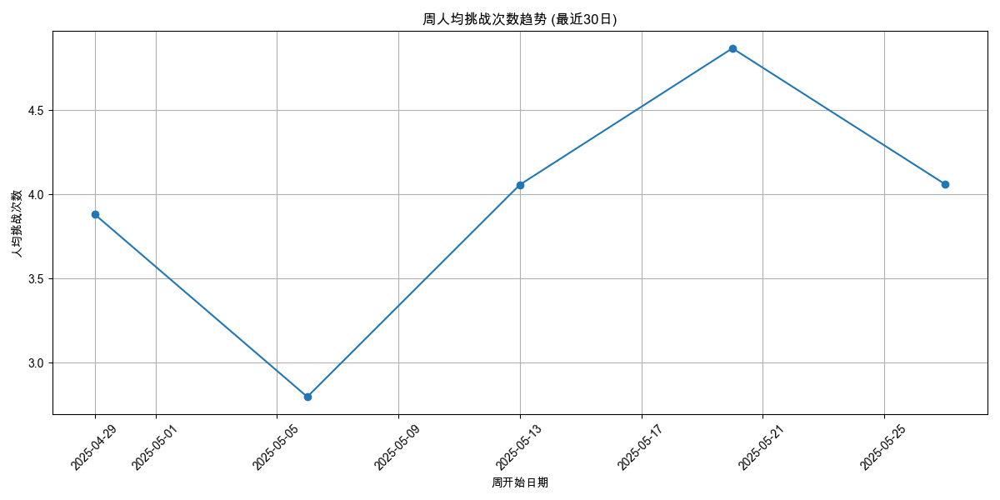
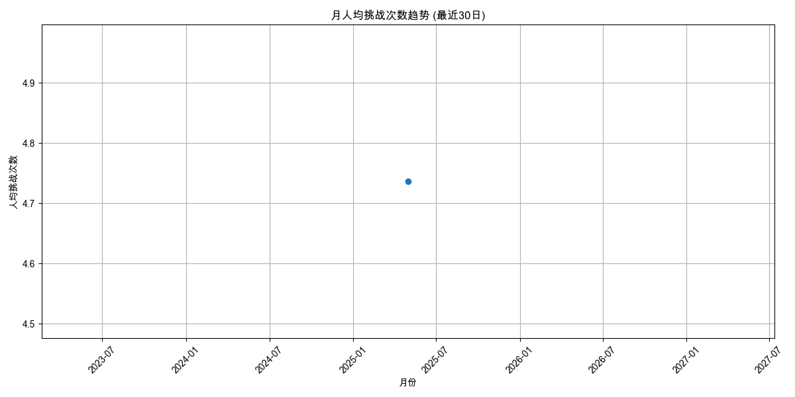
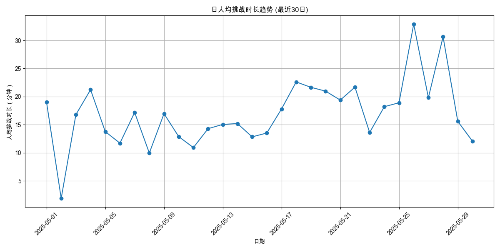
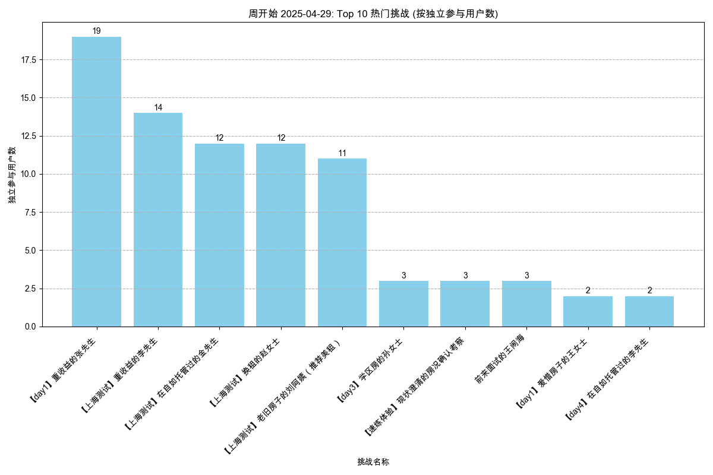
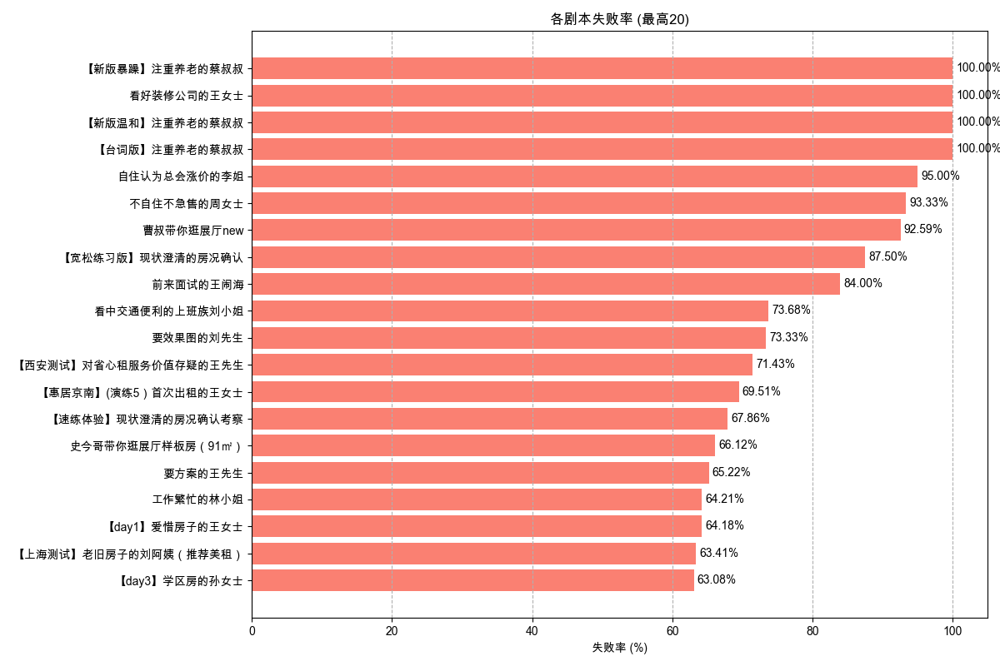

# 综合分析30日报告 - 2025-06-09

本报告集合了多个维度的自动分析结果，提供核心指标的周期性概览。

---

报告生成于: 2025-06-09 17:47:36

## 分析目标
本报告提供用户活跃度的洞察，主要关注：
- 日活跃用户 (DAU)
- 周活跃用户 (WAU)
- 月活跃用户 (MAU)

**分析周期**: 最近30日

## 数据来源
- 输入数据文件: `filtered_online_data.xlsx`

## 日活跃用户 (DAU)

| 日期       |   DAU |
|:-----------|------:|
| 2025-05-01 |     3 |
| 2025-05-02 |     3 |
| 2025-05-03 |     6 |
| 2025-05-04 |    16 |
| 2025-05-05 |    17 |
| 2025-05-06 |    26 |
| 2025-05-07 |    80 |
| 2025-05-08 |   142 |
| 2025-05-09 |    86 |
| 2025-05-10 |    22 |
| 2025-05-11 |    17 |
| 2025-05-12 |    50 |
| 2025-05-13 |    48 |
| 2025-05-14 |    87 |
| 2025-05-15 |   163 |
| 2025-05-16 |   121 |
| 2025-05-17 |    54 |
| 2025-05-18 |    31 |
| 2025-05-19 |    54 |
| 2025-05-20 |    28 |
| 2025-05-21 |   114 |
| 2025-05-22 |   121 |
| 2025-05-23 |   104 |
| 2025-05-24 |    64 |
| 2025-05-25 |    47 |
| 2025-05-26 |    68 |
| 2025-05-27 |    57 |
| 2025-05-28 |    69 |
| 2025-05-29 |   342 |
| 2025-05-30 |     1 |

## 周活跃用户 (WAU)

| 周开始日期   |   WAU |
|:-------------|------:|
| 2025-04-29   |    42 |
| 2025-05-06   |   394 |
| 2025-05-13   |   459 |
| 2025-05-20   |   459 |
| 2025-05-27   |   448 |

## 月活跃用户 (MAU)

| 月份       |   MAU |
|:-----------|------:|
| 2025-05-01 |  1516 |

## 输出文件
- DAU 数据: `daily_active_users_30d.xlsx`
- WAU 数据: `weekly_active_users_30d.xlsx`
- MAU 数据: `monthly_active_users_30d.xlsx`
- 本报告: `user_activity_report_30d.md`

---

报告生成于: 2025-06-09 17:47:39

## 分析目标
本报告提供用户参与度的洞察，主要关注：
- 人均挑战次数 (日/周/月)
- 人均挑战时长（分钟） (日/周/月)

**分析周期**: 最近30日

## 数据来源
- 输入数据文件: `filtered_online_data.xlsx`

### 人均挑战次数
#### 日人均挑战次数

| 日期       |   人均挑战次数 |   总用户数 |   总挑战次数 |
|:-----------|---------------:|-----------:|-------------:|
| 2025-05-01 |        2.33333 |          3 |            7 |
| 2025-05-02 |        1.66667 |          3 |            5 |
| 2025-05-03 |        4       |          6 |           24 |
| 2025-05-04 |        5.125   |         16 |           82 |
| 2025-05-05 |        2.64706 |         17 |           45 |
| 2025-05-06 |        2.5     |         26 |           65 |
| 2025-05-07 |        3.0625  |         80 |          245 |
| 2025-05-08 |        2.14085 |        142 |          304 |
| 2025-05-09 |        3.10465 |         86 |          267 |
| 2025-05-10 |        2.18182 |         22 |           48 |
| 2025-05-11 |        1.76471 |         17 |           30 |
| 2025-05-12 |        2.86    |         50 |          143 |
| 2025-05-13 |        2.29167 |         48 |          110 |
| 2025-05-14 |        2.73563 |         87 |          238 |
| 2025-05-15 |        3.07975 |        163 |          502 |
| 2025-05-16 |        3.24793 |        121 |          393 |
| 2025-05-17 |        4.09259 |         54 |          221 |
| 2025-05-18 |        4.09677 |         31 |          127 |
| 2025-05-19 |        5.01852 |         54 |          271 |
| 2025-05-20 |        5       |         28 |          140 |
| 2025-05-21 |        3.47368 |        114 |          396 |
| 2025-05-22 |        3.87603 |        121 |          469 |
| 2025-05-23 |        3.27885 |        104 |          341 |
| 2025-05-24 |        3.40625 |         64 |          218 |
| 2025-05-25 |        2.89362 |         47 |          136 |
| 2025-05-26 |        7.85294 |         68 |          534 |
| 2025-05-27 |        5.57895 |         57 |          318 |
| 2025-05-28 |        8.68116 |         69 |          599 |
| 2025-05-29 |        2.6345  |        342 |          901 |
| 2025-05-30 |        1       |          1 |            1 |

#### 周人均挑战次数

| 周开始日期   |   人均挑战次数 |   总用户数 |   总挑战次数 |
|:-------------|---------------:|-----------:|-------------:|
| 2025-04-29   |        3.88095 |         42 |          163 |
| 2025-05-06   |        2.79695 |        394 |         1102 |
| 2025-05-13   |        4.05664 |        459 |         1862 |
| 2025-05-20   |        4.8671  |        459 |         2234 |
| 2025-05-27   |        4.06027 |        448 |         1819 |

#### 月人均挑战次数

| 月份       |   人均挑战次数 |   总用户数 |   总挑战次数 |
|:-----------|---------------:|-----------:|-------------:|
| 2025-05-01 |        4.73615 |       1516 |         7180 |

### 人均挑战时长（分钟）
#### 日人均挑战时长

| 日期       |   人均挑战时长（分钟） |   参与时长计算用户数 |   总挑战时长（分钟） |
|:-----------|-----------------------:|---------------------:|---------------------:|
| 2025-05-01 |               19.0556  |                    3 |             57.1667  |
| 2025-05-02 |                1.87222 |                    3 |              5.61667 |
| 2025-05-03 |               16.7861  |                    6 |            100.717   |
| 2025-05-04 |               21.2312  |                   16 |            339.7     |
| 2025-05-05 |               13.7696  |                   17 |            234.083   |
| 2025-05-06 |               11.7128  |                   26 |            304.533   |
| 2025-05-07 |               17.1808  |                   80 |           1374.47    |
| 2025-05-08 |                9.9507  |                  142 |           1413       |
| 2025-05-09 |               16.9626  |                   86 |           1458.78    |
| 2025-05-10 |               12.8811  |                   22 |            283.383   |
| 2025-05-11 |               10.9255  |                   17 |            185.733   |
| 2025-05-12 |               14.2903  |                   50 |            714.517   |
| 2025-05-13 |               15.051   |                   48 |            722.45    |
| 2025-05-14 |               15.1987  |                   87 |           1322.28    |
| 2025-05-15 |               12.8311  |                  163 |           2091.47    |
| 2025-05-16 |               13.5194  |                  121 |           1635.85    |
| 2025-05-17 |               17.7951  |                   54 |            960.933   |
| 2025-05-18 |               22.6124  |                   31 |            700.983   |
| 2025-05-19 |               21.654   |                   54 |           1169.32    |
| 2025-05-20 |               20.9756  |                   28 |            587.317   |
| 2025-05-21 |               19.381   |                  114 |           2209.43    |
| 2025-05-22 |               21.6891  |                  121 |           2624.38    |
| 2025-05-23 |               13.6109  |                  104 |           1415.53    |
| 2025-05-24 |               18.2023  |                   64 |           1164.95    |
| 2025-05-25 |               18.9078  |                   47 |            888.667   |
| 2025-05-26 |               32.9     |                   68 |           2237.2     |
| 2025-05-27 |               19.8044  |                   57 |           1128.85    |
| 2025-05-28 |               30.6553  |                   69 |           2115.22    |
| 2025-05-29 |               15.5984  |                  342 |           5334.67    |
| 2025-05-30 |               12.0667  |                    1 |             12.0667  |

#### 周人均挑战时长

| 周开始日期   |   人均挑战时长（分钟） |   参与时长计算用户数 |   总挑战时长（分钟） |
|:-------------|-----------------------:|---------------------:|---------------------:|
| 2025-04-29   |                17.5544 |                   42 |              737.283 |
| 2025-05-06   |                14.5544 |                  394 |             5734.42  |
| 2025-05-13   |                18.7435 |                  459 |             8603.28  |
| 2025-05-20   |                24.2429 |                  459 |            11127.5   |
| 2025-05-27   |                19.1759 |                  448 |             8590.8   |

#### 月人均挑战时长

| 月份       |   人均挑战时长（分钟） |   参与时长计算用户数 |   总挑战时长（分钟） |
|:-----------|-----------------------:|---------------------:|---------------------:|
| 2025-05-01 |                22.9507 |                 1516 |              34793.3 |

## 输出文件
- 日人均挑战次数: `avg_challenges_daily_30d.xlsx`
- 周人均挑战次数: `avg_challenges_weekly_30d.xlsx`
- 月人均挑战次数: `avg_challenges_monthly_30d.xlsx`
- 日人均挑战时长: `avg_duration_daily_30d.xlsx`
- 周人均挑战时长: `avg_duration_weekly_30d.xlsx`
- 月人均挑战时长: `avg_duration_monthly_30d.xlsx`
- 本报告: `user_engagement_report_30d.md`

---

报告生成于: 2025-06-09 17:47:43

## 分析目标
本报告识别基于周独立参与用户数最受欢迎的挑战（剧本/场景）。
列出每周排名前 10 的挑战。

**分析周期**: 最近30日

## 数据来源
- 输入数据文件: `filtered_online_data.xlsx`

## 每周独立参与用户数排名前 10 的挑战
### 各周热门挑战图表

#### 30d 开始的一周

#### 30d 开始的一周

#### 30d 开始的一周

#### 30d 开始的一周

#### 30d 开始的一周

### 数据表
| 周开始日期   | 挑战名称                                         |   独立参与用户数 |
|:-------------|:-------------------------------------------------|-----------------:|
| 2025-04-29   | 【day1】重收益的张先生                           |               19 |
| 2025-04-29   | 【上海测试】重收益的李先生                       |               14 |
| 2025-04-29   | 【上海测试】在自如托管过的金先生                 |               12 |
| 2025-04-29   | 【上海测试】换租的赵女士                         |               12 |
| 2025-04-29   | 【上海测试】老旧房子的刘阿姨（推荐美租）         |               11 |
| 2025-04-29   | 【day3】学区房的孙女士                           |                3 |
| 2025-04-29   | 【速练体验】现状澄清的房况确认考察               |                3 |
| 2025-04-29   | 前来面试的王闹海                                 |                3 |
| 2025-04-29   | 【day1】爱惜房子的王女士                         |                2 |
| 2025-04-29   | 【day4】在自如托管过的李先生                     |                2 |
| 2025-05-06   | 谨慎装修的王先生                                 |              154 |
| 2025-05-06   | 前来面试的王闹海                                 |               76 |
| 2025-05-06   | 【day1】重收益的张先生                           |               39 |
| 2025-05-06   | 【云管家】在外地首次了解省心租的王女士           |               35 |
| 2025-05-06   | 【云管家】朋友被包租公司坑过，担心没保障的苏女士 |               35 |
| 2025-05-06   | 【云管家】首次了解省心租，看重收益的李先生       |               34 |
| 2025-05-06   | 置换养老的李女士                                 |               25 |
| 2025-05-06   | 【上海测试】重收益的李先生                       |               19 |
| 2025-05-06   | 工作繁忙的林小姐                                 |               15 |
| 2025-05-06   | 【day1】爱惜房子的王女士                         |               14 |
| 2025-05-13   | 【day1】重收益的张先生                           |              164 |
| 2025-05-13   | 【day1】爱惜房子的王女士                         |               87 |
| 2025-05-13   | 前来面试的王闹海                                 |               72 |
| 2025-05-13   | 【day3】学区房的孙女士                           |               61 |
| 2025-05-13   | 购房用于即将新婚的李先生                         |               54 |
| 2025-05-13   | 【day4】在自如托管过的李先生                     |               50 |
| 2025-05-13   | 购房用于出租的陈女士                             |               46 |
| 2025-05-13   | 【day5】首次出租的王女士                         |               44 |
| 2025-05-13   | 【云管家】在外地首次了解省心租的王女士           |               38 |
| 2025-05-13   | 【云管家】首次了解省心租，看重收益的李先生       |               35 |
| 2025-05-20   | 谨慎装修的王先生                                 |               80 |
| 2025-05-20   | 【day1】重收益的张先生                           |               79 |
| 2025-05-20   | 置换养老的李女士                                 |               51 |
| 2025-05-20   | 在乎优惠活动的丁先生                             |               50 |
| 2025-05-20   | 套底价反复压价格李女士                           |               50 |
| 2025-05-20   | 前来面试的王闹海                                 |               47 |
| 2025-05-20   | 【惠居京南】（速练1）开场破冰                    |               40 |
| 2025-05-20   | 【惠居京南】（速练2）现状澄清                    |               38 |
| 2025-05-20   | 【惠居京南】(演练1）重收益的张先生               |               37 |
| 2025-05-20   | 【惠居京南】（速练3）产品匹配                    |               37 |
| 2025-05-27   | 史今哥带你逛展厅样板房（91㎡）                   |              225 |
| 2025-05-27   | 【day1】重收益的张先生                           |               45 |
| 2025-05-27   | 谨慎装修的王先生                                 |               39 |
| 2025-05-27   | 首次服务失望的李阿姨                             |               36 |
| 2025-05-27   | 新房团装-申请退款的黄小姐                        |               33 |
| 2025-05-27   | 【惠居京南】(演练1）重收益的张先生               |               29 |
| 2025-05-27   | 【惠居京南】（速练3）产品匹配                    |               29 |
| 2025-05-27   | 【惠居京南】（速练1）开场破冰                    |               28 |
| 2025-05-27   | 【惠居京南】(演练4）在自如托管过的李先生         |               26 |
| 2025-05-27   | 【惠居京南】(演练5）首次出租的王女士             |               26 |

## 输出文件
- 周热门挑战数据: `top_challenges_weekly_30d.xlsx`
- 本报告: `content_hotness_report_30d.md`

---

报告生成于: 2025-06-09 17:47:47

## 分析目标
本报告基于"挑战结果"列分析剧本的失败率，其中值为"failed"表示失败。

**分析周期**: 最近30日

## 数据来源
- 输入数据文件: `filtered_online_data.xlsx`

## 总体剧本失败率
|   总尝试次数 |   失败尝试次数 |   总体失败率 (%) |
|-------------:|---------------:|-----------------:|
|         7180 |           3214 |            44.76 |

## 各剧本失败率

| 剧本名称                                           |   总尝试次数 |   失败尝试次数 |   失败率 (%) |
|:---------------------------------------------------|-------------:|---------------:|-------------:|
| 【新版暴躁】注重养老的蔡叔叔                       |            5 |              5 |       100    |
| 看好装修公司的王女士                               |            1 |              1 |       100    |
| 【新版温和】注重养老的蔡叔叔                       |            6 |              6 |       100    |
| 【台词版】注重养老的蔡叔叔                         |            7 |              7 |       100    |
| 自住认为总会涨价的李姐                             |           20 |             19 |        95    |
| 不自住不急售的周女士                               |           15 |             14 |        93.33 |
| 曹叔带你逛展厅new                                  |           27 |             25 |        92.59 |
| 【宽松练习版】现状澄清的房况确认                   |            8 |              7 |        87.5  |
| 前来面试的王闹海                                   |          575 |            483 |        84    |
| 看中交通便利的上班族刘小姐                         |           38 |             28 |        73.68 |
| 要效果图的刘先生                                   |           15 |             11 |        73.33 |
| 【西安测试】对省心租服务价值存疑的王先生           |           28 |             20 |        71.43 |
| 【惠居京南】(演练5）首次出租的王女士               |          164 |            114 |        69.51 |
| 【速练体验】现状澄清的房况确认考察                 |           28 |             19 |        67.86 |
| 史今哥带你逛展厅样板房（91㎡）                     |          425 |            281 |        66.12 |
| 要方案的王先生                                     |           23 |             15 |        65.22 |
| 工作繁忙的林小姐                                   |           95 |             61 |        64.21 |
| 【day1】爱惜房子的王女士                           |          282 |            181 |        64.18 |
| 【上海测试】老旧房子的刘阿姨（推荐美租）           |           41 |             26 |        63.41 |
| 【day3】学区房的孙女士                             |          195 |            123 |        63.08 |
| 【惠居京南】（速练1）开场破冰                      |          195 |            123 |        63.08 |
| 【新人通关】出租转出售的李女士                     |            8 |              5 |        62.5  |
| 【惠居京南】(演练1）重收益的张先生                 |          140 |             87 |        62.14 |
| 【云管家】朋友被包租公司坑过，担心没保障的苏女士   |          195 |            120 |        61.54 |
| 需要被点燃的小赵                                   |           13 |              8 |        61.54 |
| 置换养老的李女士                                   |          121 |             73 |        60.33 |
| 【云管家】非常爱惜房屋，对租客挑剔的郭女士         |           30 |             18 |        60    |
| 想要报价的陈女士                                   |           32 |             19 |        59.38 |
| 【新人通关】再次委托出租的钱女士                   |           22 |             13 |        59.09 |
| 【上海测试】重收益的李先生                         |           66 |             39 |        59.09 |
| 【惠居京南】（速练3）产品匹配                      |          160 |             94 |        58.75 |
| 【云管家】退休在家的王阿姨                         |           29 |             17 |        58.62 |
| 套底价反复压价格李女士                             |          122 |             67 |        54.92 |
| 【day1】重收益的张先生                             |          527 |            288 |        54.65 |
| 兼顾上学和居住品质的王先生                         |           51 |             26 |        50.98 |
| 【上海测试】换租的赵女士                           |           42 |             21 |        50    |
| 【新人通关】被中介坑过的王先生                     |           21 |             10 |        47.62 |
| 【新人通关】在乎性价比的张先生                     |           19 |              9 |        47.37 |
| 【新人通关】看中居住质量的刘小姐                   |           26 |             12 |        46.15 |
| 【惠居京南】（速练4）邀约线下                      |          116 |             53 |        45.69 |
| 【day5】首次出租的王女士                           |          109 |             49 |        44.95 |
| 同事合租多套的蔡先生                               |            9 |              4 |        44.44 |
| 【day4】在自如托管过的李先生                       |          130 |             57 |        43.85 |
| 【新人通关】时间紧迫的赵女士                       |           28 |             12 |        42.86 |
| 【惠居京南】(演练4）在自如托管过的李先生           |           91 |             39 |        42.86 |
| 【上海测试】在自如托管过的金先生                   |           32 |             13 |        40.62 |
| 想租一室户的年轻人卢先生                           |           45 |             18 |        40    |
| （改1）愿意尝试的包子铺老板娘李姐                  |            5 |              2 |        40    |
| 【惠居京南】(演练3）学区房的孙女士                 |           85 |             34 |        40    |
| 【惠居京南】(演练6）替人出租的李女士               |           81 |             32 |        39.51 |
| 【云管家】打算卖房，担心省心租签约年限太长的张先生 |           19 |              7 |        36.84 |
| 【惠居京南】（速练2）现状澄清                      |          105 |             37 |        35.24 |
| 强势的李女士                                       |           23 |              8 |        34.78 |
| 【day6】替人出租的李女士                           |           78 |             26 |        33.33 |
| 首次了解美化套餐的张姐                             |            3 |              1 |        33.33 |
| 对全包公司失望的杜先生                             |            3 |              1 |        33.33 |
| 购房用于即将新婚的李先生                           |           93 |             31 |        33.33 |
| 希望快速成交的李先生                               |            6 |              2 |        33.33 |
| 【云管家】在外地首次了解省心租的王女士             |          152 |             49 |        32.24 |
| 【惠居京南】(演练2）爱惜房子的王女士               |           73 |             20 |        27.4  |
| 【惠居京南】（速练5）总结跟进                      |           92 |             25 |        27.17 |
| 【惠居京南】(演练7）老旧房子刘女士                 |           74 |             19 |        25.68 |
| 【惠居京南】(演练8）以租换租刘先生                 |           76 |             19 |        25    |
| 了解美化后有疑问的胡女士                           |            4 |              1 |        25    |
| 谨慎装修的王先生                                   |          352 |             81 |        23.01 |
| 新房团装-申请退款的黄小姐                          |           41 |              9 |        21.95 |
| 首次服务失望的李阿姨                               |           44 |              9 |        20.45 |
| 在乎优惠活动的丁先生                               |           71 |             14 |        19.72 |
| 【云管家】首次了解省心租，看重收益的李先生         |          112 |             22 |        19.64 |
| 预期偏高的张女士                                   |            7 |              1 |        14.29 |
| 大姑的春节热线                                     |           14 |              2 |        14.29 |
| 购房用于出租的陈女士                               |           68 |              9 |        13.24 |
| 做不了主的张女士                                   |           24 |              3 |        12.5  |
| 二次进店的俞先生                                   |            3 |              0 |         0    |

## 输出文件
- 总体失败率数据: `overall_script_failure_rate_30d.xlsx`
- 各剧本失败率数据: `per_script_failure_rate_30d.xlsx`
- 本报告: `script_failure_rate_report_30d.md`

---

