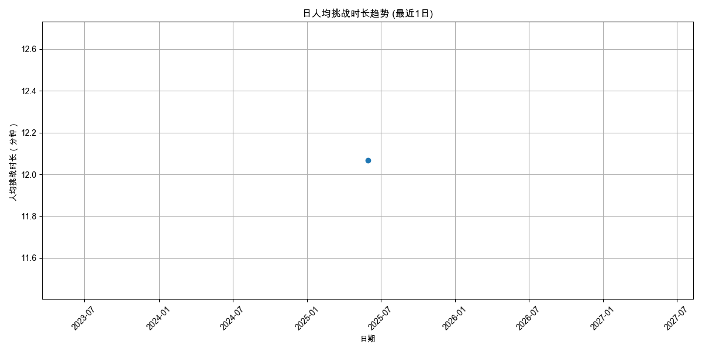
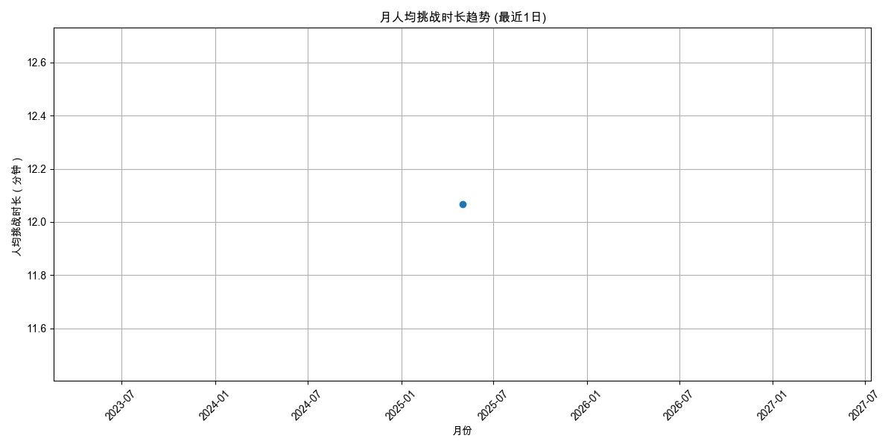
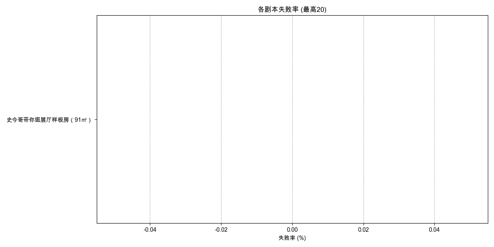

# 综合分析日报 - 2025-06-09

本报告集合了多个维度的自动分析结果，提供核心指标的周期性概览。

---

报告生成于: 2025-06-09 17:07:51

## 分析目标
本报告提供用户活跃度的洞察，主要关注：
- 日活跃用户 (DAU)
- 周活跃用户 (WAU)
- 月活跃用户 (MAU)

**分析周期**: 最近1日

## 数据来源
- 输入数据文件: `filtered_online_data.xlsx`

## 日活跃用户 (DAU)

| 日期       |   DAU |
|:-----------|------:|
| 2025-05-30 |     1 |

## 周活跃用户 (WAU)

| 周开始日期   |   WAU |
|:-------------|------:|
| 2025-05-27   |     1 |

## 月活跃用户 (MAU)

| 月份       |   MAU |
|:-----------|------:|
| 2025-05-01 |     1 |

## 输出文件
- DAU 数据: `daily_active_users_1d.xlsx`
- WAU 数据: `weekly_active_users_1d.xlsx`
- MAU 数据: `monthly_active_users_1d.xlsx`
- 本报告: `user_activity_report_1d.md`

---

报告生成于: 2025-06-09 17:07:55

## 分析目标
本报告提供用户参与度的洞察，主要关注：
- 人均挑战次数 (日/周/月)
- 人均挑战时长（分钟） (日/周/月)

**分析周期**: 最近1日

## 数据来源
- 输入数据文件: `filtered_online_data.xlsx`

### 人均挑战次数
#### 日人均挑战次数

| 日期       |   人均挑战次数 |   总用户数 |   总挑战次数 |
|:-----------|---------------:|-----------:|-------------:|
| 2025-05-30 |              1 |          1 |            1 |

#### 周人均挑战次数

| 周开始日期   |   人均挑战次数 |   总用户数 |   总挑战次数 |
|:-------------|---------------:|-----------:|-------------:|
| 2025-05-27   |              1 |          1 |            1 |

#### 月人均挑战次数

| 月份       |   人均挑战次数 |   总用户数 |   总挑战次数 |
|:-----------|---------------:|-----------:|-------------:|
| 2025-05-01 |              1 |          1 |            1 |

### 人均挑战时长（分钟）
#### 日人均挑战时长

| 日期       |   人均挑战时长（分钟） |   参与时长计算用户数 |   总挑战时长（分钟） |
|:-----------|-----------------------:|---------------------:|---------------------:|
| 2025-05-30 |                12.0667 |                    1 |              12.0667 |

#### 周人均挑战时长

| 周开始日期   |   人均挑战时长（分钟） |   参与时长计算用户数 |   总挑战时长（分钟） |
|:-------------|-----------------------:|---------------------:|---------------------:|
| 2025-05-27   |                12.0667 |                    1 |              12.0667 |

#### 月人均挑战时长

| 月份       |   人均挑战时长（分钟） |   参与时长计算用户数 |   总挑战时长（分钟） |
|:-----------|-----------------------:|---------------------:|---------------------:|
| 2025-05-01 |                12.0667 |                    1 |              12.0667 |

## 输出文件
- 日人均挑战次数: `avg_challenges_daily_1d.xlsx`
- 周人均挑战次数: `avg_challenges_weekly_1d.xlsx`
- 月人均挑战次数: `avg_challenges_monthly_1d.xlsx`
- 日人均挑战时长: `avg_duration_daily_1d.xlsx`
- 周人均挑战时长: `avg_duration_weekly_1d.xlsx`
- 月人均挑战时长: `avg_duration_monthly_1d.xlsx`
- 本报告: `user_engagement_report_1d.md`

---

报告生成于: 2025-06-09 17:07:58

## 分析目标
本报告识别基于周独立参与用户数最受欢迎的挑战（剧本/场景）。
列出每周排名前 10 的挑战。

**分析周期**: 最近1日

## 数据来源
- 输入数据文件: `filtered_online_data.xlsx`

## 每周独立参与用户数排名前 10 的挑战
### 各周热门挑战图表

#### 1d 开始的一周

### 数据表
| 周开始日期   | 挑战名称                       |   独立参与用户数 |
|:-------------|:-------------------------------|-----------------:|
| 2025-05-27   | 史今哥带你逛展厅样板房（91㎡） |                1 |

## 输出文件
- 周热门挑战数据: `top_challenges_weekly_1d.xlsx`
- 本报告: `content_hotness_report_1d.md`

---

报告生成于: 2025-06-09 17:08:01

## 分析目标
本报告基于"挑战结果"列分析剧本的失败率，其中值为"failed"表示失败。

**分析周期**: 最近1日

## 数据来源
- 输入数据文件: `filtered_online_data.xlsx`

## 总体剧本失败率
|   总尝试次数 |   失败尝试次数 |   总体失败率 (%) |
|-------------:|---------------:|-----------------:|
|            1 |              0 |                0 |

## 各剧本失败率

| 剧本名称                       |   总尝试次数 |   失败尝试次数 |   失败率 (%) |
|:-------------------------------|-------------:|---------------:|-------------:|
| 史今哥带你逛展厅样板房（91㎡） |            0 |              0 |          nan |

## 输出文件
- 总体失败率数据: `overall_script_failure_rate_1d.xlsx`
- 各剧本失败率数据: `per_script_failure_rate_1d.xlsx`
- 本报告: `script_failure_rate_report_1d.md`

---

