# 综合分析自定义周期_2025-05-20_to_2025-07-30 - 2025-06-09

本报告集合了多个维度的自动分析结果，提供核心指标的周期性概览。

---

报告生成于: 2025-06-09 17:48:10

## 分析目标
本报告提供用户活跃度的洞察，主要关注：
- 日活跃用户 (DAU)
- 周活跃用户 (WAU)
- 月活跃用户 (MAU)

**分析周期**: 2025-05-20 至 2025-07-30

## 数据来源
- 输入数据文件: `filtered_online_data.xlsx`

## 日活跃用户 (DAU)
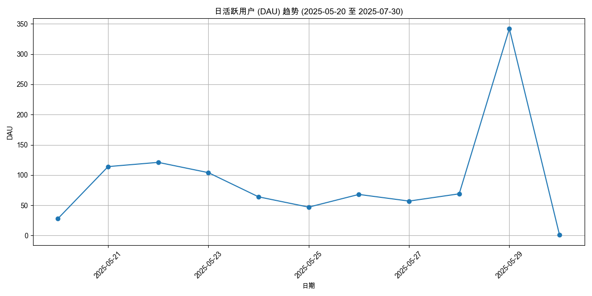

| 日期       |   DAU |
|:-----------|------:|
| 2025-05-20 |    28 |
| 2025-05-21 |   114 |
| 2025-05-22 |   121 |
| 2025-05-23 |   104 |
| 2025-05-24 |    64 |
| 2025-05-25 |    47 |
| 2025-05-26 |    68 |
| 2025-05-27 |    57 |
| 2025-05-28 |    69 |
| 2025-05-29 |   342 |
| 2025-05-30 |     1 |

## 周活跃用户 (WAU)
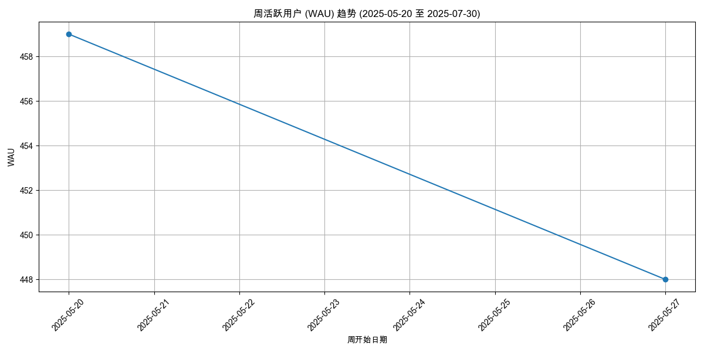

| 周开始日期   |   WAU |
|:-------------|------:|
| 2025-05-20   |   459 |
| 2025-05-27   |   448 |

## 月活跃用户 (MAU)
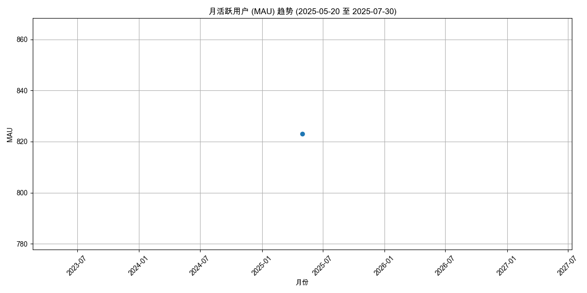

| 月份       |   MAU |
|:-----------|------:|
| 2025-05-01 |   823 |

## 输出文件
- DAU 数据: `daily_active_users_2025-05-20_to_2025-07-30.xlsx`
- WAU 数据: `weekly_active_users_2025-05-20_to_2025-07-30.xlsx`
- MAU 数据: `monthly_active_users_2025-05-20_to_2025-07-30.xlsx`
- 本报告: `user_activity_report_2025-05-20_to_2025-07-30.md`

---

报告生成于: 2025-06-09 17:48:13

## 分析目标
本报告提供用户参与度的洞察，主要关注：
- 人均挑战次数 (日/周/月)
- 人均挑战时长（分钟） (日/周/月)

**分析周期**: 2025-05-20 至 2025-07-30

## 数据来源
- 输入数据文件: `filtered_online_data.xlsx`

### 人均挑战次数
#### 日人均挑战次数
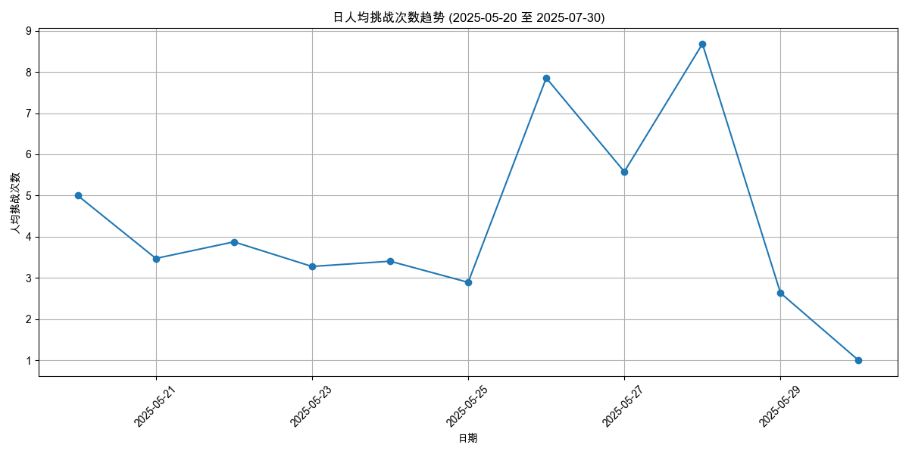

| 日期       |   人均挑战次数 |   总用户数 |   总挑战次数 |
|:-----------|---------------:|-----------:|-------------:|
| 2025-05-20 |        5       |         28 |          140 |
| 2025-05-21 |        3.47368 |        114 |          396 |
| 2025-05-22 |        3.87603 |        121 |          469 |
| 2025-05-23 |        3.27885 |        104 |          341 |
| 2025-05-24 |        3.40625 |         64 |          218 |
| 2025-05-25 |        2.89362 |         47 |          136 |
| 2025-05-26 |        7.85294 |         68 |          534 |
| 2025-05-27 |        5.57895 |         57 |          318 |
| 2025-05-28 |        8.68116 |         69 |          599 |
| 2025-05-29 |        2.6345  |        342 |          901 |
| 2025-05-30 |        1       |          1 |            1 |

#### 周人均挑战次数
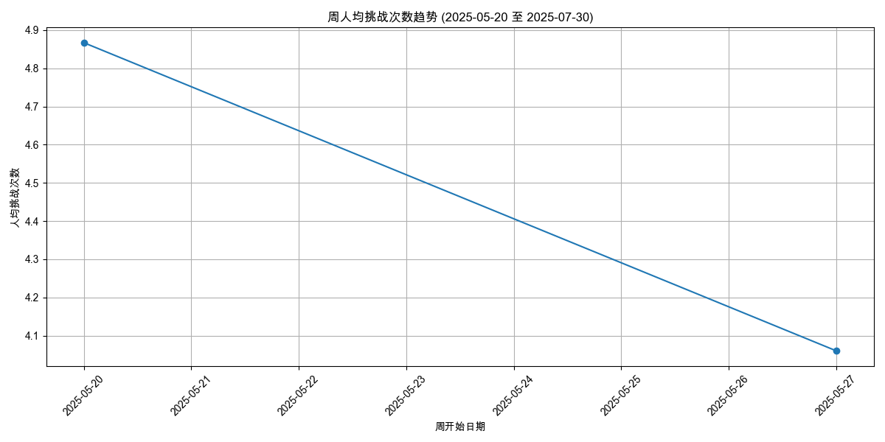

| 周开始日期   |   人均挑战次数 |   总用户数 |   总挑战次数 |
|:-------------|---------------:|-----------:|-------------:|
| 2025-05-20   |        4.8671  |        459 |         2234 |
| 2025-05-27   |        4.06027 |        448 |         1819 |

#### 月人均挑战次数
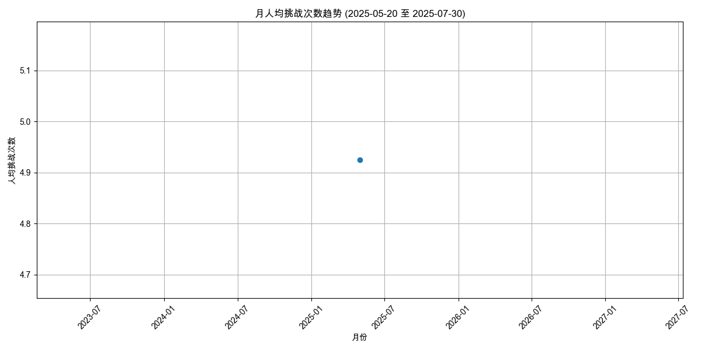

| 月份       |   人均挑战次数 |   总用户数 |   总挑战次数 |
|:-----------|---------------:|-----------:|-------------:|
| 2025-05-01 |        4.92467 |        823 |         4053 |

### 人均挑战时长（分钟）
#### 日人均挑战时长
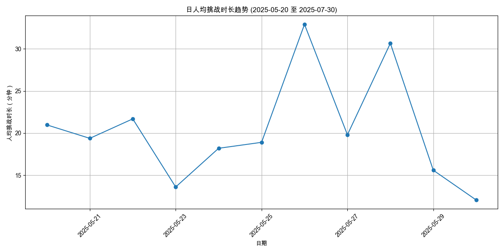

| 日期       |   人均挑战时长（分钟） |   参与时长计算用户数 |   总挑战时长（分钟） |
|:-----------|-----------------------:|---------------------:|---------------------:|
| 2025-05-20 |                20.9756 |                   28 |             587.317  |
| 2025-05-21 |                19.381  |                  114 |            2209.43   |
| 2025-05-22 |                21.6891 |                  121 |            2624.38   |
| 2025-05-23 |                13.6109 |                  104 |            1415.53   |
| 2025-05-24 |                18.2023 |                   64 |            1164.95   |
| 2025-05-25 |                18.9078 |                   47 |             888.667  |
| 2025-05-26 |                32.9    |                   68 |            2237.2    |
| 2025-05-27 |                19.8044 |                   57 |            1128.85   |
| 2025-05-28 |                30.6553 |                   69 |            2115.22   |
| 2025-05-29 |                15.5984 |                  342 |            5334.67   |
| 2025-05-30 |                12.0667 |                    1 |              12.0667 |

#### 周人均挑战时长

| 周开始日期   |   人均挑战时长（分钟） |   参与时长计算用户数 |   总挑战时长（分钟） |
|:-------------|-----------------------:|---------------------:|---------------------:|
| 2025-05-20   |                24.2429 |                  459 |              11127.5 |
| 2025-05-27   |                19.1759 |                  448 |               8590.8 |

#### 月人均挑战时长
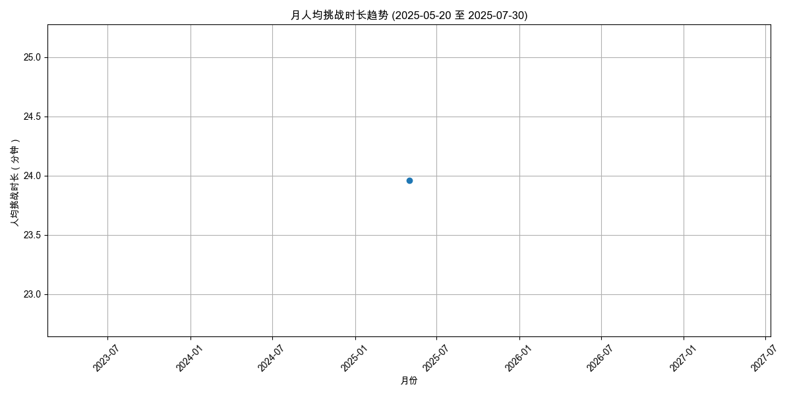

| 月份       |   人均挑战时长（分钟） |   参与时长计算用户数 |   总挑战时长（分钟） |
|:-----------|-----------------------:|---------------------:|---------------------:|
| 2025-05-01 |                 23.959 |                  823 |              19718.3 |

## 输出文件
- 日人均挑战次数: `avg_challenges_daily_2025-05-20_to_2025-07-30.xlsx`
- 周人均挑战次数: `avg_challenges_weekly_2025-05-20_to_2025-07-30.xlsx`
- 月人均挑战次数: `avg_challenges_monthly_2025-05-20_to_2025-07-30.xlsx`
- 日人均挑战时长: `avg_duration_daily_2025-05-20_to_2025-07-30.xlsx`
- 周人均挑战时长: `avg_duration_weekly_2025-05-20_to_2025-07-30.xlsx`
- 月人均挑战时长: `avg_duration_monthly_2025-05-20_to_2025-07-30.xlsx`
- 本报告: `user_engagement_report_2025-05-20_to_2025-07-30.md`

---

报告生成于: 2025-06-09 17:48:17

## 分析目标
本报告识别基于周独立参与用户数最受欢迎的挑战（剧本/场景）。
列出每周排名前 10 的挑战。

**分析周期**: 2025-05-20 至 2025-07-30

## 数据来源
- 输入数据文件: `filtered_online_data.xlsx`

## 每周独立参与用户数排名前 10 的挑战
### 各周热门挑战图表

#### 2025-07-30 开始的一周
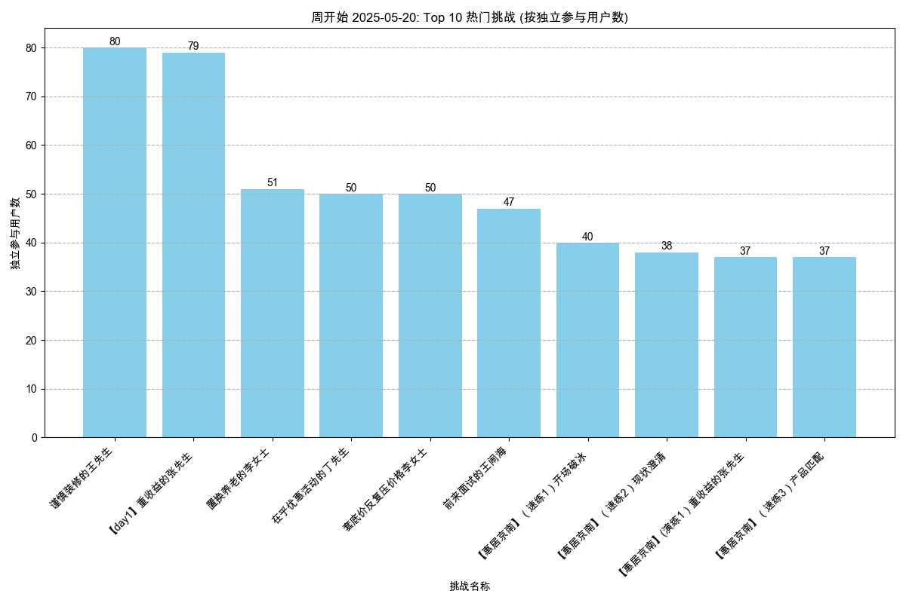

#### 2025-07-30 开始的一周
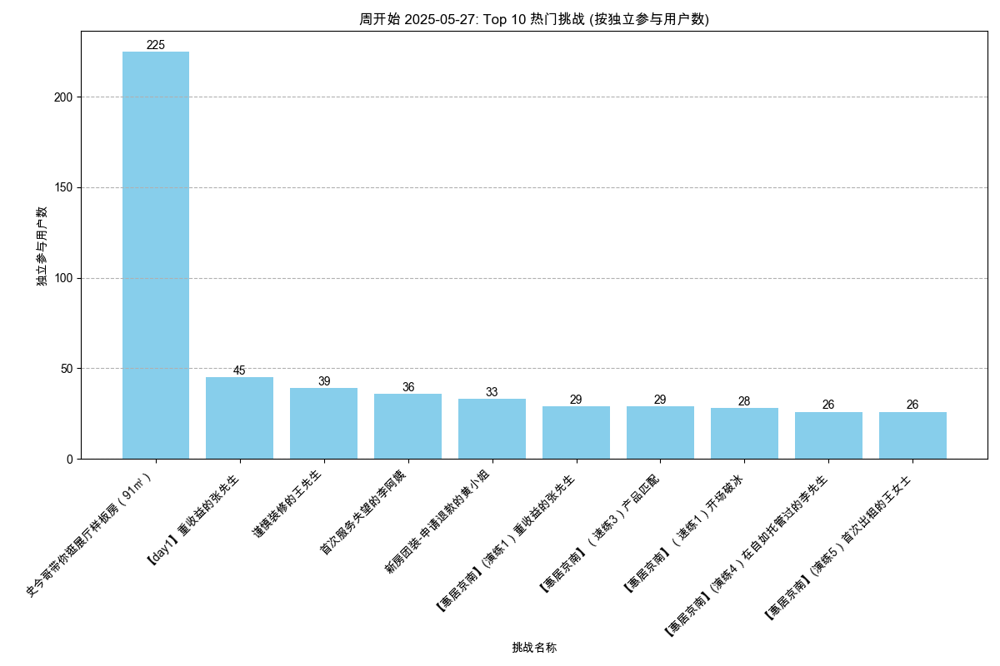

### 数据表
| 周开始日期   | 挑战名称                                 |   独立参与用户数 |
|:-------------|:-----------------------------------------|-----------------:|
| 2025-05-20   | 谨慎装修的王先生                         |               80 |
| 2025-05-20   | 【day1】重收益的张先生                   |               79 |
| 2025-05-20   | 置换养老的李女士                         |               51 |
| 2025-05-20   | 在乎优惠活动的丁先生                     |               50 |
| 2025-05-20   | 套底价反复压价格李女士                   |               50 |
| 2025-05-20   | 前来面试的王闹海                         |               47 |
| 2025-05-20   | 【惠居京南】（速练1）开场破冰            |               40 |
| 2025-05-20   | 【惠居京南】（速练2）现状澄清            |               38 |
| 2025-05-20   | 【惠居京南】(演练1）重收益的张先生       |               37 |
| 2025-05-20   | 【惠居京南】（速练3）产品匹配            |               37 |
| 2025-05-27   | 史今哥带你逛展厅样板房（91㎡）           |              225 |
| 2025-05-27   | 【day1】重收益的张先生                   |               45 |
| 2025-05-27   | 谨慎装修的王先生                         |               39 |
| 2025-05-27   | 首次服务失望的李阿姨                     |               36 |
| 2025-05-27   | 新房团装-申请退款的黄小姐                |               33 |
| 2025-05-27   | 【惠居京南】(演练1）重收益的张先生       |               29 |
| 2025-05-27   | 【惠居京南】（速练3）产品匹配            |               29 |
| 2025-05-27   | 【惠居京南】（速练1）开场破冰            |               28 |
| 2025-05-27   | 【惠居京南】(演练4）在自如托管过的李先生 |               26 |
| 2025-05-27   | 【惠居京南】(演练5）首次出租的王女士     |               26 |

## 输出文件
- 周热门挑战数据: `top_challenges_weekly_2025-05-20_to_2025-07-30.xlsx`
- 本报告: `content_hotness_report_2025-05-20_to_2025-07-30.md`

---

报告生成于: 2025-06-09 17:48:20

## 分析目标
本报告基于"挑战结果"列分析剧本的失败率，其中值为"failed"表示失败。

**分析周期**: 2025-05-20 至 2025-07-30

## 数据来源
- 输入数据文件: `filtered_online_data.xlsx`

## 总体剧本失败率
|   总尝试次数 |   失败尝试次数 |   总体失败率 (%) |
|-------------:|---------------:|-----------------:|
|         4053 |           1783 |            43.99 |

## 各剧本失败率
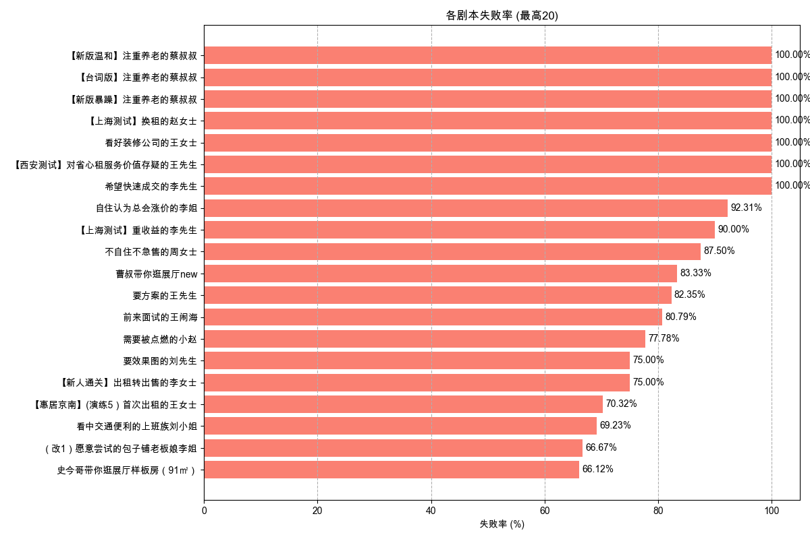

| 剧本名称                                           |   总尝试次数 |   失败尝试次数 |   失败率 (%) |
|:---------------------------------------------------|-------------:|---------------:|-------------:|
| 【新版温和】注重养老的蔡叔叔                       |            3 |              3 |       100    |
| 【台词版】注重养老的蔡叔叔                         |            7 |              7 |       100    |
| 【新版暴躁】注重养老的蔡叔叔                       |            4 |              4 |       100    |
| 【上海测试】换租的赵女士                           |            1 |              1 |       100    |
| 看好装修公司的王女士                               |            1 |              1 |       100    |
| 【西安测试】对省心租服务价值存疑的王先生           |            1 |              1 |       100    |
| 希望快速成交的李先生                               |            1 |              1 |       100    |
| 自住认为总会涨价的李姐                             |           13 |             12 |        92.31 |
| 【上海测试】重收益的李先生                         |           10 |              9 |        90    |
| 不自住不急售的周女士                               |            8 |              7 |        87.5  |
| 曹叔带你逛展厅new                                  |           12 |             10 |        83.33 |
| 要方案的王先生                                     |           17 |             14 |        82.35 |
| 前来面试的王闹海                                   |          177 |            143 |        80.79 |
| 需要被点燃的小赵                                   |            9 |              7 |        77.78 |
| 【新人通关】出租转出售的李女士                     |            4 |              3 |        75    |
| 要效果图的刘先生                                   |            4 |              3 |        75    |
| 【惠居京南】(演练5）首次出租的王女士               |          155 |            109 |        70.32 |
| 看中交通便利的上班族刘小姐                         |           26 |             18 |        69.23 |
| （改1）愿意尝试的包子铺老板娘李姐                  |            3 |              2 |        66.67 |
| 史今哥带你逛展厅样板房（91㎡）                     |          425 |            281 |        66.12 |
| 【云管家】朋友被包租公司坑过，担心没保障的苏女士   |           56 |             37 |        66.07 |
| 工作繁忙的林小姐                                   |           39 |             25 |        64.1  |
| 想要报价的陈女士                                   |           11 |              7 |        63.64 |
| 置换养老的李女士                                   |           71 |             45 |        63.38 |
| 【惠居京南】（速练1）开场破冰                      |          155 |             98 |        63.23 |
| 【day3】学区房的孙女士                             |           95 |             59 |        62.11 |
| 【惠居京南】(演练1）重收益的张先生                 |          128 |             79 |        61.72 |
| 【云管家】非常爱惜房屋，对租客挑剔的郭女士         |           30 |             18 |        60    |
| 【惠居京南】（速练3）产品匹配                      |          145 |             87 |        60    |
| 【云管家】退休在家的王阿姨                         |           29 |             17 |        58.62 |
| 【day1】爱惜房子的王女士                           |          102 |             58 |        56.86 |
| 套底价反复压价格李女士                             |          120 |             65 |        54.17 |
| 【day1】重收益的张先生                             |          184 |             94 |        51.09 |
| 【新人通关】再次委托出租的钱女士                   |           12 |              6 |        50    |
| 首次了解美化套餐的张姐                             |            2 |              1 |        50    |
| 【惠居京南】（速练4）邀约线下                      |          105 |             50 |        47.62 |
| 兼顾上学和居住品质的王先生                         |           30 |             14 |        46.67 |
| 【新人通关】在乎性价比的张先生                     |           15 |              7 |        46.67 |
| 【新人通关】看中居住质量的刘小姐                   |           15 |              7 |        46.67 |
| 【新人通关】被中介坑过的王先生                     |           17 |              7 |        41.18 |
| 【惠居京南】(演练4）在自如托管过的李先生           |           81 |             33 |        40.74 |
| 【新人通关】时间紧迫的赵女士                       |           15 |              6 |        40    |
| 强势的李女士                                       |           15 |              6 |        40    |
| 想租一室户的年轻人卢先生                           |           25 |             10 |        40    |
| 【惠居京南】(演练6）替人出租的李女士               |           72 |             28 |        38.89 |
| 【惠居京南】(演练3）学区房的孙女士                 |           77 |             29 |        37.66 |
| 【惠居京南】（速练2）现状澄清                      |           93 |             35 |        37.63 |
| 【云管家】打算卖房，担心省心租签约年限太长的张先生 |           19 |              7 |        36.84 |
| 【day5】首次出租的王女士                           |           46 |             16 |        34.78 |
| 【day4】在自如托管过的李先生                       |           58 |             18 |        31.03 |
| 【day6】替人出租的李女士                           |           41 |             12 |        29.27 |
| 同事合租多套的蔡先生                               |            7 |              2 |        28.57 |
| 【云管家】在外地首次了解省心租的王女士             |           42 |             12 |        28.57 |
| 【惠居京南】（速练5）总结跟进                      |           81 |             23 |        28.4  |
| 【惠居京南】(演练2）爱惜房子的王女士               |           68 |             19 |        27.94 |
| 【惠居京南】(演练7）老旧房子刘女士                 |           64 |             16 |        25    |
| 【惠居京南】(演练8）以租换租刘先生                 |           66 |             15 |        22.73 |
| 新房团装-申请退款的黄小姐                          |           41 |              9 |        21.95 |
| 谨慎装修的王先生                                   |          141 |             30 |        21.28 |
| 首次服务失望的李阿姨                               |           43 |              9 |        20.93 |
| 【云管家】首次了解省心租，看重收益的李先生         |           35 |              7 |        20    |
| 预期偏高的张女士                                   |            5 |              1 |        20    |
| 做不了主的张女士                                   |           10 |              2 |        20    |
| 在乎优惠活动的丁先生                               |           71 |             14 |        19.72 |
| 购房用于即将新婚的李先生                           |           13 |              2 |        15.38 |
| 大姑的春节热线                                     |            9 |              1 |        11.11 |
| 购房用于出租的陈女士                               |           15 |              1 |         6.67 |
| 二次进店的俞先生                                   |            2 |              0 |         0    |
| 对全包公司失望的杜先生                             |            1 |              0 |         0    |
| 了解美化后有疑问的胡女士                           |            1 |              0 |         0    |

## 输出文件
- 总体失败率数据: `overall_script_failure_rate_2025-05-20_to_2025-07-30.xlsx`
- 各剧本失败率数据: `per_script_failure_rate_2025-05-20_to_2025-07-30.xlsx`
- 本报告: `script_failure_rate_report_2025-05-20_to_2025-07-30.md`

---

