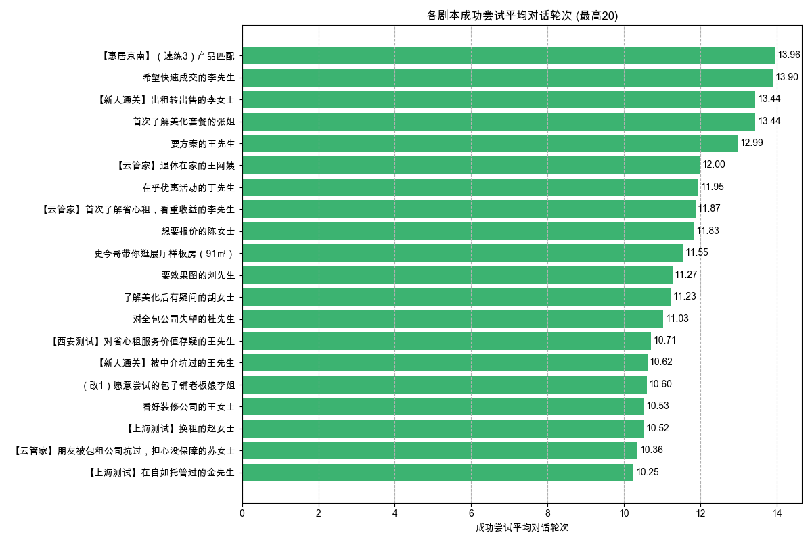

# 剧本完成度与难度分析报告

报告生成于: 2025-05-30 18:50:29

## 分析目标
本报告分析剧本完成效率和感知难度：
- **用户平均通关尝试次数：** 用户针对同一剧本达到非"failed"结果所需的平均尝试次数。对某一用户和某一剧本的连续尝试被计数，直到出现非"failed"结果为止。
- **用户成功尝试平均对话轮次：** 单次非"{FAILED_VALUE}"挑战尝试中的平均Q/A交互轮次。

## 数据来源
- 输入数据文件: `filtered_online_data.xlsx` (路径: `data_for_analysis/online_data_20250529/filtered_data/filtered_online_data.xlsx`)
- 剧本标识: `challenge_id` (`挑战名称`)
- "通关"或"成功尝试"定义为 `挑战结果` 中任何未明确标记为"failed"的结果。
- 交互轮次来源于 `对话记录` JSON。

## 各剧本用户平均通关尝试次数
(按平均尝试次数降序排列)

|   challenge_id | 挑战名称                                           |   平均通关尝试次数 |   总成功通关序列数 |
|---------------:|:---------------------------------------------------|-------------------:|-------------------:|
|            220 | 【惠居京南】(演练5）首次出租的王女士               |               2.89 |                 61 |
|              3 | 要方案的王先生                                     |               2.31 |                895 |
|            215 | 【惠居京南】（速练1）开场破冰                      |               2.23 |                 94 |
|            201 | 【速练体验】现状澄清的房况确认考察                 |               2.22 |                 13 |
|            216 | 【惠居京南】(演练1）重收益的张先生                 |               2.15 |                 66 |
|            159 | 【云管家】朋友被包租公司坑过，担心没保障的苏女士   |               2.15 |                149 |
|            162 | 前来面试的王闹海                                   |               2.06 |                275 |
|            225 | 【惠居京南】（速练3）产品匹配                      |               2.06 |                 79 |
|            242 | 【云管家】非常爱惜房屋，对租客挑剔的郭女士         |               2.04 |                 20 |
|             31 | 自住认为总会涨价的李姐                             |               2.03 |                180 |
|             30 | 不自住不急售的周女士                               |               1.88 |                171 |
|            241 | 【云管家】退休在家的王阿姨                         |               1.81 |                 17 |
|            119 | 【day3】学区房的孙女士                             |               1.74 |                119 |
|            200 | 套底价反复压价格李女士                             |               1.73 |                 89 |
|            232 | 史今哥带你逛展厅样板房（91㎡）                     |               1.71 |                227 |
|            168 | 曹叔带你逛展厅new                                  |               1.71 |                 12 |
|              4 | 想要报价的陈女士                                   |               1.7  |                811 |
|            226 | 【惠居京南】（速练4）邀约线下                      |               1.67 |                 74 |
|            218 | 【惠居京南】(演练3）学区房的孙女士                 |               1.62 |                 53 |
|            195 | 【上海测试】换租的赵女士                           |               1.58 |                 29 |
|            113 | 【day1】爱惜房子的王女士                           |               1.57 |                174 |
|            120 | 【day4】在自如托管过的李先生                       |               1.54 |                 99 |
|            196 | 【上海测试】在自如托管过的金先生                   |               1.54 |                 28 |
|            219 | 【惠居京南】(演练4）在自如托管过的李先生           |               1.52 |                 59 |
|            221 | 【惠居京南】(演练6）替人出租的李女士               |               1.52 |                 53 |
|            209 | 【新版暴躁】注重养老的蔡叔叔                       |               1.5  |                  2 |
|            112 | 【day1】重收益的张先生                             |               1.49 |                527 |
|            224 | 【惠居京南】（速练2）现状澄清                      |               1.48 |                 76 |
|             37 | 对全包公司失望的杜先生                             |               1.48 |                101 |
|            121 | 【day5】首次出租的王女士                           |               1.48 |                 89 |
|             33 | 看中交通便利的上班族刘小姐                         |               1.48 |                159 |
|            197 | 【上海测试】老旧房子的刘阿姨（推荐美租）           |               1.46 |                 23 |
|            194 | 【上海测试】重收益的李先生                         |               1.44 |                 45 |
|            154 | 【新人通关】出租转出售的李女士                     |               1.44 |                  9 |
|              6 | 要效果图的刘先生                                   |               1.43 |                513 |
|              1 | 工作繁忙的林小姐                                   |               1.42 |               1828 |
|             35 | 希望快速成交的李先生                               |               1.37 |                152 |
|            208 | 【台词版】注重养老的蔡叔叔                         |               1.33 |                  7 |
|            227 | 【惠居京南】（速练5）总结跟进                      |               1.32 |                 74 |
|            217 | 【惠居京南】(演练2）爱惜房子的王女士               |               1.32 |                 59 |
|            202 | 【宽松练习版】现状澄清的房况确认                   |               1.31 |                  9 |
|            157 | 【云管家】在外地首次了解省心租的王女士             |               1.31 |                195 |
|            243 | 【云管家】打算卖房，担心省心租签约年限太长的张先生 |               1.31 |                 17 |
|            198 | 购房用于即将新婚的李先生                           |               1.29 |                 94 |
|            158 | 【云管家】首次了解省心租，看重收益的李先生         |               1.29 |                157 |
|            155 | 【新人通关】再次委托出租的钱女士                   |               1.27 |                 32 |
|            223 | 【惠居京南】(演练8）以租换租刘先生                 |               1.27 |                 67 |
|              2 | 做不了主的张女士                                   |               1.25 |                859 |
|              5 | 强势的李女士                                       |               1.25 |                523 |
|             36 | 置换养老的李女士                                   |               1.25 |                928 |
|            222 | 【惠居京南】(演练7）老旧房子刘女士                 |               1.25 |                 62 |
|            150 | 【新人通关】时间紧迫的赵女士                       |               1.23 |                 76 |
|            122 | 【day6】替人出租的李女士                           |               1.23 |                 75 |
|            114 | 谨慎装修的王先生                                   |               1.23 |                369 |
|             32 | 兼顾上学和居住品质的王先生                         |               1.21 |                267 |
|             34 | 预期偏高的张女士                                   |               1.21 |                147 |
|             38 | 二次进店的俞先生                                   |               1.21 |                 59 |
|             72 | 首次了解美化套餐的张姐                             |               1.21 |                237 |
|             45 | 需要被点燃的小赵                                   |               1.19 |                 42 |
|             41 | 在乎优惠活动的丁先生                               |               1.17 |                194 |
|            210 | 【新版温和】注重养老的蔡叔叔                       |               1.17 |                  6 |
|            240 | 新房团装-申请退款的黄小姐                          |               1.17 |                 37 |
|            152 | 【新人通关】看中居住质量的刘小姐                   |               1.17 |                 60 |
|            204 | 【西安测试】对省心租服务价值存疑的王先生           |               1.14 |                 14 |
|            199 | 购房用于出租的陈女士                               |               1.14 |                 76 |
|             73 | 了解美化后有疑问的胡女士                           |               1.13 |                 96 |
|            151 | 【新人通关】被中介坑过的王先生                     |               1.12 |                 47 |
|            156 | 【新人通关】在乎性价比的张先生                     |               1.11 |                 49 |
|             42 | 想租一室户的年轻人卢先生                           |               1.11 |                274 |
|             39 | 看好装修公司的王女士                               |               1.1  |                 89 |
|             40 | 首次服务失望的李阿姨                               |               1.09 |                134 |
|             43 | 同事合租多套的蔡先生                               |               1.05 |                 53 |
|             44 | 大姑的春节热线                                     |               1.05 |                129 |
|            203 | （改1）愿意尝试的包子铺老板娘李姐                  |               1    |                  5 |

## 各剧本成功尝试平均对话轮次
(按平均轮次数降序排列)

|   challenge_id | 挑战名称                                           |   成功尝试平均对话轮次 |   总成功尝试次数 |
|---------------:|:---------------------------------------------------|-----------------------:|-----------------:|
|            225 | 【惠居京南】（速练3）产品匹配                      |                  13.96 |               79 |
|             35 | 希望快速成交的李先生                               |                  13.9  |              152 |
|            154 | 【新人通关】出租转出售的李女士                     |                  13.44 |                9 |
|             72 | 首次了解美化套餐的张姐                             |                  13.44 |              237 |
|              3 | 要方案的王先生                                     |                  12.99 |              895 |
|            241 | 【云管家】退休在家的王阿姨                         |                  12    |               17 |
|             41 | 在乎优惠活动的丁先生                               |                  11.95 |              194 |
|            158 | 【云管家】首次了解省心租，看重收益的李先生         |                  11.87 |              157 |
|              4 | 想要报价的陈女士                                   |                  11.83 |              812 |
|            232 | 史今哥带你逛展厅样板房（91㎡）                     |                  11.55 |              227 |
|              6 | 要效果图的刘先生                                   |                  11.27 |              513 |
|             73 | 了解美化后有疑问的胡女士                           |                  11.23 |               96 |
|             37 | 对全包公司失望的杜先生                             |                  11.03 |              101 |
|            204 | 【西安测试】对省心租服务价值存疑的王先生           |                  10.71 |               14 |
|            151 | 【新人通关】被中介坑过的王先生                     |                  10.62 |               47 |
|            203 | （改1）愿意尝试的包子铺老板娘李姐                  |                  10.6  |                5 |
|             39 | 看好装修公司的王女士                               |                  10.53 |               89 |
|            195 | 【上海测试】换租的赵女士                           |                  10.52 |               29 |
|            159 | 【云管家】朋友被包租公司坑过，担心没保障的苏女士   |                  10.36 |              149 |
|            196 | 【上海测试】在自如托管过的金先生                   |                  10.25 |               28 |
|             34 | 预期偏高的张女士                                   |                  10.24 |              147 |
|             30 | 不自住不急售的周女士                               |                  10.17 |              171 |
|            152 | 【新人通关】看中居住质量的刘小姐                   |                  10.03 |               60 |
|             36 | 置换养老的李女士                                   |                   9.91 |              928 |
|              5 | 强势的李女士                                       |                   9.87 |              523 |
|             31 | 自住认为总会涨价的李姐                             |                   9.67 |              180 |
|              2 | 做不了主的张女士                                   |                   9.65 |              859 |
|            156 | 【新人通关】在乎性价比的张先生                     |                   9.61 |               49 |
|            243 | 【云管家】打算卖房，担心省心租签约年限太长的张先生 |                   9.59 |               17 |
|            217 | 【惠居京南】(演练2）爱惜房子的王女士               |                   9.58 |               59 |
|            208 | 【台词版】注重养老的蔡叔叔                         |                   9.43 |                7 |
|            114 | 谨慎装修的王先生                                   |                   9.38 |              369 |
|             38 | 二次进店的俞先生                                   |                   9.34 |               59 |
|            194 | 【上海测试】重收益的李先生                         |                   9.31 |               45 |
|            200 | 套底价反复压价格李女士                             |                   9.27 |               89 |
|            157 | 【云管家】在外地首次了解省心租的王女士             |                   9.25 |              195 |
|            150 | 【新人通关】时间紧迫的赵女士                       |                   9.12 |               76 |
|             40 | 首次服务失望的李阿姨                               |                   8.86 |              134 |
|            215 | 【惠居京南】（速练1）开场破冰                      |                   8.78 |               94 |
|            197 | 【上海测试】老旧房子的刘阿姨（推荐美租）           |                   8.78 |               23 |
|            120 | 【day4】在自如托管过的李先生                       |                   8.73 |               99 |
|             44 | 大姑的春节热线                                     |                   8.64 |              129 |
|            199 | 购房用于出租的陈女士                               |                   8.59 |               76 |
|            218 | 【惠居京南】(演练3）学区房的孙女士                 |                   8.51 |               53 |
|            216 | 【惠居京南】(演练1）重收益的张先生                 |                   8.41 |               66 |
|            113 | 【day1】爱惜房子的王女士                           |                   8.41 |              174 |
|            223 | 【惠居京南】(演练8）以租换租刘先生                 |                   8.4  |               67 |
|            119 | 【day3】学区房的孙女士                             |                   8.36 |              119 |
|            240 | 新房团装-申请退款的黄小姐                          |                   8.27 |               37 |
|            221 | 【惠居京南】(演练6）替人出租的李女士               |                   8.21 |               53 |
|            222 | 【惠居京南】(演练7）老旧房子刘女士                 |                   8.18 |               62 |
|            224 | 【惠居京南】（速练2）现状澄清                      |                   8.14 |               76 |
|            202 | 【宽松练习版】现状澄清的房况确认                   |                   8.11 |                9 |
|            112 | 【day1】重收益的张先生                             |                   8.09 |              527 |
|             43 | 同事合租多套的蔡先生                               |                   8.09 |               53 |
|            219 | 【惠居京南】(演练4）在自如托管过的李先生           |                   8.03 |               59 |
|             32 | 兼顾上学和居住品质的王先生                         |                   7.99 |              267 |
|            122 | 【day6】替人出租的李女士                           |                   7.97 |               75 |
|            162 | 前来面试的王闹海                                   |                   7.88 |              275 |
|            121 | 【day5】首次出租的王女士                           |                   7.84 |               89 |
|            198 | 购房用于即将新婚的李先生                           |                   7.81 |               94 |
|            227 | 【惠居京南】（速练5）总结跟进                      |                   7.69 |               74 |
|             33 | 看中交通便利的上班族刘小姐                         |                   7.6  |              159 |
|             42 | 想租一室户的年轻人卢先生                           |                   7.55 |              274 |
|            226 | 【惠居京南】（速练4）邀约线下                      |                   7.5  |               74 |
|            220 | 【惠居京南】(演练5）首次出租的王女士               |                   7.48 |               61 |
|            155 | 【新人通关】再次委托出租的钱女士                   |                   7.22 |               32 |
|            210 | 【新版温和】注重养老的蔡叔叔                       |                   7.17 |                6 |
|              1 | 工作繁忙的林小姐                                   |                   6.96 |             1830 |
|            242 | 【云管家】非常爱惜房屋，对租客挑剔的郭女士         |                   6.65 |               20 |
|            201 | 【速练体验】现状澄清的房况确认考察                 |                   6.46 |               13 |
|             45 | 需要被点燃的小赵                                   |                   6.36 |               42 |
|            168 | 曹叔带你逛展厅new                                  |                   5.08 |               12 |
|            209 | 【新版暴躁】注重养老的蔡叔叔                       |                   4    |                2 |

## 输出文件
- 平均通关尝试次数数据: `avg_pass_attempts_per_script.xlsx` (路径: `data_for_analysis/online_data_20250529/basic_analysis_outputs/script_completion_difficulty_analysis/avg_pass_attempts_per_script.xlsx`)
- 成功剧本平均轮次数据: `avg_rounds_in_successful_scripts.xlsx` (路径: `data_for_analysis/online_data_20250529/basic_analysis_outputs/script_completion_difficulty_analysis/avg_rounds_in_successful_scripts.xlsx`)
- 本报告: `script_completion_difficulty_report.md` (路径: `data_for_analysis/online_data_20250529/basic_analysis_outputs/script_completion_difficulty_analysis/script_completion_difficulty_report.md`)

---

## 深度分析

### 1. 解构“剧本难度”：两个核心维度
单一指标无法完全定义剧本的“难度”。我们将难度拆分为两个维度进行分析：
- **“毅力”难度 (平均通关尝试次数)**: 反映用户需要多大的毅力（即重试次数）才能成功。次数越高，挫败感越强。
- **“耐力”难度 (成功平均对话轮次)**: 反映单次成功的对话需要花费多长的精力。轮次越多，内容越深入、耗时越长。

### 2. 剧本难度矩阵分析
结合通关尝试次数和成功对话轮次，我们可以将主要剧本归入四个象限，以进行更精细的诊断：

|                      | **低轮次 (流程简短)**                                        | **高轮次 (流程漫长)**                                                              |
| -------------------- | ------------------------------------------------------------ | ----------------------------------------------------------------------------------- |
| **低重试 (易通关)**  | **象限一：轻松速通**   - `工作繁忙的林小姐` (1.4次, 7.0轮)   - `【新人通关】` 系列 | **象限二：沉浸体验 (理想区)**   - `谨慎装修的王先生` (1.2次, 9.4轮)   - `置换养老的李女士` (1.25次, 9.9轮) |
| **高重试 (难通关)**  | **象限三：挫败关卡**   - `前来面试的王闹海` (2.1次, 7.9轮)   - `不自住不急售的周女士` (1.9次, 10.2轮)  | **象限四：硬核挑战 (高风险区)**   - `要方案的王先生` (2.3次, 13.0轮)   - `史今哥带你逛展厅` (1.7次, 11.6轮) |

- **象限一 (轻松速通)**: 这些是优秀的入门级或放松型内容，能快速给予用户正反馈，适合新手入门。
- **象限二 (沉浸体验)**: 这是 **“内容甜蜜点”**。通关不难，但内容有深度，能让用户投入其中并获得成就感。这是最健康的内容类型，应作为内容设计的黄金标准。
- **象限三 (挫败关卡)**: 这类剧本是需要警惕的“绊脚石”。流程不长，但用户反复失败，容易让用户质疑自己或迁怒于系统，体验极差。**“前来面试的王闹海”** 是典型代表。
- **象限四 (硬核挑战)**: 这是双刃剑。漫长的流程加上高重试门槛，可能会劝退大量普通用户，但一旦成功，也能带来极大的满足感，从而筛选出核心高玩用户。**“要方案的王先生”** 是其中最需要优化的剧本，因为它结合了最高的重试次数和最长的对话流程，是最大的用户流失风险点。

### 3. 策略建议
- **优化“挫败关卡”**: 立即复盘象限三中的剧本。分析其高重试次数的原因，是否存在关键节点的回答设置不合理，或是非黑即白的评估逻辑。目标是将其转化为“轻松速通”或“沉浸体验”型剧本。
- **平衡“硬核挑战”**: 审视象限四的剧本。可以考虑：
    1.  **增加引导**: 在剧本中增加更多的提示或指引，降低通关难度。
    2.  **拆分剧本**: 如果流程过长，可以考虑将其拆分为多个阶段性的小剧本。
    3.  **明确标注**: 在剧本选择界面明确标注“高难度”或“专家模式”，管理用户的预期。
- **丰富内容矩阵**: 基于此矩阵，有意识地规划和设计不同类型的剧本，满足从新手到专家不同用户的需求，构建一个层次丰富、体验健康的内容生态。
