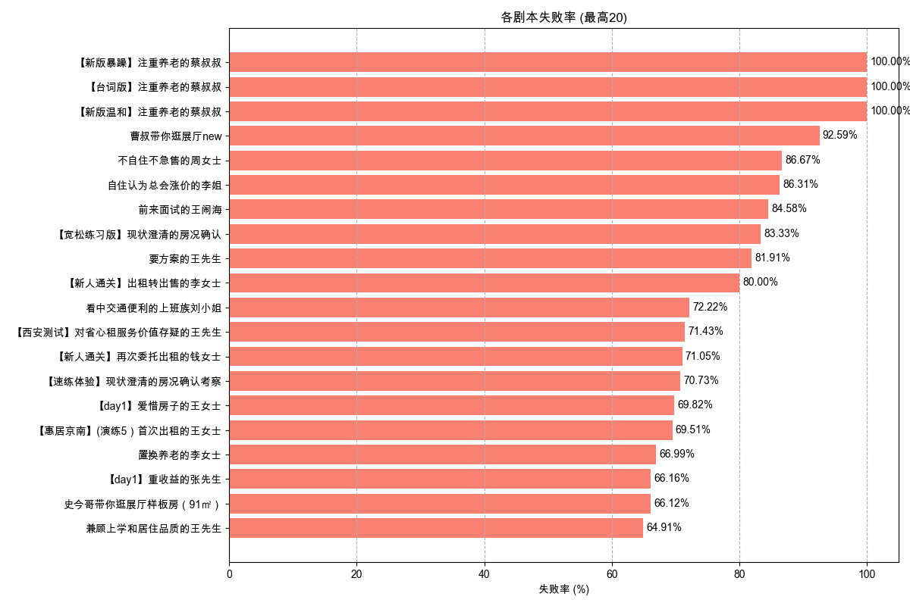

# 剧本失败率分析报告

报告生成于: 2025-05-30 18:48:46

## 分析目标
本报告基于"挑战结果"列分析剧本（挑战）的失败率，其中值为"failed"表示失败。
- 整体剧本失败率。
- 各独立剧本的失败率。
**注意：** 对新上线剧本的失败率分析需要剧本上线日期信息，当前数据集中未包含此信息，因此这部分未覆盖。

## 数据来源
- 输入数据文件: `filtered_online_data.xlsx` (路径: `data_for_analysis/online_data_20250529/filtered_data/filtered_online_data.xlsx`)
- 失败定义: `挑战结果` == 'failed'。
- 剧本标识: `挑战名称`。

## 总体剧本失败率
|   总尝试次数 |   失败尝试次数 |   总体失败率 (%) |
|-------------:|---------------:|-----------------:|
|        23115 |          10002 |            43.27 |

## 各剧本失败率

| 剧本名称                                           |   总尝试次数 |   失败尝试次数 |   失败率 (%) |
|:---------------------------------------------------|-------------:|---------------:|-------------:|
| 【新版暴躁】注重养老的蔡叔叔                       |            5 |              5 |       100    |
| 【台词版】注重养老的蔡叔叔                         |            7 |              7 |       100    |
| 【新版温和】注重养老的蔡叔叔                       |            6 |              6 |       100    |
| 曹叔带你逛展厅new                                  |           27 |             25 |        92.59 |
| 不自住不急售的周女士                               |          405 |            351 |        86.67 |
| 自住认为总会涨价的李姐                             |          409 |            353 |        86.31 |
| 前来面试的王闹海                                   |          642 |            543 |        84.58 |
| 【宽松练习版】现状澄清的房况确认                   |           18 |             15 |        83.33 |
| 要方案的王先生                                     |         1774 |           1453 |        81.91 |
| 【新人通关】出租转出售的李女士                     |           25 |             20 |        80    |
| 看中交通便利的上班族刘小姐                         |          234 |            169 |        72.22 |
| 【西安测试】对省心租服务价值存疑的王先生           |           28 |             20 |        71.43 |
| 【新人通关】再次委托出租的钱女士                   |           38 |             27 |        71.05 |
| 【速练体验】现状澄清的房况确认考察                 |           41 |             29 |        70.73 |
| 【day1】爱惜房子的王女士                           |          391 |            273 |        69.82 |
| 【惠居京南】(演练5）首次出租的王女士               |          164 |            114 |        69.51 |
| 置换养老的李女士                                   |         1227 |            822 |        66.99 |
| 【day1】重收益的张先生                             |          857 |            567 |        66.16 |
| 史今哥带你逛展厅样板房（91㎡）                     |          425 |            281 |        66.12 |
| 兼顾上学和居住品质的王先生                         |          285 |            185 |        64.91 |
| 【云管家】朋友被包租公司坑过，担心没保障的苏女士   |          313 |            203 |        64.86 |
| 【day3】学区房的孙女士                             |          234 |            151 |        64.53 |
| 【惠居京南】（速练1）开场破冰                      |          195 |            123 |        63.08 |
| 需要被点燃的小赵                                   |           51 |             32 |        62.75 |
| 【惠居京南】(演练1）重收益的张先生                 |          140 |             87 |        62.14 |
| 【上海测试】重收益的李先生                         |           78 |             48 |        61.54 |
| 对全包公司失望的杜先生                             |          144 |             88 |        61.11 |
| 【云管家】非常爱惜房屋，对租客挑剔的郭女士         |           30 |             18 |        60    |
| 【惠居京南】（速练3）产品匹配                      |          160 |             94 |        58.75 |
| 【上海测试】老旧房子的刘阿姨（推荐美租）           |           46 |             27 |        58.7  |
| 【云管家】退休在家的王阿姨                         |           29 |             17 |        58.62 |
| 想要报价的陈女士                                   |         1076 |            618 |        57.43 |
| 希望快速成交的李先生                               |          223 |            124 |        55.61 |
| 【新人通关】在乎性价比的张先生                     |           54 |             30 |        55.56 |
| 套底价反复压价格李女士                             |          123 |             68 |        55.28 |
| 【day5】首次出租的王女士                           |          157 |             85 |        54.14 |
| 【新人通关】时间紧迫的赵女士                       |           80 |             43 |        53.75 |
| 【新人通关】看中居住质量的刘小姐                   |           62 |             33 |        53.23 |
| 工作繁忙的林小姐                                   |         1846 |            938 |        50.81 |
| 【day4】在自如托管过的李先生                       |          164 |             81 |        49.39 |
| 【上海测试】换租的赵女士                           |           47 |             22 |        46.81 |
| 预期偏高的张女士                                   |          150 |             70 |        46.67 |
| 【惠居京南】（速练4）邀约线下                      |          116 |             53 |        45.69 |
| 【新人通关】被中介坑过的王先生                     |           45 |             20 |        44.44 |
| 要效果图的刘先生                                   |          656 |            285 |        43.45 |
| 同事合租多套的蔡先生                               |           42 |             18 |        42.86 |
| 【惠居京南】(演练4）在自如托管过的李先生           |           91 |             39 |        42.86 |
| （改1）愿意尝试的包子铺老板娘李姐                  |            7 |              3 |        42.86 |
| 想租一室户的年轻人卢先生                           |          233 |             97 |        41.63 |
| 【惠居京南】(演练3）学区房的孙女士                 |           85 |             34 |        40    |
| 【惠居京南】(演练6）替人出租的李女士               |           81 |             32 |        39.51 |
| 大姑的春节热线                                     |          134 |             50 |        37.31 |
| 【云管家】打算卖房，担心省心租签约年限太长的张先生 |           19 |              7 |        36.84 |
| 【惠居京南】（速练2）现状澄清                      |          105 |             37 |        35.24 |
| 【上海测试】在自如托管过的金先生                   |           37 |             13 |        35.14 |
| 首次了解美化套餐的张姐                             |          254 |             87 |        34.25 |
| 购房用于即将新婚的李先生                           |           96 |             32 |        33.33 |
| 【day6】替人出租的李女士                           |           93 |             30 |        32.26 |
| 了解美化后有疑问的胡女士                           |          105 |             32 |        30.48 |
| 【云管家】在外地首次了解省心租的王女士             |          232 |             69 |        29.74 |
| 二次进店的俞先生                                   |           64 |             19 |        29.69 |
| 强势的李女士                                       |          611 |            176 |        28.81 |
| 【惠居京南】(演练2）爱惜房子的王女士               |           73 |             20 |        27.4  |
| 【惠居京南】（速练5）总结跟进                      |           92 |             25 |        27.17 |
| 做不了主的张女士                                   |          926 |            251 |        27.11 |
| 谨慎装修的王先生                                   |          387 |            103 |        26.61 |
| 看好装修公司的王女士                               |           88 |             23 |        26.14 |
| 【惠居京南】(演练7）老旧房子刘女士                 |           74 |             19 |        25.68 |
| 【惠居京南】(演练8）以租换租刘先生                 |           76 |             19 |        25    |
| 在乎优惠活动的丁先生                               |          195 |             43 |        22.05 |
| 新房团装-申请退款的黄小姐                          |           41 |              9 |        21.95 |
| 【云管家】首次了解省心租，看重收益的李先生         |          178 |             37 |        20.79 |
| 购房用于出租的陈女士                               |           72 |             12 |        16.67 |
| 首次服务失望的李阿姨                               |          122 |             19 |        15.57 |

## 输出文件
- 总体失败率数据: `overall_script_failure_rate.xlsx` (路径: `data_for_analysis/online_data_20250529/basic_analysis_outputs/script_failure_rate_analysis/overall_script_failure_rate.xlsx`)
- 各剧本失败率数据: `per_script_failure_rate.xlsx` (路径: `data_for_analysis/online_data_20250529/basic_analysis_outputs/script_failure_rate_analysis/per_script_failure_rate.xlsx`)
- 本报告: `script_failure_rate_report.md` (路径: `data_for_analysis/online_data_20250529/basic_analysis_outputs/script_failure_rate_analysis/script_failure_rate_report.md`)

## 深度分析

### 1. 核心发现：整体失败率偏高，重点剧本问题严重
- **整体健康度警报**: **43.27%** 的总体失败率是一个需要高度关注的危险信号。这意味着用户近一半的尝试以失败告终，这可能严重影响用户体验和长期留存。
- **高风险剧本识别**:
    - **急需审查的剧本 (失败率 > 80%)**:
        - **"注重养老的蔡叔叔"** 的三个版本失败率均为100%，可能存在BUG或评估逻辑问题，需立即下线审查。
        - **"不自住不急售的周女士" (86.7%)**、**"自住认为总会涨价的李姐" (86.3%)**、**"前来面试的王闹海" (84.6%)** 以及 **"要方案的王先生" (81.9%)**。
    - **"热门陷阱"**: 特别是 **"要方案的王先生"**，在拥有大量尝试次数（1774次）的同时，失败率极高，这意味着该剧本已导致超过 **1450次** 的失败体验。这种"高热度高失败率"的组合对用户伤害最大，应作为内容优化的最高优先级。

### 2. 内容设计平衡性分析
- **"甜蜜点"剧本**:
    - **"做不了主的张女士"** (27.1%失败率) 和 **"谨慎装修的王先生"** (26.6%失败率) 是优秀的设计典范。它们既保持了相当高的热度（在内容热度分析中名列前茅），又提供了合理的成功可能性，给予了用户挑战性和成就感。建议内容设计团队深入分析这些剧本的特点，作为未来设计的参考。
- **可能过于简单的剧本**:
    - **"首次服务失望的李阿姨" (15.6%)** 和 **"购房用于出租的陈女士" (16.7%)** 等失败率极低的剧本，可能挑战性不足。虽然低失败率对初期用户友好，但也可能让资深用户感到"无聊"。

### 3. 策略与行动建议
- **建立内容质量红线**:
    - **设定失败率阈值**: 建议为剧本设定一个失败率的监控阈值（例如，上线一周后失败率高于70%）。一旦触发，应自动告警并由内容团队介入分析，判断是难度问题、设计缺陷还是评估BUG。
    - **立即审查并优化**: 对上述所有失败率超过80%的剧本进行紧急复盘。优化方案可以是调整对话流程、修改评估标准，或者增加引导提示。
- **结合用户反馈进行诊断**: 对于高失败率剧本，不能仅看数据。应结合用户在这些剧本下的主观评价（参考`user_feedback_keywords_analysis`的分析结果），以理解失败的具体原因（是"太难"、"不合理"还是技术问题）。
- **新剧本观察期**: 所有新上线的剧本都应有一个为期1-2周的观察期，在此期间密切监控其失败率、通关轮次等数据，以便快速迭代和优化。
