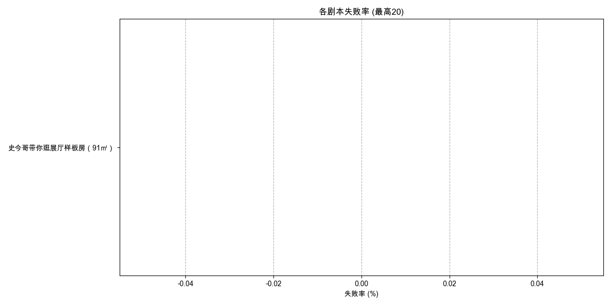

# 剧本失败率分析报告 (最近1日)

报告生成于: 2025-06-09 17:08:01

## 分析目标
本报告基于"挑战结果"列分析剧本的失败率，其中值为"failed"表示失败。

**分析周期**: 最近1日

## 数据来源
- 输入数据文件: `filtered_online_data.xlsx`

## 总体剧本失败率
|   总尝试次数 |   失败尝试次数 |   总体失败率 (%) |
|-------------:|---------------:|-----------------:|
|            1 |              0 |                0 |

## 各剧本失败率

| 剧本名称                       |   总尝试次数 |   失败尝试次数 |   失败率 (%) |
|:-------------------------------|-------------:|---------------:|-------------:|
| 史今哥带你逛展厅样板房（91㎡） |            0 |              0 |          nan |

## 输出文件
- 总体失败率数据: `overall_script_failure_rate_1d.xlsx`
- 各剧本失败率数据: `per_script_failure_rate_1d.xlsx`
- 本报告: `script_failure_rate_report_1d.md`
