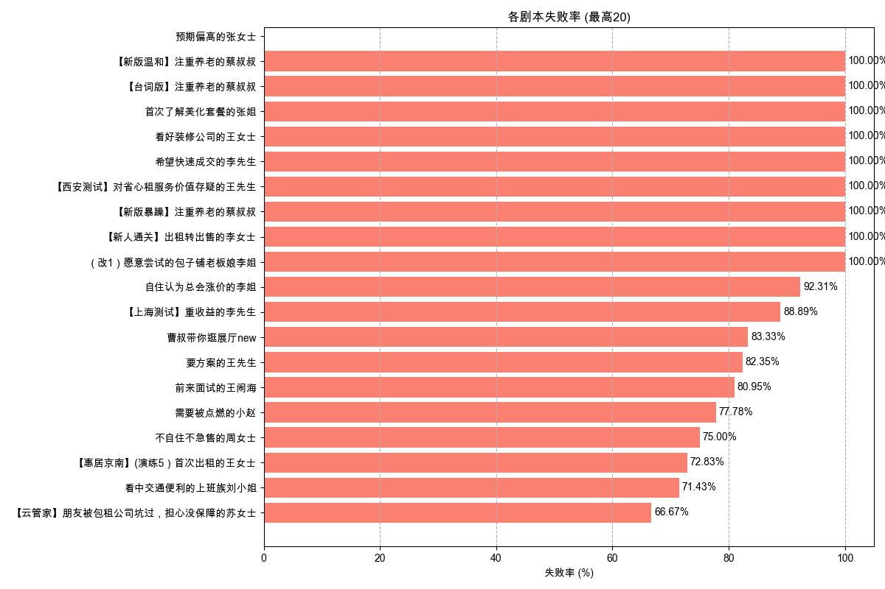

# 剧本失败率分析报告 (2025-05-20 至 2025-05-27)

报告生成于: 2025-06-09 17:46:55

## 分析目标
本报告基于"挑战结果"列分析剧本的失败率，其中值为"failed"表示失败。

**分析周期**: 2025-05-20 至 2025-05-27

## 数据来源
- 输入数据文件: `filtered_online_data.xlsx`

## 总体剧本失败率
|   总尝试次数 |   失败尝试次数 |   总体失败率 (%) |
|-------------:|---------------:|-----------------:|
|         2552 |           1091 |            42.75 |

## 各剧本失败率

| 剧本名称                                           |   总尝试次数 |   失败尝试次数 |   失败率 (%) |
|:---------------------------------------------------|-------------:|---------------:|-------------:|
| 【新版温和】注重养老的蔡叔叔                       |            3 |              3 |       100    |
| 【台词版】注重养老的蔡叔叔                         |            2 |              2 |       100    |
| 首次了解美化套餐的张姐                             |            1 |              1 |       100    |
| 看好装修公司的王女士                               |            1 |              1 |       100    |
| 希望快速成交的李先生                               |            1 |              1 |       100    |
| 【西安测试】对省心租服务价值存疑的王先生           |            1 |              1 |       100    |
| 【新版暴躁】注重养老的蔡叔叔                       |            4 |              4 |       100    |
| 【新人通关】出租转出售的李女士                     |            3 |              3 |       100    |
| （改1）愿意尝试的包子铺老板娘李姐                  |            2 |              2 |       100    |
| 自住认为总会涨价的李姐                             |           13 |             12 |        92.31 |
| 【上海测试】重收益的李先生                         |            9 |              8 |        88.89 |
| 曹叔带你逛展厅new                                  |           12 |             10 |        83.33 |
| 要方案的王先生                                     |           17 |             14 |        82.35 |
| 前来面试的王闹海                                   |          147 |            119 |        80.95 |
| 需要被点燃的小赵                                   |            9 |              7 |        77.78 |
| 不自住不急售的周女士                               |            4 |              3 |        75    |
| 【惠居京南】(演练5）首次出租的王女士               |           92 |             67 |        72.83 |
| 看中交通便利的上班族刘小姐                         |           21 |             15 |        71.43 |
| 【云管家】朋友被包租公司坑过，担心没保障的苏女士   |           54 |             36 |        66.67 |
| 要效果图的刘先生                                   |            3 |              2 |        66.67 |
| 【云管家】退休在家的王阿姨                         |           25 |             16 |        64    |
| 【惠居京南】(演练1）重收益的张先生                 |           88 |             56 |        63.64 |
| 置换养老的李女士                                   |           60 |             37 |        61.67 |
| 想要报价的陈女士                                   |           10 |              6 |        60    |
| 【惠居京南】（速练1）开场破冰                      |           89 |             52 |        58.43 |
| 【day1】爱惜房子的王女士                           |           71 |             41 |        57.75 |
| 史今哥带你逛展厅样板房（91㎡）                     |           26 |             15 |        57.69 |
| 套底价反复压价格李女士                             |          114 |             64 |        56.14 |
| 【惠居京南】（速练3）产品匹配                      |           86 |             48 |        55.81 |
| 【新人通关】再次委托出租的钱女士                   |            9 |              5 |        55.56 |
| 【云管家】非常爱惜房屋，对租客挑剔的郭女士         |           20 |             11 |        55    |
| 【day3】学区房的孙女士                             |           59 |             32 |        54.24 |
| 【day1】重收益的张先生                             |          122 |             65 |        53.28 |
| 工作繁忙的林小姐                                   |           19 |             10 |        52.63 |
| 【惠居京南】（速练4）邀约线下                      |           72 |             35 |        48.61 |
| 【新人通关】看中居住质量的刘小姐                   |           15 |              7 |        46.67 |
| 【新人通关】在乎性价比的张先生                     |           13 |              6 |        46.15 |
| 想租一室户的年轻人卢先生                           |           22 |             10 |        45.45 |
| 【惠居京南】(演练6）替人出租的李女士               |           46 |             20 |        43.48 |
| 兼顾上学和居住品质的王先生                         |           23 |             10 |        43.48 |
| 【惠居京南】(演练4）在自如托管过的李先生           |           53 |             22 |        41.51 |
| 【新人通关】被中介坑过的王先生                     |           17 |              7 |        41.18 |
| 强势的李女士                                       |           15 |              6 |        40    |
| 【云管家】打算卖房，担心省心租签约年限太长的张先生 |           15 |              6 |        40    |
| 【惠居京南】(演练3）学区房的孙女士                 |           50 |             20 |        40    |
| 【惠居京南】（速练2）现状澄清                      |           64 |             24 |        37.5  |
| 【惠居京南】(演练2）爱惜房子的王女士               |           47 |             16 |        34.04 |
| 【惠居京南】（速练5）总结跟进                      |           59 |             19 |        32.2  |
| 【day5】首次出租的王女士                           |           29 |              9 |        31.03 |
| 【惠居京南】(演练7）老旧房子刘女士                 |           43 |             13 |        30.23 |
| 【新人通关】时间紧迫的赵女士                       |            7 |              2 |        28.57 |
| 【day6】替人出租的李女士                           |           26 |              7 |        26.92 |
| 【惠居京南】(演练8）以租换租刘先生                 |           45 |             12 |        26.67 |
| 【云管家】在外地首次了解省心租的王女士             |           38 |             10 |        26.32 |
| 【day4】在自如托管过的李先生                       |           36 |              9 |        25    |
| 谨慎装修的王先生                                   |          110 |             25 |        22.73 |
| 在乎优惠活动的丁先生                               |           69 |             14 |        20.29 |
| 购房用于即将新婚的李先生                           |           10 |              2 |        20    |
| 同事合租多套的蔡先生                               |            5 |              1 |        20    |
| 首次服务失望的李阿姨                               |            5 |              1 |        20    |
| 【云管家】首次了解省心租，看重收益的李先生         |           33 |              6 |        18.18 |
| 做不了主的张女士                                   |            8 |              1 |        12.5  |
| 大姑的春节热线                                     |            8 |              1 |        12.5  |
| 购房用于出租的陈女士                               |           13 |              1 |         7.69 |
| 对全包公司失望的杜先生                             |            1 |              0 |         0    |
| 新房团装-申请退款的黄小姐                          |            3 |              0 |         0    |
| 了解美化后有疑问的胡女士                           |            1 |              0 |         0    |
| 二次进店的俞先生                                   |            2 |              0 |         0    |
| 预期偏高的张女士                                   |            0 |              0 |       nan    |

## 输出文件
- 总体失败率数据: `overall_script_failure_rate_2025-05-20_to_2025-05-27.xlsx`
- 各剧本失败率数据: `per_script_failure_rate_2025-05-20_to_2025-05-27.xlsx`
- 本报告: `script_failure_rate_report_2025-05-20_to_2025-05-27.md`
