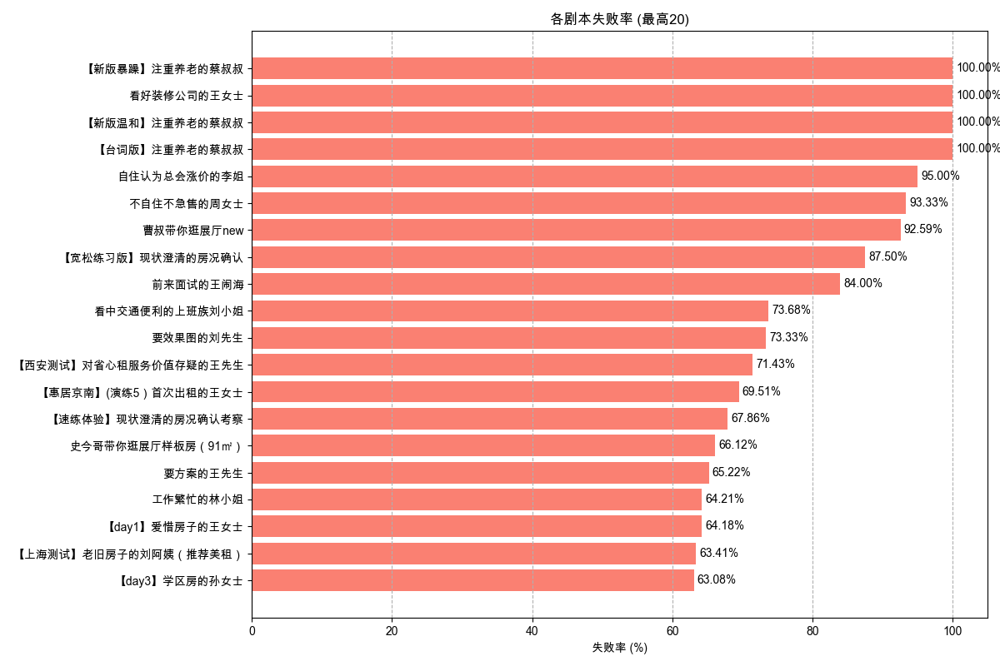

# 剧本失败率分析报告 (最近30日)

报告生成于: 2025-06-09 17:47:47

## 分析目标
本报告基于"挑战结果"列分析剧本的失败率，其中值为"failed"表示失败。

**分析周期**: 最近30日

## 数据来源
- 输入数据文件: `filtered_online_data.xlsx`

## 总体剧本失败率
|   总尝试次数 |   失败尝试次数 |   总体失败率 (%) |
|-------------:|---------------:|-----------------:|
|         7180 |           3214 |            44.76 |

## 各剧本失败率

| 剧本名称                                           |   总尝试次数 |   失败尝试次数 |   失败率 (%) |
|:---------------------------------------------------|-------------:|---------------:|-------------:|
| 【新版暴躁】注重养老的蔡叔叔                       |            5 |              5 |       100    |
| 看好装修公司的王女士                               |            1 |              1 |       100    |
| 【新版温和】注重养老的蔡叔叔                       |            6 |              6 |       100    |
| 【台词版】注重养老的蔡叔叔                         |            7 |              7 |       100    |
| 自住认为总会涨价的李姐                             |           20 |             19 |        95    |
| 不自住不急售的周女士                               |           15 |             14 |        93.33 |
| 曹叔带你逛展厅new                                  |           27 |             25 |        92.59 |
| 【宽松练习版】现状澄清的房况确认                   |            8 |              7 |        87.5  |
| 前来面试的王闹海                                   |          575 |            483 |        84    |
| 看中交通便利的上班族刘小姐                         |           38 |             28 |        73.68 |
| 要效果图的刘先生                                   |           15 |             11 |        73.33 |
| 【西安测试】对省心租服务价值存疑的王先生           |           28 |             20 |        71.43 |
| 【惠居京南】(演练5）首次出租的王女士               |          164 |            114 |        69.51 |
| 【速练体验】现状澄清的房况确认考察                 |           28 |             19 |        67.86 |
| 史今哥带你逛展厅样板房（91㎡）                     |          425 |            281 |        66.12 |
| 要方案的王先生                                     |           23 |             15 |        65.22 |
| 工作繁忙的林小姐                                   |           95 |             61 |        64.21 |
| 【day1】爱惜房子的王女士                           |          282 |            181 |        64.18 |
| 【上海测试】老旧房子的刘阿姨（推荐美租）           |           41 |             26 |        63.41 |
| 【day3】学区房的孙女士                             |          195 |            123 |        63.08 |
| 【惠居京南】（速练1）开场破冰                      |          195 |            123 |        63.08 |
| 【新人通关】出租转出售的李女士                     |            8 |              5 |        62.5  |
| 【惠居京南】(演练1）重收益的张先生                 |          140 |             87 |        62.14 |
| 【云管家】朋友被包租公司坑过，担心没保障的苏女士   |          195 |            120 |        61.54 |
| 需要被点燃的小赵                                   |           13 |              8 |        61.54 |
| 置换养老的李女士                                   |          121 |             73 |        60.33 |
| 【云管家】非常爱惜房屋，对租客挑剔的郭女士         |           30 |             18 |        60    |
| 想要报价的陈女士                                   |           32 |             19 |        59.38 |
| 【新人通关】再次委托出租的钱女士                   |           22 |             13 |        59.09 |
| 【上海测试】重收益的李先生                         |           66 |             39 |        59.09 |
| 【惠居京南】（速练3）产品匹配                      |          160 |             94 |        58.75 |
| 【云管家】退休在家的王阿姨                         |           29 |             17 |        58.62 |
| 套底价反复压价格李女士                             |          122 |             67 |        54.92 |
| 【day1】重收益的张先生                             |          527 |            288 |        54.65 |
| 兼顾上学和居住品质的王先生                         |           51 |             26 |        50.98 |
| 【上海测试】换租的赵女士                           |           42 |             21 |        50    |
| 【新人通关】被中介坑过的王先生                     |           21 |             10 |        47.62 |
| 【新人通关】在乎性价比的张先生                     |           19 |              9 |        47.37 |
| 【新人通关】看中居住质量的刘小姐                   |           26 |             12 |        46.15 |
| 【惠居京南】（速练4）邀约线下                      |          116 |             53 |        45.69 |
| 【day5】首次出租的王女士                           |          109 |             49 |        44.95 |
| 同事合租多套的蔡先生                               |            9 |              4 |        44.44 |
| 【day4】在自如托管过的李先生                       |          130 |             57 |        43.85 |
| 【新人通关】时间紧迫的赵女士                       |           28 |             12 |        42.86 |
| 【惠居京南】(演练4）在自如托管过的李先生           |           91 |             39 |        42.86 |
| 【上海测试】在自如托管过的金先生                   |           32 |             13 |        40.62 |
| 想租一室户的年轻人卢先生                           |           45 |             18 |        40    |
| （改1）愿意尝试的包子铺老板娘李姐                  |            5 |              2 |        40    |
| 【惠居京南】(演练3）学区房的孙女士                 |           85 |             34 |        40    |
| 【惠居京南】(演练6）替人出租的李女士               |           81 |             32 |        39.51 |
| 【云管家】打算卖房，担心省心租签约年限太长的张先生 |           19 |              7 |        36.84 |
| 【惠居京南】（速练2）现状澄清                      |          105 |             37 |        35.24 |
| 强势的李女士                                       |           23 |              8 |        34.78 |
| 【day6】替人出租的李女士                           |           78 |             26 |        33.33 |
| 首次了解美化套餐的张姐                             |            3 |              1 |        33.33 |
| 对全包公司失望的杜先生                             |            3 |              1 |        33.33 |
| 购房用于即将新婚的李先生                           |           93 |             31 |        33.33 |
| 希望快速成交的李先生                               |            6 |              2 |        33.33 |
| 【云管家】在外地首次了解省心租的王女士             |          152 |             49 |        32.24 |
| 【惠居京南】(演练2）爱惜房子的王女士               |           73 |             20 |        27.4  |
| 【惠居京南】（速练5）总结跟进                      |           92 |             25 |        27.17 |
| 【惠居京南】(演练7）老旧房子刘女士                 |           74 |             19 |        25.68 |
| 【惠居京南】(演练8）以租换租刘先生                 |           76 |             19 |        25    |
| 了解美化后有疑问的胡女士                           |            4 |              1 |        25    |
| 谨慎装修的王先生                                   |          352 |             81 |        23.01 |
| 新房团装-申请退款的黄小姐                          |           41 |              9 |        21.95 |
| 首次服务失望的李阿姨                               |           44 |              9 |        20.45 |
| 在乎优惠活动的丁先生                               |           71 |             14 |        19.72 |
| 【云管家】首次了解省心租，看重收益的李先生         |          112 |             22 |        19.64 |
| 预期偏高的张女士                                   |            7 |              1 |        14.29 |
| 大姑的春节热线                                     |           14 |              2 |        14.29 |
| 购房用于出租的陈女士                               |           68 |              9 |        13.24 |
| 做不了主的张女士                                   |           24 |              3 |        12.5  |
| 二次进店的俞先生                                   |            3 |              0 |         0    |

## 输出文件
- 总体失败率数据: `overall_script_failure_rate_30d.xlsx`
- 各剧本失败率数据: `per_script_failure_rate_30d.xlsx`
- 本报告: `script_failure_rate_report_30d.md`
