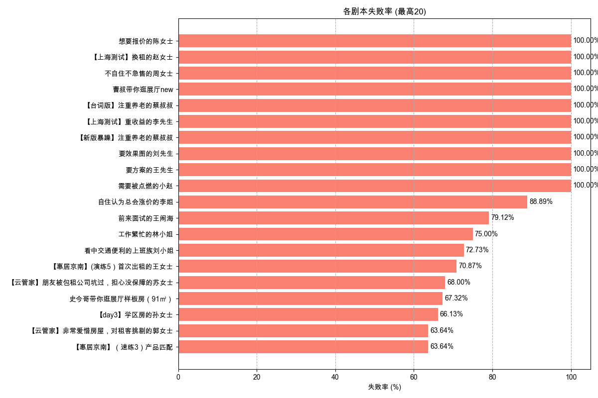

# 剧本失败率分析报告 (最近7日)

报告生成于: 2025-06-09 17:07:01

## 分析目标
本报告基于"挑战结果"列分析剧本的失败率，其中值为"failed"表示失败。

**分析周期**: 最近7日

## 数据来源
- 输入数据文件: `filtered_online_data.xlsx`

## 总体剧本失败率
|   总尝试次数 |   失败尝试次数 |   总体失败率 (%) |
|-------------:|---------------:|-----------------:|
|         2707 |           1224 |            45.22 |

## 各剧本失败率

| 剧本名称                                           |   总尝试次数 |   失败尝试次数 |   失败率 (%) |
|:---------------------------------------------------|-------------:|---------------:|-------------:|
| 想要报价的陈女士                                   |            1 |              1 |       100    |
| 【上海测试】换租的赵女士                           |            1 |              1 |       100    |
| 不自住不急售的周女士                               |            5 |              5 |       100    |
| 曹叔带你逛展厅new                                  |            2 |              2 |       100    |
| 【台词版】注重养老的蔡叔叔                         |            5 |              5 |       100    |
| 【上海测试】重收益的李先生                         |            1 |              1 |       100    |
| 【新版暴躁】注重养老的蔡叔叔                       |            1 |              1 |       100    |
| 要效果图的刘先生                                   |            1 |              1 |       100    |
| 要方案的王先生                                     |           12 |             12 |       100    |
| 需要被点燃的小赵                                   |            2 |              2 |       100    |
| 自住认为总会涨价的李姐                             |            9 |              8 |        88.89 |
| 前来面试的王闹海                                   |           91 |             72 |        79.12 |
| 工作繁忙的林小姐                                   |           28 |             21 |        75    |
| 看中交通便利的上班族刘小姐                         |           22 |             16 |        72.73 |
| 【惠居京南】(演练5）首次出租的王女士               |          127 |             90 |        70.87 |
| 【云管家】朋友被包租公司坑过，担心没保障的苏女士   |           50 |             34 |        68    |
| 史今哥带你逛展厅样板房（91㎡）                     |          410 |            276 |        67.32 |
| 【day3】学区房的孙女士                             |           62 |             41 |        66.13 |
| 【云管家】非常爱惜房屋，对租客挑剔的郭女士         |           11 |              7 |        63.64 |
| 【惠居京南】（速练3）产品匹配                      |          110 |             70 |        63.64 |
| 【惠居京南】（速练1）开场破冰                      |          107 |             68 |        63.55 |
| 【惠居京南】(演练1）重收益的张先生                 |           87 |             54 |        62.07 |
| 置换养老的李女士                                   |           45 |             26 |        57.78 |
| 【day1】爱惜房子的王女士                           |           63 |             35 |        55.56 |
| 【新人通关】再次委托出租的钱女士                   |           11 |              6 |        54.55 |
| 套底价反复压价格李女士                             |           28 |             15 |        53.57 |
| 【惠居京南】（速练4）邀约线下                      |           78 |             41 |        52.56 |
| 【新人通关】出租转出售的李女士                     |            2 |              1 |        50    |
| 做不了主的张女士                                   |            4 |              2 |        50    |
| 兼顾上学和居住品质的王先生                         |           22 |             10 |        45.45 |
| 【新人通关】时间紧迫的赵女士                       |           11 |              5 |        45.45 |
| 【day1】重收益的张先生                             |           91 |             41 |        45.05 |
| 【惠居京南】（速练2）现状澄清                      |           65 |             28 |        43.08 |
| 【云管家】打算卖房，担心省心租签约年限太长的张先生 |            7 |              3 |        42.86 |
| 【惠居京南】(演练4）在自如托管过的李先生           |           62 |             26 |        41.94 |
| 【新人通关】看中居住质量的刘小姐                   |           12 |              5 |        41.67 |
| 【新人通关】在乎性价比的张先生                     |           10 |              4 |        40    |
| 【云管家】退休在家的王阿姨                         |            5 |              2 |        40    |
| 【新人通关】被中介坑过的王先生                     |            5 |              2 |        40    |
| 【惠居京南】(演练3）学区房的孙女士                 |           53 |             21 |        39.62 |
| 【day5】首次出租的王女士                           |           34 |             13 |        38.24 |
| 【惠居京南】(演练6）替人出租的李女士               |           55 |             21 |        38.18 |
| 想租一室户的年轻人卢先生                           |           19 |              7 |        36.84 |
| 同事合租多套的蔡先生                               |            6 |              2 |        33.33 |
| 强势的李女士                                       |            3 |              1 |        33.33 |
| 【day6】替人出租的李女士                           |           29 |              9 |        31.03 |
| 【day4】在自如托管过的李先生                       |           39 |             12 |        30.77 |
| 【惠居京南】(演练2）爱惜房子的王女士               |           44 |             12 |        27.27 |
| 【惠居京南】（速练5）总结跟进                      |           53 |             14 |        26.42 |
| 【云管家】在外地首次了解省心租的王女士             |           36 |              9 |        25    |
| 新房团装-申请退款的黄小姐                          |           41 |              9 |        21.95 |
| 首次服务失望的李阿姨                               |           42 |              9 |        21.43 |
| 谨慎装修的王先生                                   |           85 |             17 |        20    |
| 预期偏高的张女士                                   |            5 |              1 |        20    |
| 【云管家】首次了解省心租，看重收益的李先生         |           32 |              6 |        18.75 |
| 【惠居京南】(演练7）老旧房子刘女士                 |           43 |              8 |        18.6  |
| 【惠居京南】(演练8）以租换租刘先生                 |           46 |              8 |        17.39 |
| 在乎优惠活动的丁先生                               |           14 |              2 |        14.29 |
| 首次了解美化套餐的张姐                             |            1 |              0 |         0    |
| 二次进店的俞先生                                   |            1 |              0 |         0    |
| 购房用于即将新婚的李先生                           |            7 |              0 |         0    |
| 购房用于出租的陈女士                               |            6 |              0 |         0    |
| 大姑的春节热线                                     |            4 |              0 |         0    |
| （改1）愿意尝试的包子铺老板娘李姐                  |            1 |              0 |         0    |

## 输出文件
- 总体失败率数据: `overall_script_failure_rate_7d.xlsx`
- 各剧本失败率数据: `per_script_failure_rate_7d.xlsx`
- 本报告: `script_failure_rate_report_7d.md`
