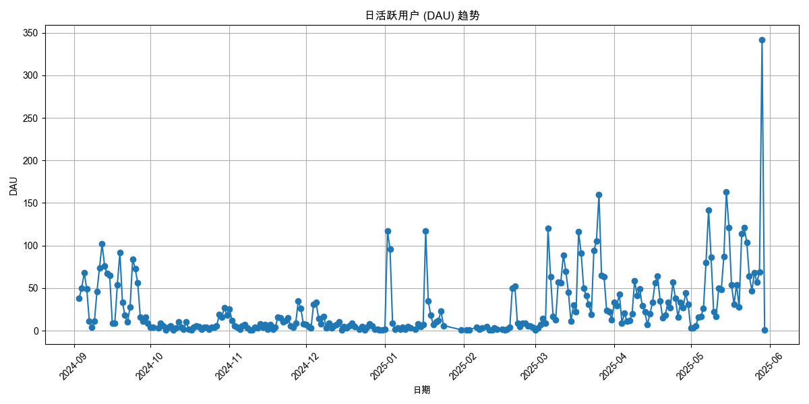
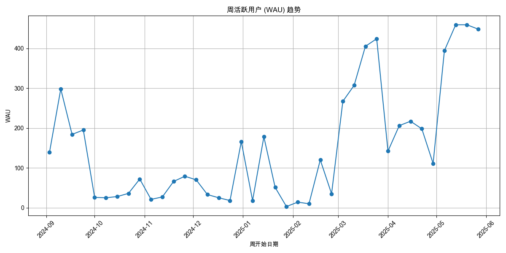
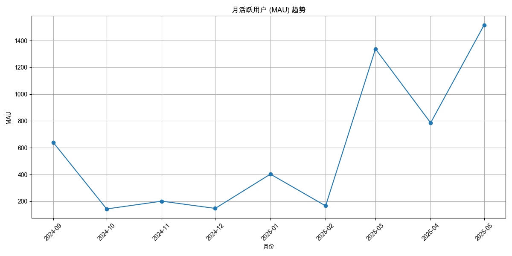

# 用户活跃度分析报告

报告生成于: 2025-05-30 18:47:05

## 分析目标
本报告提供用户活跃度的洞察，主要关注：
- 日活跃用户 (DAU)
- 周活跃用户 (WAU)
- 月活跃用户 (MAU)

## 数据来源
- 输入数据文件: `filtered_online_data.xlsx` (路径: `data_for_analysis/online_data_20250529/filtered_data/filtered_online_data.xlsx`)

## 日活跃用户 (DAU)

| 日期       |   DAU |
|:-----------|------:|
| 2024-09-03 |    38 |
| 2024-09-04 |    50 |
| 2024-09-05 |    68 |
| 2024-09-06 |    49 |
| 2024-09-07 |    11 |
| 2024-09-08 |     4 |
| 2024-09-09 |    11 |
| 2024-09-10 |    46 |
| 2024-09-11 |    74 |
| 2024-09-12 |   102 |
| 2024-09-13 |    76 |
| 2024-09-14 |    67 |
| 2024-09-15 |    65 |
| 2024-09-16 |     9 |
| 2024-09-17 |     9 |
| 2024-09-18 |    54 |
| 2024-09-19 |    92 |
| 2024-09-20 |    33 |
| 2024-09-21 |    18 |
| 2024-09-22 |    10 |
| 2024-09-23 |    28 |
| 2024-09-24 |    84 |
| 2024-09-25 |    73 |
| 2024-09-26 |    56 |
| 2024-09-27 |    16 |
| 2024-09-28 |    11 |
| 2024-09-29 |    16 |
| 2024-09-30 |     9 |
| 2024-10-01 |     4 |
| 2024-10-02 |     4 |
| 2024-10-04 |     3 |
| 2024-10-05 |     9 |
| 2024-10-06 |     6 |
| 2024-10-07 |     1 |
| 2024-10-08 |     4 |
| 2024-10-09 |     6 |
| 2024-10-10 |     1 |
| 2024-10-11 |     3 |
| 2024-10-12 |    10 |
| 2024-10-13 |     4 |
| 2024-10-14 |     2 |
| 2024-10-15 |    10 |
| 2024-10-16 |     2 |
| 2024-10-17 |     1 |
| 2024-10-18 |     4 |
| 2024-10-19 |     6 |
| 2024-10-20 |     5 |
| 2024-10-21 |     2 |
| 2024-10-22 |     4 |
| 2024-10-23 |     4 |
| 2024-10-24 |     2 |
| 2024-10-25 |     4 |
| 2024-10-26 |     4 |
| 2024-10-27 |     6 |
| 2024-10-28 |    19 |
| 2024-10-29 |    16 |
| 2024-10-30 |    27 |
| 2024-10-31 |    18 |
| 2024-11-01 |    25 |
| 2024-11-02 |    12 |
| 2024-11-03 |     6 |
| 2024-11-04 |     4 |
| 2024-11-05 |     2 |
| 2024-11-06 |     6 |
| 2024-11-07 |     7 |
| 2024-11-08 |     3 |
| 2024-11-09 |     1 |
| 2024-11-10 |     1 |
| 2024-11-11 |     4 |
| 2024-11-12 |     3 |
| 2024-11-13 |     8 |
| 2024-11-14 |     4 |
| 2024-11-15 |     7 |
| 2024-11-16 |     2 |
| 2024-11-17 |     7 |
| 2024-11-18 |     2 |
| 2024-11-19 |     4 |
| 2024-11-20 |    16 |
| 2024-11-21 |    15 |
| 2024-11-22 |    10 |
| 2024-11-23 |    12 |
| 2024-11-24 |    15 |
| 2024-11-25 |     6 |
| 2024-11-26 |     4 |
| 2024-11-27 |     9 |
| 2024-11-28 |    35 |
| 2024-11-29 |    26 |
| 2024-11-30 |     8 |
| 2024-12-01 |     7 |
| 2024-12-02 |     5 |
| 2024-12-03 |     3 |
| 2024-12-04 |    31 |
| 2024-12-05 |    33 |
| 2024-12-06 |    14 |
| 2024-12-07 |     8 |
| 2024-12-08 |    17 |
| 2024-12-09 |     3 |
| 2024-12-10 |     9 |
| 2024-12-11 |     3 |
| 2024-12-12 |     6 |
| 2024-12-13 |     7 |
| 2024-12-14 |    10 |
| 2024-12-15 |     1 |
| 2024-12-16 |     5 |
| 2024-12-17 |     3 |
| 2024-12-18 |     6 |
| 2024-12-19 |     9 |
| 2024-12-20 |     5 |
| 2024-12-22 |     2 |
| 2024-12-23 |     5 |
| 2024-12-24 |     1 |
| 2024-12-25 |     4 |
| 2024-12-26 |     8 |
| 2024-12-27 |     6 |
| 2024-12-28 |     2 |
| 2024-12-29 |     2 |
| 2024-12-30 |     1 |
| 2024-12-31 |     1 |
| 2025-01-01 |     2 |
| 2025-01-02 |   117 |
| 2025-01-03 |    96 |
| 2025-01-04 |     9 |
| 2025-01-05 |     2 |
| 2025-01-06 |     3 |
| 2025-01-07 |     2 |
| 2025-01-08 |     4 |
| 2025-01-09 |     2 |
| 2025-01-10 |     5 |
| 2025-01-11 |     3 |
| 2025-01-13 |     2 |
| 2025-01-14 |     8 |
| 2025-01-15 |     5 |
| 2025-01-16 |     7 |
| 2025-01-17 |   117 |
| 2025-01-18 |    35 |
| 2025-01-19 |    18 |
| 2025-01-20 |     7 |
| 2025-01-21 |    10 |
| 2025-01-22 |    12 |
| 2025-01-23 |    23 |
| 2025-01-24 |     6 |
| 2025-01-31 |     1 |
| 2025-02-02 |     1 |
| 2025-02-03 |     1 |
| 2025-02-06 |     4 |
| 2025-02-07 |     2 |
| 2025-02-08 |     3 |
| 2025-02-10 |     5 |
| 2025-02-11 |     1 |
| 2025-02-12 |     1 |
| 2025-02-13 |     3 |
| 2025-02-14 |     2 |
| 2025-02-16 |     2 |
| 2025-02-17 |     1 |
| 2025-02-18 |     2 |
| 2025-02-19 |     4 |
| 2025-02-20 |    50 |
| 2025-02-21 |    52 |
| 2025-02-22 |     9 |
| 2025-02-23 |     5 |
| 2025-02-24 |     9 |
| 2025-02-25 |     9 |
| 2025-02-26 |     6 |
| 2025-02-27 |     6 |
| 2025-02-28 |     4 |
| 2025-03-01 |     1 |
| 2025-03-02 |     3 |
| 2025-03-03 |     7 |
| 2025-03-04 |    14 |
| 2025-03-05 |     9 |
| 2025-03-06 |   120 |
| 2025-03-07 |    63 |
| 2025-03-08 |    17 |
| 2025-03-09 |    13 |
| 2025-03-10 |    57 |
| 2025-03-11 |    56 |
| 2025-03-12 |    89 |
| 2025-03-13 |    70 |
| 2025-03-14 |    45 |
| 2025-03-15 |    11 |
| 2025-03-16 |    30 |
| 2025-03-17 |    22 |
| 2025-03-18 |   116 |
| 2025-03-19 |    91 |
| 2025-03-20 |    50 |
| 2025-03-21 |    41 |
| 2025-03-22 |    31 |
| 2025-03-23 |    19 |
| 2025-03-24 |    94 |
| 2025-03-25 |   105 |
| 2025-03-26 |   160 |
| 2025-03-27 |    65 |
| 2025-03-28 |    63 |
| 2025-03-29 |    24 |
| 2025-03-30 |    22 |
| 2025-03-31 |    13 |
| 2025-04-01 |    33 |
| 2025-04-02 |    29 |
| 2025-04-03 |    43 |
| 2025-04-04 |     9 |
| 2025-04-05 |    21 |
| 2025-04-06 |    11 |
| 2025-04-07 |    12 |
| 2025-04-08 |    20 |
| 2025-04-09 |    59 |
| 2025-04-10 |    41 |
| 2025-04-11 |    49 |
| 2025-04-12 |    29 |
| 2025-04-13 |    22 |
| 2025-04-14 |     7 |
| 2025-04-15 |    20 |
| 2025-04-16 |    33 |
| 2025-04-17 |    56 |
| 2025-04-18 |    64 |
| 2025-04-19 |    35 |
| 2025-04-20 |    15 |
| 2025-04-21 |    18 |
| 2025-04-22 |    33 |
| 2025-04-23 |    27 |
| 2025-04-24 |    57 |
| 2025-04-25 |    38 |
| 2025-04-26 |    16 |
| 2025-04-27 |    33 |
| 2025-04-28 |    27 |
| 2025-04-29 |    44 |
| 2025-04-30 |    31 |
| 2025-05-01 |     3 |
| 2025-05-02 |     3 |
| 2025-05-03 |     6 |
| 2025-05-04 |    16 |
| 2025-05-05 |    17 |
| 2025-05-06 |    26 |
| 2025-05-07 |    80 |
| 2025-05-08 |   142 |
| 2025-05-09 |    86 |
| 2025-05-10 |    22 |
| 2025-05-11 |    17 |
| 2025-05-12 |    50 |
| 2025-05-13 |    48 |
| 2025-05-14 |    87 |
| 2025-05-15 |   163 |
| 2025-05-16 |   121 |
| 2025-05-17 |    54 |
| 2025-05-18 |    31 |
| 2025-05-19 |    54 |
| 2025-05-20 |    28 |
| 2025-05-21 |   114 |
| 2025-05-22 |   121 |
| 2025-05-23 |   104 |
| 2025-05-24 |    64 |
| 2025-05-25 |    47 |
| 2025-05-26 |    68 |
| 2025-05-27 |    57 |
| 2025-05-28 |    69 |
| 2025-05-29 |   342 |
| 2025-05-30 |     1 |

## 周活跃用户 (WAU)

| 周开始日期   |   WAU |
|:-------------|------:|
| 2024-09-03   |   139 |
| 2024-09-10   |   298 |
| 2024-09-17   |   184 |
| 2024-09-24   |   195 |
| 2024-10-01   |    26 |
| 2024-10-08   |    25 |
| 2024-10-15   |    28 |
| 2024-10-22   |    36 |
| 2024-10-29   |    72 |
| 2024-11-05   |    21 |
| 2024-11-12   |    27 |
| 2024-11-19   |    66 |
| 2024-11-26   |    79 |
| 2024-12-03   |    70 |
| 2024-12-10   |    33 |
| 2024-12-17   |    25 |
| 2024-12-24   |    18 |
| 2024-12-31   |   166 |
| 2025-01-07   |    18 |
| 2025-01-14   |   178 |
| 2025-01-21   |    51 |
| 2025-01-28   |     3 |
| 2025-02-04   |    14 |
| 2025-02-11   |    10 |
| 2025-02-18   |   120 |
| 2025-02-25   |    35 |
| 2025-03-04   |   267 |
| 2025-03-11   |   307 |
| 2025-03-18   |   405 |
| 2025-03-25   |   424 |
| 2025-04-01   |   142 |
| 2025-04-08   |   206 |
| 2025-04-15   |   217 |
| 2025-04-22   |   198 |
| 2025-04-29   |   111 |
| 2025-05-06   |   394 |
| 2025-05-13   |   459 |
| 2025-05-20   |   459 |
| 2025-05-27   |   448 |

## 月活跃用户 (MAU)

| 月份       |   MAU |
|:-----------|------:|
| 2024-09-01 |   640 |
| 2024-10-01 |   143 |
| 2024-11-01 |   201 |
| 2024-12-01 |   147 |
| 2025-01-01 |   403 |
| 2025-02-01 |   166 |
| 2025-03-01 |  1338 |
| 2025-04-01 |   786 |
| 2025-05-01 |  1516 |

## 输出文件
- DAU 数据: `daily_active_users.xlsx` (路径: `data_for_analysis/online_data_20250529/basic_analysis_outputs/user_activity_analysis/daily_active_users.xlsx`)
- WAU 数据: `weekly_active_users.xlsx` (路径: `data_for_analysis/online_data_20250529/basic_analysis_outputs/user_activity_analysis/weekly_active_users.xlsx`)
- MAU 数据: `monthly_active_users.xlsx` (路径: `data_for_analysis/online_data_20250529/basic_analysis_outputs/user_activity_analysis/monthly_active_users.xlsx`)
- 本报告: `user_activity_report.md` (路径: `data_for_analysis/online_data_20250529/basic_analysis_outputs/user_activity_analysis/user_activity_report.md`)

## 深度分析

### 1. 整体趋势分析
- **长期增长显著**: 从月活跃用户（MAU）数据看，产品用户基础呈现强劲的增长态势，尤其在2025年第一季度末至第二季度初（3月至5月），MAU从1338人激增至1516人，表明此期间产品推广或内容更新可能取得了显著成效。
- **用户活跃度波动性大**: 日活跃用户（DAU）数据表现出极高的波动性。工作日用户量远高于周末，这符合企业级（B2B）或学习型产品的使用特征。这提示我们，运营活动和内容推送应重点安排在工作日以获得最大曝光。
- **周期性低谷**: 在2024年10月、12月末至2025年2月初期间，用户活跃度显著下降。这可能与国庆节、元旦及春节等长假有关，符合用户在节假日期间活跃度降低的普遍规律。在制定未来运营计划时应将此因素纳入考量。

### 2. 关键波动归因分析 (需结合业务事件验证)
根据 `basic_analysis_objective.md` 的要求，我们识别出几个关键的DAU峰值，这些节点很可能与特定的运营活动、产品更新或新内容发布相关：
- **`2025-03-26` (DAU: 160)**: 这是3月份的最高点，当月MAU也达到了1338的历史高位。
- **`2025-05-15` (DAU: 163)**: 5月份的一个显著高峰。
- **`2025-05-29` (DAU: 342)**: 数据期内的绝对峰值，当日活跃用户数远超平均水平，是正常工作日DAU（约50-100）的3-6倍。

**建议**:
- **深入调查峰值事件**: 强烈建议与市场或产品团队核对在`2025-03-26`、`2025-05-15`及特别是`2025-05-29`前后是否有新版本发布、全员推广邮件、组织培训或引入了热门新剧本等事件。理解这些增长引擎是复制成功和制定未来策略的关键。
- **监控用户粘性**: 2025年5月的WAU/MAU比率约为 **29%** (平均WAU 440 / MAU 1516)。这意味着月活跃用户中，平均每周有约29%的用户会回访。这是一个评估用户粘性的良好基线，后续可通过提升内容质量、增加提醒推送等方式，观察该比例的变化，以衡量产品对用户的吸引力是否增强。

### 3. 总结与后续步骤
用户活跃度总体向好，但日常活跃度不稳定。未来的分析应致力于将用户行为与具体的产品版本、运营活动和内容更新进行关联分析，以更精确地评估各项举措的效果。同时，建立一个事件日历（记录版本发布、运营活动等），用于与用户数据进行对照分析，将是实现"波动归因自动化初步分析"目标的重要一步。
