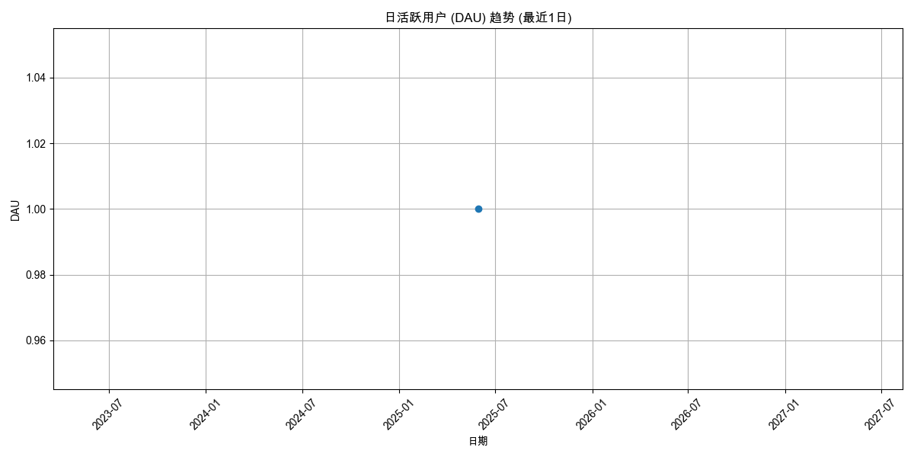

# 用户活跃度分析报告 (最近1日)

报告生成于: 2025-06-09 17:07:51

## 分析目标
本报告提供用户活跃度的洞察，主要关注：
- 日活跃用户 (DAU)
- 周活跃用户 (WAU)
- 月活跃用户 (MAU)

**分析周期**: 最近1日

## 数据来源
- 输入数据文件: `filtered_online_data.xlsx`

## 日活跃用户 (DAU)

| 日期       |   DAU |
|:-----------|------:|
| 2025-05-30 |     1 |

## 周活跃用户 (WAU)

| 周开始日期   |   WAU |
|:-------------|------:|
| 2025-05-27   |     1 |

## 月活跃用户 (MAU)

| 月份       |   MAU |
|:-----------|------:|
| 2025-05-01 |     1 |

## 输出文件
- DAU 数据: `daily_active_users_1d.xlsx`
- WAU 数据: `weekly_active_users_1d.xlsx`
- MAU 数据: `monthly_active_users_1d.xlsx`
- 本报告: `user_activity_report_1d.md`
