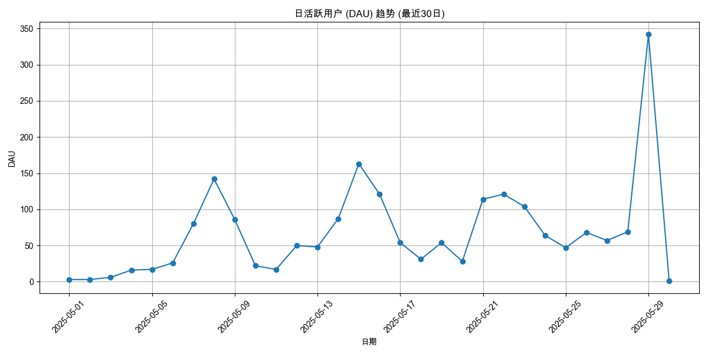

# 用户活跃度分析报告 (最近30日)

报告生成于: 2025-06-09 17:47:36

## 分析目标
本报告提供用户活跃度的洞察，主要关注：
- 日活跃用户 (DAU)
- 周活跃用户 (WAU)
- 月活跃用户 (MAU)

**分析周期**: 最近30日

## 数据来源
- 输入数据文件: `filtered_online_data.xlsx`

## 日活跃用户 (DAU)

| 日期       |   DAU |
|:-----------|------:|
| 2025-05-01 |     3 |
| 2025-05-02 |     3 |
| 2025-05-03 |     6 |
| 2025-05-04 |    16 |
| 2025-05-05 |    17 |
| 2025-05-06 |    26 |
| 2025-05-07 |    80 |
| 2025-05-08 |   142 |
| 2025-05-09 |    86 |
| 2025-05-10 |    22 |
| 2025-05-11 |    17 |
| 2025-05-12 |    50 |
| 2025-05-13 |    48 |
| 2025-05-14 |    87 |
| 2025-05-15 |   163 |
| 2025-05-16 |   121 |
| 2025-05-17 |    54 |
| 2025-05-18 |    31 |
| 2025-05-19 |    54 |
| 2025-05-20 |    28 |
| 2025-05-21 |   114 |
| 2025-05-22 |   121 |
| 2025-05-23 |   104 |
| 2025-05-24 |    64 |
| 2025-05-25 |    47 |
| 2025-05-26 |    68 |
| 2025-05-27 |    57 |
| 2025-05-28 |    69 |
| 2025-05-29 |   342 |
| 2025-05-30 |     1 |

## 周活跃用户 (WAU)

| 周开始日期   |   WAU |
|:-------------|------:|
| 2025-04-29   |    42 |
| 2025-05-06   |   394 |
| 2025-05-13   |   459 |
| 2025-05-20   |   459 |
| 2025-05-27   |   448 |

## 月活跃用户 (MAU)

| 月份       |   MAU |
|:-----------|------:|
| 2025-05-01 |  1516 |

## 输出文件
- DAU 数据: `daily_active_users_30d.xlsx`
- WAU 数据: `weekly_active_users_30d.xlsx`
- MAU 数据: `monthly_active_users_30d.xlsx`
- 本报告: `user_activity_report_30d.md`
