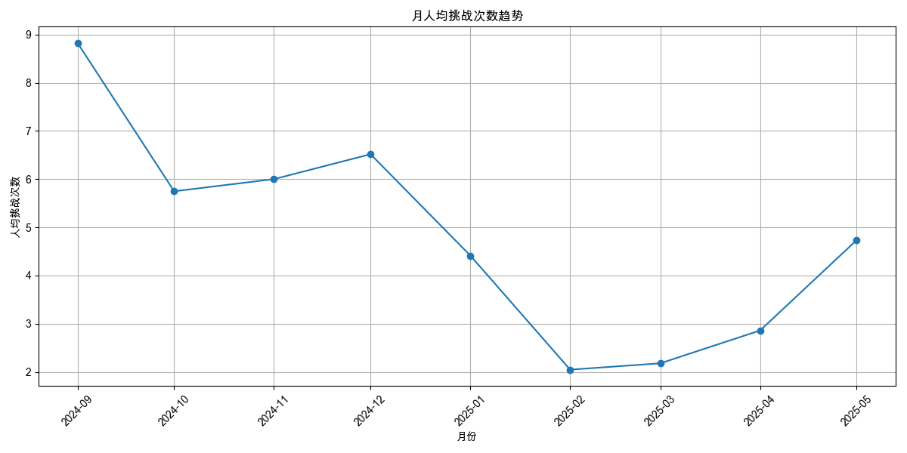

# 用户参与度分析报告

报告生成于: 2025-05-30 18:47:29

## 分析目标
本报告提供用户参与度的洞察，主要关注：
- 人均挑战次数 (日/周/月)
- 人均挑战时长（分钟） (日/周/月)

## 数据来源
- 输入数据文件: `filtered_online_data.xlsx` (路径: `data_for_analysis/online_data_20250529/filtered_data/filtered_online_data.xlsx`)

### 人均挑战次数
#### 日人均挑战次数

| 日期       |   人均挑战次数 |   总用户数 |   总挑战次数 |
|:-----------|---------------:|-----------:|-------------:|
| 2024-09-03 |        4.60526 |         38 |          175 |
| 2024-09-04 |        4.12    |         50 |          206 |
| 2024-09-05 |        5.69118 |         68 |          387 |
| 2024-09-06 |        6.10204 |         49 |          299 |
| 2024-09-07 |        3.81818 |         11 |           42 |
| 2024-09-08 |        1       |          4 |            4 |
| 2024-09-09 |        2.90909 |         11 |           32 |
| 2024-09-10 |        3.76087 |         46 |          173 |
| 2024-09-11 |        4.2027  |         74 |          311 |
| 2024-09-12 |        5.84314 |        102 |          596 |
| 2024-09-13 |        3.60526 |         76 |          274 |
| 2024-09-14 |        6.04478 |         67 |          405 |
| 2024-09-15 |        5.81538 |         65 |          378 |
| 2024-09-16 |        4       |          9 |           36 |
| 2024-09-17 |        2.55556 |          9 |           23 |
| 2024-09-18 |        5.22222 |         54 |          282 |
| 2024-09-19 |        5.56522 |         92 |          512 |
| 2024-09-20 |        3.18182 |         33 |          105 |
| 2024-09-21 |        1.94444 |         18 |           35 |
| 2024-09-22 |        3       |         10 |           30 |
| 2024-09-23 |        4.78571 |         28 |          134 |
| 2024-09-24 |        4.61905 |         84 |          388 |
| 2024-09-25 |        4.83562 |         73 |          353 |
| 2024-09-26 |        4.94643 |         56 |          277 |
| 2024-09-27 |        3.6875  |         16 |           59 |
| 2024-09-28 |        2.45455 |         11 |           27 |
| 2024-09-29 |        4.6875  |         16 |           75 |
| 2024-09-30 |        3.22222 |          9 |           29 |
| 2024-10-01 |        1       |          4 |            4 |
| 2024-10-02 |        2.75    |          4 |           11 |
| 2024-10-04 |        1       |          3 |            3 |
| 2024-10-05 |        3       |          9 |           27 |
| 2024-10-06 |        3       |          6 |           18 |
| 2024-10-07 |        1       |          1 |            1 |
| 2024-10-08 |        4.75    |          4 |           19 |
| 2024-10-09 |        2.16667 |          6 |           13 |
| 2024-10-10 |        2       |          1 |            2 |
| 2024-10-11 |        4.33333 |          3 |           13 |
| 2024-10-12 |        2.7     |         10 |           27 |
| 2024-10-13 |        2.25    |          4 |            9 |
| 2024-10-14 |        2.5     |          2 |            5 |
| 2024-10-15 |        2.6     |         10 |           26 |
| 2024-10-16 |        2       |          2 |            4 |
| 2024-10-17 |        1       |          1 |            1 |
| 2024-10-18 |        1       |          4 |            4 |
| 2024-10-19 |        1.66667 |          6 |           10 |
| 2024-10-20 |        1       |          5 |            5 |
| 2024-10-21 |        7.5     |          2 |           15 |
| 2024-10-22 |        1.5     |          4 |            6 |
| 2024-10-23 |        1.25    |          4 |            5 |
| 2024-10-24 |        3.5     |          2 |            7 |
| 2024-10-25 |        3       |          4 |           12 |
| 2024-10-26 |        5.25    |          4 |           21 |
| 2024-10-27 |        2.83333 |          6 |           17 |
| 2024-10-28 |        7.15789 |         19 |          136 |
| 2024-10-29 |        5.3125  |         16 |           85 |
| 2024-10-30 |        5.2963  |         27 |          143 |
| 2024-10-31 |        9.61111 |         18 |          173 |
| 2024-11-01 |        5.28    |         25 |          132 |
| 2024-11-02 |        2.66667 |         12 |           32 |
| 2024-11-03 |        1.16667 |          6 |            7 |
| 2024-11-04 |        1       |          4 |            4 |
| 2024-11-05 |        1       |          2 |            2 |
| 2024-11-06 |        2.83333 |          6 |           17 |
| 2024-11-07 |        3.42857 |          7 |           24 |
| 2024-11-08 |        1.33333 |          3 |            4 |
| 2024-11-09 |        1       |          1 |            1 |
| 2024-11-10 |        1       |          1 |            1 |
| 2024-11-11 |        5       |          4 |           20 |
| 2024-11-12 |        1.66667 |          3 |            5 |
| 2024-11-13 |        1.625   |          8 |           13 |
| 2024-11-14 |        4.25    |          4 |           17 |
| 2024-11-15 |        7.85714 |          7 |           55 |
| 2024-11-16 |        1.5     |          2 |            3 |
| 2024-11-17 |        7       |          7 |           49 |
| 2024-11-18 |        6       |          2 |           12 |
| 2024-11-19 |        1       |          4 |            4 |
| 2024-11-20 |        2.1875  |         16 |           35 |
| 2024-11-21 |        3.46667 |         15 |           52 |
| 2024-11-22 |        4.3     |         10 |           43 |
| 2024-11-23 |        4.75    |         12 |           57 |
| 2024-11-24 |        9.4     |         15 |          141 |
| 2024-11-25 |        4.66667 |          6 |           28 |
| 2024-11-26 |        1.5     |          4 |            6 |
| 2024-11-27 |        7.66667 |          9 |           69 |
| 2024-11-28 |        7.08571 |         35 |          248 |
| 2024-11-29 |        3.57692 |         26 |           93 |
| 2024-11-30 |        4       |          8 |           32 |
| 2024-12-01 |        4       |          7 |           28 |
| 2024-12-02 |        5.2     |          5 |           26 |
| 2024-12-03 |        5.33333 |          3 |           16 |
| 2024-12-04 |        3.09677 |         31 |           96 |
| 2024-12-05 |        2.48485 |         33 |           82 |
| 2024-12-06 |        2.85714 |         14 |           40 |
| 2024-12-07 |        4.125   |          8 |           33 |
| 2024-12-08 |        5.29412 |         17 |           90 |
| 2024-12-09 |        6.66667 |          3 |           20 |
| 2024-12-10 |        6.77778 |          9 |           61 |
| 2024-12-11 |        6.66667 |          3 |           20 |
| 2024-12-12 |        8.83333 |          6 |           53 |
| 2024-12-13 |        3.14286 |          7 |           22 |
| 2024-12-14 |        4.2     |         10 |           42 |
| 2024-12-15 |        2       |          1 |            2 |
| 2024-12-16 |        3       |          5 |           15 |
| 2024-12-17 |        1.66667 |          3 |            5 |
| 2024-12-18 |       11       |          6 |           66 |
| 2024-12-19 |        4.77778 |          9 |           43 |
| 2024-12-20 |        6.4     |          5 |           32 |
| 2024-12-22 |       12       |          2 |           24 |
| 2024-12-23 |        7       |          5 |           35 |
| 2024-12-24 |        1       |          1 |            1 |
| 2024-12-25 |        4.25    |          4 |           17 |
| 2024-12-26 |        5       |          8 |           40 |
| 2024-12-27 |        2.83333 |          6 |           17 |
| 2024-12-28 |        3.5     |          2 |            7 |
| 2024-12-29 |        6.5     |          2 |           13 |
| 2024-12-30 |       11       |          1 |           11 |
| 2024-12-31 |        1       |          1 |            1 |
| 2025-01-01 |        3       |          2 |            6 |
| 2025-01-02 |        6.2735  |        117 |          734 |
| 2025-01-03 |        5.15625 |         96 |          495 |
| 2025-01-04 |        2.88889 |          9 |           26 |
| 2025-01-05 |        5       |          2 |           10 |
| 2025-01-06 |        1.33333 |          3 |            4 |
| 2025-01-07 |        1       |          2 |            2 |
| 2025-01-08 |        2.25    |          4 |            9 |
| 2025-01-09 |        1       |          2 |            2 |
| 2025-01-10 |        1.4     |          5 |            7 |
| 2025-01-11 |        1       |          3 |            3 |
| 2025-01-13 |        2       |          2 |            4 |
| 2025-01-14 |        1.75    |          8 |           14 |
| 2025-01-15 |        5.2     |          5 |           26 |
| 2025-01-16 |        5.14286 |          7 |           36 |
| 2025-01-17 |        1.69231 |        117 |          198 |
| 2025-01-18 |        2.08571 |         35 |           73 |
| 2025-01-19 |        2.16667 |         18 |           39 |
| 2025-01-20 |        1.57143 |          7 |           11 |
| 2025-01-21 |        1.4     |         10 |           14 |
| 2025-01-22 |        1.33333 |         12 |           16 |
| 2025-01-23 |        1.73913 |         23 |           40 |
| 2025-01-24 |        1.33333 |          6 |            8 |
| 2025-01-31 |        2       |          1 |            2 |
| 2025-02-02 |        1       |          1 |            1 |
| 2025-02-03 |        2       |          1 |            2 |
| 2025-02-06 |        1.75    |          4 |            7 |
| 2025-02-07 |        1       |          2 |            2 |
| 2025-02-08 |        1.33333 |          3 |            4 |
| 2025-02-10 |        1.2     |          5 |            6 |
| 2025-02-11 |        1       |          1 |            1 |
| 2025-02-12 |        3       |          1 |            3 |
| 2025-02-13 |        1.66667 |          3 |            5 |
| 2025-02-14 |        1       |          2 |            2 |
| 2025-02-16 |        1       |          2 |            2 |
| 2025-02-17 |        2       |          1 |            2 |
| 2025-02-18 |        1       |          2 |            2 |
| 2025-02-19 |        1.75    |          4 |            7 |
| 2025-02-20 |        1.42    |         50 |           71 |
| 2025-02-21 |        1.78846 |         52 |           93 |
| 2025-02-22 |        2.55556 |          9 |           23 |
| 2025-02-23 |        1.8     |          5 |            9 |
| 2025-02-24 |        2.66667 |          9 |           24 |
| 2025-02-25 |        3.44444 |          9 |           31 |
| 2025-02-26 |        2.5     |          6 |           15 |
| 2025-02-27 |        3.5     |          6 |           21 |
| 2025-02-28 |        1.75    |          4 |            7 |
| 2025-03-01 |        3       |          1 |            3 |
| 2025-03-02 |       16       |          3 |           48 |
| 2025-03-03 |        2       |          7 |           14 |
| 2025-03-04 |        1.71429 |         14 |           24 |
| 2025-03-05 |        4.55556 |          9 |           41 |
| 2025-03-06 |        1.95833 |        120 |          235 |
| 2025-03-07 |        2.03175 |         63 |          128 |
| 2025-03-08 |        2.64706 |         17 |           45 |
| 2025-03-09 |        1.76923 |         13 |           23 |
| 2025-03-10 |        1.80702 |         57 |          103 |
| 2025-03-11 |        1.60714 |         56 |           90 |
| 2025-03-12 |        1.66292 |         89 |          148 |
| 2025-03-13 |        1.48571 |         70 |          104 |
| 2025-03-14 |        2.42222 |         45 |          109 |
| 2025-03-15 |        5.09091 |         11 |           56 |
| 2025-03-16 |        1.83333 |         30 |           55 |
| 2025-03-17 |        1.59091 |         22 |           35 |
| 2025-03-18 |        2.03448 |        116 |          236 |
| 2025-03-19 |        1.81319 |         91 |          165 |
| 2025-03-20 |        1.68    |         50 |           84 |
| 2025-03-21 |        2.63415 |         41 |          108 |
| 2025-03-22 |        1.87097 |         31 |           58 |
| 2025-03-23 |        3       |         19 |           57 |
| 2025-03-24 |        1.64894 |         94 |          155 |
| 2025-03-25 |        1.66667 |        105 |          175 |
| 2025-03-26 |        1.60625 |        160 |          257 |
| 2025-03-27 |        1.69231 |         65 |          110 |
| 2025-03-28 |        1.87302 |         63 |          118 |
| 2025-03-29 |        1.66667 |         24 |           40 |
| 2025-03-30 |        2.86364 |         22 |           63 |
| 2025-03-31 |        2.30769 |         13 |           30 |
| 2025-04-01 |        2.39394 |         33 |           79 |
| 2025-04-02 |        1.68966 |         29 |           49 |
| 2025-04-03 |        1.81395 |         43 |           78 |
| 2025-04-04 |        2.44444 |          9 |           22 |
| 2025-04-05 |        2.52381 |         21 |           53 |
| 2025-04-06 |        1.54545 |         11 |           17 |
| 2025-04-07 |        2.83333 |         12 |           34 |
| 2025-04-08 |        1.85    |         20 |           37 |
| 2025-04-09 |        2.38983 |         59 |          141 |
| 2025-04-10 |        2.43902 |         41 |          100 |
| 2025-04-11 |        2.30612 |         49 |          113 |
| 2025-04-12 |        1.93103 |         29 |           56 |
| 2025-04-13 |        2.59091 |         22 |           57 |
| 2025-04-14 |        1.85714 |          7 |           13 |
| 2025-04-15 |        1.45    |         20 |           29 |
| 2025-04-16 |        2.39394 |         33 |           79 |
| 2025-04-17 |        2.03571 |         56 |          114 |
| 2025-04-18 |        2.46875 |         64 |          158 |
| 2025-04-19 |        2.25714 |         35 |           79 |
| 2025-04-20 |        2.8     |         15 |           42 |
| 2025-04-21 |        2.27778 |         18 |           41 |
| 2025-04-22 |        1.87879 |         33 |           62 |
| 2025-04-23 |        2.14815 |         27 |           58 |
| 2025-04-24 |        1.54386 |         57 |           88 |
| 2025-04-25 |        1.71053 |         38 |           65 |
| 2025-04-26 |        3.5625  |         16 |           57 |
| 2025-04-27 |        5.78788 |         33 |          191 |
| 2025-04-28 |        4.11111 |         27 |          111 |
| 2025-04-29 |        3.47727 |         44 |          153 |
| 2025-04-30 |        2.35484 |         31 |           73 |
| 2025-05-01 |        2.33333 |          3 |            7 |
| 2025-05-02 |        1.66667 |          3 |            5 |
| 2025-05-03 |        4       |          6 |           24 |
| 2025-05-04 |        5.125   |         16 |           82 |
| 2025-05-05 |        2.64706 |         17 |           45 |
| 2025-05-06 |        2.5     |         26 |           65 |
| 2025-05-07 |        3.0625  |         80 |          245 |
| 2025-05-08 |        2.14085 |        142 |          304 |
| 2025-05-09 |        3.10465 |         86 |          267 |
| 2025-05-10 |        2.18182 |         22 |           48 |
| 2025-05-11 |        1.76471 |         17 |           30 |
| 2025-05-12 |        2.86    |         50 |          143 |
| 2025-05-13 |        2.29167 |         48 |          110 |
| 2025-05-14 |        2.73563 |         87 |          238 |
| 2025-05-15 |        3.07975 |        163 |          502 |
| 2025-05-16 |        3.24793 |        121 |          393 |
| 2025-05-17 |        4.09259 |         54 |          221 |
| 2025-05-18 |        4.09677 |         31 |          127 |
| 2025-05-19 |        5.01852 |         54 |          271 |
| 2025-05-20 |        5       |         28 |          140 |
| 2025-05-21 |        3.47368 |        114 |          396 |
| 2025-05-22 |        3.87603 |        121 |          469 |
| 2025-05-23 |        3.27885 |        104 |          341 |
| 2025-05-24 |        3.40625 |         64 |          218 |
| 2025-05-25 |        2.89362 |         47 |          136 |
| 2025-05-26 |        7.85294 |         68 |          534 |
| 2025-05-27 |        5.57895 |         57 |          318 |
| 2025-05-28 |        8.68116 |         69 |          599 |
| 2025-05-29 |        2.6345  |        342 |          901 |
| 2025-05-30 |        1       |          1 |            1 |

#### 周人均挑战次数

| 周开始日期   |   人均挑战次数 |   总用户数 |   总挑战次数 |
|:-------------|---------------:|-----------:|-------------:|
| 2024-09-03   |        8.23741 |        139 |         1145 |
| 2024-09-10   |        7.29195 |        298 |         2173 |
| 2024-09-17   |        6.09239 |        184 |         1121 |
| 2024-09-24   |        6.19487 |        195 |         1208 |
| 2024-10-01   |        2.46154 |         26 |           64 |
| 2024-10-08   |        3.52    |         25 |           88 |
| 2024-10-15   |        2.32143 |         28 |           65 |
| 2024-10-22   |        5.66667 |         36 |          204 |
| 2024-10-29   |        8       |         72 |          576 |
| 2024-11-05   |        3.28571 |         21 |           69 |
| 2024-11-12   |        5.7037  |         27 |          154 |
| 2024-11-19   |        5.45455 |         66 |          360 |
| 2024-11-26   |        6.35443 |         79 |          502 |
| 2024-12-03   |        5.38571 |         70 |          377 |
| 2024-12-10   |        6.51515 |         33 |          215 |
| 2024-12-17   |        8.2     |         25 |          205 |
| 2024-12-24   |        5.88889 |         18 |          106 |
| 2024-12-31   |        7.68675 |        166 |         1276 |
| 2025-01-07   |        1.5     |         18 |           27 |
| 2025-01-14   |        2.23034 |        178 |          397 |
| 2025-01-21   |        1.52941 |         51 |           78 |
| 2025-01-28   |        1.66667 |          3 |            5 |
| 2025-02-04   |        1.35714 |         14 |           19 |
| 2025-02-11   |        1.5     |         10 |           15 |
| 2025-02-18   |        1.90833 |        120 |          229 |
| 2025-02-25   |        3.97143 |         35 |          139 |
| 2025-03-04   |        2.24345 |        267 |          599 |
| 2025-03-11   |        1.94463 |        307 |          597 |
| 2025-03-18   |        2.13086 |        405 |          863 |
| 2025-03-25   |        1.87028 |        424 |          793 |
| 2025-04-01   |        2.33803 |        142 |          332 |
| 2025-04-08   |        2.50971 |        206 |          517 |
| 2025-04-15   |        2.4977  |        217 |          542 |
| 2025-04-22   |        3.19192 |        198 |          632 |
| 2025-04-29   |        3.5045  |        111 |          389 |
| 2025-05-06   |        2.79695 |        394 |         1102 |
| 2025-05-13   |        4.05664 |        459 |         1862 |
| 2025-05-20   |        4.8671  |        459 |         2234 |
| 2025-05-27   |        4.06027 |        448 |         1819 |

#### 月人均挑战次数

| 月份       |   人均挑战次数 |   总用户数 |   总挑战次数 |
|:-----------|---------------:|-----------:|-------------:|
| 2024-09-01 |        8.82344 |        640 |         5647 |
| 2024-10-01 |        5.74825 |        143 |          822 |
| 2024-11-01 |        6       |        201 |         1206 |
| 2024-12-01 |        6.51701 |        147 |          958 |
| 2025-01-01 |        4.41439 |        403 |         1779 |
| 2025-02-01 |        2.04819 |        166 |          340 |
| 2025-03-01 |        2.18012 |       1338 |         2917 |
| 2025-04-01 |        2.86132 |        786 |         2249 |
| 2025-05-01 |        4.73615 |       1516 |         7180 |

### 人均挑战时长（分钟）
#### 日人均挑战时长

| 日期       |   人均挑战时长（分钟） |   参与时长计算用户数 |   总挑战时长（分钟） |
|:-----------|-----------------------:|---------------------:|---------------------:|
| 2024-09-03 |             16.6101    |                   38 |           631.183    |
| 2024-09-04 |             17.1877    |                   50 |           859.383    |
| 2024-09-05 |             28.3708    |                   68 |          1929.22     |
| 2024-09-06 |             37.2554    |                   49 |          1825.52     |
| 2024-09-07 |             12.7348    |                   11 |           140.083    |
| 2024-09-08 |              0.975     |                    4 |             3.9      |
| 2024-09-09 |             14         |                   11 |           154        |
| 2024-09-10 |             18.2221    |                   46 |           838.217    |
| 2024-09-11 |             19.6655    |                   74 |          1455.25     |
| 2024-09-12 |             32.3629    |                  102 |          3301.02     |
| 2024-09-13 |             21.7132    |                   76 |          1650.2      |
| 2024-09-14 |             37.9294    |                   67 |          2541.27     |
| 2024-09-15 |             35.8049    |                   65 |          2327.32     |
| 2024-09-16 |             20.9093    |                    9 |           188.183    |
| 2024-09-17 |             19.1204    |                    9 |           172.083    |
| 2024-09-18 |             40.5253    |                   54 |          2188.37     |
| 2024-09-19 |             37.0509    |                   92 |          3408.68     |
| 2024-09-20 |             21.347     |                   33 |           704.45     |
| 2024-09-21 |             24.7574    |                   18 |           445.633    |
| 2024-09-22 |             43.1833    |                   10 |           431.833    |
| 2024-09-23 |             37.5702    |                   28 |          1051.97     |
| 2024-09-24 |             29.1714    |                   84 |          2450.4      |
| 2024-09-25 |             41.5475    |                   73 |          3032.97     |
| 2024-09-26 |             32.533     |                   56 |          1821.85     |
| 2024-09-27 |             36.1625    |                   16 |           578.6      |
| 2024-09-28 |             10.6803    |                   11 |           117.483    |
| 2024-09-29 |             30.0479    |                   16 |           480.767    |
| 2024-09-30 |             14.9593    |                    9 |           134.633    |
| 2024-10-01 |              1.56667   |                    4 |             6.26667  |
| 2024-10-02 |              6.125     |                    4 |            24.5      |
| 2024-10-04 |              0.0555556 |                    3 |             0.166667 |
| 2024-10-05 |             18.0852    |                    9 |           162.767    |
| 2024-10-06 |             10.6806    |                    6 |            64.0833   |
| 2024-10-07 |              7.4       |                    1 |             7.4      |
| 2024-10-08 |             26.1958    |                    4 |           104.783    |
| 2024-10-09 |              3.875     |                    6 |            23.25     |
| 2024-10-10 |              0         |                    1 |             0        |
| 2024-10-11 |             26.4778    |                    3 |            79.4333   |
| 2024-10-12 |              7.11833   |                   10 |            71.1833   |
| 2024-10-13 |              6.65      |                    4 |            26.6      |
| 2024-10-14 |             12.1083    |                    2 |            24.2167   |
| 2024-10-15 |              6.75167   |                   10 |            67.5167   |
| 2024-10-16 |              8.825     |                    2 |            17.65     |
| 2024-10-17 |              0         |                    1 |             0        |
| 2024-10-18 |              4.08333   |                    4 |            16.3333   |
| 2024-10-19 |              6.03333   |                    6 |            36.2      |
| 2024-10-20 |              0.416667  |                    5 |             2.08333  |
| 2024-10-21 |             22.6333    |                    2 |            45.2667   |
| 2024-10-22 |              6.12083   |                    4 |            24.4833   |
| 2024-10-23 |              8.95417   |                    4 |            35.8167   |
| 2024-10-24 |             50.7917    |                    2 |           101.583    |
| 2024-10-25 |             19.2292    |                    4 |            76.9167   |
| 2024-10-26 |             22.3833    |                    4 |            89.5333   |
| 2024-10-27 |              5.29444   |                    6 |            31.7667   |
| 2024-10-28 |             65.2132    |                   19 |          1239.05     |
| 2024-10-29 |             24.6187    |                   16 |           393.9      |
| 2024-10-30 |             37.5975    |                   27 |          1015.13     |
| 2024-10-31 |             73.7981    |                   18 |          1328.37     |
| 2024-11-01 |             36.996     |                   25 |           924.9      |
| 2024-11-02 |             42.9917    |                   12 |           515.9      |
| 2024-11-03 |             15.9       |                    6 |            95.4      |
| 2024-11-04 |              6.4875    |                    4 |            25.95     |
| 2024-11-05 |              3.79167   |                    2 |             7.58333  |
| 2024-11-06 |             28.0194    |                    6 |           168.117    |
| 2024-11-07 |             14.7476    |                    7 |           103.233    |
| 2024-11-08 |              1.5       |                    3 |             4.5      |
| 2024-11-09 |              3.76667   |                    1 |             3.76667  |
| 2024-11-10 |              0.35      |                    1 |             0.35     |
| 2024-11-11 |             58.7       |                    4 |           234.8      |
| 2024-11-12 |              2.18889   |                    3 |             6.56667  |
| 2024-11-13 |              3.79375   |                    8 |            30.35     |
| 2024-11-14 |              3.54167   |                    4 |            14.1667   |
| 2024-11-15 |             70.8333    |                    7 |           495.833    |
| 2024-11-16 |             25.3167    |                    2 |            50.6333   |
| 2024-11-17 |             51.031     |                    7 |           357.217    |
| 2024-11-18 |             49.6833    |                    2 |            99.3667   |
| 2024-11-19 |              2.60833   |                    4 |            10.4333   |
| 2024-11-20 |              5.75104   |                   16 |            92.0167   |
| 2024-11-21 |             25.1689    |                   15 |           377.533    |
| 2024-11-22 |             40.135     |                   10 |           401.35     |
| 2024-11-23 |             42.4583    |                   12 |           509.5      |
| 2024-11-24 |             77.2444    |                   15 |          1158.67     |
| 2024-11-25 |             36.8639    |                    6 |           221.183    |
| 2024-11-26 |             10.9208    |                    4 |            43.6833   |
| 2024-11-27 |             64.3       |                    9 |           578.7      |
| 2024-11-28 |             38.5633    |                   35 |          1349.72     |
| 2024-11-29 |             21.3756    |                   26 |           555.767    |
| 2024-11-30 |             31.475     |                    8 |           251.8      |
| 2024-12-01 |             49.0738    |                    7 |           343.517    |
| 2024-12-02 |             63.46      |                    5 |           317.3      |
| 2024-12-03 |             74.6278    |                    3 |           223.883    |
| 2024-12-04 |             35.7914    |                   31 |          1109.53     |
| 2024-12-05 |             18.547     |                   33 |           612.05     |
| 2024-12-06 |             15.3929    |                   14 |           215.5      |
| 2024-12-07 |             48.8646    |                    8 |           390.917    |
| 2024-12-08 |             61.2059    |                   17 |          1040.5      |
| 2024-12-09 |             49.8222    |                    3 |           149.467    |
| 2024-12-10 |             23.5019    |                    9 |           211.517    |
| 2024-12-11 |             35.45      |                    3 |           106.35     |
| 2024-12-12 |             31.35      |                    6 |           188.1      |
| 2024-12-13 |             12.4929    |                    7 |            87.45     |
| 2024-12-14 |             18.555     |                   10 |           185.55     |
| 2024-12-15 |              2.76667   |                    1 |             2.76667  |
| 2024-12-16 |              9.78333   |                    5 |            48.9167   |
| 2024-12-17 |              8.2       |                    3 |            24.6      |
| 2024-12-18 |             55.2694    |                    6 |           331.617    |
| 2024-12-19 |             23.0148    |                    9 |           207.133    |
| 2024-12-20 |             34.91      |                    5 |           174.55     |
| 2024-12-22 |            163.633     |                    2 |           327.267    |
| 2024-12-23 |             41.65      |                    5 |           208.25     |
| 2024-12-24 |              2.08333   |                    1 |             2.08333  |
| 2024-12-25 |             57.1333    |                    4 |           228.533    |
| 2024-12-26 |             59.275     |                    8 |           474.2      |
| 2024-12-27 |             25.2444    |                    6 |           151.467    |
| 2024-12-28 |            148.967     |                    2 |           297.933    |
| 2024-12-29 |             29.7167    |                    2 |            59.4333   |
| 2024-12-30 |             11.3667    |                    1 |            11.3667   |
| 2024-12-31 |              2.76667   |                    1 |             2.76667  |
| 2025-01-01 |             20.4333    |                    2 |            40.8667   |
| 2025-01-02 |             34.7987    |                  117 |          4071.45     |
| 2025-01-03 |             34.5321    |                   96 |          3315.08     |
| 2025-01-04 |             28.2       |                    9 |           253.8      |
| 2025-01-05 |             22.1833    |                    2 |            44.3667   |
| 2025-01-06 |              0.866667  |                    3 |             2.6      |
| 2025-01-07 |              0.775     |                    2 |             1.55     |
| 2025-01-08 |             11.0208    |                    4 |            44.0833   |
| 2025-01-09 |              0.133333  |                    2 |             0.266667 |
| 2025-01-10 |              5.95333   |                    5 |            29.7667   |
| 2025-01-11 |              2.43889   |                    3 |             7.31667  |
| 2025-01-13 |             59.5       |                    2 |           119        |
| 2025-01-14 |              5.56875   |                    8 |            44.55     |
| 2025-01-15 |             50.57      |                    5 |           252.85     |
| 2025-01-16 |             27.881     |                    7 |           195.167    |
| 2025-01-17 |              6.20826   |                  117 |           726.367    |
| 2025-01-18 |             11.5467    |                   35 |           404.133    |
| 2025-01-19 |              9.99167   |                   18 |           179.85     |
| 2025-01-20 |              4.21905   |                    7 |            29.5333   |
| 2025-01-21 |             10.295     |                   10 |           102.95     |
| 2025-01-22 |              5.1875    |                   12 |            62.25     |
| 2025-01-23 |              6.21812   |                   23 |           143.017    |
| 2025-01-24 |              3.68333   |                    6 |            22.1      |
| 2025-01-31 |              0         |                    1 |             0        |
| 2025-02-02 |              5.65      |                    1 |             5.65     |
| 2025-02-03 |              4.95      |                    1 |             4.95     |
| 2025-02-06 |              4.27083   |                    4 |            17.0833   |
| 2025-02-07 |             12.4667    |                    2 |            24.9333   |
| 2025-02-08 |             14.6278    |                    3 |            43.8833   |
| 2025-02-10 |              0.393333  |                    5 |             1.96667  |
| 2025-02-11 |             55.1       |                    1 |            55.1      |
| 2025-02-12 |              0         |                    1 |             0        |
| 2025-02-13 |             16.0667    |                    3 |            48.2      |
| 2025-02-14 |              1.18333   |                    2 |             2.36667  |
| 2025-02-16 |              0.608333  |                    2 |             1.21667  |
| 2025-02-17 |              0.816667  |                    1 |             0.816667 |
| 2025-02-18 |              0.358333  |                    2 |             0.716667 |
| 2025-02-19 |              5.50833   |                    4 |            22.0333   |
| 2025-02-20 |              5.588     |                   50 |           279.4      |
| 2025-02-21 |              5.33462   |                   52 |           277.4      |
| 2025-02-22 |             13.1593    |                    9 |           118.433    |
| 2025-02-23 |             16.5833    |                    5 |            82.9167   |
| 2025-02-24 |             34.3981    |                    9 |           309.583    |
| 2025-02-25 |             32.2093    |                    9 |           289.883    |
| 2025-02-26 |             42.0028    |                    6 |           252.017    |
| 2025-02-27 |             30.8028    |                    6 |           184.817    |
| 2025-02-28 |             31.5667    |                    4 |           126.267    |
| 2025-03-01 |              4.63333   |                    1 |             4.63333  |
| 2025-03-02 |            183.022     |                    3 |           549.067    |
| 2025-03-03 |              0.702381  |                    7 |             4.91667  |
| 2025-03-04 |              7.99524   |                   14 |           111.933    |
| 2025-03-05 |             11.65      |                    9 |           104.85     |
| 2025-03-06 |              7.34014   |                  120 |           880.817    |
| 2025-03-07 |              9.19418   |                   63 |           579.233    |
| 2025-03-08 |             14.8196    |                   17 |           251.933    |
| 2025-03-09 |              4.80513   |                   13 |            62.4667   |
| 2025-03-10 |              4.86404   |                   57 |           277.25     |
| 2025-03-11 |              8.00774   |                   56 |           448.433    |
| 2025-03-12 |              5.6176    |                   89 |           499.967    |
| 2025-03-13 |              7.95071   |                   70 |           556.55     |
| 2025-03-14 |             15.7333    |                   45 |           708        |
| 2025-03-15 |             24.3909    |                   11 |           268.3      |
| 2025-03-16 |              9.14944   |                   30 |           274.483    |
| 2025-03-17 |              6.68409   |                   22 |           147.05     |
| 2025-03-18 |              9.37414   |                  116 |          1087.4      |
| 2025-03-19 |              7.72875   |                   91 |           703.317    |
| 2025-03-20 |              5.342     |                   50 |           267.1      |
| 2025-03-21 |              8.96463   |                   41 |           367.55     |
| 2025-03-22 |              6.48495   |                   31 |           201.033    |
| 2025-03-23 |             25.2667    |                   19 |           480.067    |
| 2025-03-24 |              6.13883   |                   94 |           577.05     |
| 2025-03-25 |              5.69381   |                  105 |           597.85     |
| 2025-03-26 |              5.92      |                  160 |           947.2      |
| 2025-03-27 |              6.06103   |                   65 |           393.967    |
| 2025-03-28 |              7.0709    |                   63 |           445.467    |
| 2025-03-29 |              5.48333   |                   24 |           131.6      |
| 2025-03-30 |             12.9856    |                   22 |           285.683    |
| 2025-03-31 |              5.75641   |                   13 |            74.8333   |
| 2025-04-01 |              6.50354   |                   33 |           214.617    |
| 2025-04-02 |              4.53966   |                   29 |           131.65     |
| 2025-04-03 |              5.24961   |                   43 |           225.733    |
| 2025-04-04 |              7.26481   |                    9 |            65.3833   |
| 2025-04-05 |             12.546     |                   21 |           263.467    |
| 2025-04-06 |              7.79697   |                   11 |            85.7667   |
| 2025-04-07 |             13.225     |                   12 |           158.7      |
| 2025-04-08 |              5.3275    |                   20 |           106.55     |
| 2025-04-09 |              7.59463   |                   59 |           448.083    |
| 2025-04-10 |              8.21585   |                   41 |           336.85     |
| 2025-04-11 |              5.79932   |                   49 |           284.167    |
| 2025-04-12 |              4.03908   |                   29 |           117.133    |
| 2025-04-13 |              9.4803    |                   22 |           208.567    |
| 2025-04-14 |              2.10476   |                    7 |            14.7333   |
| 2025-04-15 |              5.43      |                   20 |           108.6      |
| 2025-04-16 |              9.17576   |                   33 |           302.8      |
| 2025-04-17 |              9.74405   |                   56 |           545.667    |
| 2025-04-18 |              9.11797   |                   64 |           583.55     |
| 2025-04-19 |             11.8657    |                   35 |           415.3      |
| 2025-04-20 |             17.4       |                   15 |           261        |
| 2025-04-21 |              7.82037   |                   18 |           140.767    |
| 2025-04-22 |              6.41111   |                   33 |           211.567    |
| 2025-04-23 |              9.89012   |                   27 |           267.033    |
| 2025-04-24 |              5.19883   |                   57 |           296.333    |
| 2025-04-25 |              5.15877   |                   38 |           196.033    |
| 2025-04-26 |             16.925     |                   16 |           270.8      |
| 2025-04-27 |             29.0854    |                   33 |           959.817    |
| 2025-04-28 |             18.8778    |                   27 |           509.7      |
| 2025-04-29 |             13.9053    |                   44 |           611.833    |
| 2025-04-30 |             12.8134    |                   31 |           397.217    |
| 2025-05-01 |             19.0556    |                    3 |            57.1667   |
| 2025-05-02 |              1.87222   |                    3 |             5.61667  |
| 2025-05-03 |             16.7861    |                    6 |           100.717    |
| 2025-05-04 |             21.2312    |                   16 |           339.7      |
| 2025-05-05 |             13.7696    |                   17 |           234.083    |
| 2025-05-06 |             11.7128    |                   26 |           304.533    |
| 2025-05-07 |             17.1808    |                   80 |          1374.47     |
| 2025-05-08 |              9.9507    |                  142 |          1413        |
| 2025-05-09 |             16.9626    |                   86 |          1458.78     |
| 2025-05-10 |             12.8811    |                   22 |           283.383    |
| 2025-05-11 |             10.9255    |                   17 |           185.733    |
| 2025-05-12 |             14.2903    |                   50 |           714.517    |
| 2025-05-13 |             15.051     |                   48 |           722.45     |
| 2025-05-14 |             15.1987    |                   87 |          1322.28     |
| 2025-05-15 |             12.8311    |                  163 |          2091.47     |
| 2025-05-16 |             13.5194    |                  121 |          1635.85     |
| 2025-05-17 |             17.7951    |                   54 |           960.933    |
| 2025-05-18 |             22.6124    |                   31 |           700.983    |
| 2025-05-19 |             21.654     |                   54 |          1169.32     |
| 2025-05-20 |             20.9756    |                   28 |           587.317    |
| 2025-05-21 |             19.381     |                  114 |          2209.43     |
| 2025-05-22 |             21.6891    |                  121 |          2624.38     |
| 2025-05-23 |             13.6109    |                  104 |          1415.53     |
| 2025-05-24 |             18.2023    |                   64 |          1164.95     |
| 2025-05-25 |             18.9078    |                   47 |           888.667    |
| 2025-05-26 |             32.9       |                   68 |          2237.2      |
| 2025-05-27 |             19.8044    |                   57 |          1128.85     |
| 2025-05-28 |             30.6553    |                   69 |          2115.22     |
| 2025-05-29 |             15.5984    |                  342 |          5334.67     |
| 2025-05-30 |             12.0667    |                    1 |            12.0667   |

#### 周人均挑战时长

| 周开始日期   |   人均挑战时长（分钟） |   参与时长计算用户数 |   总挑战时长（分钟） |
|:-------------|-----------------------:|---------------------:|---------------------:|
| 2024-09-03   |               39.8797  |                  139 |            5543.28   |
| 2024-09-10   |               41.28    |                  298 |           12301.5    |
| 2024-09-17   |               45.6686  |                  184 |            8403.02   |
| 2024-09-24   |               44.1882  |                  195 |            8616.7    |
| 2024-10-01   |               10.1994  |                   26 |             265.183  |
| 2024-10-08   |               13.1787  |                   25 |             329.467  |
| 2024-10-15   |                6.60893 |                   28 |             185.05   |
| 2024-10-22   |               44.4208  |                   36 |            1599.15   |
| 2024-10-29   |               59.716   |                   72 |            4299.55   |
| 2024-11-05   |               24.8738  |                   21 |             522.35   |
| 2024-11-12   |               39.042   |                   27 |            1054.13   |
| 2024-11-19   |               41.9801  |                   66 |            2770.68   |
| 2024-11-26   |               43.5504  |                   79 |            3440.48   |
| 2024-12-03   |               53.455   |                   70 |            3741.85   |
| 2024-12-10   |               25.1712  |                   33 |             830.65   |
| 2024-12-17   |               50.9367  |                   25 |            1273.42   |
| 2024-12-24   |               68.0565  |                   18 |            1225.02   |
| 2024-12-31   |               46.5719  |                  166 |            7730.93   |
| 2025-01-07   |               11.2213  |                   18 |             201.983  |
| 2025-01-14   |               10.2947  |                  178 |            1832.45   |
| 2025-01-21   |                6.4768  |                   51 |             330.317  |
| 2025-01-28   |                3.53333 |                    3 |              10.6    |
| 2025-02-04   |                6.27619 |                   14 |              87.8667 |
| 2025-02-11   |               10.77    |                   10 |             107.7    |
| 2025-02-18   |                9.08736 |                  120 |            1090.48   |
| 2025-02-25   |               40.3314  |                   35 |            1411.6    |
| 2025-03-04   |                8.49619 |                  267 |            2268.48   |
| 2025-03-11   |                9.45532 |                  307 |            2902.78   |
| 2025-03-18   |                9.0951  |                  405 |            3683.52   |
| 2025-03-25   |                6.78443 |                  424 |            2876.6    |
| 2025-04-01   |                8.06561 |                  142 |            1145.32   |
| 2025-04-08   |                7.35963 |                  206 |            1516.08   |
| 2025-04-15   |               10.8649  |                  217 |            2357.68   |
| 2025-04-22   |               13.6934  |                  198 |            2711.28   |
| 2025-04-29   |               15.7327  |                  111 |            1746.33   |
| 2025-05-06   |               14.5544  |                  394 |            5734.42   |
| 2025-05-13   |               18.7435  |                  459 |            8603.28   |
| 2025-05-20   |               24.2429  |                  459 |           11127.5    |
| 2025-05-27   |               19.1759  |                  448 |            8590.8    |

#### 月人均挑战时长

| 月份       |   人均挑战时长（分钟） |   参与时长计算用户数 |   总挑战时长（分钟） |
|:-----------|-----------------------:|---------------------:|---------------------:|
| 2024-09-01 |               54.4757  |                  640 |             34864.4  |
| 2024-10-01 |               35.778   |                  143 |              5116.25 |
| 2024-11-01 |               43.2288  |                  201 |              8688.98 |
| 2024-12-01 |               52.6158  |                  147 |              7734.52 |
| 2025-01-01 |               25.0445  |                  403 |             10092.9  |
| 2025-02-01 |               12.9496  |                  166 |              2149.63 |
| 2025-03-01 |                9.18535 |                 1338 |             12290    |
| 2025-04-01 |               11.1189  |                  786 |              8739.42 |
| 2025-05-01 |               22.9507  |                 1516 |             34793.3  |

## 输出文件
- 日人均挑战次数: `avg_challenges_daily.xlsx` (路径: `data_for_analysis/online_data_20250529/basic_analysis_outputs/user_engagement_analysis/avg_challenges_daily.xlsx`)
- 周人均挑战次数: `avg_challenges_weekly.xlsx` (路径: `data_for_analysis/online_data_20250529/basic_analysis_outputs/user_engagement_analysis/avg_challenges_weekly.xlsx`)
- 月人均挑战次数: `avg_challenges_monthly.xlsx` (路径: `data_for_analysis/online_data_20250529/basic_analysis_outputs/user_engagement_analysis/avg_challenges_monthly.xlsx`)
- 日人均挑战时长: `avg_duration_daily.xlsx` (路径: `data_for_analysis/online_data_20250529/basic_analysis_outputs/user_engagement_analysis/avg_duration_daily.xlsx`)
- 周人均挑战时长: `avg_duration_weekly.xlsx` (路径: `data_for_analysis/online_data_20250529/basic_analysis_outputs/user_engagement_analysis/avg_duration_weekly.xlsx`)
- 月人均挑战时长: `avg_duration_monthly.xlsx` (路径: `data_for_analysis/online_data_20250529/basic_analysis_outputs/user_engagement_analysis/avg_duration_monthly.xlsx`)
- 本报告: `user_engagement_report.md` (路径: `data_for_analysis/online_data_20250529/basic_analysis_outputs/user_engagement_analysis/user_engagement_report.md`)

## 深度分析

### 1. 核心洞察：用户增长与参与深度的"拉锯战"
- **参与深度与用户规模的逆向关系**: 数据揭示了一个关键模式：在用户基础快速扩张的时期（尤其是2025年第一季度），人均参与度指标（包括挑战次数和时长）显著下降。
    - **2024年9月**: MAU为640时，人均每月挑战**8.8次**，时长**54.5分钟**。
    - **2025年3月**: MAU增长至1338时，人均每月挑战降至**2.2次**，时长剧降至**9.2分钟**。
- **健康度恢复迹象**: 令人鼓舞的是，在2025年5月，尽管MAU继续增长至1516，但人均指标出现回升（挑战**4.7次**，时长**23.0分钟**）。这可能表明，在经历了初期的用户稀释后，产品的内容、功能或运营策略开始重新吸引用户，提升了新老用户的平均参与水平。

### 2. 参与质量分析
- **平均挑战耗时变化**: 通过计算 `人均挑战时长 / 人均挑战次数`，我们可以估算单次挑战的平均耗时，这间接反映了内容的复杂性或用户的投入程度。
    - **2024年9月**: 平均每次挑战耗时约 **6.2分钟**。
    - **2025年5月**: 平均每次挑战耗时下降至约 **4.8分钟**。
- **潜在原因解读**:
    1. **内容轻量化**: 可能新上线的剧本/场景比早期的更简短，或难度更低。
    2. **用户效率提升**: 用户可能随着时间推移变得更熟练，能更快完成挑战。
    3. **浅尝辄止用户增多**: 新用户可能在未深入体验的情况下就退出挑战。
    （此项需结合失败率、通关率等数据进行综合判断）。

### 3. 策略建议
- **关注新用户引导**: 在大规模拉新期间，必须配备相应的新用户引导（Onboarding）和激活策略，避免新用户因"水土不服"而快速流失或成为低活跃度用户，从而拉低整体参与度指标。
- **分层用户运营**: 不能只看"人均"指标。建议对用户进行分层（例如，按活跃度分为高、中、低频用户，或按注册时间分为新、老用户），分别考察其参与度。目标应是稳住高价值用户的参与度，同时提升新用户和低活用户的参与水平。
- **日度数据仅供参考**: 日人均指标波动极大，易受少数"超级用户"影响，不适合用于判断整体趋势，应更侧重于周度和月度指标进行战略评估。例如，`2024-10-31` 的数据显示，当天仅18名活跃用户贡献了极高的人均时长（73.8分钟），这种情况会严重扭曲对普遍用户行为的认知。
