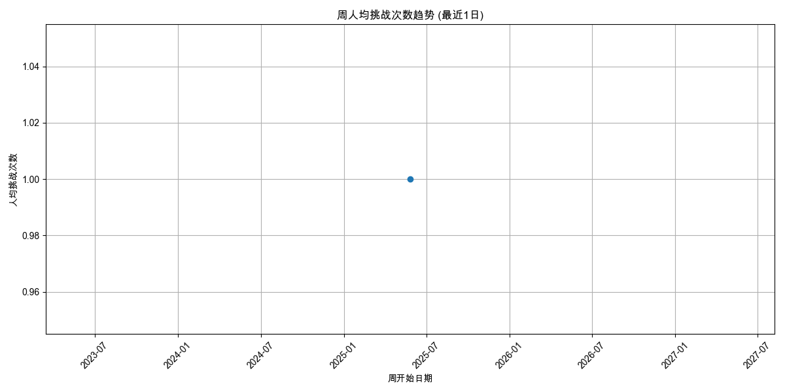
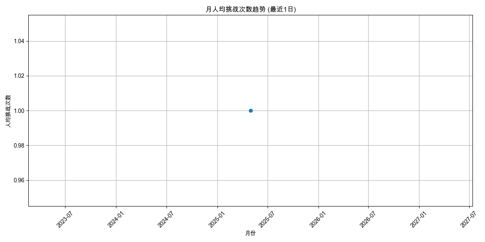
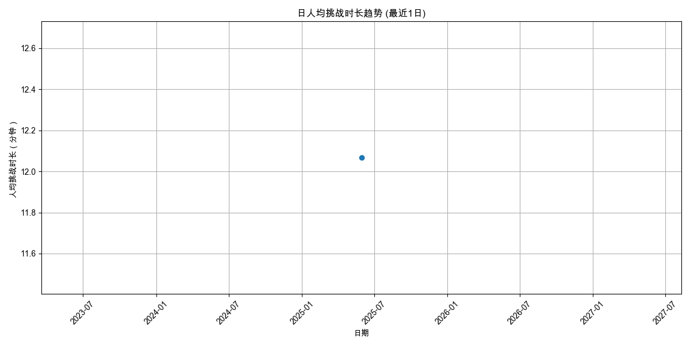
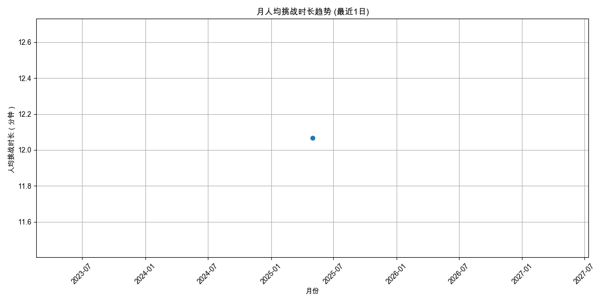

# 用户参与度分析报告 (最近1日)

报告生成于: 2025-06-09 17:07:55

## 分析目标
本报告提供用户参与度的洞察，主要关注：
- 人均挑战次数 (日/周/月)
- 人均挑战时长（分钟） (日/周/月)

**分析周期**: 最近1日

## 数据来源
- 输入数据文件: `filtered_online_data.xlsx`

### 人均挑战次数
#### 日人均挑战次数

| 日期       |   人均挑战次数 |   总用户数 |   总挑战次数 |
|:-----------|---------------:|-----------:|-------------:|
| 2025-05-30 |              1 |          1 |            1 |

#### 周人均挑战次数

| 周开始日期   |   人均挑战次数 |   总用户数 |   总挑战次数 |
|:-------------|---------------:|-----------:|-------------:|
| 2025-05-27   |              1 |          1 |            1 |

#### 月人均挑战次数

| 月份       |   人均挑战次数 |   总用户数 |   总挑战次数 |
|:-----------|---------------:|-----------:|-------------:|
| 2025-05-01 |              1 |          1 |            1 |

### 人均挑战时长（分钟）
#### 日人均挑战时长

| 日期       |   人均挑战时长（分钟） |   参与时长计算用户数 |   总挑战时长（分钟） |
|:-----------|-----------------------:|---------------------:|---------------------:|
| 2025-05-30 |                12.0667 |                    1 |              12.0667 |

#### 周人均挑战时长

| 周开始日期   |   人均挑战时长（分钟） |   参与时长计算用户数 |   总挑战时长（分钟） |
|:-------------|-----------------------:|---------------------:|---------------------:|
| 2025-05-27   |                12.0667 |                    1 |              12.0667 |

#### 月人均挑战时长

| 月份       |   人均挑战时长（分钟） |   参与时长计算用户数 |   总挑战时长（分钟） |
|:-----------|-----------------------:|---------------------:|---------------------:|
| 2025-05-01 |                12.0667 |                    1 |              12.0667 |

## 输出文件
- 日人均挑战次数: `avg_challenges_daily_1d.xlsx`
- 周人均挑战次数: `avg_challenges_weekly_1d.xlsx`
- 月人均挑战次数: `avg_challenges_monthly_1d.xlsx`
- 日人均挑战时长: `avg_duration_daily_1d.xlsx`
- 周人均挑战时长: `avg_duration_weekly_1d.xlsx`
- 月人均挑战时长: `avg_duration_monthly_1d.xlsx`
- 本报告: `user_engagement_report_1d.md`
