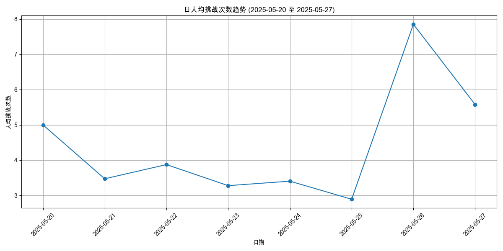
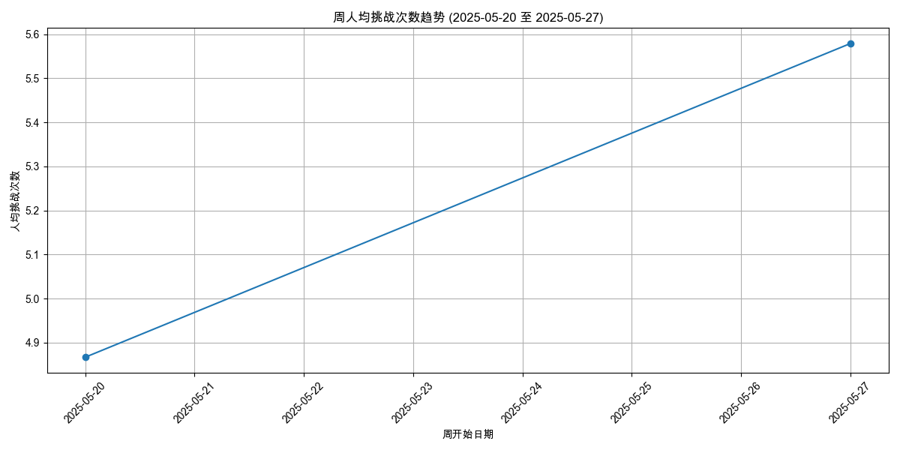
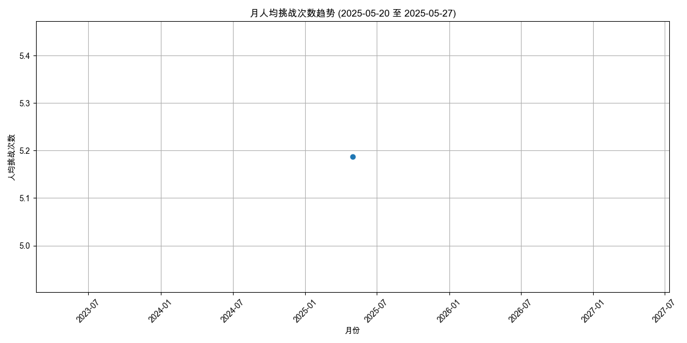
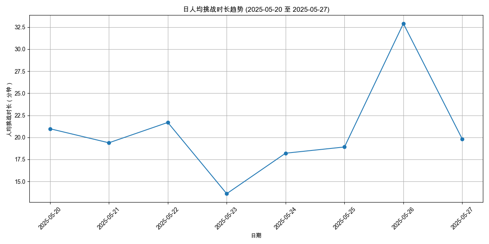
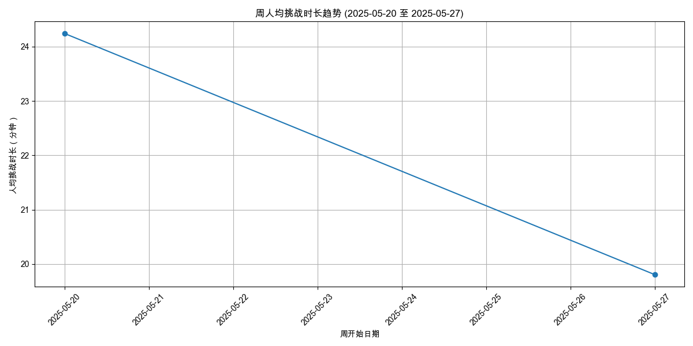
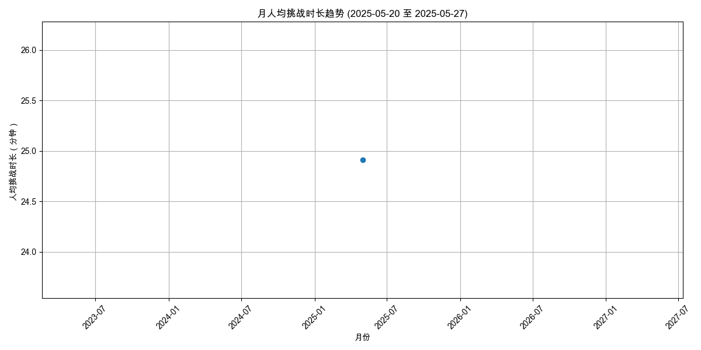

# 用户参与度分析报告 (2025-05-20 至 2025-05-27)

报告生成于: 2025-06-09 17:46:49

## 分析目标
本报告提供用户参与度的洞察，主要关注：
- 人均挑战次数 (日/周/月)
- 人均挑战时长（分钟） (日/周/月)

**分析周期**: 2025-05-20 至 2025-05-27

## 数据来源
- 输入数据文件: `filtered_online_data.xlsx`

### 人均挑战次数
#### 日人均挑战次数

| 日期       |   人均挑战次数 |   总用户数 |   总挑战次数 |
|:-----------|---------------:|-----------:|-------------:|
| 2025-05-20 |        5       |         28 |          140 |
| 2025-05-21 |        3.47368 |        114 |          396 |
| 2025-05-22 |        3.87603 |        121 |          469 |
| 2025-05-23 |        3.27885 |        104 |          341 |
| 2025-05-24 |        3.40625 |         64 |          218 |
| 2025-05-25 |        2.89362 |         47 |          136 |
| 2025-05-26 |        7.85294 |         68 |          534 |
| 2025-05-27 |        5.57895 |         57 |          318 |

#### 周人均挑战次数

| 周开始日期   |   人均挑战次数 |   总用户数 |   总挑战次数 |
|:-------------|---------------:|-----------:|-------------:|
| 2025-05-20   |        4.8671  |        459 |         2234 |
| 2025-05-27   |        5.57895 |         57 |          318 |

#### 月人均挑战次数

| 月份       |   人均挑战次数 |   总用户数 |   总挑战次数 |
|:-----------|---------------:|-----------:|-------------:|
| 2025-05-01 |        5.18699 |        492 |         2552 |

### 人均挑战时长（分钟）
#### 日人均挑战时长

| 日期       |   人均挑战时长（分钟） |   参与时长计算用户数 |   总挑战时长（分钟） |
|:-----------|-----------------------:|---------------------:|---------------------:|
| 2025-05-20 |                20.9756 |                   28 |              587.317 |
| 2025-05-21 |                19.381  |                  114 |             2209.43  |
| 2025-05-22 |                21.6891 |                  121 |             2624.38  |
| 2025-05-23 |                13.6109 |                  104 |             1415.53  |
| 2025-05-24 |                18.2023 |                   64 |             1164.95  |
| 2025-05-25 |                18.9078 |                   47 |              888.667 |
| 2025-05-26 |                32.9    |                   68 |             2237.2   |
| 2025-05-27 |                19.8044 |                   57 |             1128.85  |

#### 周人均挑战时长

| 周开始日期   |   人均挑战时长（分钟） |   参与时长计算用户数 |   总挑战时长（分钟） |
|:-------------|-----------------------:|---------------------:|---------------------:|
| 2025-05-20   |                24.2429 |                  459 |             11127.5  |
| 2025-05-27   |                19.8044 |                   57 |              1128.85 |

#### 月人均挑战时长

| 月份       |   人均挑战时长（分钟） |   参与时长计算用户数 |   总挑战时长（分钟） |
|:-----------|-----------------------:|---------------------:|---------------------:|
| 2025-05-01 |                24.9112 |                  492 |              12256.3 |

## 输出文件
- 日人均挑战次数: `avg_challenges_daily_2025-05-20_to_2025-05-27.xlsx`
- 周人均挑战次数: `avg_challenges_weekly_2025-05-20_to_2025-05-27.xlsx`
- 月人均挑战次数: `avg_challenges_monthly_2025-05-20_to_2025-05-27.xlsx`
- 日人均挑战时长: `avg_duration_daily_2025-05-20_to_2025-05-27.xlsx`
- 周人均挑战时长: `avg_duration_weekly_2025-05-20_to_2025-05-27.xlsx`
- 月人均挑战时长: `avg_duration_monthly_2025-05-20_to_2025-05-27.xlsx`
- 本报告: `user_engagement_report_2025-05-20_to_2025-05-27.md`
