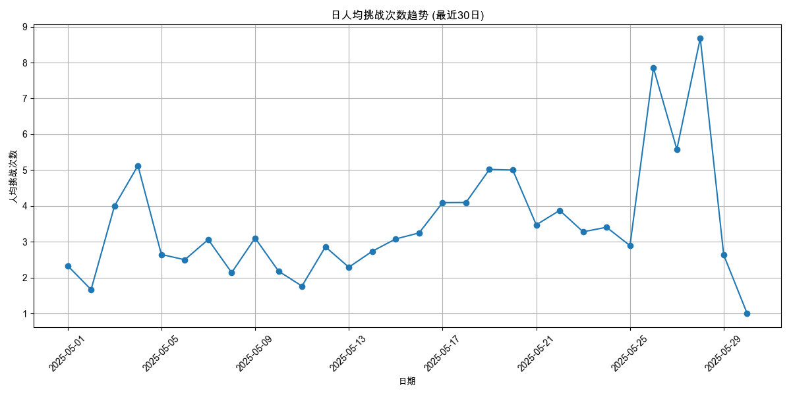
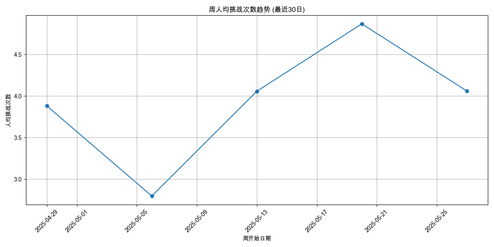
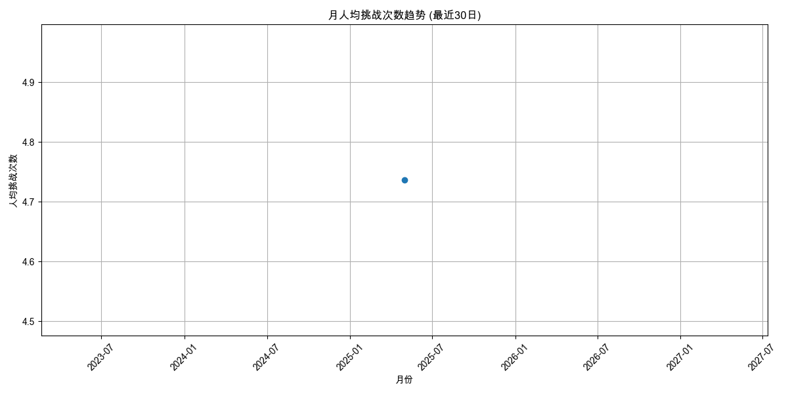
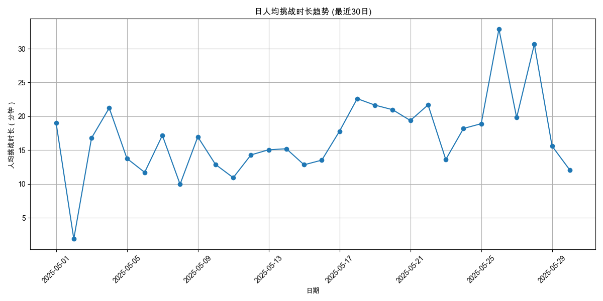
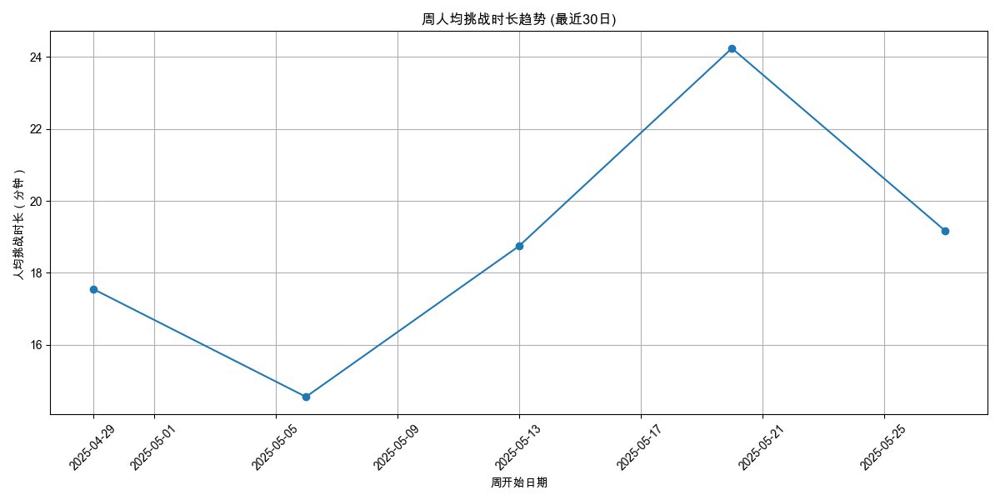
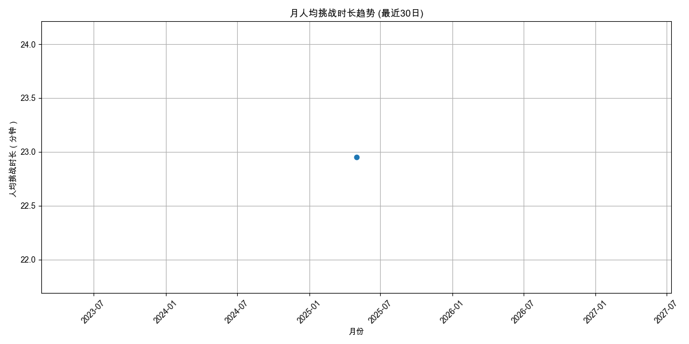

# 用户参与度分析报告 (最近30日)

报告生成于: 2025-06-09 17:47:39

## 分析目标
本报告提供用户参与度的洞察，主要关注：
- 人均挑战次数 (日/周/月)
- 人均挑战时长（分钟） (日/周/月)

**分析周期**: 最近30日

## 数据来源
- 输入数据文件: `filtered_online_data.xlsx`

### 人均挑战次数
#### 日人均挑战次数

| 日期       |   人均挑战次数 |   总用户数 |   总挑战次数 |
|:-----------|---------------:|-----------:|-------------:|
| 2025-05-01 |        2.33333 |          3 |            7 |
| 2025-05-02 |        1.66667 |          3 |            5 |
| 2025-05-03 |        4       |          6 |           24 |
| 2025-05-04 |        5.125   |         16 |           82 |
| 2025-05-05 |        2.64706 |         17 |           45 |
| 2025-05-06 |        2.5     |         26 |           65 |
| 2025-05-07 |        3.0625  |         80 |          245 |
| 2025-05-08 |        2.14085 |        142 |          304 |
| 2025-05-09 |        3.10465 |         86 |          267 |
| 2025-05-10 |        2.18182 |         22 |           48 |
| 2025-05-11 |        1.76471 |         17 |           30 |
| 2025-05-12 |        2.86    |         50 |          143 |
| 2025-05-13 |        2.29167 |         48 |          110 |
| 2025-05-14 |        2.73563 |         87 |          238 |
| 2025-05-15 |        3.07975 |        163 |          502 |
| 2025-05-16 |        3.24793 |        121 |          393 |
| 2025-05-17 |        4.09259 |         54 |          221 |
| 2025-05-18 |        4.09677 |         31 |          127 |
| 2025-05-19 |        5.01852 |         54 |          271 |
| 2025-05-20 |        5       |         28 |          140 |
| 2025-05-21 |        3.47368 |        114 |          396 |
| 2025-05-22 |        3.87603 |        121 |          469 |
| 2025-05-23 |        3.27885 |        104 |          341 |
| 2025-05-24 |        3.40625 |         64 |          218 |
| 2025-05-25 |        2.89362 |         47 |          136 |
| 2025-05-26 |        7.85294 |         68 |          534 |
| 2025-05-27 |        5.57895 |         57 |          318 |
| 2025-05-28 |        8.68116 |         69 |          599 |
| 2025-05-29 |        2.6345  |        342 |          901 |
| 2025-05-30 |        1       |          1 |            1 |

#### 周人均挑战次数

| 周开始日期   |   人均挑战次数 |   总用户数 |   总挑战次数 |
|:-------------|---------------:|-----------:|-------------:|
| 2025-04-29   |        3.88095 |         42 |          163 |
| 2025-05-06   |        2.79695 |        394 |         1102 |
| 2025-05-13   |        4.05664 |        459 |         1862 |
| 2025-05-20   |        4.8671  |        459 |         2234 |
| 2025-05-27   |        4.06027 |        448 |         1819 |

#### 月人均挑战次数

| 月份       |   人均挑战次数 |   总用户数 |   总挑战次数 |
|:-----------|---------------:|-----------:|-------------:|
| 2025-05-01 |        4.73615 |       1516 |         7180 |

### 人均挑战时长（分钟）
#### 日人均挑战时长

| 日期       |   人均挑战时长（分钟） |   参与时长计算用户数 |   总挑战时长（分钟） |
|:-----------|-----------------------:|---------------------:|---------------------:|
| 2025-05-01 |               19.0556  |                    3 |             57.1667  |
| 2025-05-02 |                1.87222 |                    3 |              5.61667 |
| 2025-05-03 |               16.7861  |                    6 |            100.717   |
| 2025-05-04 |               21.2312  |                   16 |            339.7     |
| 2025-05-05 |               13.7696  |                   17 |            234.083   |
| 2025-05-06 |               11.7128  |                   26 |            304.533   |
| 2025-05-07 |               17.1808  |                   80 |           1374.47    |
| 2025-05-08 |                9.9507  |                  142 |           1413       |
| 2025-05-09 |               16.9626  |                   86 |           1458.78    |
| 2025-05-10 |               12.8811  |                   22 |            283.383   |
| 2025-05-11 |               10.9255  |                   17 |            185.733   |
| 2025-05-12 |               14.2903  |                   50 |            714.517   |
| 2025-05-13 |               15.051   |                   48 |            722.45    |
| 2025-05-14 |               15.1987  |                   87 |           1322.28    |
| 2025-05-15 |               12.8311  |                  163 |           2091.47    |
| 2025-05-16 |               13.5194  |                  121 |           1635.85    |
| 2025-05-17 |               17.7951  |                   54 |            960.933   |
| 2025-05-18 |               22.6124  |                   31 |            700.983   |
| 2025-05-19 |               21.654   |                   54 |           1169.32    |
| 2025-05-20 |               20.9756  |                   28 |            587.317   |
| 2025-05-21 |               19.381   |                  114 |           2209.43    |
| 2025-05-22 |               21.6891  |                  121 |           2624.38    |
| 2025-05-23 |               13.6109  |                  104 |           1415.53    |
| 2025-05-24 |               18.2023  |                   64 |           1164.95    |
| 2025-05-25 |               18.9078  |                   47 |            888.667   |
| 2025-05-26 |               32.9     |                   68 |           2237.2     |
| 2025-05-27 |               19.8044  |                   57 |           1128.85    |
| 2025-05-28 |               30.6553  |                   69 |           2115.22    |
| 2025-05-29 |               15.5984  |                  342 |           5334.67    |
| 2025-05-30 |               12.0667  |                    1 |             12.0667  |

#### 周人均挑战时长

| 周开始日期   |   人均挑战时长（分钟） |   参与时长计算用户数 |   总挑战时长（分钟） |
|:-------------|-----------------------:|---------------------:|---------------------:|
| 2025-04-29   |                17.5544 |                   42 |              737.283 |
| 2025-05-06   |                14.5544 |                  394 |             5734.42  |
| 2025-05-13   |                18.7435 |                  459 |             8603.28  |
| 2025-05-20   |                24.2429 |                  459 |            11127.5   |
| 2025-05-27   |                19.1759 |                  448 |             8590.8   |

#### 月人均挑战时长

| 月份       |   人均挑战时长（分钟） |   参与时长计算用户数 |   总挑战时长（分钟） |
|:-----------|-----------------------:|---------------------:|---------------------:|
| 2025-05-01 |                22.9507 |                 1516 |              34793.3 |

## 输出文件
- 日人均挑战次数: `avg_challenges_daily_30d.xlsx`
- 周人均挑战次数: `avg_challenges_weekly_30d.xlsx`
- 月人均挑战次数: `avg_challenges_monthly_30d.xlsx`
- 日人均挑战时长: `avg_duration_daily_30d.xlsx`
- 周人均挑战时长: `avg_duration_weekly_30d.xlsx`
- 月人均挑战时长: `avg_duration_monthly_30d.xlsx`
- 本报告: `user_engagement_report_30d.md`
