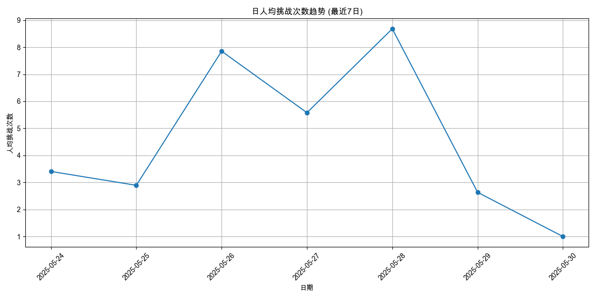
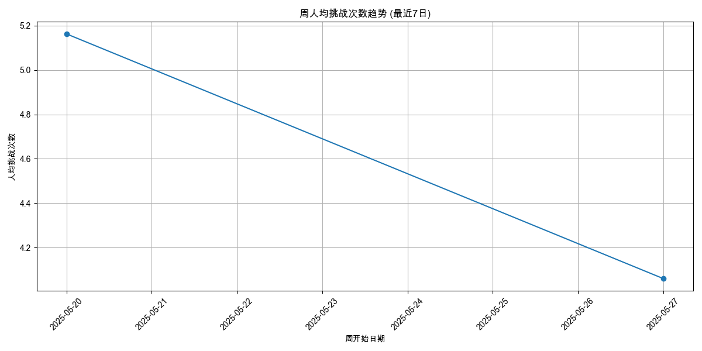
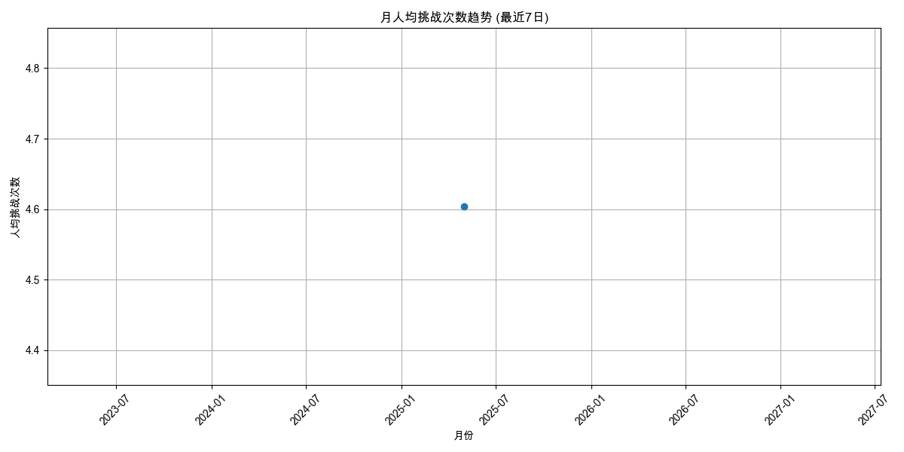
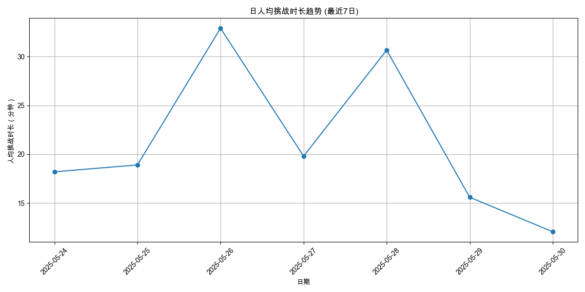
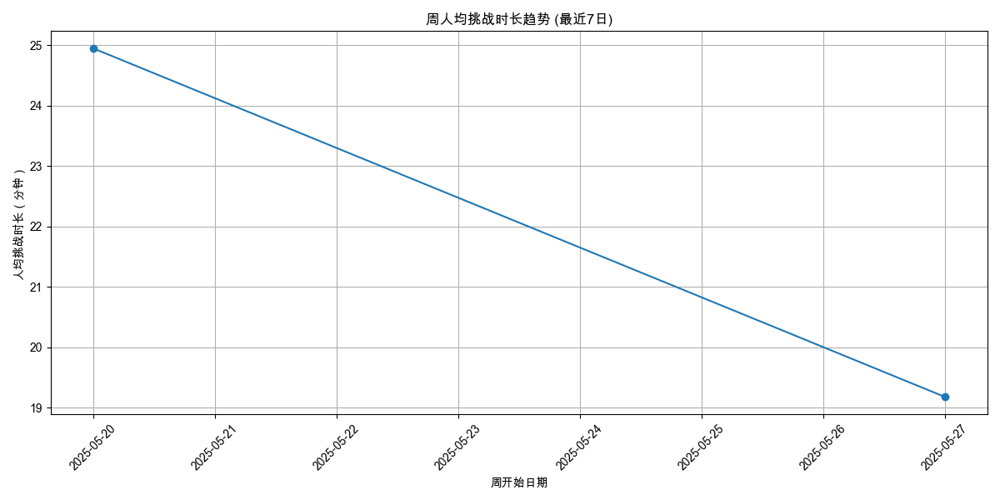
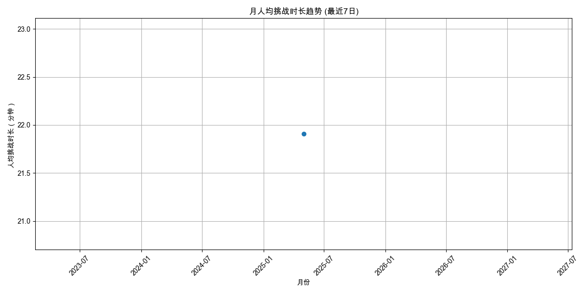

# 用户参与度分析报告 (最近7日)

报告生成于: 2025-06-09 17:06:54

## 分析目标
本报告提供用户参与度的洞察，主要关注：
- 人均挑战次数 (日/周/月)
- 人均挑战时长（分钟） (日/周/月)

**分析周期**: 最近7日

## 数据来源
- 输入数据文件: `filtered_online_data.xlsx`

### 人均挑战次数
#### 日人均挑战次数

| 日期       |   人均挑战次数 |   总用户数 |   总挑战次数 |
|:-----------|---------------:|-----------:|-------------:|
| 2025-05-24 |        3.40625 |         64 |          218 |
| 2025-05-25 |        2.89362 |         47 |          136 |
| 2025-05-26 |        7.85294 |         68 |          534 |
| 2025-05-27 |        5.57895 |         57 |          318 |
| 2025-05-28 |        8.68116 |         69 |          599 |
| 2025-05-29 |        2.6345  |        342 |          901 |
| 2025-05-30 |        1       |          1 |            1 |

#### 周人均挑战次数

| 周开始日期   |   人均挑战次数 |   总用户数 |   总挑战次数 |
|:-------------|---------------:|-----------:|-------------:|
| 2025-05-20   |        5.16279 |        172 |          888 |
| 2025-05-27   |        4.06027 |        448 |         1819 |

#### 月人均挑战次数

| 月份       |   人均挑战次数 |   总用户数 |   总挑战次数 |
|:-----------|---------------:|-----------:|-------------:|
| 2025-05-01 |        4.60374 |        588 |         2707 |

### 人均挑战时长（分钟）
#### 日人均挑战时长

| 日期       |   人均挑战时长（分钟） |   参与时长计算用户数 |   总挑战时长（分钟） |
|:-----------|-----------------------:|---------------------:|---------------------:|
| 2025-05-24 |                18.2023 |                   64 |            1164.95   |
| 2025-05-25 |                18.9078 |                   47 |             888.667  |
| 2025-05-26 |                32.9    |                   68 |            2237.2    |
| 2025-05-27 |                19.8044 |                   57 |            1128.85   |
| 2025-05-28 |                30.6553 |                   69 |            2115.22   |
| 2025-05-29 |                15.5984 |                  342 |            5334.67   |
| 2025-05-30 |                12.0667 |                    1 |              12.0667 |

#### 周人均挑战时长

| 周开始日期   |   人均挑战时长（分钟） |   参与时长计算用户数 |   总挑战时长（分钟） |
|:-------------|-----------------------:|---------------------:|---------------------:|
| 2025-05-20   |                24.9466 |                  172 |              4290.82 |
| 2025-05-27   |                19.1759 |                  448 |              8590.8  |

#### 月人均挑战时长

| 月份       |   人均挑战时长（分钟） |   参与时长计算用户数 |   总挑战时长（分钟） |
|:-----------|-----------------------:|---------------------:|---------------------:|
| 2025-05-01 |                21.9075 |                  588 |              12881.6 |

## 输出文件
- 日人均挑战次数: `avg_challenges_daily_7d.xlsx`
- 周人均挑战次数: `avg_challenges_weekly_7d.xlsx`
- 月人均挑战次数: `avg_challenges_monthly_7d.xlsx`
- 日人均挑战时长: `avg_duration_daily_7d.xlsx`
- 周人均挑战时长: `avg_duration_weekly_7d.xlsx`
- 月人均挑战时长: `avg_duration_monthly_7d.xlsx`
- 本报告: `user_engagement_report_7d.md`
