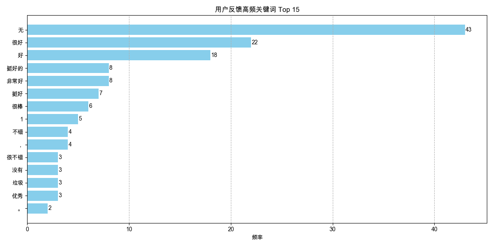

# 用户反馈（关键词）分析报告

报告生成于: 2025-05-30 18:51:04

## 分析目标
本报告分析来自"用户评价"列的主观用户反馈文本：
- **高频关键词：** 用户反馈中出现频率最高的 15 个词语（基础清洗后）。**重要提示：** 对于中文文本，当前使用简单的空格进行分词。为获得更准确的中文关键词，建议使用专业的中文分词库（如jieba）。
- **特定负面关键词提及：** 预定义负面关键词的提及次数。当前监控列表为: 不合理, 太难, 无聊, 加载慢, 卡顿, 闪退, 没声音, bug, 错误, 不流畅, 不满意, 差, 不好, 问题, 没用, 垃圾

## 数据来源
- 输入数据文件: `filtered_online_data.xlsx` (路径: `data_for_analysis/online_data_20250529/filtered_data/filtered_online_data.xlsx`)
- 文本分析基于 `用户评价` 列。

## 用户反馈中的高频关键词

| 关键词   |   频率 |
|:---------|-------:|
| 无       |     43 |
| 很好     |     22 |
| 好       |     18 |
| 非常好   |      8 |
| 挺好的   |      8 |
| 挺好     |      7 |
| 很棒     |      6 |
| 1        |      5 |
| ，       |      4 |
| 不错     |      4 |
| 优秀     |      3 |
| 垃圾     |      3 |
| 没有     |      3 |
| 很不错   |      3 |
| 。       |      2 |

## 特定负面关键词的提及次数

| 关键词   |   提及次数 |
|:---------|-----------:|
| 问题     |         22 |
| 卡顿     |         12 |
| 不好     |          8 |
| 差       |          7 |
| 没声音   |          6 |
| 垃圾     |          3 |
| 不流畅   |          2 |
| 无聊     |          1 |
| 错误     |          1 |
| 不合理   |          0 |
| 太难     |          0 |
| 加载慢   |          0 |
| 闪退     |          0 |
| bug      |          0 |
| 不满意   |          0 |
| 没用     |          0 |

## 输出文件
- 高频关键词数据: `high_frequency_keywords.xlsx` (路径: `data_for_analysis/online_data_20250529/basic_analysis_outputs/user_feedback_keywords_analysis/high_frequency_keywords.xlsx`)
- 负面关键词提及数据: `negative_keywords_mentions.xlsx` (路径: `data_for_analysis/online_data_20250529/basic_analysis_outputs/user_feedback_keywords_analysis/negative_keywords_mentions.xlsx`)
- 本报告: `user_feedback_keywords_report.md` (路径: `data_for_analysis/online_data_20250529/basic_analysis_outputs/user_feedback_keywords_analysis/user_feedback_keywords_report.md`)

## 深度分析

### 1. 核心洞察：主观反馈质量低，但仍透露关键问题
- **无效反馈占主导**: 高频关键词分析显示，绝大多数用户反馈是"无"、"很好"、"好"等无信息量的词语。这表明用户普遍没有提供有价值的主观反馈，当前的反馈机制未能有效激发用户表达。
- **原始分词方法的局限性**: 报告中明确指出中文分词方式过于简单，导致"垃圾"、"问题"等关键词被单独统计，而未能形成有意义的词组（如"垃圾体验"、"产品问题"），这限制了我们深入理解用户意图。

### 2. 从噪音中提取信号：定位核心负面反馈
尽管反馈质量不高，但负面关键词的提及次数仍然为我们指明了方向，印证了"用户体验与技术性能"分析维度的必要性。
- **首要问题：技术性能**:
    - **"问题" (22次)**、**"卡顿" (12次)**、**"没声音" (6次)** 是提及最多的具体负面反馈。这表明，在内容和设计之外，产品的技术稳定性和性能是当前用户体验的主要痛点。
- **内容体验的负面信号**:
    - **"不好" (8次)**、**"差" (7次)**、**"垃圾" (3次)**、**"无聊" (1次)** 等词汇虽然频次不高，但直接表达了用户对体验的不满。这些反馈需要结合剧本ID进行关联分析，才能找到具体是哪个环节出了问题。

### 3. 策略建议
- **行动优先级：解决技术问题**:
    - **成立技术排查小组**: 应立即将"卡顿"、"没声音"等技术问题反馈给技术团队，并根据用户ID和对话时间（conv_id, start_time）追溯具体场景，定位并修复问题。这是提升用户体验最直接、最有效的切入点。
- **改进反馈分析方法**:
    - **引入专业分词工具**: 必须替换掉当前简陋的分词方法，采用如 `jieba` 等专业的中文分词库，并结合自定义词典（例如，将产品术语、剧本名称加入词典）重新进行关键词分析，以获得更准确的洞察。
    - **进行情感分析与主题建模**: 仅看关键词是不够的。下一步应引入情感分析模型，自动判断每条评论的正面、负面或中性倾向，并使用主题建模（如LDA）等技术，从大量评论中自动归纳出用户反馈的核心主题（如"价格异议"、"功能建议"、"BUG报告"等）。
- **关联分析，精准定位**:
    - 将包含负面关键词的反馈与其对应的 **剧本名称 (challenge_id)**、**失败率**、**通关轮次** 等数据进行交叉分析。例如，我们可以筛选出提及"太难"或"不合理"的反馈，看看它们主要集中在哪些高失败率的剧本上，从而为内容优化提供直接证据。这是"人工介入与深度分析流程"的关键一步。
