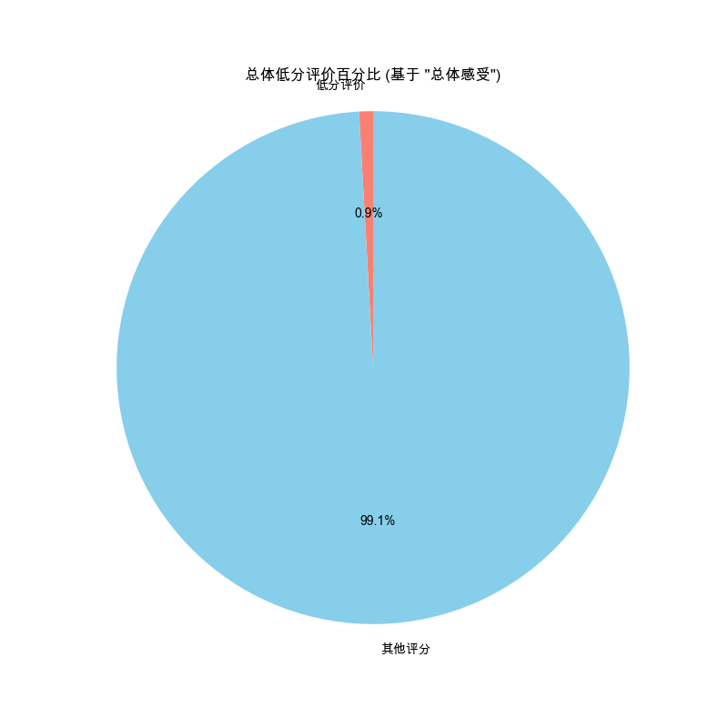

# 用户反馈（评分）分析报告

报告生成于: 2025-05-30 18:50:50

## 分析目标
本报告基于提交的评价和评分分析用户反馈：
- **评价率：** 用户提交任何形式评价（文本或评分）的对话百分比。
- **低分（"总体感受"）百分比：** "总体感受"列中被视为低分（分数为: [1, 2]）的评分百分比。分别计算总体和各剧本的百分比。

## 数据来源
- 输入数据文件: `filtered_online_data.xlsx` (路径: `data_for_analysis/online_data_20250529/filtered_data/filtered_online_data.xlsx`)
- 评价由以下任一列中的非空值指示: ['用户评价', '总体感受', '业务帮助', '客户拟人', '体验流畅']。
- "总体感受"的低分定义为 [1, 2]。
- 各剧本分析使用 `challenge_id` (`挑战名称`) 。

## 评价率

|   总对话数 |   有评价的对话数 |   评价率 (%): |
|-----------:|-----------------:|--------------:|
|      23115 |            23115 |           100 |

## 总体低分百分比 （"总体感受"）

| 评分列   |   总有效评分数 |   低分数 | 低分定义   |   低分百分比 (%): |
|:---------|---------------:|---------:|:-----------|------------------:|
| 总体感受 |          23115 |      202 | [1, 2]     |              0.87 |

## 各剧本低分百分比 （"总体感受"）
(按低分百分比降序排列)

|   剧本ID | 剧本名称                                           |   总评分数 |   低分数 |   低分百分比 (%): |
|---------:|:---------------------------------------------------|-----------:|---------:|------------------:|
|      202 | 【宽松练习版】现状澄清的房况确认                   |         24 |        1 |              4.17 |
|      220 | 【惠居京南】(演练5）首次出租的王女士               |        175 |        7 |              4    |
|      241 | 【云管家】退休在家的王阿姨                         |         34 |        1 |              2.94 |
|      216 | 【惠居京南】(演练1）重收益的张先生                 |        153 |        4 |              2.61 |
|      226 | 【惠居京南】（速练4）邀约线下                      |        127 |        3 |              2.36 |
|      162 | 前来面试的王闹海                                   |        818 |       16 |              1.96 |
|      200 | 套底价反复压价格李女士                             |        157 |        3 |              1.91 |
|      215 | 【惠居京南】（速练1）开场破冰                      |        217 |        4 |              1.84 |
|        3 | 要方案的王先生                                     |       2348 |       37 |              1.58 |
|       33 | 看中交通便利的上班族刘小姐                         |        328 |        5 |              1.52 |
|      151 | 【新人通关】被中介坑过的王先生                     |         67 |        1 |              1.49 |
|       43 | 同事合租多套的蔡先生                               |         71 |        1 |              1.41 |
|       42 | 想租一室户的年轻人卢先生                           |        371 |        5 |              1.35 |
|       45 | 需要被点燃的小赵                                   |         74 |        1 |              1.35 |
|       38 | 二次进店的俞先生                                   |         78 |        1 |              1.28 |
|      222 | 【惠居京南】(演练7）老旧房子刘女士                 |         81 |        1 |              1.23 |
|       72 | 首次了解美化套餐的张姐                             |        324 |        4 |              1.23 |
|      223 | 【惠居京南】(演练8）以租换租刘先生                 |         86 |        1 |              1.16 |
|      199 | 购房用于出租的陈女士                               |         88 |        1 |              1.14 |
|      113 | 【day1】爱惜房子的王女士                           |        447 |        5 |              1.12 |
|      219 | 【惠居京南】(演练4）在自如托管过的李先生           |         98 |        1 |              1.02 |
|       30 | 不自住不急售的周女士                               |        522 |        5 |              0.96 |
|       34 | 预期偏高的张女士                                   |        217 |        2 |              0.92 |
|      112 | 【day1】重收益的张先生                             |       1094 |       10 |              0.91 |
|       39 | 看好装修公司的王女士                               |        112 |        1 |              0.89 |
|       41 | 在乎优惠活动的丁先生                               |        237 |        2 |              0.84 |
|        1 | 工作繁忙的林小姐                                   |       2768 |       23 |              0.83 |
|      232 | 史今哥带你逛展厅样板房（91㎡）                     |        508 |        4 |              0.79 |
|      198 | 购房用于即将新婚的李先生                           |        126 |        1 |              0.79 |
|       73 | 了解美化后有疑问的胡女士                           |        128 |        1 |              0.78 |
|      119 | 【day3】学区房的孙女士                             |        270 |        2 |              0.74 |
|        4 | 想要报价的陈女士                                   |       1430 |       10 |              0.7  |
|        6 | 要效果图的刘先生                                   |        798 |        5 |              0.63 |
|      159 | 【云管家】朋友被包租公司坑过，担心没保障的苏女士   |        352 |        2 |              0.57 |
|      121 | 【day5】首次出租的王女士                           |        174 |        1 |              0.57 |
|       31 | 自住认为总会涨价的李姐                             |        533 |        3 |              0.56 |
|       37 | 对全包公司失望的杜先生                             |        189 |        1 |              0.53 |
|      158 | 【云管家】首次了解省心租，看重收益的李先生         |        194 |        1 |              0.52 |
|       36 | 置换养老的李女士                                   |       1750 |        8 |              0.46 |
|        2 | 做不了主的张女士                                   |       1110 |        5 |              0.45 |
|        5 | 强势的李女士                                       |        699 |        3 |              0.43 |
|      157 | 【云管家】在外地首次了解省心租的王女士             |        264 |        1 |              0.38 |
|       35 | 希望快速成交的李先生                               |        276 |        1 |              0.36 |
|       32 | 兼顾上学和居住品质的王先生                         |        452 |        1 |              0.22 |
|      114 | 谨慎装修的王先生                                   |        472 |        1 |              0.21 |
|      194 | 【上海测试】重收益的李先生                         |         93 |        0 |              0    |
|      195 | 【上海测试】换租的赵女士                           |         51 |        0 |              0    |
|      242 | 【云管家】非常爱惜房屋，对租客挑剔的郭女士         |         38 |        0 |              0    |
|      240 | 新房团装-申请退款的黄小姐                          |         46 |        0 |              0    |
|      227 | 【惠居京南】（速练5）总结跟进                      |         99 |        0 |              0    |
|       40 | 首次服务失望的李阿姨                               |        153 |        0 |              0    |
|      225 | 【惠居京南】（速练3）产品匹配                      |        173 |        0 |              0    |
|      224 | 【惠居京南】（速练2）现状澄清                      |        113 |        0 |              0    |
|       44 | 大姑的春节热线                                     |        179 |        0 |              0    |
|      221 | 【惠居京南】(演练6）替人出租的李女士               |         85 |        0 |              0    |
|      120 | 【day4】在自如托管过的李先生                       |        180 |        0 |              0    |
|      122 | 【day6】替人出租的李女士                           |        105 |        0 |              0    |
|      218 | 【惠居京南】(演练3）学区房的孙女士                 |         87 |        0 |              0    |
|      217 | 【惠居京南】(演练2）爱惜房子的王女士               |         79 |        0 |              0    |
|      150 | 【新人通关】时间紧迫的赵女士                       |        119 |        0 |              0    |
|      152 | 【新人通关】看中居住质量的刘小姐                   |         93 |        0 |              0    |
|      210 | 【新版温和】注重养老的蔡叔叔                       |         12 |        0 |              0    |
|      209 | 【新版暴躁】注重养老的蔡叔叔                       |          7 |        0 |              0    |
|      208 | 【台词版】注重养老的蔡叔叔                         |         14 |        0 |              0    |
|      204 | 【西安测试】对省心租服务价值存疑的王先生           |         34 |        0 |              0    |
|      203 | （改1）愿意尝试的包子铺老板娘李姐                  |          8 |        0 |              0    |
|      154 | 【新人通关】出租转出售的李女士                     |         29 |        0 |              0    |
|      201 | 【速练体验】现状澄清的房况确认考察                 |         42 |        0 |              0    |
|      155 | 【新人通关】再次委托出租的钱女士                   |         59 |        0 |              0    |
|      156 | 【新人通关】在乎性价比的张先生                     |         79 |        0 |              0    |
|      168 | 曹叔带你逛展厅new                                  |         37 |        0 |              0    |
|      197 | 【上海测试】老旧房子的刘阿姨（推荐美租）           |         50 |        0 |              0    |
|      196 | 【上海测试】在自如托管过的金先生                   |         41 |        0 |              0    |
|      243 | 【云管家】打算卖房，担心省心租签约年限太长的张先生 |         24 |        0 |              0    |

## 输出文件
- 评价率数据: `evaluation_rate.xlsx` (路径: `data_for_analysis/online_data_20250529/basic_analysis_outputs/user_feedback_ratings_analysis/evaluation_rate.xlsx`)
- 总体低分百分比数据: `low_score_percentage_overall.xlsx` (路径: `data_for_analysis/online_data_20250529/basic_analysis_outputs/user_feedback_ratings_analysis/low_score_percentage_overall.xlsx`)
- 各剧本低分百分比数据: `low_score_percentage_per_script.xlsx` (路径: `data_for_analysis/online_data_20250529/basic_analysis_outputs/user_feedback_ratings_analysis/low_score_percentage_per_script.xlsx`)
- 本报告: `user_feedback_ratings_report.md` (路径: `data_for_analysis/online_data_20250529/basic_analysis_outputs/user_feedback_ratings_analysis/user_feedback_ratings_report.md`)

## 深度分析

### 1. 核心洞察：评分数据与行为数据存在巨大"温差"
- **总体满意度高得反常**: **0.87%** 的总体低分率与我们在先前分析中看到的 **43.27%** 的总体失败率形成了鲜明对比。这揭示了一个核心问题：**用户在行为上的挫败感（如反复失败）并未转化为评分上的不满**。
- **评价率指标失效**: 100%的评价率表明评分是产品流程中的强制环节，或未评分的记录已被过滤。因此，该指标无法用于衡量用户提供反馈的意愿，不具备分析价值。

### 2. 对评分数据的解读与警示
- **评分无法有效识别"差内容"**:
    - 即便是失败率高达80%-100%的剧本，如"要方案的王先生"、"前来面试的王闹海"以及"注重养老的蔡叔叔"系列，其"总体感受"低分率也仅在1-2%左右，甚至为0。
    - **结论：绝对不能依赖"总体感受"的评分来衡量剧本的质量或用户的真实体验。**
- **产生"温差"的可能原因**:
    1.  **用户心态**: 用户可能将产品定位为"训练工具"，认为"失败"是学习过程的一部分，而非产品体验差。
    2.  **反馈惰性**: 用户可能为了快速结束流程而随手给出默认好评，懒于表达真实的不满。
    3.  **"幸存者偏差"**: 能够完成对话并进行评分的用户，本身可能就是体验尚可的用户。因体验过差而中途退出的用户，其负面感受并未被捕获。
    4.  **反馈渠道错位**: 用户的真实负面反馈可能更多地体现在**主观评价的文本**中，而非量化评分里。

### 3. 策略建议
- **弱化评分指标的权重**: 在衡量用户满意度和内容质量时，应大幅降低"总体感受"等评分指标的权重。行为指标（如失败率、通关尝试次数、用户留存）和主观文本反馈是更可靠的"温度计"。
- **聚焦主观文本分析**: **分析的重心必须转向 `user_feedback_keywords_analysis`**。从用户自己的语言中挖掘出的高频关键词（特别是负面词汇），是定位问题的最宝贵线索。
- **优化反馈机制**:
    - **在失败时收集反馈**: 考虑在用户挑战"失败"的节点，主动弹出简短的反馈窗口，询问失败原因（例如，"对话难度过高"、"AI回复不合理"、"场景目标不明确"等选项），这样能更精准地收集针对性反馈。
    - **区分"产品体验"与"内容体验"**: 在评分设计上，可考虑将评分维度拆分得更细，如"你对本次对话的流畅度是否满意？"（产品体验）和"你认为本次挑战的难度是否合理？"（内容体验），以获得更明确的指向性。
