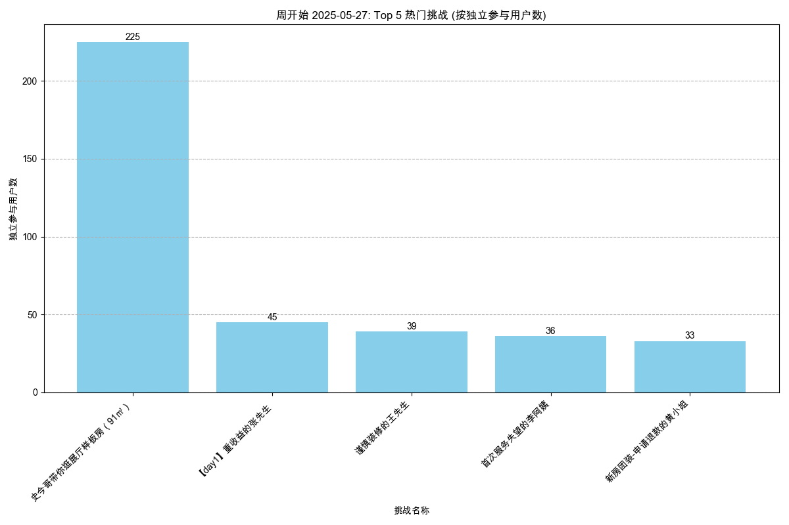

# 角色扮演对话Agent线上数据分析报告（含周期性洞察）

## 一、核心分析维度与目标

本报告旨在全面监控角色扮演对话Agent的线上表现。报告分为两大部分：首先是基于全量历史数据的**全周期分析**，旨在揭示长期趋势与根本性问题；其次是新增的**周期性数据洞察**，通过对近30天、近7天及昨日数据的分析，聚焦近期动态，实现对产品健康度的敏捷监控。

---

## 二、数据分析发现

### 1. 用户活跃与参与度

#### **1.1. 活跃用户数 (DAU, WAU, MAU)**

-   **数据来源**: `user_activity_analysis/user_activity_report.md`, `periodic_report_*`
-   **长期趋势 (All-time)**:
    -   **核心发现**: MAU (月活) 长期增长趋势强劲，从2024年9月的640人稳步增长至2025年5月的1516人，表明产品用户基础在持续扩大。DAU (日活) 则表现出极高的波动性，呈现出典型的B2B或学习型产品特征（工作日活跃远高于周末）。
    -   **客观数据图表引用**:
        -   *月活跃用户(MAU)趋势图，展现了产品的长期健康增长。*
        
        -   *日活跃用户(DAU)趋势图，揭示了用户活跃度的高波动性及关键峰值。*
        
-   **近期趋势 (30/7/1-Day)**:
    -   **核心发现**: 近期用户活跃度表现出极高的波动性，峰值由特定内容驱动，但缺乏持续性。
    -   **客观数据表格引用**:
        | 周期 | MAU | WAU (最近一周) | DAU (峰值) | DAU (昨日) |
        |:---|---:|---:|---:|---:|
        | 30日 | 1516 | 448 | 342 | 1 |
        | 7日 | 588 | 448 | 342 | 1 |
    -   **洞察**:
        -   **事件驱动的高峰**: 近30日DAU数据显示，`2025-05-29` 出现了 **342** 人的历史峰值，但次日迅速回落至 **1** 人。这表明该峰值是短暂的、由特定事件（见1.3内容热度分析）驱动的，而非用户基线的系统性抬升。
        -   **用户粘性基线**: 基于近30日数据，WAU/MAU比率约为 **29.5%** (448/1516)，这为我们提供了衡量用户粘性的最新基线。

#### **1.2. 用户平均参与度 (人均挑战次数/时长)**

-   **数据来源**: `user_engagement_analysis/user_engagement_report.md`, `periodic_report_*`
-   **长期趋势 (All-time)**:
    -   **核心发现**: 用户参与度与用户增长呈"拉锯战"关系。2025年3月MAU暴增时，人均每月挑战次数从前期高点 **8.8次** 降至 **2.2次**。5月份MAU继续增长的同时，参与度指标已回升（**4.7次/23分钟**），表明产品对新用户的承接能力有所改善。
    -   **客观数据图表引用**:
        -   *月人均挑战次数与挑战时长趋势图，直观展示了用户参与深度的变化。*
        
        
-   **近期趋势 (30/7/1-Day)**:
    -   **核心发现**: 近期用户参与度同样波动巨大，且与高热度内容强相关。
    -   **客观数据表格引用**:
        | 周期 | 月人均挑战次数 | 月人均挑战时长（分钟） |
        |:---|---:|---:|
        | 30日 | 4.74 | 22.95 |
        | 7日 | 4.60 | 21.91 |
    -   **洞察**:
        -   日数据显示，`2025-05-26` 和 `2025-05-28` 的人均挑战次数（分别为7.85次和8.68次）和时长远超平均水平，这与特定运营活动或内容推送高度相关，进一步证明了优质内容对提升用户参与深度的直接作用。

#### **1.3. 内容热度 (剧本周维度挑战人次TOP榜单)**

-   **数据来源**: `content_hotness_analysis/content_hotness_report.md`, `periodic_report_*`
-   **核心发现**:
    -   内容生态呈现"常青树"与"爆款"并存的模式。**周期性数据明确验证了新"爆款"内容是拉动近期核心指标（DAU、参与度）激增的直接引擎**。
    -   `史今哥带你逛展厅样板房（91㎡）` 在上线当周（05-27开始的一周）即吸引 **225** 名独立用户，远超同期其他任何剧本，直接促成了DAU历史峰值。
-   **客观数据图表引用**:
    -   *2025年5月27日当周的热门挑战榜单，清晰地展示了"爆款"内容的引流效应。*
    

#### **1.4. 归因分析总结**
- **增长引擎识别**: 通过交叉验证近30日用户活跃度数据与内容热度数据，可以明确 **DAU峰值与新内容的发布强相关**。`2025-05-29`的DAU峰值（342人）与新剧本`史今哥带你逛展厅样板房`的上线（当周吸引225名用户）在时间上高度吻合。
- **核心挑战**: 周期性数据表明，当前的增长模式高度依赖"爆款"内容投放，但用户留存和持续活跃面临挑战（峰值后DAU断崖式下跌）。**核心挑战在于如何将事件驱动型流量转化为产品的稳定日活**。

---

### 2. 剧本（内容）表现与质量

#### **2.1. 剧本失败率**

-   **数据来源**: `script_failure_rate_analysis/script_failure_rate_report.md`, `periodic_report_*`
-   **核心发现**: **剧本失败率是当前产品的核心痛点，且近期未有改善，甚至略有恶化**。
-   **客观数据表格引用**:
    | 周期 | 总体失败率 |
    |:---|---:|
    | 全量 | 43.27% |
    | 30日 | 44.76% |
    | 7日 | 45.22% |
-   **深度洞察**:
    -   **问题持续存在**: 近7日失败率（45.22%）略高于历史平均水平，表明解决高失败率问题的优先级需进一步提高。
    -   **热门陷阱持续**: 新的爆款内容 `史今哥带你逛展厅样板房（91㎡）` 虽然吸引了大量用户，但其在近30日的失败率高达 **66.12%**，制造了大量负面体验，可能也是导致用户次日留存低的原因之一。
    -   **设计缺陷未修复**: 部分失败率100%的剧本在近30日/7日报告中依然存在，说明这些问题尚未被修复。
-   **客观数据图表引用**:
    - *各剧本失败率图表，高失败率的剧本被明确标识。*
    

#### **2.2. 剧本通关效率/难度**

-   **数据来源**: `script_completion_difficulty_analysis/script_completion_difficulty_report.md`
-   **核心发现 (基于全量数据)**:
    -   **"挫败关卡"**: `前来面试的王闹海` 等剧本平均通关尝试次数高（2.06次），但成功后的对话轮次却不长（7.88轮），表明用户需要多次尝试才能通过一个流程较短的剧本，体验极差。
    -   **"硬核挑战"**: `要方案的王先生` 不仅需要多次尝试（2.31次），通关的流程本身也最长（13轮），是用户流失的最高风险点。
    -   **"内容甜蜜点"**: `谨慎装修的王先生`（1.23次尝试/9.38轮）等剧本在难度和内容长度上取得了良好平衡，是内容设计的典范。
-   **客观数据图表引用**:
    - *平均通关尝试次数图表，直观反映了剧本的"毅力"难度。*
    
-   **周期性分析待办**: 当前分析基于全量数据。为实现更敏捷的监控，需按照`script_gap_analysis.md`的规划，为该指标开发周期性分析能力。

---

### 3. 用户反馈与满意度

#### **3.1. 客观评价数据 (评分)**

-   **数据来源**: `user_feedback_ratings_analysis/user_feedback_ratings_report.md`
-   **核心发现 (基于全量数据)**:
    -   **数据严重失真**: 尽管有43%的总体失败率，但"总体感受"的 **低分率仅为0.87%**。用户的行为与评分存在巨大"温差"。
    -   **评分机制已失效**: 用户并未通过评分表达真实不满。**结论是：必须停止使用评分作为衡量内容质量和用户满意度的指标**，分析重心应全面转向行为数据和文本反馈。
-   **客观数据图表引用**:
    - *总体低分率饼图直观地展示了评分数据的"虚假繁荣"。*
    
-   **周期性分析待办**: 当前分析基于全量数据。为实现更敏捷的监控，需按照`script_gap_analysis.md`的规划，为该指标开发周期性分析能力。

#### **3.2. 主观评价内容 (关键词)**

-   **数据来源**: `user_feedback_keywords_analysis/user_feedback_keywords_report.md`
-   **核心发现 (基于全量数据)**:
    -   大部分反馈为"无"、"很好"等低价值内容。
    -   但在有效反馈中，**"问题"(22次), "卡顿"(12次), "没声音"(6次)** 是最常被提及的负面关键词。
-   **深度洞察**:
    -   **揭示真实痛点**: 即便在低质量的文本反馈中，信号依然明确：**技术性能是当前用户体验的首要痛点**，这在评分数据中完全无法体现。
-   **客观数据图表引用**:
    - *负面关键词提及次数图表，揭示了评分数据未能反映出的真实用户痛点。*
    
-   **周期性分析待办**: 当前分析基于全量数据。为实现更敏捷的监控，需按照`script_gap_analysis.md`的规划，为该指标开发周期性分析能力。

---

### 4. 用户体验与技术性能

-   **数据来源**: `user_feedback_keywords_analysis.md`, `technical_performance_keywords_analysis.md`
-   **核心发现与深度洞察 (基于全量数据)**:
    -   **分析流程存在缺陷**: `technical_performance_keywords_report.md`报告称"无技术性能关键词提及"，与`user_feedback_keywords_analysis.md`的发现（卡顿、没声音等）完全矛盾。
    -   **根本原因**: 问题源于两个关键词分析脚本使用了不同且不完整的监控列表，导致其中一份报告结论完全错误。
    -   **真实问题**: 真实的技术性能问题是存在的，即 **"卡顿"和"没声音"**。
-   **周期性分析待办**: 当前分析基于全量数据。为实现更敏捷的监控，需按照`script_gap_analysis.md`的规划，为该指标开发周期性分析能力。

---

## 三、总结与建议

1.  **增长与挑战并存**: 产品用户规模长期向好，但**周期性数据显示增长模式脆弱**，高度依赖"爆款"拉动，缺乏稳定留存。**剧本失败率高企（近期达45%）** 和 **技术性能问题** 是当前最主要的两大风险。
2.  **增长引擎明确，但需优化**: **高质量的新内容是用户增长的核心驱动力**。但`史今哥`等爆款内容自身也存在高失败率问题。未来内容生产不仅要追求"爆"，更要保证"好"。
3.  **数据反馈体系重构**:
    -   **放弃评分**: 立即停止依赖用户评分来衡量满意度。
    -   **聚焦行为和文本**: 将分析重心全面转向 **用户行为数据（尤其的失败分析）** 和 **定性文本反馈**。
    -   **完善周期性监控**: **本次周期性报告的价值已初步体现**。应按照 `script_gap_analysis.md` 的规划，全面覆盖所有核心指标的周期性监控，建立自动化告警机制。
4.  **内容质量优化**:
    -   **立即下线/修复**: 针对失败率持续高于80%的剧本（如`要方案的王先生`, `注重养老的蔡叔叔`）进行紧急处理。
    -   **建立质量门禁**: 新内容上线标准必须包含"失败率"和"平均通关尝试次数"的硬性要求。**对新上线内容进行为期7天的重点监控**。
    -   **推广设计标杆**: 总结`谨慎装修的王先生`等"内容甜蜜点"剧本的设计模式，并加以推广。
5.  **技术问题修复**:
    -   **最高优先级**: 立即组织技术力量解决"卡顿"和"没声音"的问题。
    -   **修复分析脚本**: 合并关键词分析脚本，使用统一的关键词库，并为之增加周期性监控能力。
