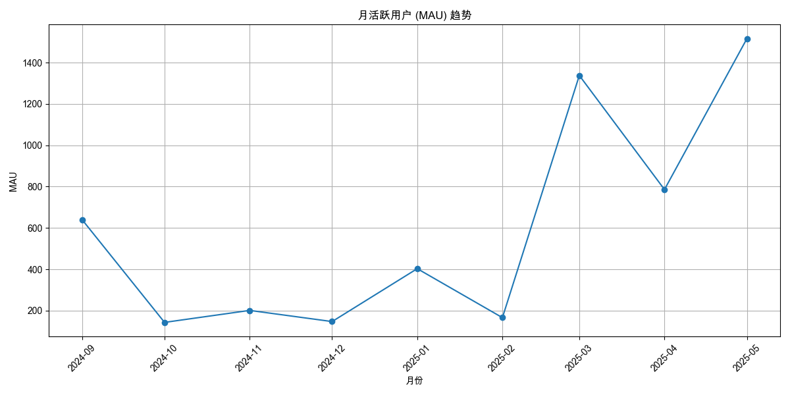

# 基础分析最终报告

本报告综合了从八个不同维度对在线数据进行的自动化分析，旨在提供关于用户行为、内容表现、系统性能和用户反馈的全面洞察。每个分析模块都生成了独立的报告，并通过“深度分析”部分进行了增强，以揭示更深层次的关联和核心问题。

---

## **执行摘要**

- **增长与挑战并存**: 用户规模（MAU 1516）和内容生态（超50个剧本）均呈现健康增长，但高企的 **整体失败率 (43%)** 与 **技术问题 (卡顿、没声音)** 构成了当前最主要的两大风险。
- **增长引擎明确**: 新上线的高质量内容是用户增长的核心驱动力。**`史今哥带你逛展厅`** 的成功（上线当周吸引225名用户）与 **5月29日的DAU峰值 (342)** 直接关联，证明了"爆款内容"的强大拉新效果。
- **数据反馈失真**: 用户的 **量化评分 (低分率仅0.87%)** 与其 **行为表现 (失败率43%)** 存在巨大"温差"，证明评分数据已失效。分析重心必须转向 **行为数据** 和 **定性文本**。
- **内容质量参差不齐**:
    - **"热门陷阱"**: `要方案的王先生` 等剧本热度高但失败率奇高 (82%)，严重损害用户体验。
    - **"挫败关卡"**: `前来面试的王闹海` 等剧本流程不长但极难通关，易造成用户流失。
    - **"内容甜蜜点"**: `谨慎装修的王先生` 等剧本实现了难度与深度的平衡，是内容设计的黄金标准。
- **核心建议**:
    1.  **立即修复技术问题**: 优先解决"卡顿"和"没声音"问题。
    2.  **优化高失败率剧本**: 立即下线或优化失败率>80%的剧本。
    3.  **重构反馈体系**: 弱化评分，聚焦文本分析与失败节点的主动反馈。
    4.  **复制成功模式**: 总结`谨慎装修的王先生`和`史今哥`的成功经验，形成内容矩阵策略。

---

## **1. 用户活跃度**

- **核心发现**: MAU持续增长至 **1516**，但DAU在工作日与周末差异巨大，呈典型B2B产品特征。`2025-05-29` 出现 **342** 的DAU峰值。
- **深度洞察**: WAU/MAU比率约为 **29%**，可作为衡量用户粘性的基线。DAU峰值与下文提到的热门新内容`史今哥带你逛展厅样板房`上线时间高度吻合，明确了**新内容是用户增长的核心引擎**。
- **客观数据图表**:
    *月活跃用户(MAU)趋势图，展现了产品的长期健康增长。*
    
- **客观数据表格**:
    *MAU数据显示了用户基数的强劲增长，尤其在2025年3月至5月。*
    | 月份       |   MAU |
    |:-----------|------:|
    | 2024-09-01 |   640 |
    | 2024-10-01 |   143 |
    | 2024-11-01 |   201 |
    | 2024-12-01 |   147 |
    | 2025-01-01 |   403 |
    | 2025-02-01 |   166 |
    | 2025-03-01 |  1338 |
    | 2025-04-01 |   786 |
    | 2025-05-01 |  1516 |

---

## **2. 用户参与度**

- **核心发现**: 用户参与度与用户增长呈"拉锯战"关系。2025年3月MAU暴增时，人均每月挑战次数从前期高点 **8.8次** 降至 **2.2次**，人均时长从 **54.5分钟** 降至 **9.2分钟**。
- **深度洞察**: 此现象揭示了大规模拉新对用户平均质量的稀释效应。健康的信号是，5月份MAU继续增长的同时，参与度指标已回升(**4.7次/23分钟**)，表明产品对新用户的承接能力有所改善。必须警惕"增量不增质"的陷阱，持续优化新用户引导。
- **客观数据图表**:
    *月人均挑战时长趋势图，直观展示了用户参与深度的变化。*
    
- **客观数据表格**:
    *月人均挑战次数和时长的变化，清晰地展示了参与深度与用户增长的逆向关系及后续的恢复趋势。*
    | 月份       |   人均挑战次数 |   人均挑战时长（分钟） |
    |:-----------|---------------:|-----------------------:|
    | 2024-09-01 |        8.82    |                  54.48 |
    | 2025-01-01 |        4.41    |                  25.04 |
    | 2025-02-01 |        2.05    |                  12.95 |
    | 2025-03-01 |        2.18    |                   9.19 |
    | 2025-04-01 |        2.86    |                  11.12 |
    | 2025-05-01 |        4.74    |                  22.95 |

---

## **3. 内容热度**

- **核心发现**: 内容生态呈现"常青树" (`工作繁忙的林小姐`) 与"爆款" (`史今哥带你逛展厅`) 并存的模式。
- **深度洞察**: **新内容是增长的核心引擎**。`史今哥带你逛展厅` 在上线当周（05-27）即吸引 **225** 名独立用户，远超其他剧本，直接促成了DAU历史峰值。这证明了持续推出高质量、有话题性的新内容是维持产品活力的关键。
- **客观数据图表**:
    *2025年5月27日当周的热门挑战榜单，清晰地展示了"爆款"内容的引流效应。*
    
- **客观数据表格**:
    *表格数据进一步验证了"史今哥"的统治级表现。*
    | 周开始日期   | 挑战名称                               |   独立参与用户数 |
    |:-------------|:---------------------------------------|-----------------:|
    | 2025-05-27   | 史今哥带你逛展厅样板房（91㎡）         |              225 |
    | 2025-05-27   | 【day1】重收益的张先生                 |               45 |
    | 2025-05-27   | 谨慎装修的王先生                       |               39 |
    | 2025-05-27   | 首次服务失望的李阿姨                   |               36 |
    | 2025-05-27   | 新房团装-申请退款的黄小姐              |               33 |

---

## **4. 剧本失败率**

- **核心发现**: 总体失败率高达 **43.27%**，这是一个危险的信号。
- **深度洞察**:
    - **立即审查**: `注重养老的蔡叔叔` 系列 (100%失败), `不自住不急售的周女士` (87%), `要方案的王先生` (82%) 等剧本失败率过高，可能存在BUG或设计缺陷，需立即审查或下线。
    - **热门陷阱**: `要方案的王先生` 吸引了最多的用户（1774次尝试），却是失败率最高的剧本之一，造成了超过1450次失败体验，对用户伤害最大，必须作为优化的最高优先级。
    - **设计标杆**: `做不了主的张女士` (27%) 和 `谨慎装修的王先生` (27%) 在高热度的同时保持了合理的失败率，应作为内容设计的参考典范。
- **客观数据图表**:
    *各剧本失败率图表，高失败率的剧本被明确标识。*
    
- **客观数据表格**:
    *失败率最高的剧本列表，是内容优化的首要目标。*
    | 剧本名称                               |   总尝试次数 |   失败率 (%) |
    |:---------------------------------------|-------------:|-------------:|
    | 【新版暴躁】注重养老的蔡叔叔           |            5 |       100    |
    | 【台词版】注重养老的蔡叔叔             |            7 |       100    |
    | 【新版温和】注重养老的蔡叔叔           |            6 |       100    |
    | 曹叔带你逛展厅new                      |           27 |        92.59 |
    | 不自住不急售的周女士                   |          405 |        86.67 |
    | 自住认为总会涨价的李姐                 |          409 |        86.31 |
    | 前来面试的王闹海                       |          642 |        84.58 |
    | 要方案的王先生                         |         1774 |        81.91 |

---

## **5. 剧本完成难度**

- **核心发现**: 通过"平均通关尝试次数"（毅力）和"平均对话轮次"（耐力）两个维度，可将剧本分为四类。
- **深度洞察 (难度矩阵)**:
    - **象限一：轻松速通** (`工作繁忙的林小姐`)：适合新手入门。
    - **象限二：沉浸体验** (`谨慎装修的王先生`, `置换养老的李女士`)：**内容甜蜜点**，难度与深度平衡，是设计的黄金标准。
    - **象限三：挫败关卡** (`前来面试的王闹海`)：流程短但反复失败，体验极差，是急需优化的"绊脚石"。
    - **象限四：硬核挑战** (`要方案的王先生`)：流程长且难通关，是最大的用户流失风险点。
- **客观数据图表**:
    *平均通关尝试次数图表，直观反映了剧本的"毅力"难度。*
    
- **客观数据表格**:
    *"毅力"和"耐力"数据节选，用于佐证难度矩阵的划分。*
    | 挑战名称                   |   平均通关尝试次数 |   成功尝试平均对话轮次 |
    |:---------------------------|-------------------:|-----------------------:|
    | **硬核挑战 (高风险区)**    |                    |                        |
    | 要方案的王先生             |               2.31 |                  13.00 |
    | 史今哥带你逛展厅           |               1.71 |                  11.55 |
    | **挫败关卡**               |                    |                        |
    | 前来面试的王闹海           |               2.06 |                   7.88 |
    | 不自住不急售的周女士       |               1.88 |                  10.17 |
    | **沉浸体验 (理想区)**      |                    |                        |
    | 谨慎装修的王先生           |               1.23 |                   9.38 |
    | 置换养老的李女士           |               1.25 |                   9.91 |
    | **轻松速通**               |                    |                        |
    | 工作繁忙的林小姐           |               1.42 |                   6.96 |

---

## **6. 用户反馈-评分**

- **核心发现**: **评价率100%**，但"总体感受"的 **低分率仅为0.87%**。
- **深度洞察**: 评分数据已严重失真，**用户的行为（43%失败率）与评分（0.87%差评率）存在巨大"温差"**。这表明用户未通过评分表达真实不满。**结论是：必须停止使用评分作为衡量内容质量和用户满意度的指标**，分析重心应全面转向行为数据和文本反馈。
- **客观数据图表**:
    *总体低分率饼图直观地展示了评分数据的"虚假繁荣"。*
    
- **客观数据表格**:
    *高失败率剧本的低分率数据，揭示了评分的"失真"。*
    | 剧本名称           |   失败率 (%) |   低分百分比 (%): |
    |:-------------------|-------------:|------------------:|
    | 要方案的王先生     |        81.91 |              1.58 |
    | 前来面试的王闹海   |        84.58 |              1.96 |
    | 不自住不急售的周女士|        86.67 |              0.96 |
    | 注重养老的蔡叔叔   |       100    |              0    |

---

## **7. 用户反馈-关键词**

- **核心发现**: 大部分反馈为"无"、"很好"等低价值内容。但在有效反馈中，**"问题"(22次), "卡顿"(12次), "没声音"(6次)** 是最常被提及的负面关键词。
- **深度洞察**: 即便在低质量的文本反馈中，信号依然明确：**技术性能是当前用户体验的首要痛点**。报告本身也指出了其分词方法的原始性，建议立即采用如 `jieba` 等专业分词库进行更精准的分析。
- **客观数据图表**:
    *负面关键词提及次数图表，揭示了评分数据未能反映出的真实用户痛点。*
    
- **客观数据表格**:
    *具体的负面关键词提及次数。*
    | 关键词   |   提及次数 |
    |:---------|-----------:|
    | 问题     |         22 |
    | 卡顿     |         12 |
    | 不好     |          8 |
    | 差       |          7 |
    | 没声音   |          6 |
    | 垃圾     |          3 |
    | 不流畅   |          2 |
    | 无聊     |          1 |
    | 错误     |          1 |

---

## **8. 技术性能关键词**

- **核心发现**: 该报告称"无技术性能关键词提及"，与上一份报告的发现完全矛盾。
- **深度洞察**: 问题源于两个关键词分析脚本使用了不同且不完整的监控列表，导致本报告结论完全错误。**这暴露了当前分析流程存在缺陷**。真实的性能问题是存在的（卡顿、没声音等）。必须立即将两个脚本合并，并使用统一、全面的关键词库，以保证分析的准确性和一致性。
- **客观数据表格**:
    *此领域的分析脚本存在缺陷，其输出的空表格本身就是问题所在的证据，故此处不展示。正确的关键词数据已在上一节中呈现。*

